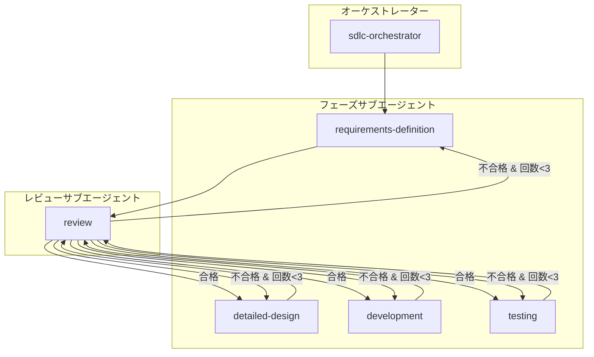

# SDLC エージェント群

このディレクトリには、ソフトウェア開発ライフサイクル（SDLC）を自動化するためのカスタムエージェント群が格納されています。

## アーキテクチャ概要



## エージェント一覧

| エージェント | 説明 | 準拠規格 |
|---|---|---|
| `sdlc-orchestrator` | 全体の作業を統括するオーケストレーター | - |
| `requirements-definition` | 要求定義を行うサブエージェント | ISO 29148 |
| `detailed-design` | 詳細設計を行うサブエージェント | IEEE 1016-2009 |
| `development` | 実装を行うサブエージェント | OWASP TOP 10 |
| `testing` | テストを行うサブエージェント | ISTQB |
| `review` | レビューを行うサブエージェント | - |

## 使用方法

### Coding Agent での使用

GitHub Copilot Coding Agent でこのエージェント群を使用する場合:

1. Issueを作成し、実装したい機能を記載
2. `@sdlc-orchestrator` を呼び出し、Issue番号を指定

```
@sdlc-orchestrator #123
```

### VS Code での使用

VS Code の Copilot Chat で直接エージェントを呼び出す:

```
@sdlc-orchestrator 新しいユーザー認証機能を実装してください
```

### 個別フェーズの実行

特定のフェーズのみ実行したい場合は、個別のサブエージェントを呼び出す:

```
@requirements-definition ユーザー登録機能の要求を定義してください
@detailed-design docs/要求定義/SRS-001-user-registration.md の詳細設計を行ってください
@development docs/詳細設計/SDD-001-user-registration.md に基づいて実装してください
@testing src/user-service/ のテストを実装・実行してください
```

## 処理フロー

### 1. 要求定義フェーズ
- 入力: Issue/仕様書
- 出力: `docs/要求定義/SRS-{ID}-{名前}.md`
- 規格: ISO 29148

### 2. 詳細設計フェーズ
- 入力: 要求仕様書
- 出力: `docs/詳細設計/SDD-{ID}-{名前}.md`
- 規格: IEEE 1016-2009

### 3. 開発フェーズ
- 入力: 詳細設計書
- 出力: 
  - `src/{アプリ名}/front/` (Angular)
  - `src/{アプリ名}/api/` (ASP.NET Core)
  - `src/{アプリ名}/database/` (SQL Database Project)
- 規格: OWASP TOP 10, OWASP API Security TOP 10

### 4. テストフェーズ
- 入力: 詳細設計書、実装コード
- 出力: テストコード、テスト結果
- 規格: ISTQB

### 5. レビュー（各フェーズ後）
- 批判的レビューの実施
- 合格/不合格の判定
- PRコメントへの記録
- 最大3回のリトライ

## 成果物の格納先

| 成果物 | 格納先 |
|---|---|
| 要求仕様書 | `docs/要求定義/` |
| 詳細設計書 | `docs/詳細設計/` |
| Frontendコード | `src/{アプリ名}/front/` |
| Backendコード | `src/{アプリ名}/api/` |
| Databaseコード | `src/{アプリ名}/database/` |

## レビュー結果の記録

全てのレビュー結果はPRコメントに記録されます:

```markdown
## フェーズレビュー結果: [フェーズ名]

### 判定: ✅ 合格 / ❌ 不合格

### 評価サマリー
| 重要度 | 件数 |
|---|---|
| Critical | X |
| Major | X |
| Minor | X |

### 指摘事項
[詳細な指摘]
```

## 技術スタック

- **Frontend**: Angular (latest)
- **Backend**: ASP.NET Core (latest)
- **Database**: SQL Database (SQL Database Project)
- **CI/CD**: GitHub Actions
- **CLI**: GitHub CLI (`gh` コマンド)

## 関連ドキュメント

- [要求定義INDEX](../../docs/要求定義/INDEX.md)
- [詳細設計INDEX](../../docs/詳細設計/INDEX.md)
- [コードレビューガイドライン](../instructions/code-review.instructions.md)
