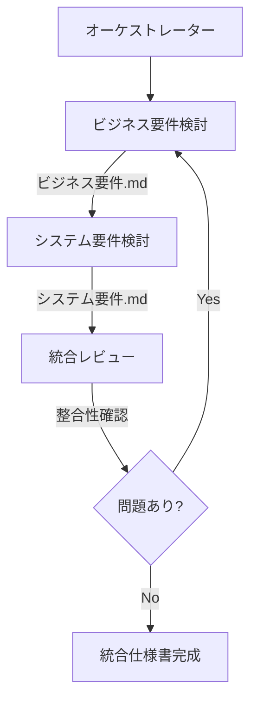

# タグ・ラベル機能 エージェントチーム

このディレクトリには、ToDoアプリのタグ・ラベル機能の仕様を検討するための4つのエージェントが含まれています。

## エージェント一覧

| エージェント | ファイル | 役割 |
|---|---|---|
| オーケストレーター | `orchestrator.agent.md` | チーム全体を統括し、3人のエージェントを順番に実行 |
| ビジネス要件検討 | `business-requirements.agent.md` | ユースケースとビジネス要件の構築 |
| システム要件検討 | `system-requirements.agent.md` | 既存コードから技術要件の検討 |
| レビュー統合 | `integration-reviewer.agent.md` | 両要件の精査と統合 |

## 使用方法

### 1. オーケストレーターの使用（推奨）

最も簡単な方法は、オーケストレーターを使用することです。オーケストレーターが自動的に3人のエージェントを順番に実行します。

```
@tag-label-spec-orchestrator ToDoアプリにタグとラベル機能を追加したい
```

オーケストレーターは以下を実行します:
1. ビジネス要件検討エージェントを実行
2. システム要件検討エージェントを実行
3. 統合レビューエージェントを実行
4. 整合性を確認し、問題があればフィードバック
5. INDEX.mdを作成してコミット

### 2. 個別エージェントの使用

特定の要件のみを更新したい場合は、個別のエージェントを直接呼び出すこともできます。

#### ビジネス要件のみ検討:
```
@business-requirements ToDoアプリのタグ機能について、ユーザーのニーズを分析してください
```

#### システム要件のみ検討:
```
@system-requirements 既存のToDoサービスにタグ機能を追加する場合のデータモデルとAPIを設計してください
```

#### 統合レビューのみ実行:
```
@integration-reviewer docs/タグ・ラベル機能/ビジネス要件.md と docs/タグ・ラベル機能/システム要件.md の整合性を確認してください
```

## エージェントチームの協業フロー



## 成果物

エージェントチームの実行後、以下のファイルが `docs/タグ・ラベル機能/` に作成されます:

```
docs/タグ・ラベル機能/
├── INDEX.md                # 仕様書の索引
├── ビジネス要件.md         # ビジネス観点の要件
├── システム要件.md         # 技術観点の要件
└── 統合仕様書.md          # 最終統合仕様書
```

### ビジネス要件.md
- ビジネスコンテキスト
- ユーザーストーリー
- ビジネス要件
- ビジネスKPI
- リスク分析

### システム要件.md
- データモデル設計（ER図）
- API設計
- データベーススキーマ
- DTO定義
- 非機能要件

### 統合仕様書.md
- エグゼクティブサマリー
- 要件トレーサビリティマトリクス
- 統合データモデル
- 統合API仕様
- 実装計画
- レビュー結果

## エージェントの特徴

### 1. ビジネス要件検討エージェント
- **強み**: ユーザー視点でのニーズ分析
- **出力**: ユーザーストーリー、受け入れ基準、ビジネスKPI
- **使用ツール**: read, edit, search

### 2. システム要件検討エージェント
- **強み**: 既存コード分析と技術設計
- **出力**: データモデル、API仕様、DBスキーマ
- **使用ツール**: read, edit, search

### 3. 統合レビューエージェント
- **強み**: 整合性確認と品質保証
- **出力**: 統合仕様書、レビュー結果、推奨事項
- **使用ツール**: read, edit, search

### 4. オーケストレーター
- **強み**: チーム統括と自動化
- **役割**: エージェント間の調整とワークフロー管理
- **使用ツール**: read, execute, agent

## 品質保証

統合レビューエージェントは以下の観点でレビューを実施します:

- ✅ **整合性**: ビジネス要件とシステム要件の矛盾がないか
- ✅ **完全性**: すべての要件が実装方法に紐づいているか
- ✅ **実現可能性**: 技術的制約内で実現可能か
- ✅ **品質**: 測定可能で明確な仕様になっているか

## トラブルシューティング

### Q: オーケストレーターの実行が途中で止まった
A: 個別のエージェントが失敗している可能性があります。エラーメッセージを確認し、該当するエージェントを個別に実行してください。

### Q: レビューで問題が指摘された
A: オーケストレーターは自動的にフィードバックループを実行します。最大2回まで自動で修正を試みます。

### Q: 既存の仕様書を更新したい
A: 該当するエージェントを直接呼び出し、既存ファイルのパスを指定してください。

## 関連ドキュメント

- 既存システム構造: `/src/todo-service/`
- 要求定義INDEX: `docs/要求定義/INDEX.md`
- 詳細設計INDEX: `docs/詳細設計/INDEX.md`
- リポジトリレイアウト: `docs/repo-layout.md`

## 次のステップ

仕様書作成後は、以下のエージェントを使用して実装を進めることができます:

1. **詳細設計**: `huge-app-orch/orchestrator` エージェントで IEEE 1016準拠の詳細設計書を作成
2. **実装**: `huge-app-orch/development` エージェントで実装を実施
3. **テスト**: `huge-app-orch/testing` エージェントでテストを実施

## ライセンス

このエージェントチームは change-log-lab プロジェクトの一部です。
