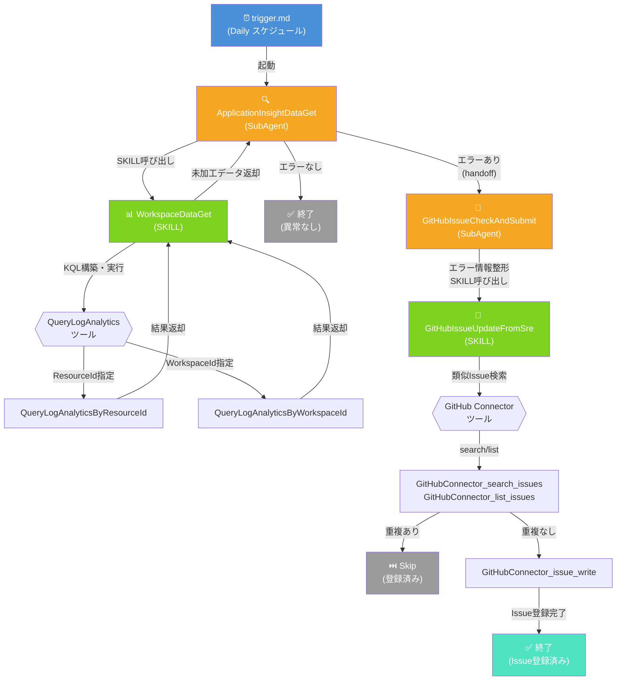

# SRE-Agents-Demo

Azure SRE Agent のトリガー処理で使用している SubAgent・SKILL の構成ドキュメントです。  
Application Insights からエラーを検知し、GitHub Issue に自動登録するまでの一連のワークフローを定義しています。

## 処理フロー

## ファイル構成

| ファイル | 種別 | 役割 |
|---|---|---|
| `trigger.md` | **トリガー定義** | Daily スケジュールで起動。Application Insight `api-set-agent-lab-takas` の直近1日間のエラーを確認し、エラー発生時は `GitHubIssueCheckAndSubmit` へ引き渡す |
| `application-insight-data-get.yml` | **SubAgent** | `ApplicationInsightDataGet` — Log Analytics ワークスペース (`law-ai-takas-jpe`) から直近1日間の Exception 情報を収集。SKILL `WorkspaceDataGet` を使用。完了後 `GitHubIssueCheckAndSubmit` へ handoff |
| `github-issue-check-and-submit.yml` | **SubAgent** | `GitHubIssueCheckAndSubmit` — 受け取ったエラー情報を整形し、SKILL `GitHubIssueUpdateFromSre` で `Takas0522/change-log-lab` リポジトリに Issue を登録 |
| `workspace-data-get.md` | **SKILL** | `WorkspaceDataGet` — KQL を構築し、`QueryLogAnalyticsByResourceId` / `QueryLogAnalyticsByWorkspaceId` ツールで Log Analytics からデータを取得して未加工のまま返却 |
| `git-hub-issue-update-from-sre.md` | **SKILL** | `GitHubIssueUpdateFromSre` — GitHub Connector ツール群で類似 Issue を検索し、重複がなければ新規 Issue を登録 |

## SubAgent と SKILL の関係

- **SubAgent（`.yml`）**: `azuresre.ai/v1` API で定義された自律型エージェント。`handoffs` で次の SubAgent へ遷移し、`allowed_skills` で使用可能な SKILL を制限する
- **SKILL（`.md`）**: frontmatter に `name`, `description`, `tools` を持つ再利用可能な処理単位。データ取得や外部サービス連携など単一責任の作業を担う

## 使用ツール一覧

| ツール名 | 使用元 SKILL |
|---|---|
| `QueryLogAnalyticsByResourceId` | WorkspaceDataGet |
| `QueryLogAnalyticsByWorkspaceId` | WorkspaceDataGet |
| `GitHubConnector_issue_read` | GitHubIssueUpdateFromSre |
| `GitHubConnector_issue_write` | GitHubIssueUpdateFromSre |
| `GitHubConnector_list_issues` | GitHubIssueUpdateFromSre |
| `GitHubConnector_search_issues` | GitHubIssueUpdateFromSre |
