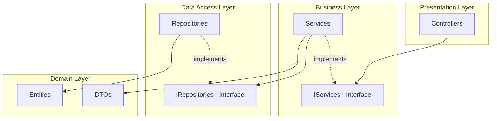

# 詳細設計レビュー結果（第1回）

## レビュー概要

| 項目 | 値 |
|---|---|
| レビュー日時 | 2025-01-31 00:52:00 |
| 対象成果物 | `docs/todo-app/詳細設計/SDD-001-todo-app.md` (v1.0) |
| レビュー回数 | 1/3回目 |
| レビュー担当者 | AI Reviewer Agent |
| 対象範囲 | 詳細設計書全体（IEEE 1016-2009準拠） |
| 参照要求仕様書 | `docs/todo-app/要求定義/SRS-001-todo-app.md` (v2.0) |

---

## 判定結果

**❌ 不合格**

**判定理由:**
- **Critical問題**: 3件
- **Major問題**: 5件

Critical問題が存在するため、不合格と判定します。特に、Angular最新機能への準拠不足、トレーサビリティの不完全性、データベース設計の詳細不足が重大な問題として指摘されました。

---

## 評価サマリー

| 重要度 | 件数 |
|---|---|
| **Critical** | 3 |
| **Major** | 5 |
| **Minor** | 7 |
| **合計** | 15 |

### カテゴリ別指摘

| カテゴリ | Critical | Major | Minor | 合計 |
|---|---|---|---|---|
| アーキテクチャ | 0 | 1 | 1 | 2 |
| API設計 | 0 | 1 | 2 | 3 |
| データベース設計 | 1 | 0 | 1 | 2 |
| Frontend設計 | 2 | 1 | 2 | 5 |
| Backend設計 | 0 | 1 | 0 | 1 |
| セキュリティ | 0 | 0 | 1 | 1 |
| パフォーマンス | 0 | 1 | 0 | 1 |

---

## 指摘事項

### Critical（即座に修正が必要）

#### C-01: Angular最新機能（スタンドアロンコンポーネント）への準拠不足

**カテゴリ**: Frontend設計  
**重要度**: Critical

**問題点:**
要求仕様書では「Angular 17+の最新機能（スタンドアロンコンポーネント、Signals、制御フロー構文）」の使用が明記されていますが、詳細設計書では以下の問題があります：

1. コンポーネント定義でスタンドアロン設定が明示されていない
2. `@if`、`@for`などの新しい制御フロー構文の使用例がない
3. 従来の`ngIf`、`ngFor`ディレクティブを前提とした設計になっている可能性
4. `provideHttpClient()`などの新しいプロバイダー設定が記載されていない

**該当箇所:**
- セクション4.3「主要コンポーネント詳細」
- TodoListComponent、TodoFormComponentの実装例

**修正提案:**

1. **コンポーネント定義の更新:**
```typescript
// ✅ 推奨: スタンドアロンコンポーネント
@Component({
  selector: 'app-todo-list',
  standalone: true,
  imports: [CommonModule, TodoItemComponent, PaginationComponent],
  templateUrl: './todo-list.component.html',
  styleUrls: ['./todo-list.component.scss']
})
export class TodoListComponent implements OnInit {
  // ...
}
```

2. **制御フロー構文の明記:**
```html
<!-- ✅ 推奨: 新しい制御フロー構文 -->
@if (isLoading()) {
  <app-loading-spinner />
}

@for (todo of todos(); track todo.todoId) {
  <app-todo-item [todo]="todo" />
}

@empty {
  <p>ToDoがありません</p>
}
```

3. **app.config.tsの詳細設計:**
```typescript
export const appConfig: ApplicationConfig = {
  providers: [
    provideRouter(routes),
    provideHttpClient(
      withInterceptors([errorInterceptor, cacheInterceptor])
    ),
    provideAnimations()
  ]
};
```

**影響範囲**: Frontend設計全体

---

#### C-02: トレーサビリティの不完全性

**カテゴリ**: Frontend設計  
**重要度**: Critical

**問題点:**
セクション9「トレーサビリティ」で要件→設計マッピングが記載されていますが、以下の不足があります：

1. **非機能要件の一部が未マッピング:**
   - REQ-USE-004（学習容易性）→ 対応する設計要素なし
   - REQ-USE-006（入力補助）→ 部分的にしか設計されていない
   - REQ-USE-007（キーボードショートカット）→ 設計なし
   - REQ-EXT-001～004（拡張性要件）→ マッピングなし
   - REQ-COMP-001～004（互換性要件）→ マッピングなし

2. **設計要素→要件の逆マッピングがない:**
   - 設計された要素が本当に要件を満たしているか検証できない

3. **性能要件の具体的なマッピングが不足:**
   - REQ-PERF-001（500ms以内）がどの設計要素で達成されるか不明確

**該当箇所:**
- セクション9.1「要件→設計マッピング」
- セクション9.2「非機能要件→設計マッピング」

**修正提案:**

1. **非機能要件の完全マッピング:**

| 要件ID | 非機能要件 | 設計要素 | 実装方法 |
|---|---|---|---|
| REQ-USE-004 | 学習容易性 | UIコンポーネント設計、ヘルプツールチップ、直感的なアイコン | Material Designアイコン、tooltip directive |
| REQ-USE-006 | 入力補助 | FormValidation、HintComponent、RequiredFieldDirective | Angular ReactiveFormsでのリアルタイムバリデーション |
| REQ-USE-007 | キーボードショートカット | KeyboardShortcutDirective、HostListener | @HostListener('document:keydown')でのショートカット実装 |
| REQ-EXT-001 | データ量増加 | 仮想スクロール、ページネーション、インデックス設計 | CDK Virtual Scroll、最適化されたクエリ |

2. **設計要素の詳細化:**
   - キーボードショートカットディレクティブの設計追加
   - ヘルプ・ツールチップコンポーネントの設計追加

**影響範囲**: ドキュメント全体、実装計画

---

#### C-03: データベース設計の詳細不足

**カテゴリ**: データベース設計  
**重要度**: Critical

**問題点:**

1. **全文検索インデックスの詳細が不足:**
   - `FULLTEXT INDEX`が定義されているが、検索クエリの実装例がない
   - Entity Framework Coreでの全文検索実装方法が記載されていない
   - 日本語全文検索の考慮がない（ストップワード、ワードブレーカー）

2. **パフォーマンステスト基準との乖離:**
   - REQ-PERF-008（100万レコードで2秒以内）を満たすための設計根拠がない
   - インデックスの効果測定方法が記載されていない

3. **データ整合性制約の不足:**
   - ラベル削除時のToDo処理が`CASCADE`のみで、業務要件との整合性確認が必要
   - 論理削除されたToDoと紐づくラベルの扱いが不明確

**該当箇所:**
- セクション6.2.1「Todoテーブル」- 全文検索インデックス
- セクション6.4「SQL Migration Script」

**修正提案:**

1. **全文検索の詳細設計を追加:**

```sql
-- 日本語対応のストップワード設定
CREATE FULLTEXT STOPLIST JapaneseStopList;

-- 全文検索インデックス（日本語対応）
CREATE FULLTEXT INDEX ON [dbo].[Todo]([Title] LANGUAGE 1041, [Content] LANGUAGE 1041)
KEY INDEX [PK_Todo]
WITH STOPLIST = JapaneseStopList;
```

```csharp
// Repository層での全文検索実装
public async Task<IEnumerable<TodoEntity>> SearchByKeywordAsync(
    string keyword,
    CancellationToken cancellationToken = default)
{
    return await _context.Todos
        .FromSqlRaw(@"
            SELECT t.* 
            FROM [dbo].[Todo] t
            WHERE CONTAINS((t.Title, t.Content), {0})
            AND t.IsDeleted = 0
            ORDER BY t.CreatedAt DESC",
            keyword)
        .Include(t => t.TodoLabels)
            .ThenInclude(tl => tl.Label)
        .AsNoTracking()
        .ToListAsync(cancellationToken);
}
```

2. **カスケード削除の明確化:**
   - ラベル削除時の業務ルールを明記（ToDoは保持、紐付けのみ削除）
   - 論理削除時のラベル紐付け保持ポリシーを明記

3. **インデックス効果測定の追加:**
   - 各インデックスの期待効果を数値で記載
   - パフォーマンステスト項目との対応を明確化

**影響範囲**: データベース設計、Repository実装

---

### Major（修正すべき）

#### M-01: API設計の一貫性不足

**カテゴリ**: API設計  
**重要度**: Major

**問題点:**

1. **エラーレスポンスフォーマットの不統一:**
   - セクション5.2.2で定義されたエラーレスポンスと、実際のController実装例に差異がある
   - HTTPステータスコードとエラーコードの対応が部分的

2. **バリデーションエラーのフィールド特定:**
   - 複数フィールドエラー時の表現方法が不明確

**該当箇所:**
- セクション5.2「API設計」
- セクション5.3「Controller設計」

**修正提案:**

エラーレスポンスの標準化：
```json
{
  "success": false,
  "data": null,
  "errors": [
    {
      "code": "VALIDATION_ERROR",
      "message": "Title is required",
      "field": "title"
    },
    {
      "code": "VALIDATION_ERROR",
      "message": "Title must be less than 200 characters",
      "field": "title"
    }
  ],
  "meta": {
    "timestamp": "2025-01-31T00:00:00Z",
    "requestId": "uuid-here"
  }
}
```

**影響範囲**: API設計、Controller実装

---

#### M-02: Signalsの使用方法の詳細不足

**カテゴリ**: Frontend設計  
**重要度**: Major

**問題点:**

1. **Computed Signalsの使用例が限定的:**
   - `totalPages`、`hasNextPage`などの例はあるが、より複雑な派生状態の設計がない
   - Effect APIの使用例がない

2. **Signals更新のベストプラクティス記載なし:**
   - `set()` vs `update()` vs `mutate()`の使い分けが不明確
   - 非同期操作とSignalsの組み合わせパターンが不足

**該当箇所:**
- セクション4.3「主要コンポーネント詳細」

**修正提案:**

1. **Effect APIの使用例を追加:**
```typescript
export class TodoListComponent {
  todos = signal<Todo[]>([]);
  filterCriteria = signal<FilterCriteria>({});
  
  constructor() {
    // filterCriteria変更時に自動でリロード
    effect(() => {
      const criteria = this.filterCriteria();
      this.loadTodos();
    });
  }
}
```

2. **Signals更新ガイドラインを追加:**
```typescript
// ✅ 推奨: プリミティブ値の更新
count.set(10);

// ✅ 推奨: 既存値を使った更新
count.update(current => current + 1);

// ✅ 推奨: 配列の更新
todos.update(current => [...current, newTodo]);
```

**影響範囲**: Frontend設計、コンポーネント実装

---

#### M-03: ページネーション実装の効率性

**カテゴリ**: パフォーマンス  
**重要度**: Major

**問題点:**

セクション8.2「ページネーション実装」で、`CountAsync()`と`ToListAsync()`を並列実行していますが、以下の問題があります：

1. **同じクエリの重複:**
   - フィルタリング条件が同じクエリを2回構築している
   - SQLレベルでも2回のクエリが実行される

2. **より効率的な方法の検討不足:**
   - SQL Server 2012以降の`OFFSET-FETCH`構文の活用
   - `COUNT() OVER()`によるワンクエリでの実装

**該当箇所:**
- セクション8.2「ページネーション実装」

**修正提案:**

効率的なページネーション実装:
```csharp
// Option 1: COUNT() OVER() 使用（推奨）
public async Task<PagedResult<TodoDto>> GetTodosAsync(
    TodoQueryParameters parameters,
    CancellationToken cancellationToken = default)
{
    var query = @"
        SELECT 
            t.*,
            COUNT(*) OVER() AS TotalCount
        FROM [dbo].[Todo] t
        WHERE t.IsDeleted = 0
        ORDER BY t.CreatedAt DESC
        OFFSET @Offset ROWS
        FETCH NEXT @PageSize ROWS ONLY";
    
    var result = await _context.Todos
        .FromSqlRaw(query, 
            new SqlParameter("@Offset", (parameters.Page - 1) * parameters.PageSize),
            new SqlParameter("@PageSize", parameters.PageSize))
        .ToListAsync(cancellationToken);
    
    var totalCount = result.FirstOrDefault()?.TotalCount ?? 0;
    
    // ...
}

// Option 2: EF Core拡張メソッド
public static async Task<PagedResult<T>> ToPagedResultAsync<T>(
    this IQueryable<T> query,
    int page,
    int pageSize,
    CancellationToken cancellationToken = default)
{
    var totalCount = await query.CountAsync(cancellationToken);
    var items = await query
        .Skip((page - 1) * pageSize)
        .Take(pageSize)
        .ToListAsync(cancellationToken);
    
    return new PagedResult<T>
    {
        Items = items,
        TotalCount = totalCount,
        Page = page,
        PageSize = pageSize
    };
}
```

**影響範囲**: Repository層、パフォーマンス

---

#### M-04: Backend Service層のトランザクション管理不足

**カテゴリ**: Backend設計  
**重要度**: Major

**問題点:**

1. **トランザクション境界が不明確:**
   - ToDo作成時のラベル紐付けなど、複数テーブル更新時のトランザクション設計がない
   - エラー時のロールバック処理が記載されていない

2. **並行制御の考慮不足:**
   - 楽観的ロック（Timestamp/RowVersion）の設計がない
   - 同時更新時の動作が不明確

**該当箇所:**
- セクション5.4.2「TodoService Implementation」

**修正提案:**

1. **トランザクション管理の追加:**
```csharp
public async Task<TodoDto> CreateTodoAsync(
    CreateTodoRequest request,
    CancellationToken cancellationToken = default)
{
    using var transaction = await _context.Database.BeginTransactionAsync(cancellationToken);
    
    try
    {
        // バリデーション
        var validationResult = await _createValidator.ValidateAsync(request, cancellationToken);
        if (!validationResult.IsValid)
        {
            throw new ValidationException(validationResult.Errors);
        }
        
        // エンティティ作成
        var todo = new TodoEntity { /* ... */ };
        var createdTodo = await _todoRepository.CreateAsync(todo, cancellationToken);
        
        // ラベル紐付け（別テーブル）
        if (request.LabelIds?.Any() == true)
        {
            await _todoLabelRepository.AddLabelsAsync(
                createdTodo.TodoId, 
                request.LabelIds, 
                cancellationToken);
        }
        
        await transaction.CommitAsync(cancellationToken);
        
        return _mapper.Map<TodoDto>(createdTodo);
    }
    catch
    {
        await transaction.RollbackAsync(cancellationToken);
        throw;
    }
}
```

2. **楽観的ロックの設計追加:**
```csharp
// TodoEntity に追加
public byte[] RowVersion { get; set; }

// EntityConfiguration に追加
builder.Property(t => t.RowVersion)
    .IsRowVersion();
```

**影響範囲**: Service層、エンティティ設計

---

#### M-05: Angular Material コンポーネントの具体的設計不足

**カテゴリ**: Frontend設計  
**重要度**: Major

**問題点:**

技術スタックとして「Angular Material 17+」が明記されていますが、以下が不足しています：

1. **使用するMaterialコンポーネントの一覧がない**
2. **テーマ設定の記載がない**
3. **レスポンシブデザインの実装方法が抽象的**

**該当箇所:**
- セクション2.3「技術スタック」
- セクション4「Frontend設計」

**修正提案:**

1. **使用Materialコンポーネントの明記:**

| 機能 | Materialコンポーネント | 用途 |
|---|---|---|
| ボタン | MatButton | ToDo作成、保存ボタン |
| フォーム入力 | MatFormField, MatInput | タイトル、内容入力 |
| セレクト | MatSelect | ステータス選択 |
| チップ | MatChip | ラベル表示 |
| ページネーション | MatPaginator | 一覧ページング |
| テーブル | MatTable | ToDo一覧表示（オプション） |
| ダイアログ | MatDialog | 削除確認 |
| スナックバー | MatSnackBar | 成功・エラー通知 |

2. **テーマ設定を追加:**
```scss
// styles.scss
@use '@angular/material' as mat;

$my-primary: mat.define-palette(mat.$indigo-palette);
$my-accent: mat.define-palette(mat.$pink-palette, A200, A100, A400);
$my-warn: mat.define-palette(mat.$red-palette);

$my-theme: mat.define-light-theme((
  color: (
    primary: $my-primary,
    accent: $my-accent,
    warn: $my-warn,
  )
));

@include mat.all-component-themes($my-theme);
```

**影響範囲**: Frontend設計、UI実装

---

#### M-06: アーキテクチャ図のレイヤー分離表現

**カテゴリ**: アーキテクチャ  
**重要度**: Major

**問題点:**

セクション2.2のMermaid図は視覚的に優れていますが、以下の点で改善の余地があります：

1. **依存性逆転原則（DIP）の表現がない:**
   - Service層がRepository interfaceに依存している点が不明確
   - DIコンテナの役割が図示されていない

2. **ミドルウェアパイプラインの順序が不明確:**
   - CORS → Exception → RateLimit の順序が重要だが、図からは読み取れない

**該当箇所:**
- セクション2.2「アーキテクチャ概要」

**修正提案:**

依存関係をより明確にした図の追加:


**影響範囲**: ドキュメント、実装理解

---

### Minor（推奨される改善）

#### m-01: エラーハンドリング戦略の集約

**カテゴリ**: アーキテクチャ  
**重要度**: Minor

**問題点:**
エラーハンドリングがFrontend（ErrorInterceptor）とBackend（ExceptionMiddleware）で分散して説明されていますが、全体戦略が1箇所にまとまっていない。

**該当箇所:**
- セクション4.7「HTTP Interceptor」
- セクション5（Backend設計）

**修正提案:**
「エラーハンドリング戦略」セクションを新設し、以下を集約：
- Frontend/Backend それぞれのエラー処理
- エラーログの記録方針
- ユーザーへのエラー通知方針
- リトライ戦略

**影響範囲**: ドキュメント構成

---

#### m-02: API レスポンスキャッシュ戦略の詳細化

**カテゴリ**: API設計  
**重要度**: Minor

**問題点:**
セクション8.3でキャッシング戦略が記載されていますが、APIレスポンスヘッダー（`Cache-Control`、`ETag`）の設計がない。

**該当箇所:**
- セクション8.3「キャッシング戦略」

**修正提案:**
HTTPキャッシュヘッダーの設計を追加：
```csharp
[HttpGet]
[ResponseCache(Duration = 60, Location = ResponseCacheLocation.Client, VaryByQueryKeys = new[] { "*" })]
public async Task<IActionResult> GetLabels()
{
    // ...
}
```

**影響範囲**: API設計、キャッシング

---

#### m-03: 国際化（i18n）設計の不足

**カテゴリ**: Frontend設計  
**重要度**: Minor

**問題点:**
要求仕様書でステータス表示の多言語対応（i18n）が言及されていますが、詳細設計書に国際化戦略が記載されていない。

**該当箇所:**
- セクション4「Frontend設計」

**修正提案:**
国際化セクションを追加：
- `@angular/localize`パッケージの使用
- 翻訳ファイル（`messages.ja.xlf`、`messages.en.xlf`）の管理方法
- ステータスenum値の表示変換ロジック

**影響範囲**: Frontend設計、実装

---

#### m-04: データベース接続文字列のセキュリティ

**カテゴリ**: セキュリティ  
**重要度**: Minor

**問題点:**
付録Bの環境設定で接続文字列が平文で記載されていますが、セキュアな管理方法への言及が不足。

**該当箇所:**
- 付録B「環境設定」

**修正提案:**
セキュアな設定管理の追加：
- Azure Key Vault / AWS Secrets Manager の利用推奨
- User Secrets（開発環境）の使用方法
- 環境変数での機密情報管理

**影響範囲**: セキュリティ設計、運用

---

#### m-05: データベーステストデータ生成戦略

**カテゴリ**: データベース設計  
**重要度**: Minor

**問題点:**
パフォーマンステストで100万レコードが想定されていますが、テストデータ生成の設計がない。

**該当箇所:**
- セクション6「データベース設計」

**修正提案:**
Migration Scriptにシードデータ生成スクリプトを追加：
- 開発環境用のサンプルデータ（100件程度）
- パフォーマンステスト用の大量データ生成SQL
- データ整合性を保つ制約の確認

**影響範囲**: データベース設計、テスト計画

---

#### m-06: ログ設計の詳細不足

**カテゴリ**: API設計  
**重要度**: Minor

**問題点:**
Service層でのログ出力例はあるが、ログレベル、ログ形式、構造化ログの設計が体系的に記載されていない。

**該当箇所:**
- セクション5.4「Service Layer設計」
- セクション7「セキュリティ設計」

**修正提案:**
ログ設計セクションを追加：
- ログレベルの使い分け（Trace/Debug/Information/Warning/Error/Critical）
- 構造化ログ（Serilog）の使用
- 機密情報のマスキング戦略
- ログローテーション設定

**影響範囲**: Backend設計、運用

---

#### m-07: Angular制御フローの移行ガイド

**カテゴリ**: Frontend設計  
**重要度**: Minor

**問題点:**
Critical問題C-01で指摘した通り、新しい制御フロー構文が設計に含まれていませんが、従来構文との比較表があるとより親切です。

**該当箇所:**
- セクション4「Frontend設計」

**修正提案:**
移行ガイド表を追加：

| 従来構文 | 新構文 | 備考 |
|---|---|---|
| `*ngIf="condition"` | `@if (condition) { }` | テンプレート内で使用 |
| `*ngFor="let item of items"` | `@for (item of items; track item.id) { }` | trackは必須 |
| `*ngSwitch` | `@switch (value) { @case(...) }` | より簡潔 |

**影響範囲**: ドキュメント、開発者理解

---

## 良い点

以下の点は高く評価できます：

### 1. 包括的なドキュメント構成
- IEEE 1016-2009に準拠した構造で、必要な情報が網羅されている
- 各セクションが明確に分離され、可読性が高い

### 2. 具体的なコード例の提供
- Frontend（TypeScript）、Backend（C#）、SQL の実装例が豊富
- 実装者が迷わず開発できるレベルの詳細度

### 3. セキュリティ設計の具体性
- OWASP Top 10への対策が具体的
- 禁止パターンと推奨パターンが明確に示されている
- SQLインジェクション、XSS対策が詳細

### 4. パフォーマンス設計の考慮
- インデックス戦略が明確
- N+1問題への対策が記載されている
- ページネーション、キャッシングが設計されている

### 5. トレーサビリティの試み
- 要件IDと設計要素のマッピングが存在
- 実装時の追跡可能性を考慮

### 6. Mermaid図の効果的な活用
- アーキテクチャ図、ER図、コンポーネント図が視覚的
- システム全体像の理解が容易

### 7. Entity Framework Core設計の詳細性
- Entity Configuration が詳細に記載
- マイグレーションスクリプトが完備

### 8. レイヤー分離の明確性
- 各レイヤーの責務が明確
- 禁止事項も明記され、境界が明確

---

## 総評

### 全体評価
本詳細設計書は、IEEE 1016-2009に準拠した包括的なドキュメントとして、高い完成度を持っています。特に、セキュリティ設計、データベース設計、Backend設計は実装可能なレベルで詳細に記述されており、優れています。

しかし、以下の重大な問題により、**第1回レビューでは不合格**と判定します：

### Critical問題の影響
1. **Angular最新機能への準拠不足（C-01）**: 技術要件で明示されているスタンドアロンコンポーネント、新制御フロー構文が設計に反映されていないため、実装フェーズで混乱が予想されます。
2. **トレーサビリティの不完全性（C-02）**: 非機能要件の一部（学習容易性、キーボードショートカット、拡張性要件等）が設計要素にマッピングされていないため、要求仕様書の完全実装が保証できません。
3. **データベース設計の詳細不足（C-03）**: 全文検索の実装方法、日本語対応、100万レコードでのパフォーマンス保証が不明確で、性能要件（REQ-PERF-008）達成のリスクがあります。

### Major問題の重要性
- API設計の一貫性、Signalsの活用、トランザクション管理など、実装品質に直結する問題が5件存在します。
- これらはCritical問題と同時に修正することで、設計全体の品質が大幅に向上します。

### 改善の方向性
1. **Angular 17+の最新機能を完全に反映した設計への更新**
2. **非機能要件の完全トレーサビリティ確保**
3. **データベース性能設計の根拠明確化**
4. **API、サービス層の一貫性向上**

---

## 次のアクション

### 設計担当者が実施すべき修正

#### 優先度1（Critical）
- [ ] **C-01**: Angular最新機能（スタンドアロン、制御フロー）を反映した設計更新
  - すべてのコンポーネントをスタンドアロン設計に変更
  - 制御フロー構文（@if、@for）の使用例を追加
  - app.config.tsの詳細設計を追加
- [ ] **C-02**: トレーサビリティの完全化
  - 非機能要件の完全マッピング（REQ-USE-004, 006, 007, REQ-EXT-*, REQ-COMP-*）
  - キーボードショートカット、ヘルプ機能の設計追加
  - 拡張性設計の具体化
- [ ] **C-03**: データベース設計の詳細化
  - 全文検索（日本語対応）の実装方法を明記
  - 100万レコードでの性能保証根拠を追加
  - インデックス効果測定方法を記載

#### 優先度2（Major）
- [ ] **M-01**: APIエラーレスポンスの標準化
- [ ] **M-02**: Signals（Effect、update）の詳細設計追加
- [ ] **M-03**: ページネーション効率化（COUNT() OVER()）
- [ ] **M-04**: トランザクション管理、楽観的ロック設計追加
- [ ] **M-05**: Angular Material コンポーネント一覧、テーマ設計追加
- [ ] **M-06**: アーキテクチャ図の依存性明確化

#### 優先度3（Minor） - 可能な範囲で対応
- [ ] m-01～m-07: ドキュメント品質向上（エラーハンドリング集約、i18n設計等）

### レビュアーからの推奨事項
1. **段階的な修正**: Critical問題を優先的に修正し、第2回レビューを早期に実施
2. **要求仕様書との突合**: 非機能要件を1つずつ確認し、設計要素への反映を確実に
3. **実装者との協議**: Angular最新機能の使用方法について、実装チームと認識合わせを推奨

---

## レビュアーコメント

本詳細設計書は、多くの優れた点を持つ高品質なドキュメントです。特にセキュリティ、データベース、Backend設計は実装可能なレベルに達しています。

Critical問題として指摘した3点は、いずれも技術要件や要求仕様書で明示されている事項が設計に十分反映されていないことに起因します。これらは設計の根幹に関わる問題であり、実装フェーズでの手戻りや品質問題を防ぐために、必ず修正が必要です。

特に、Angular 17+の最新機能（スタンドアロンコンポーネント、Signals、新制御フロー構文）は、Angularチームが推奨する新しいベストプラクティスであり、従来の設計パターンとは大きく異なります。これらを正しく設計に反映することで、将来のメンテナンス性、パフォーマンス、開発者体験が大幅に向上します。

修正後の第2回レビューでは、これらの問題が解決されていることを期待します。設計担当者の努力を高く評価しており、指摘事項を修正することで、優れた詳細設計書が完成すると確信しています。

---

**レビュー完了日時**: 2025-01-31 00:52:00  
**次回レビュー予定**: 修正完了後、第2回レビューを実施（2/3回目）  
**レビュアー**: AI Reviewer Agent
