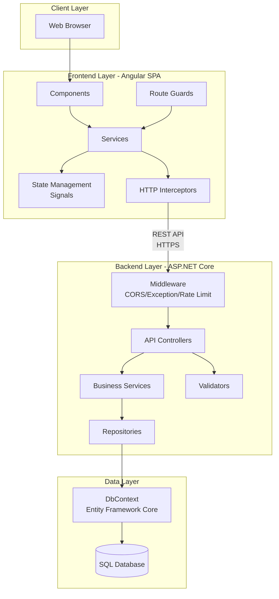
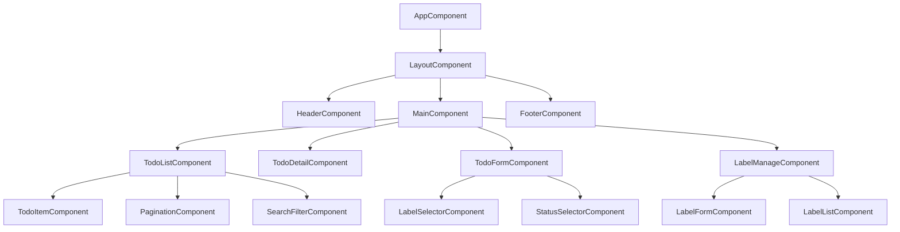
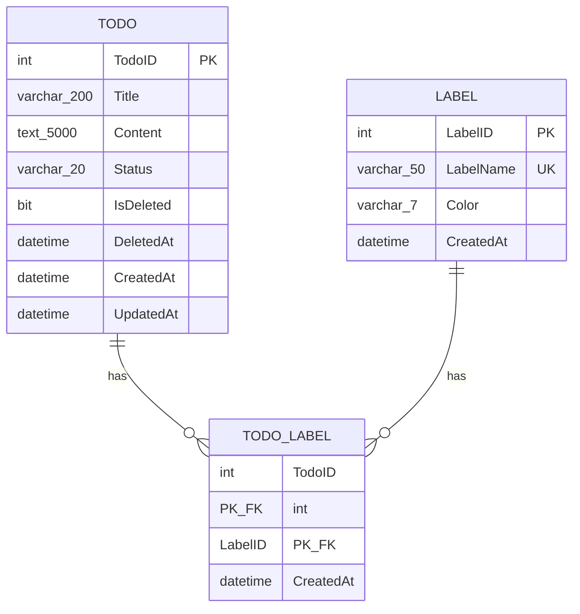

# ソフトウェア設計記述書: 高機能ToDoアプリケーション

**文書ID**: SDD-001  
**バージョン**: 1.0  
**作成日**: 2025-01-31  
**ステータス**: Draft

---

## 1. はじめに

### 1.1 目的

本文書は、高機能ToDoアプリケーション（todo-app）のソフトウェア詳細設計を記述するものである。本文書は IEEE 1016-2009（Systems and software engineering — Life cycle processes — Design description）に準拠し、実装者が実装可能な具体的レベルの設計情報を提供する。

**本設計書の目的：**
- 開発者が実装に必要な詳細な技術仕様の提供
- システムアーキテクチャとコンポーネント構成の明確化
- API、データベース、UI設計の詳細定義
- セキュリティおよびパフォーマンス設計の具体化
- 要求仕様書とのトレーサビリティ確保

### 1.2 範囲

本設計書は以下の範囲をカバーする：

**対象システム：**
- Frontend: Angular（SPA）
- Backend: ASP.NET Core（REST API）
- Database: SQL Database

**設計範囲：**
- システム全体アーキテクチャ
- Frontendコンポーネント設計
- Backend API・ビジネスロジック設計
- データベース物理設計
- セキュリティ設計
- パフォーマンス設計

**対象外：**
- インフラストラクチャ詳細（サーバー構成等）
- デプロイメント手順
- 運用監視設計
- ユーザー認証機能（将来フェーズ）

### 1.3 参照資料

- **要求仕様書**: `docs/todo-app/要求定義/SRS-001-todo-app.md` (v2.0)
- IEEE 1016-2009: Systems and software engineering — Life cycle processes — Design description
- Angular公式ドキュメント: https://angular.io/
- ASP.NET Core公式ドキュメント: https://docs.microsoft.com/aspnet/core/
- OWASP Top Ten: https://owasp.org/www-project-top-ten/

### 1.4 用語・定義

| 用語 | 定義 |
|---|---|
| SPA | Single Page Application - クライアントサイドでレンダリングするWebアプリケーション |
| DTO | Data Transfer Object - レイヤー間でデータを転送するオブジェクト |
| DI | Dependency Injection - 依存性注入パターン |
| Repository | データアクセス層のデザインパターン |
| Service | ビジネスロジック層 |
| Controller | APIエンドポイントを提供するコントローラー層 |
| Signal | Angular 16+の新しいリアクティブプリミティブ |
| UTC | 協定世界時 - すべての日時データはUTCで保存 |

---

## 2. 設計概要

### 2.1 設計方針

**アーキテクチャパターン：**
- **Frontend**: Component-based Architecture（Angular）
- **Backend**: Layered Architecture（Controller → Service → Repository）
- **全体**: 3-Tier Architecture

**設計原則：**
1. **関心の分離（Separation of Concerns）**: 各層が明確な責務を持つ
2. **SOLID原則**: 特に単一責任原則、依存性逆転原則を重視
3. **DRY原則**: コードの重複を避ける
4. **API First**: APIインターフェースを先に定義
5. **セキュアバイデザイン**: 設計段階からセキュリティを考慮
6. **パフォーマンスバイデザイン**: インデックス設計、クエリ最適化を事前設計

### 2.2 アーキテクチャ概要



### 2.3 技術スタック

| レイヤー | 技術 | バージョン | 用途 |
|---|---|---|---|
| **Frontend** | Angular | 17+ | SPAフレームワーク |
| | TypeScript | 5.0+ | 型安全な開発 |
| | RxJS | 7.8+ | リアクティブプログラミング |
| | Angular Material | 17+ | UIコンポーネント |
| | Signals API | Angular 16+ | 状態管理 |
| **Backend** | ASP.NET Core | 8.0+ | Web APIフレームワーク |
| | C# | 12.0+ | プログラミング言語 |
| | Entity Framework Core | 8.0+ | ORM |
| | FluentValidation | 11.0+ | バリデーション |
| | Swashbuckle | 6.5+ | OpenAPI/Swagger |
| **Database** | SQL Server | 2022+ | リレーショナルDB |
| | SQL Database Project | - | スキーマ管理 |
| **Development** | Git | - | バージョン管理 |
| | npm | - | パッケージ管理（Frontend） |
| | NuGet | - | パッケージ管理（Backend） |

### 2.4 レイヤー責務

| レイヤー | 責務 | 禁止事項 |
|---|---|---|
| **Presentation (Angular)** | UI表示、ユーザー入力受付、画面遷移 | ビジネスロジック、直接DB接続 |
| **API Controller** | HTTPリクエスト/レスポンス変換、ルーティング | ビジネスロジック、DB直接操作 |
| **Business Service** | ビジネスルール実装、トランザクション制御 | HTTPリクエスト操作、SQL直接発行 |
| **Repository** | データアクセス抽象化、クエリ構築 | ビジネスロジック |
| **Data Layer** | データ永続化 | - |

---

## 3. システムコンテキスト

### 3.1 外部インターフェース

| インターフェース | 種類 | プロトコル | 説明 |
|---|---|---|---|
| Frontend ⇔ Backend | REST API | HTTPS | JSON形式のデータ交換 |
| Backend ⇔ Database | SQL | TDS | Entity Framework Core経由 |
| Browser ⇔ Frontend | HTTP(S) | HTTPS | 静的ファイル配信 |

### 3.2 API通信仕様

**Base URL:** `https://{domain}/api/v1`

**共通ヘッダー:**
```http
Content-Type: application/json
Accept: application/json
X-Request-ID: {UUID}
```

**共通レスポンス形式:**
```json
{
  "success": true,
  "data": {},
  "errors": [],
  "meta": {
    "timestamp": "2025-01-31T00:00:00Z",
    "requestId": "uuid"
  }
}
```

---

## 4. Frontend設計

### 4.1 ディレクトリ構造

```
src/todo-app/front/src/
├── app/
│   ├── core/                    # コア機能（シングルトン）
│   │   ├── services/           # HTTP, Error Handling等
│   │   ├── interceptors/       # HTTP Interceptors
│   │   ├── guards/             # Route Guards
│   │   └── models/             # 共通データモデル
│   ├── shared/                 # 共有コンポーネント・モジュール
│   │   ├── components/         # 再利用可能コンポーネント
│   │   ├── directives/         # カスタムディレクティブ
│   │   └── pipes/              # カスタムパイプ
│   ├── features/               # 機能別モジュール
│   │   ├── todo/               # ToDo機能
│   │   │   ├── components/
│   │   │   ├── services/
│   │   │   ├── models/
│   │   │   └── todo.routes.ts
│   │   └── label/              # ラベル機能
│   │       ├── components/
│   │       ├── services/
│   │       ├── models/
│   │       └── label.routes.ts
│   ├── app.component.ts
│   ├── app.config.ts
│   └── app.routes.ts
├── environments/
│   ├── environment.ts
│   └── environment.prod.ts
└── assets/
```

### 4.2 コンポーネント構成




### 4.3 主要コンポーネント詳細

#### 4.3.1 TodoListComponent

| 項目 | 内容 |
|---|---|
| パス | `src/todo-app/front/src/app/features/todo/components/todo-list/` |
| 責務 | ToDo一覧の表示、ページネーション、絞込UI提供 |
| セレクター | `app-todo-list` |

**主要フィールド（Signals使用）:**
```typescript
export class TodoListComponent implements OnInit {
  // Signals
  todos = signal<Todo[]>([]);
  currentPage = signal<number>(1);
  pageSize = signal<number>(20);
  totalCount = signal<number>(0);
  isLoading = signal<boolean>(false);
  filterCriteria = signal<FilterCriteria>({
    statuses: [],
    labels: [],
    keyword: '',
    startDate: null,
    endDate: null
  });
  
  // Computed
  totalPages = computed(() => Math.ceil(this.totalCount() / this.pageSize()));
  hasNextPage = computed(() => this.currentPage() < this.totalPages());
  hasPrevPage = computed(() => this.currentPage() > 1);
  
  constructor(
    private todoService: TodoService,
    private router: Router
  ) {}
  
  ngOnInit(): void {
    this.loadTodos();
  }
  
  loadTodos(): void {
    this.isLoading.set(true);
    const criteria = this.filterCriteria();
    
    this.todoService.getTodos(
      this.currentPage(),
      this.pageSize(),
      criteria
    ).subscribe({
      next: (response) => {
        this.todos.set(response.data);
        this.totalCount.set(response.meta.total);
        this.isLoading.set(false);
      },
      error: (error) => {
        this.isLoading.set(false);
        // Error handling
      }
    });
  }
  
  onPageChange(page: number): void {
    this.currentPage.set(page);
    this.loadTodos();
  }
  
  onFilterChange(criteria: FilterCriteria): void {
    this.filterCriteria.set(criteria);
    this.currentPage.set(1); // Reset to first page
    this.loadTodos();
  }
  
  onTodoSelect(todoId: number): void {
    this.router.navigate(['/todos', todoId]);
  }
}
```

#### 4.3.2 TodoFormComponent

| 項目 | 内容 |
|---|---|
| パス | `src/todo-app/front/src/app/features/todo/components/todo-form/` |
| 責務 | ToDo作成・編集フォームの提供 |
| セレクター | `app-todo-form` |

**フォーム定義:**
```typescript
export class TodoFormComponent implements OnInit {
  todoForm: FormGroup;
  isEditMode = signal<boolean>(false);
  todoId = signal<number | null>(null);
  availableLabels = signal<Label[]>([]);
  
  constructor(
    private fb: FormBuilder,
    private todoService: TodoService,
    private labelService: LabelService,
    private route: ActivatedRoute,
    private router: Router
  ) {
    this.todoForm = this.fb.group({
      title: ['', [Validators.required, Validators.maxLength(200)]],
      content: ['', [Validators.maxLength(5000)]],
      status: ['NotStarted', Validators.required],
      labelIds: [[]]
    });
  }
  
  ngOnInit(): void {
    this.loadLabels();
    
    const id = this.route.snapshot.paramMap.get('id');
    if (id) {
      this.isEditMode.set(true);
      this.todoId.set(+id);
      this.loadTodo(+id);
    }
  }
  
  loadLabels(): void {
    this.labelService.getLabels().subscribe({
      next: (response) => {
        this.availableLabels.set(response.data);
      }
    });
  }
  
  loadTodo(id: number): void {
    this.todoService.getTodoById(id).subscribe({
      next: (response) => {
        this.todoForm.patchValue({
          title: response.data.title,
          content: response.data.content,
          status: response.data.status,
          labelIds: response.data.labels.map(l => l.labelId)
        });
      }
    });
  }
  
  onSubmit(): void {
    if (this.todoForm.valid) {
      const formValue = this.todoForm.value;
      
      if (this.isEditMode()) {
        this.updateTodo(this.todoId()!, formValue);
      } else {
        this.createTodo(formValue);
      }
    }
  }
  
  private createTodo(data: any): void {
    this.todoService.createTodo(data).subscribe({
      next: () => {
        this.router.navigate(['/todos']);
      },
      error: (error) => {
        // Error handling
      }
    });
  }
  
  private updateTodo(id: number, data: any): void {
    this.todoService.updateTodo(id, data).subscribe({
      next: () => {
        this.router.navigate(['/todos', id]);
      },
      error: (error) => {
        // Error handling
      }
    });
  }
}
```

### 4.4 サービス設計

#### 4.4.1 TodoService

| 項目 | 内容 |
|---|---|
| パス | `src/todo-app/front/src/app/features/todo/services/todo.service.ts` |
| 責務 | ToDo関連のHTTP通信、状態管理 |
| 提供形式 | `providedIn: 'root'` |

**実装:**
```typescript
@Injectable({
  providedIn: 'root'
})
export class TodoService {
  private apiUrl = `${environment.apiBaseUrl}/api/v1/todos`;
  
  constructor(private http: HttpClient) {}
  
  getTodos(
    page: number,
    pageSize: number,
    filter: FilterCriteria
  ): Observable<ApiResponse<Todo[]>> {
    const params = this.buildQueryParams(page, pageSize, filter);
    return this.http.get<ApiResponse<Todo[]>>(this.apiUrl, { params });
  }
  
  getTodoById(id: number): Observable<ApiResponse<Todo>> {
    return this.http.get<ApiResponse<Todo>>(`${this.apiUrl}/${id}`);
  }
  
  createTodo(data: CreateTodoRequest): Observable<ApiResponse<Todo>> {
    return this.http.post<ApiResponse<Todo>>(this.apiUrl, data);
  }
  
  updateTodo(id: number, data: UpdateTodoRequest): Observable<ApiResponse<Todo>> {
    return this.http.put<ApiResponse<Todo>>(`${this.apiUrl}/${id}`, data);
  }
  
  deleteTodo(id: number): Observable<ApiResponse<void>> {
    return this.http.delete<ApiResponse<void>>(`${this.apiUrl}/${id}`);
  }
  
  updateStatus(id: number, status: TodoStatus): Observable<ApiResponse<Todo>> {
    return this.http.patch<ApiResponse<Todo>>(
      `${this.apiUrl}/${id}/status`,
      { status }
    );
  }
  
  private buildQueryParams(
    page: number,
    pageSize: number,
    filter: FilterCriteria
  ): HttpParams {
    let params = new HttpParams()
      .set('page', page.toString())
      .set('pageSize', pageSize.toString());
    
    if (filter.statuses && filter.statuses.length > 0) {
      filter.statuses.forEach(status => {
        params = params.append('statuses', status);
      });
    }
    
    if (filter.labels && filter.labels.length > 0) {
      filter.labels.forEach(labelId => {
        params = params.append('labelIds', labelId.toString());
      });
    }
    
    if (filter.keyword) {
      params = params.set('keyword', filter.keyword);
    }
    
    if (filter.startDate) {
      params = params.set('startDate', filter.startDate.toISOString());
    }
    
    if (filter.endDate) {
      params = params.set('endDate', filter.endDate.toISOString());
    }
    
    return params;
  }
}
```

#### 4.4.2 LabelService

| 項目 | 内容 |
|---|---|
| パス | `src/todo-app/front/src/app/features/label/services/label.service.ts` |
| 責務 | ラベル関連のHTTP通信 |
| 提供形式 | `providedIn: 'root'` |

**実装:**
```typescript
@Injectable({
  providedIn: 'root'
})
export class LabelService {
  private apiUrl = `${environment.apiBaseUrl}/api/v1/labels`;
  
  constructor(private http: HttpClient) {}
  
  getLabels(): Observable<ApiResponse<Label[]>> {
    return this.http.get<ApiResponse<Label[]>>(this.apiUrl);
  }
  
  getLabelById(id: number): Observable<ApiResponse<Label>> {
    return this.http.get<ApiResponse<Label>>(`${this.apiUrl}/${id}`);
  }
  
  createLabel(data: CreateLabelRequest): Observable<ApiResponse<Label>> {
    return this.http.post<ApiResponse<Label>>(this.apiUrl, data);
  }
  
  updateLabel(id: number, data: UpdateLabelRequest): Observable<ApiResponse<Label>> {
    return this.http.put<ApiResponse<Label>>(`${this.apiUrl}/${id}`, data);
  }
  
  deleteLabel(id: number): Observable<ApiResponse<void>> {
    return this.http.delete<ApiResponse<void>>(`${this.apiUrl}/${id}`);
  }
}
```

### 4.5 データモデル

#### 4.5.1 Todo Model

```typescript
export interface Todo {
  todoId: number;
  title: string;
  content: string | null;
  status: TodoStatus;
  labels: Label[];
  createdAt: Date;
  updatedAt: Date;
}

export enum TodoStatus {
  NotStarted = 'NotStarted',
  InProgress = 'InProgress',
  Completed = 'Completed',
  Abandoned = 'Abandoned'
}

export interface CreateTodoRequest {
  title: string;
  content?: string;
  status: TodoStatus;
  labelIds: number[];
}

export interface UpdateTodoRequest {
  title: string;
  content?: string;
  status: TodoStatus;
  labelIds: number[];
}

export interface FilterCriteria {
  statuses?: TodoStatus[];
  labels?: number[];
  keyword?: string;
  startDate?: Date | null;
  endDate?: Date | null;
}
```

#### 4.5.2 Label Model

```typescript
export interface Label {
  labelId: number;
  labelName: string;
  color: string;
  todoCount?: number;
  createdAt: Date;
}

export interface CreateLabelRequest {
  labelName: string;
  color: string;
}

export interface UpdateLabelRequest {
  labelName: string;
  color: string;
}
```

#### 4.5.3 API Response Model

```typescript
export interface ApiResponse<T> {
  success: boolean;
  data: T;
  errors: ApiError[];
  meta: ResponseMeta;
}

export interface ApiError {
  code: string;
  message: string;
  field?: string;
}

export interface ResponseMeta {
  timestamp: string;
  requestId: string;
  total?: number;
  page?: number;
  pageSize?: number;
}
```

### 4.6 ルーティング設計

```typescript
// app.routes.ts
export const routes: Routes = [
  {
    path: '',
    component: LayoutComponent,
    children: [
      { path: '', redirectTo: '/todos', pathMatch: 'full' },
      {
        path: 'todos',
        loadChildren: () => import('./features/todo/todo.routes').then(m => m.TODO_ROUTES)
      },
      {
        path: 'labels',
        loadChildren: () => import('./features/label/label.routes').then(m => m.LABEL_ROUTES)
      }
    ]
  },
  { path: '**', component: NotFoundComponent }
];

// features/todo/todo.routes.ts
export const TODO_ROUTES: Routes = [
  {
    path: '',
    component: TodoListComponent
  },
  {
    path: 'new',
    component: TodoFormComponent
  },
  {
    path: ':id',
    component: TodoDetailComponent
  },
  {
    path: ':id/edit',
    component: TodoFormComponent
  }
];

// features/label/label.routes.ts
export const LABEL_ROUTES: Routes = [
  {
    path: '',
    component: LabelManageComponent
  }
];
```

### 4.7 HTTP Interceptor

#### 4.7.1 ErrorInterceptor

```typescript
@Injectable()
export class ErrorInterceptor implements HttpInterceptor {
  constructor(private errorService: ErrorService) {}
  
  intercept(req: HttpRequest<any>, next: HttpHandler): Observable<HttpEvent<any>> {
    return next.handle(req).pipe(
      catchError((error: HttpErrorResponse) => {
        let errorMessage = '';
        
        if (error.error instanceof ErrorEvent) {
          // Client-side error
          errorMessage = `Error: ${error.error.message}`;
        } else {
          // Server-side error
          errorMessage = this.getServerErrorMessage(error);
        }
        
        this.errorService.showError(errorMessage);
        return throwError(() => error);
      })
    );
  }
  
  private getServerErrorMessage(error: HttpErrorResponse): string {
    switch (error.status) {
      case 400:
        return error.error?.errors?.[0]?.message || 'Invalid request';
      case 401:
        return 'Unauthorized';
      case 404:
        return 'Resource not found';
      case 500:
        return 'Server error occurred';
      default:
        return `Error Code: ${error.status}\nMessage: ${error.message}`;
    }
  }
}
```

---

## 5. Backend設計

### 5.1 プロジェクト構造

```
src/todo-app/api/
├── TodoApp.API/                # Web API Layer
│   ├── Controllers/
│   ├── Middleware/
│   ├── Filters/
│   ├── Program.cs
│   └── appsettings.json
├── TodoApp.Core/               # Business Logic Layer
│   ├── Services/
│   ├── Interfaces/
│   ├── DTOs/
│   └── Validators/
├── TodoApp.Infrastructure/     # Data Access Layer
│   ├── Data/
│   │   ├── TodoDbContext.cs
│   │   └── Configurations/
│   ├── Repositories/
│   └── Migrations/
└── TodoApp.Domain/             # Domain Entities
    └── Entities/
```

### 5.2 API設計

#### 5.2.1 エンドポイント一覧

| HTTPメソッド | エンドポイント | 説明 | 要件ID |
|---|---|---|---|
| GET | `/api/v1/todos` | ToDo一覧取得（ページネーション、フィルタ） | REQ-FUNC-002 |
| GET | `/api/v1/todos/{id}` | ToDo詳細取得 | REQ-FUNC-003 |
| POST | `/api/v1/todos` | ToDo作成 | REQ-FUNC-001 |
| PUT | `/api/v1/todos/{id}` | ToDo更新 | REQ-FUNC-004 |
| DELETE | `/api/v1/todos/{id}` | ToDo削除（論理削除） | REQ-FUNC-005 |
| PATCH | `/api/v1/todos/{id}/status` | ステータス更新 | REQ-FUNC-006 |
| GET | `/api/v1/labels` | ラベル一覧取得 | REQ-FUNC-009 |
| GET | `/api/v1/labels/{id}` | ラベル詳細取得 | - |
| POST | `/api/v1/labels` | ラベル作成 | REQ-FUNC-008 |
| PUT | `/api/v1/labels/{id}` | ラベル更新 | REQ-FUNC-010 |
| DELETE | `/api/v1/labels/{id}` | ラベル削除 | REQ-FUNC-011 |

#### 5.2.2 ToDo API詳細

##### GET /api/v1/todos

**説明**: ToDo一覧を取得する（ページネーション、フィルタリング対応）

**クエリパラメータ:**
```typescript
{
  page?: number,          // ページ番号（デフォルト: 1）
  pageSize?: number,      // 1ページあたりの件数（デフォルト: 20, 最大: 100）
  statuses?: string[],    // ステータスフィルタ（OR条件）
  labelIds?: number[],    // ラベルIDフィルタ（OR条件）
  keyword?: string,       // キーワード検索（タイトル・内容）
  startDate?: string,     // 開始日時（ISO 8601形式）
  endDate?: string        // 終了日時（ISO 8601形式）
}
```

**レスポンス（200 OK）:**
```json
{
  "success": true,
  "data": [
    {
      "todoId": 1,
      "title": "プロジェクト計画書作成",
      "content": "Q1の計画書を作成する",
      "status": "InProgress",
      "labels": [
        {
          "labelId": 1,
          "labelName": "仕事",
          "color": "#FF5733"
        }
      ],
      "createdAt": "2025-01-31T00:00:00Z",
      "updatedAt": "2025-01-31T00:00:00Z"
    }
  ],
  "errors": [],
  "meta": {
    "timestamp": "2025-01-31T00:00:00Z",
    "requestId": "uuid-here",
    "total": 150,
    "page": 1,
    "pageSize": 20
  }
}
```

**エラーレスポンス:**
| HTTPステータス | 説明 | レスポンス例 |
|---|---|---|
| 400 Bad Request | パラメータ不正 | `{"success": false, "errors": [{"code": "INVALID_PARAMETER", "message": "pageSize must be between 1 and 100"}]}` |
| 500 Internal Server Error | サーバーエラー | `{"success": false, "errors": [{"code": "INTERNAL_ERROR", "message": "An unexpected error occurred"}]}` |

##### GET /api/v1/todos/{id}

**説明**: 指定されたIDのToDo詳細を取得する

**パスパラメータ:**
- `id` (number): ToDoID

**レスポンス（200 OK）:**
```json
{
  "success": true,
  "data": {
    "todoId": 1,
    "title": "プロジェクト計画書作成",
    "content": "Q1の計画書を作成する\n詳細な計画を含める",
    "status": "InProgress",
    "labels": [
      {
        "labelId": 1,
        "labelName": "仕事",
        "color": "#FF5733"
      },
      {
        "labelId": 2,
        "labelName": "重要",
        "color": "#FF0000"
      }
    ],
    "createdAt": "2025-01-31T00:00:00Z",
    "updatedAt": "2025-01-31T01:30:00Z"
  },
  "errors": [],
  "meta": {
    "timestamp": "2025-01-31T02:00:00Z",
    "requestId": "uuid-here"
  }
}
```

**エラーレスポンス:**
| HTTPステータス | 説明 |
|---|---|
| 404 Not Found | ToDoが存在しない、または削除済み |
| 400 Bad Request | IDパラメータが不正 |


##### POST /api/v1/todos

**説明**: 新しいToDoを作成する

**リクエストボディ:**
```json
{
  "title": "新しいタスク",
  "content": "タスクの詳細説明",
  "status": "NotStarted",
  "labelIds": [1, 2]
}
```

**バリデーションルール:**
| フィールド | ルール |
|---|---|
| title | 必須、最大200文字 |
| content | 任意、最大5000文字 |
| status | 必須、NotStarted/InProgress/Completed/Abandonedのいずれか |
| labelIds | 任意、最大10個 |

**レスポンス（201 Created）:**
```json
{
  "success": true,
  "data": {
    "todoId": 151,
    "title": "新しいタスク",
    "content": "タスクの詳細説明",
    "status": "NotStarted",
    "labels": [
      {"labelId": 1, "labelName": "仕事", "color": "#FF5733"}
    ],
    "createdAt": "2025-01-31T03:00:00Z",
    "updatedAt": "2025-01-31T03:00:00Z"
  },
  "errors": [],
  "meta": {
    "timestamp": "2025-01-31T03:00:00Z",
    "requestId": "uuid-here"
  }
}
```

**エラーレスポンス:**
| HTTPステータス | 説明 |
|---|---|
| 400 Bad Request | バリデーションエラー |
| 404 Not Found | 指定されたlabelIdが存在しない |

##### PUT /api/v1/todos/{id}

**説明**: 既存のToDoを更新する

**パスパラメータ:**
- `id` (number): ToDoID

**リクエストボディ:**
```json
{
  "title": "更新されたタスク",
  "content": "更新された詳細説明",
  "status": "InProgress",
  "labelIds": [1, 3]
}
```

**レスポンス（200 OK）:** POST /api/v1/todosと同様

**エラーレスポンス:**
| HTTPステータス | 説明 |
|---|---|
| 404 Not Found | ToDoが存在しない、または削除済み |
| 400 Bad Request | バリデーションエラー |

##### DELETE /api/v1/todos/{id}

**説明**: ToDoを論理削除する

**パスパラメータ:**
- `id` (number): ToDoID

**レスポンス（204 No Content）:**
```json
{
  "success": true,
  "data": null,
  "errors": [],
  "meta": {
    "timestamp": "2025-01-31T04:00:00Z",
    "requestId": "uuid-here"
  }
}
```

**エラーレスポンス:**
| HTTPステータス | 説明 |
|---|---|
| 404 Not Found | ToDoが存在しない、または既に削除済み |

##### PATCH /api/v1/todos/{id}/status

**説明**: ToDoのステータスのみを更新する

**パスパラメータ:**
- `id` (number): ToDoID

**リクエストボディ:**
```json
{
  "status": "Completed"
}
```

**レスポンス（200 OK）:** GET /api/v1/todos/{id}と同様

#### 5.2.3 Label API詳細

##### GET /api/v1/labels

**説明**: ラベル一覧を取得する

**レスポンス（200 OK）:**
```json
{
  "success": true,
  "data": [
    {
      "labelId": 1,
      "labelName": "仕事",
      "color": "#FF5733",
      "todoCount": 25,
      "createdAt": "2025-01-01T00:00:00Z"
    }
  ],
  "errors": [],
  "meta": {
    "timestamp": "2025-01-31T05:00:00Z",
    "requestId": "uuid-here"
  }
}
```

##### POST /api/v1/labels

**説明**: 新しいラベルを作成する

**リクエストボディ:**
```json
{
  "labelName": "新しいラベル",
  "color": "#00FF00"
}
```

**バリデーションルール:**
| フィールド | ルール |
|---|---|
| labelName | 必須、最大50文字、ユニーク |
| color | 必須、カラーコード形式（#RRGGBB） |

**レスポンス（201 Created）:**
```json
{
  "success": true,
  "data": {
    "labelId": 10,
    "labelName": "新しいラベル",
    "color": "#00FF00",
    "todoCount": 0,
    "createdAt": "2025-01-31T06:00:00Z"
  },
  "errors": [],
  "meta": {
    "timestamp": "2025-01-31T06:00:00Z",
    "requestId": "uuid-here"
  }
}
```

**エラーレスポンス:**
| HTTPステータス | 説明 |
|---|---|
| 400 Bad Request | バリデーションエラー |
| 409 Conflict | 同名のラベルが既に存在する |

### 5.3 Controller設計

#### 5.3.1 TodosController

```csharp
namespace TodoApp.API.Controllers;

[ApiController]
[Route("api/v1/[controller]")]
[Produces("application/json")]
public class TodosController : ControllerBase
{
    private readonly ITodoService _todoService;
    private readonly ILogger<TodosController> _logger;

    public TodosController(
        ITodoService todoService,
        ILogger<TodosController> logger)
    {
        _todoService = todoService;
        _logger = logger;
    }

    /// <summary>
    /// ToDo一覧を取得する
    /// </summary>
    [HttpGet]
    [ProducesResponseType(typeof(ApiResponse<IEnumerable<TodoDto>>), StatusCodes.Status200OK)]
    [ProducesResponseType(typeof(ApiResponse<object>), StatusCodes.Status400BadRequest)]
    public async Task<IActionResult> GetTodos(
        [FromQuery] TodoQueryParameters parameters,
        CancellationToken cancellationToken = default)
    {
        try
        {
            var result = await _todoService.GetTodosAsync(parameters, cancellationToken);
            
            var response = new ApiResponse<IEnumerable<TodoDto>>
            {
                Success = true,
                Data = result.Items,
                Meta = new ResponseMeta
                {
                    Timestamp = DateTime.UtcNow,
                    RequestId = HttpContext.TraceIdentifier,
                    Total = result.TotalCount,
                    Page = parameters.Page,
                    PageSize = parameters.PageSize
                }
            };
            
            return Ok(response);
        }
        catch (ArgumentException ex)
        {
            return BadRequest(CreateErrorResponse(ex.Message, "INVALID_PARAMETER"));
        }
    }

    /// <summary>
    /// ToDoの詳細を取得する
    /// </summary>
    [HttpGet("{id}")]
    [ProducesResponseType(typeof(ApiResponse<TodoDto>), StatusCodes.Status200OK)]
    [ProducesResponseType(typeof(ApiResponse<object>), StatusCodes.Status404NotFound)]
    public async Task<IActionResult> GetTodoById(
        int id,
        CancellationToken cancellationToken = default)
    {
        try
        {
            var todo = await _todoService.GetTodoByIdAsync(id, cancellationToken);
            
            var response = new ApiResponse<TodoDto>
            {
                Success = true,
                Data = todo,
                Meta = new ResponseMeta
                {
                    Timestamp = DateTime.UtcNow,
                    RequestId = HttpContext.TraceIdentifier
                }
            };
            
            return Ok(response);
        }
        catch (NotFoundException ex)
        {
            return NotFound(CreateErrorResponse(ex.Message, "NOT_FOUND"));
        }
    }

    /// <summary>
    /// 新しいToDoを作成する
    /// </summary>
    [HttpPost]
    [ProducesResponseType(typeof(ApiResponse<TodoDto>), StatusCodes.Status201Created)]
    [ProducesResponseType(typeof(ApiResponse<object>), StatusCodes.Status400BadRequest)]
    public async Task<IActionResult> CreateTodo(
        [FromBody] CreateTodoRequest request,
        CancellationToken cancellationToken = default)
    {
        try
        {
            var todo = await _todoService.CreateTodoAsync(request, cancellationToken);
            
            var response = new ApiResponse<TodoDto>
            {
                Success = true,
                Data = todo,
                Meta = new ResponseMeta
                {
                    Timestamp = DateTime.UtcNow,
                    RequestId = HttpContext.TraceIdentifier
                }
            };
            
            return CreatedAtAction(
                nameof(GetTodoById),
                new { id = todo.TodoId },
                response);
        }
        catch (ValidationException ex)
        {
            return BadRequest(CreateValidationErrorResponse(ex));
        }
        catch (NotFoundException ex)
        {
            return NotFound(CreateErrorResponse(ex.Message, "NOT_FOUND"));
        }
    }

    /// <summary>
    /// ToDoを更新する
    /// </summary>
    [HttpPut("{id}")]
    [ProducesResponseType(typeof(ApiResponse<TodoDto>), StatusCodes.Status200OK)]
    [ProducesResponseType(typeof(ApiResponse<object>), StatusCodes.Status404NotFound)]
    public async Task<IActionResult> UpdateTodo(
        int id,
        [FromBody] UpdateTodoRequest request,
        CancellationToken cancellationToken = default)
    {
        try
        {
            var todo = await _todoService.UpdateTodoAsync(id, request, cancellationToken);
            
            var response = new ApiResponse<TodoDto>
            {
                Success = true,
                Data = todo,
                Meta = new ResponseMeta
                {
                    Timestamp = DateTime.UtcNow,
                    RequestId = HttpContext.TraceIdentifier
                }
            };
            
            return Ok(response);
        }
        catch (NotFoundException ex)
        {
            return NotFound(CreateErrorResponse(ex.Message, "NOT_FOUND"));
        }
        catch (ValidationException ex)
        {
            return BadRequest(CreateValidationErrorResponse(ex));
        }
    }

    /// <summary>
    /// ToDoを削除する（論理削除）
    /// </summary>
    [HttpDelete("{id}")]
    [ProducesResponseType(typeof(ApiResponse<object>), StatusCodes.Status204NoContent)]
    [ProducesResponseType(typeof(ApiResponse<object>), StatusCodes.Status404NotFound)]
    public async Task<IActionResult> DeleteTodo(
        int id,
        CancellationToken cancellationToken = default)
    {
        try
        {
            await _todoService.DeleteTodoAsync(id, cancellationToken);
            
            var response = new ApiResponse<object>
            {
                Success = true,
                Data = null,
                Meta = new ResponseMeta
                {
                    Timestamp = DateTime.UtcNow,
                    RequestId = HttpContext.TraceIdentifier
                }
            };
            
            return Ok(response);
        }
        catch (NotFoundException ex)
        {
            return NotFound(CreateErrorResponse(ex.Message, "NOT_FOUND"));
        }
    }

    /// <summary>
    /// ToDoのステータスを更新する
    /// </summary>
    [HttpPatch("{id}/status")]
    [ProducesResponseType(typeof(ApiResponse<TodoDto>), StatusCodes.Status200OK)]
    [ProducesResponseType(typeof(ApiResponse<object>), StatusCodes.Status404NotFound)]
    public async Task<IActionResult> UpdateTodoStatus(
        int id,
        [FromBody] UpdateTodoStatusRequest request,
        CancellationToken cancellationToken = default)
    {
        try
        {
            var todo = await _todoService.UpdateTodoStatusAsync(id, request.Status, cancellationToken);
            
            var response = new ApiResponse<TodoDto>
            {
                Success = true,
                Data = todo,
                Meta = new ResponseMeta
                {
                    Timestamp = DateTime.UtcNow,
                    RequestId = HttpContext.TraceIdentifier
                }
            };
            
            return Ok(response);
        }
        catch (NotFoundException ex)
        {
            return NotFound(CreateErrorResponse(ex.Message, "NOT_FOUND"));
        }
    }

    private ApiResponse<object> CreateErrorResponse(string message, string code)
    {
        return new ApiResponse<object>
        {
            Success = false,
            Data = null,
            Errors = new List<ApiError>
            {
                new ApiError { Code = code, Message = message }
            },
            Meta = new ResponseMeta
            {
                Timestamp = DateTime.UtcNow,
                RequestId = HttpContext.TraceIdentifier
            }
        };
    }

    private ApiResponse<object> CreateValidationErrorResponse(ValidationException ex)
    {
        return new ApiResponse<object>
        {
            Success = false,
            Data = null,
            Errors = ex.Errors.Select(e => new ApiError
            {
                Code = "VALIDATION_ERROR",
                Message = e.ErrorMessage,
                Field = e.PropertyName
            }).ToList(),
            Meta = new ResponseMeta
            {
                Timestamp = DateTime.UtcNow,
                RequestId = HttpContext.TraceIdentifier
            }
        };
    }
}
```

### 5.4 Service Layer設計

#### 5.4.1 ITodoService Interface

```csharp
namespace TodoApp.Core.Interfaces;

public interface ITodoService
{
    Task<PagedResult<TodoDto>> GetTodosAsync(
        TodoQueryParameters parameters,
        CancellationToken cancellationToken = default);
    
    Task<TodoDto> GetTodoByIdAsync(
        int id,
        CancellationToken cancellationToken = default);
    
    Task<TodoDto> CreateTodoAsync(
        CreateTodoRequest request,
        CancellationToken cancellationToken = default);
    
    Task<TodoDto> UpdateTodoAsync(
        int id,
        UpdateTodoRequest request,
        CancellationToken cancellationToken = default);
    
    Task DeleteTodoAsync(
        int id,
        CancellationToken cancellationToken = default);
    
    Task<TodoDto> UpdateTodoStatusAsync(
        int id,
        TodoStatus status,
        CancellationToken cancellationToken = default);
}
```

#### 5.4.2 TodoService Implementation

```csharp
namespace TodoApp.Core.Services;

public class TodoService : ITodoService
{
    private readonly ITodoRepository _todoRepository;
    private readonly ILabelRepository _labelRepository;
    private readonly IMapper _mapper;
    private readonly IValidator<CreateTodoRequest> _createValidator;
    private readonly IValidator<UpdateTodoRequest> _updateValidator;
    private readonly ILogger<TodoService> _logger;

    public TodoService(
        ITodoRepository todoRepository,
        ILabelRepository labelRepository,
        IMapper mapper,
        IValidator<CreateTodoRequest> createValidator,
        IValidator<UpdateTodoRequest> updateValidator,
        ILogger<TodoService> logger)
    {
        _todoRepository = todoRepository;
        _labelRepository = labelRepository;
        _mapper = mapper;
        _createValidator = createValidator;
        _updateValidator = updateValidator;
        _logger = logger;
    }

    public async Task<PagedResult<TodoDto>> GetTodosAsync(
        TodoQueryParameters parameters,
        CancellationToken cancellationToken = default)
    {
        _logger.LogInformation("Getting todos with parameters: {@Parameters}", parameters);
        
        // パラメータ検証
        if (parameters.Page < 1)
            throw new ArgumentException("Page must be greater than 0", nameof(parameters.Page));
        
        if (parameters.PageSize < 1 || parameters.PageSize > 100)
            throw new ArgumentException("PageSize must be between 1 and 100", nameof(parameters.PageSize));
        
        var todos = await _todoRepository.GetTodosAsync(parameters, cancellationToken);
        var totalCount = await _todoRepository.GetTodoCountAsync(parameters, cancellationToken);
        
        var todoDtos = _mapper.Map<IEnumerable<TodoDto>>(todos);
        
        return new PagedResult<TodoDto>
        {
            Items = todoDtos,
            TotalCount = totalCount,
            Page = parameters.Page,
            PageSize = parameters.PageSize
        };
    }

    public async Task<TodoDto> GetTodoByIdAsync(
        int id,
        CancellationToken cancellationToken = default)
    {
        _logger.LogInformation("Getting todo by id: {Id}", id);
        
        var todo = await _todoRepository.GetByIdAsync(id, cancellationToken);
        
        if (todo == null || todo.IsDeleted)
        {
            throw new NotFoundException($"Todo with id {id} not found");
        }
        
        return _mapper.Map<TodoDto>(todo);
    }

    public async Task<TodoDto> CreateTodoAsync(
        CreateTodoRequest request,
        CancellationToken cancellationToken = default)
    {
        _logger.LogInformation("Creating todo: {@Request}", request);
        
        // バリデーション
        var validationResult = await _createValidator.ValidateAsync(request, cancellationToken);
        if (!validationResult.IsValid)
        {
            throw new ValidationException(validationResult.Errors);
        }
        
        // ラベルの存在確認
        if (request.LabelIds != null && request.LabelIds.Any())
        {
            await ValidateLabelsExistAsync(request.LabelIds, cancellationToken);
        }
        
        // エンティティ作成
        var todo = new TodoEntity
        {
            Title = request.Title,
            Content = request.Content,
            Status = request.Status,
            CreatedAt = DateTime.UtcNow,
            UpdatedAt = DateTime.UtcNow,
            IsDeleted = false
        };
        
        // ラベル紐付け
        if (request.LabelIds != null && request.LabelIds.Any())
        {
            var labels = await _labelRepository.GetByIdsAsync(request.LabelIds, cancellationToken);
            todo.TodoLabels = labels.Select(l => new TodoLabelEntity
            {
                LabelId = l.LabelId,
                CreatedAt = DateTime.UtcNow
            }).ToList();
        }
        
        var createdTodo = await _todoRepository.CreateAsync(todo, cancellationToken);
        
        _logger.LogInformation("Todo created successfully: {TodoId}", createdTodo.TodoId);
        
        return _mapper.Map<TodoDto>(createdTodo);
    }

    public async Task<TodoDto> UpdateTodoAsync(
        int id,
        UpdateTodoRequest request,
        CancellationToken cancellationToken = default)
    {
        _logger.LogInformation("Updating todo {Id}: {@Request}", id, request);
        
        // バリデーション
        var validationResult = await _updateValidator.ValidateAsync(request, cancellationToken);
        if (!validationResult.IsValid)
        {
            throw new ValidationException(validationResult.Errors);
        }
        
        // 既存ToDoの取得
        var todo = await _todoRepository.GetByIdAsync(id, cancellationToken);
        if (todo == null || todo.IsDeleted)
        {
            throw new NotFoundException($"Todo with id {id} not found");
        }
        
        // ラベルの存在確認
        if (request.LabelIds != null && request.LabelIds.Any())
        {
            await ValidateLabelsExistAsync(request.LabelIds, cancellationToken);
        }
        
        // 更新
        todo.Title = request.Title;
        todo.Content = request.Content;
        todo.Status = request.Status;
        todo.UpdatedAt = DateTime.UtcNow;
        
        // ラベル更新
        if (request.LabelIds != null)
        {
            // 既存のラベル紐付けを削除
            todo.TodoLabels.Clear();
            
            // 新しいラベル紐付けを追加
            if (request.LabelIds.Any())
            {
                var labels = await _labelRepository.GetByIdsAsync(request.LabelIds, cancellationToken);
                todo.TodoLabels = labels.Select(l => new TodoLabelEntity
                {
                    TodoId = id,
                    LabelId = l.LabelId,
                    CreatedAt = DateTime.UtcNow
                }).ToList();
            }
        }
        
        var updatedTodo = await _todoRepository.UpdateAsync(todo, cancellationToken);
        
        _logger.LogInformation("Todo updated successfully: {TodoId}", id);
        
        return _mapper.Map<TodoDto>(updatedTodo);
    }

    public async Task DeleteTodoAsync(
        int id,
        CancellationToken cancellationToken = default)
    {
        _logger.LogInformation("Deleting todo: {Id}", id);
        
        var todo = await _todoRepository.GetByIdAsync(id, cancellationToken);
        if (todo == null || todo.IsDeleted)
        {
            throw new NotFoundException($"Todo with id {id} not found");
        }
        
        // 論理削除
        todo.IsDeleted = true;
        todo.DeletedAt = DateTime.UtcNow;
        todo.UpdatedAt = DateTime.UtcNow;
        
        await _todoRepository.UpdateAsync(todo, cancellationToken);
        
        _logger.LogInformation("Todo deleted successfully: {TodoId}", id);
    }

    public async Task<TodoDto> UpdateTodoStatusAsync(
        int id,
        TodoStatus status,
        CancellationToken cancellationToken = default)
    {
        _logger.LogInformation("Updating todo status {Id} to {Status}", id, status);
        
        var todo = await _todoRepository.GetByIdAsync(id, cancellationToken);
        if (todo == null || todo.IsDeleted)
        {
            throw new NotFoundException($"Todo with id {id} not found");
        }
        
        todo.Status = status;
        todo.UpdatedAt = DateTime.UtcNow;
        
        var updatedTodo = await _todoRepository.UpdateAsync(todo, cancellationToken);
        
        _logger.LogInformation("Todo status updated successfully: {TodoId}", id);
        
        return _mapper.Map<TodoDto>(updatedTodo);
    }

    private async Task ValidateLabelsExistAsync(
        IEnumerable<int> labelIds,
        CancellationToken cancellationToken)
    {
        var labels = await _labelRepository.GetByIdsAsync(labelIds, cancellationToken);
        var existingLabelIds = labels.Select(l => l.LabelId).ToHashSet();
        
        var missingLabelIds = labelIds.Where(id => !existingLabelIds.Contains(id)).ToList();
        if (missingLabelIds.Any())
        {
            throw new NotFoundException(
                $"Labels with ids {string.Join(", ", missingLabelIds)} not found");
        }
    }
}
```

### 5.5 Repository Layer設計

#### 5.5.1 ITodoRepository Interface

```csharp
namespace TodoApp.Core.Interfaces;

public interface ITodoRepository
{
    Task<IEnumerable<TodoEntity>> GetTodosAsync(
        TodoQueryParameters parameters,
        CancellationToken cancellationToken = default);
    
    Task<int> GetTodoCountAsync(
        TodoQueryParameters parameters,
        CancellationToken cancellationToken = default);
    
    Task<TodoEntity?> GetByIdAsync(
        int id,
        CancellationToken cancellationToken = default);
    
    Task<TodoEntity> CreateAsync(
        TodoEntity todo,
        CancellationToken cancellationToken = default);
    
    Task<TodoEntity> UpdateAsync(
        TodoEntity todo,
        CancellationToken cancellationToken = default);
}
```


#### 5.5.2 TodoRepository Implementation

```csharp
namespace TodoApp.Infrastructure.Repositories;

public class TodoRepository : ITodoRepository
{
    private readonly TodoDbContext _context;

    public TodoRepository(TodoDbContext context)
    {
        _context = context;
    }

    public async Task<IEnumerable<TodoEntity>> GetTodosAsync(
        TodoQueryParameters parameters,
        CancellationToken cancellationToken = default)
    {
        var query = _context.Todos
            .Include(t => t.TodoLabels)
                .ThenInclude(tl => tl.Label)
            .Where(t => !t.IsDeleted);
        
        // ステータスフィルタ
        if (parameters.Statuses != null && parameters.Statuses.Any())
        {
            query = query.Where(t => parameters.Statuses.Contains(t.Status));
        }
        
        // ラベルフィルタ
        if (parameters.LabelIds != null && parameters.LabelIds.Any())
        {
            query = query.Where(t => t.TodoLabels
                .Any(tl => parameters.LabelIds.Contains(tl.LabelId)));
        }
        
        // キーワード検索
        if (!string.IsNullOrWhiteSpace(parameters.Keyword))
        {
            var keyword = parameters.Keyword.ToLower();
            query = query.Where(t =>
                t.Title.ToLower().Contains(keyword) ||
                (t.Content != null && t.Content.ToLower().Contains(keyword)));
        }
        
        // 日時範囲フィルタ
        if (parameters.StartDate.HasValue)
        {
            query = query.Where(t => t.CreatedAt >= parameters.StartDate.Value);
        }
        
        if (parameters.EndDate.HasValue)
        {
            query = query.Where(t => t.CreatedAt <= parameters.EndDate.Value);
        }
        
        // ソート（作成日時降順）
        query = query.OrderByDescending(t => t.CreatedAt);
        
        // ページネーション
        query = query
            .Skip((parameters.Page - 1) * parameters.PageSize)
            .Take(parameters.PageSize);
        
        return await query.AsNoTracking().ToListAsync(cancellationToken);
    }

    public async Task<int> GetTodoCountAsync(
        TodoQueryParameters parameters,
        CancellationToken cancellationToken = default)
    {
        var query = _context.Todos
            .Where(t => !t.IsDeleted);
        
        // 同じフィルタリングロジックを適用
        if (parameters.Statuses != null && parameters.Statuses.Any())
        {
            query = query.Where(t => parameters.Statuses.Contains(t.Status));
        }
        
        if (parameters.LabelIds != null && parameters.LabelIds.Any())
        {
            query = query.Where(t => t.TodoLabels
                .Any(tl => parameters.LabelIds.Contains(tl.LabelId)));
        }
        
        if (!string.IsNullOrWhiteSpace(parameters.Keyword))
        {
            var keyword = parameters.Keyword.ToLower();
            query = query.Where(t =>
                t.Title.ToLower().Contains(keyword) ||
                (t.Content != null && t.Content.ToLower().Contains(keyword)));
        }
        
        if (parameters.StartDate.HasValue)
        {
            query = query.Where(t => t.CreatedAt >= parameters.StartDate.Value);
        }
        
        if (parameters.EndDate.HasValue)
        {
            query = query.Where(t => t.CreatedAt <= parameters.EndDate.Value);
        }
        
        return await query.CountAsync(cancellationToken);
    }

    public async Task<TodoEntity?> GetByIdAsync(
        int id,
        CancellationToken cancellationToken = default)
    {
        return await _context.Todos
            .Include(t => t.TodoLabels)
                .ThenInclude(tl => tl.Label)
            .FirstOrDefaultAsync(t => t.TodoId == id, cancellationToken);
    }

    public async Task<TodoEntity> CreateAsync(
        TodoEntity todo,
        CancellationToken cancellationToken = default)
    {
        _context.Todos.Add(todo);
        await _context.SaveChangesAsync(cancellationToken);
        
        // リロードしてナビゲーションプロパティを取得
        return await GetByIdAsync(todo.TodoId, cancellationToken)
            ?? throw new InvalidOperationException("Failed to retrieve created todo");
    }

    public async Task<TodoEntity> UpdateAsync(
        TodoEntity todo,
        CancellationToken cancellationToken = default)
    {
        _context.Todos.Update(todo);
        await _context.SaveChangesAsync(cancellationToken);
        
        return await GetByIdAsync(todo.TodoId, cancellationToken)
            ?? throw new InvalidOperationException("Failed to retrieve updated todo");
    }
}
```

### 5.6 DTO（Data Transfer Object）設計

#### 5.6.1 TodoDto

```csharp
namespace TodoApp.Core.DTOs;

public record TodoDto
{
    public int TodoId { get; init; }
    public string Title { get; init; } = string.Empty;
    public string? Content { get; init; }
    public TodoStatus Status { get; init; }
    public List<LabelDto> Labels { get; init; } = new();
    public DateTime CreatedAt { get; init; }
    public DateTime UpdatedAt { get; init; }
}

public record CreateTodoRequest
{
    public string Title { get; init; } = string.Empty;
    public string? Content { get; init; }
    public TodoStatus Status { get; init; } = TodoStatus.NotStarted;
    public List<int> LabelIds { get; init; } = new();
}

public record UpdateTodoRequest
{
    public string Title { get; init; } = string.Empty;
    public string? Content { get; init; }
    public TodoStatus Status { get; init; }
    public List<int> LabelIds { get; init; } = new();
}

public record UpdateTodoStatusRequest
{
    public TodoStatus Status { get; init; }
}

public record TodoQueryParameters
{
    public int Page { get; init; } = 1;
    public int PageSize { get; init; } = 20;
    public List<TodoStatus>? Statuses { get; init; }
    public List<int>? LabelIds { get; init; }
    public string? Keyword { get; init; }
    public DateTime? StartDate { get; init; }
    public DateTime? EndDate { get; init; }
}
```

#### 5.6.2 LabelDto

```csharp
namespace TodoApp.Core.DTOs;

public record LabelDto
{
    public int LabelId { get; init; }
    public string LabelName { get; init; } = string.Empty;
    public string Color { get; init; } = string.Empty;
    public int? TodoCount { get; init; }
    public DateTime CreatedAt { get; init; }
}

public record CreateLabelRequest
{
    public string LabelName { get; init; } = string.Empty;
    public string Color { get; init; } = string.Empty;
}

public record UpdateLabelRequest
{
    public string LabelName { get; init; } = string.Empty;
    public string Color { get; init; } = string.Empty;
}
```

#### 5.6.3 共通DTO

```csharp
namespace TodoApp.Core.DTOs;

public record ApiResponse<T>
{
    public bool Success { get; init; }
    public T? Data { get; init; }
    public List<ApiError> Errors { get; init; } = new();
    public ResponseMeta Meta { get; init; } = new();
}

public record ApiError
{
    public string Code { get; init; } = string.Empty;
    public string Message { get; init; } = string.Empty;
    public string? Field { get; init; }
}

public record ResponseMeta
{
    public DateTime Timestamp { get; init; }
    public string RequestId { get; init; } = string.Empty;
    public int? Total { get; init; }
    public int? Page { get; init; }
    public int? PageSize { get; init; }
}

public record PagedResult<T>
{
    public IEnumerable<T> Items { get; init; } = Enumerable.Empty<T>();
    public int TotalCount { get; init; }
    public int Page { get; init; }
    public int PageSize { get; init; }
}
```

### 5.7 Validator設計

#### 5.7.1 CreateTodoRequestValidator

```csharp
namespace TodoApp.Core.Validators;

public class CreateTodoRequestValidator : AbstractValidator<CreateTodoRequest>
{
    public CreateTodoRequestValidator()
    {
        RuleFor(x => x.Title)
            .NotEmpty().WithMessage("Title is required")
            .MaximumLength(200).WithMessage("Title must not exceed 200 characters");

        RuleFor(x => x.Content)
            .MaximumLength(5000).WithMessage("Content must not exceed 5000 characters")
            .When(x => !string.IsNullOrEmpty(x.Content));

        RuleFor(x => x.Status)
            .IsInEnum().WithMessage("Invalid status value");

        RuleFor(x => x.LabelIds)
            .Must(x => x == null || x.Count <= 10)
            .WithMessage("A todo can have maximum 10 labels");
    }
}
```

#### 5.7.2 UpdateTodoRequestValidator

```csharp
namespace TodoApp.Core.Validators;

public class UpdateTodoRequestValidator : AbstractValidator<UpdateTodoRequest>
{
    public UpdateTodoRequestValidator()
    {
        RuleFor(x => x.Title)
            .NotEmpty().WithMessage("Title is required")
            .MaximumLength(200).WithMessage("Title must not exceed 200 characters");

        RuleFor(x => x.Content)
            .MaximumLength(5000).WithMessage("Content must not exceed 5000 characters")
            .When(x => !string.IsNullOrEmpty(x.Content));

        RuleFor(x => x.Status)
            .IsInEnum().WithMessage("Invalid status value");

        RuleFor(x => x.LabelIds)
            .Must(x => x == null || x.Count <= 10)
            .WithMessage("A todo can have maximum 10 labels");
    }
}
```

#### 5.7.3 CreateLabelRequestValidator

```csharp
namespace TodoApp.Core.Validators;

public class CreateLabelRequestValidator : AbstractValidator<CreateLabelRequest>
{
    public CreateLabelRequestValidator()
    {
        RuleFor(x => x.LabelName)
            .NotEmpty().WithMessage("Label name is required")
            .MaximumLength(50).WithMessage("Label name must not exceed 50 characters");

        RuleFor(x => x.Color)
            .NotEmpty().WithMessage("Color is required")
            .Matches(@"^#[0-9A-Fa-f]{6}$").WithMessage("Color must be in hex format (#RRGGBB)");
    }
}
```

### 5.8 Middleware設計

#### 5.8.1 GlobalExceptionMiddleware

```csharp
namespace TodoApp.API.Middleware;

public class GlobalExceptionMiddleware
{
    private readonly RequestDelegate _next;
    private readonly ILogger<GlobalExceptionMiddleware> _logger;

    public GlobalExceptionMiddleware(
        RequestDelegate next,
        ILogger<GlobalExceptionMiddleware> logger)
    {
        _next = next;
        _logger = logger;
    }

    public async Task InvokeAsync(HttpContext context)
    {
        try
        {
            await _next(context);
        }
        catch (Exception ex)
        {
            _logger.LogError(ex, "An unhandled exception occurred");
            await HandleExceptionAsync(context, ex);
        }
    }

    private static Task HandleExceptionAsync(HttpContext context, Exception exception)
    {
        context.Response.ContentType = "application/json";
        
        var response = new ApiResponse<object>
        {
            Success = false,
            Data = null,
            Errors = new List<ApiError>
            {
                new ApiError
                {
                    Code = "INTERNAL_ERROR",
                    Message = "An unexpected error occurred"
                }
            },
            Meta = new ResponseMeta
            {
                Timestamp = DateTime.UtcNow,
                RequestId = context.TraceIdentifier
            }
        };

        context.Response.StatusCode = exception switch
        {
            NotFoundException => StatusCodes.Status404NotFound,
            ValidationException => StatusCodes.Status400BadRequest,
            ArgumentException => StatusCodes.Status400BadRequest,
            _ => StatusCodes.Status500InternalServerError
        };

        return context.Response.WriteAsJsonAsync(response);
    }
}
```

---

## 6. データベース設計

### 6.1 ER図



### 6.2 テーブル定義

#### 6.2.1 Todoテーブル

| カラム名 | データ型 | NULL | 制約 | デフォルト | 説明 |
|---|---|---|---|---|---|
| TodoID | INT | NO | PK, IDENTITY(1,1) | - | ToDo識別子 |
| Title | NVARCHAR(200) | NO | - | - | タイトル |
| Content | NVARCHAR(MAX) | YES | CHECK(LEN(Content) <= 5000) | NULL | 内容（最大5000文字） |
| Status | NVARCHAR(20) | NO | CHECK(Status IN ('NotStarted','InProgress','Completed','Abandoned')) | 'NotStarted' | ステータス |
| IsDeleted | BIT | NO | - | 0 | 論理削除フラグ |
| DeletedAt | DATETIME2(7) | YES | - | NULL | 削除日時（UTC） |
| CreatedAt | DATETIME2(7) | NO | - | GETUTCDATE() | 作成日時（UTC） |
| UpdatedAt | DATETIME2(7) | NO | - | GETUTCDATE() | 更新日時（UTC） |

**インデックス:**
```sql
-- 主キー
ALTER TABLE [dbo].[Todo] ADD CONSTRAINT [PK_Todo] PRIMARY KEY CLUSTERED ([TodoID]);

-- ステータスによる絞込用
CREATE NONCLUSTERED INDEX [IX_Todo_Status] ON [dbo].[Todo] ([Status])
INCLUDE ([TodoID], [Title], [CreatedAt])
WHERE [IsDeleted] = 0;

-- 作成日時ソート用
CREATE NONCLUSTERED INDEX [IX_Todo_CreatedAt] ON [dbo].[Todo] ([CreatedAt] DESC)
INCLUDE ([TodoID], [Title], [Status])
WHERE [IsDeleted] = 0;

-- 論理削除フィルター用
CREATE NONCLUSTERED INDEX [IX_Todo_IsDeleted] ON [dbo].[Todo] ([IsDeleted])
INCLUDE ([TodoID], [Title], [Status], [CreatedAt]);

-- 全文検索用
CREATE FULLTEXT INDEX ON [dbo].[Todo]([Title], [Content])
KEY INDEX [PK_Todo]
WITH STOPLIST = SYSTEM;
```

**トリガー（UpdatedAt自動更新）:**
```sql
CREATE TRIGGER [dbo].[TR_Todo_UpdatedAt]
ON [dbo].[Todo]
AFTER UPDATE
AS
BEGIN
    SET NOCOUNT ON;
    
    UPDATE [dbo].[Todo]
    SET [UpdatedAt] = GETUTCDATE()
    FROM [dbo].[Todo] t
    INNER JOIN inserted i ON t.[TodoID] = i.[TodoID];
END;
```

#### 6.2.2 Labelテーブル

| カラム名 | データ型 | NULL | 制約 | デフォルト | 説明 |
|---|---|---|---|---|---|
| LabelID | INT | NO | PK, IDENTITY(1,1) | - | ラベル識別子 |
| LabelName | NVARCHAR(50) | NO | UNIQUE | - | ラベル名 |
| Color | NVARCHAR(7) | NO | CHECK(Color LIKE '#[0-9A-F][0-9A-F][0-9A-F][0-9A-F][0-9A-F][0-9A-F]') | - | 色（カラーコード） |
| CreatedAt | DATETIME2(7) | NO | - | GETUTCDATE() | 作成日時（UTC） |

**インデックス:**
```sql
-- 主キー
ALTER TABLE [dbo].[Label] ADD CONSTRAINT [PK_Label] PRIMARY KEY CLUSTERED ([LabelID]);

-- ラベル名ユニーク制約
CREATE UNIQUE NONCLUSTERED INDEX [UX_Label_LabelName] ON [dbo].[Label] ([LabelName]);
```

#### 6.2.3 TodoLabelテーブル（中間テーブル）

| カラム名 | データ型 | NULL | 制約 | デフォルト | 説明 |
|---|---|---|---|---|---|
| TodoID | INT | NO | PK, FK | - | ToDo識別子 |
| LabelID | INT | NO | PK, FK | - | ラベル識別子 |
| CreatedAt | DATETIME2(7) | NO | - | GETUTCDATE() | 紐付け日時（UTC） |

**制約:**
```sql
-- 主キー（複合キー）
ALTER TABLE [dbo].[TodoLabel] ADD CONSTRAINT [PK_TodoLabel] 
PRIMARY KEY CLUSTERED ([TodoID], [LabelID]);

-- 外部キー制約
ALTER TABLE [dbo].[TodoLabel] ADD CONSTRAINT [FK_TodoLabel_Todo] 
FOREIGN KEY ([TodoID]) REFERENCES [dbo].[Todo]([TodoID])
ON DELETE CASCADE;

ALTER TABLE [dbo].[TodoLabel] ADD CONSTRAINT [FK_TodoLabel_Label] 
FOREIGN KEY ([LabelID]) REFERENCES [dbo].[Label]([LabelID])
ON DELETE CASCADE;
```

**インデックス:**
```sql
-- ラベルからのToDo検索用
CREATE NONCLUSTERED INDEX [IX_TodoLabel_LabelID] ON [dbo].[TodoLabel] ([LabelID])
INCLUDE ([TodoID]);
```

### 6.3 Entity Framework Core設計

#### 6.3.1 TodoEntity

```csharp
namespace TodoApp.Domain.Entities;

public class TodoEntity
{
    public int TodoId { get; set; }
    public string Title { get; set; } = string.Empty;
    public string? Content { get; set; }
    public TodoStatus Status { get; set; } = TodoStatus.NotStarted;
    public bool IsDeleted { get; set; } = false;
    public DateTime? DeletedAt { get; set; }
    public DateTime CreatedAt { get; set; }
    public DateTime UpdatedAt { get; set; }
    
    // Navigation properties
    public ICollection<TodoLabelEntity> TodoLabels { get; set; } = new List<TodoLabelEntity>();
}

public enum TodoStatus
{
    NotStarted,
    InProgress,
    Completed,
    Abandoned
}
```

#### 6.3.2 LabelEntity

```csharp
namespace TodoApp.Domain.Entities;

public class LabelEntity
{
    public int LabelId { get; set; }
    public string LabelName { get; set; } = string.Empty;
    public string Color { get; set; } = string.Empty;
    public DateTime CreatedAt { get; set; }
    
    // Navigation properties
    public ICollection<TodoLabelEntity> TodoLabels { get; set; } = new List<TodoLabelEntity>();
}
```

#### 6.3.3 TodoLabelEntity

```csharp
namespace TodoApp.Domain.Entities;

public class TodoLabelEntity
{
    public int TodoId { get; set; }
    public int LabelId { get; set; }
    public DateTime CreatedAt { get; set; }
    
    // Navigation properties
    public TodoEntity Todo { get; set; } = null!;
    public LabelEntity Label { get; set; } = null!;
}
```

#### 6.3.4 DbContext

```csharp
namespace TodoApp.Infrastructure.Data;

public class TodoDbContext : DbContext
{
    public TodoDbContext(DbContextOptions<TodoDbContext> options)
        : base(options)
    {
    }

    public DbSet<TodoEntity> Todos => Set<TodoEntity>();
    public DbSet<LabelEntity> Labels => Set<LabelEntity>();
    public DbSet<TodoLabelEntity> TodoLabels => Set<TodoLabelEntity>();

    protected override void OnModelCreating(ModelBuilder modelBuilder)
    {
        base.OnModelCreating(modelBuilder);
        
        modelBuilder.ApplyConfigurationsFromAssembly(typeof(TodoDbContext).Assembly);
    }
}
```

#### 6.3.5 Entity Configuration

**TodoEntityConfiguration:**
```csharp
namespace TodoApp.Infrastructure.Data.Configurations;

public class TodoEntityConfiguration : IEntityTypeConfiguration<TodoEntity>
{
    public void Configure(EntityTypeBuilder<TodoEntity> builder)
    {
        builder.ToTable("Todo");
        
        builder.HasKey(t => t.TodoId);
        
        builder.Property(t => t.TodoId)
            .HasColumnName("TodoID");
        
        builder.Property(t => t.Title)
            .HasMaxLength(200)
            .IsRequired();
        
        builder.Property(t => t.Content)
            .HasMaxLength(5000);
        
        builder.Property(t => t.Status)
            .HasMaxLength(20)
            .HasConversion<string>()
            .IsRequired();
        
        builder.Property(t => t.IsDeleted)
            .HasDefaultValue(false)
            .IsRequired();
        
        builder.Property(t => t.CreatedAt)
            .HasDefaultValueSql("GETUTCDATE()")
            .IsRequired();
        
        builder.Property(t => t.UpdatedAt)
            .HasDefaultValueSql("GETUTCDATE()")
            .IsRequired();
        
        // Query Filter for Soft Delete
        builder.HasQueryFilter(t => !t.IsDeleted);
        
        // Indexes
        builder.HasIndex(t => t.Status)
            .HasDatabaseName("IX_Todo_Status")
            .HasFilter("[IsDeleted] = 0");
        
        builder.HasIndex(t => t.CreatedAt)
            .HasDatabaseName("IX_Todo_CreatedAt")
            .IsDescending()
            .HasFilter("[IsDeleted] = 0");
        
        builder.HasIndex(t => t.IsDeleted)
            .HasDatabaseName("IX_Todo_IsDeleted");
    }
}
```

**LabelEntityConfiguration:**
```csharp
namespace TodoApp.Infrastructure.Data.Configurations;

public class LabelEntityConfiguration : IEntityTypeConfiguration<LabelEntity>
{
    public void Configure(EntityTypeBuilder<LabelEntity> builder)
    {
        builder.ToTable("Label");
        
        builder.HasKey(l => l.LabelId);
        
        builder.Property(l => l.LabelId)
            .HasColumnName("LabelID");
        
        builder.Property(l => l.LabelName)
            .HasMaxLength(50)
            .IsRequired();
        
        builder.Property(l => l.Color)
            .HasMaxLength(7)
            .IsRequired();
        
        builder.Property(l => l.CreatedAt)
            .HasDefaultValueSql("GETUTCDATE()")
            .IsRequired();
        
        // Unique constraint
        builder.HasIndex(l => l.LabelName)
            .IsUnique()
            .HasDatabaseName("UX_Label_LabelName");
    }
}
```

**TodoLabelEntityConfiguration:**
```csharp
namespace TodoApp.Infrastructure.Data.Configurations;

public class TodoLabelEntityConfiguration : IEntityTypeConfiguration<TodoLabelEntity>
{
    public void Configure(EntityTypeBuilder<TodoLabelEntity> builder)
    {
        builder.ToTable("TodoLabel");
        
        builder.HasKey(tl => new { tl.TodoId, tl.LabelId });
        
        builder.Property(tl => tl.TodoId)
            .HasColumnName("TodoID");
        
        builder.Property(tl => tl.LabelId)
            .HasColumnName("LabelID");
        
        builder.Property(tl => tl.CreatedAt)
            .HasDefaultValueSql("GETUTCDATE()")
            .IsRequired();
        
        // Relationships
        builder.HasOne(tl => tl.Todo)
            .WithMany(t => t.TodoLabels)
            .HasForeignKey(tl => tl.TodoId)
            .OnDelete(DeleteBehavior.Cascade);
        
        builder.HasOne(tl => tl.Label)
            .WithMany(l => l.TodoLabels)
            .HasForeignKey(tl => tl.LabelId)
            .OnDelete(DeleteBehavior.Cascade);
        
        // Index
        builder.HasIndex(tl => tl.LabelId)
            .HasDatabaseName("IX_TodoLabel_LabelID");
    }
}
```

### 6.4 SQL Migration Script

```sql
-- =====================================
-- Todo App Database Schema
-- =====================================

-- Todoテーブル作成
CREATE TABLE [dbo].[Todo] (
    [TodoID] INT IDENTITY(1,1) NOT NULL,
    [Title] NVARCHAR(200) NOT NULL,
    [Content] NVARCHAR(MAX) NULL,
    [Status] NVARCHAR(20) NOT NULL DEFAULT 'NotStarted',
    [IsDeleted] BIT NOT NULL DEFAULT 0,
    [DeletedAt] DATETIME2(7) NULL,
    [CreatedAt] DATETIME2(7) NOT NULL DEFAULT GETUTCDATE(),
    [UpdatedAt] DATETIME2(7) NOT NULL DEFAULT GETUTCDATE(),
    CONSTRAINT [PK_Todo] PRIMARY KEY CLUSTERED ([TodoID]),
    CONSTRAINT [CK_Todo_Content_Length] CHECK (LEN([Content]) <= 5000),
    CONSTRAINT [CK_Todo_Status] CHECK ([Status] IN ('NotStarted','InProgress','Completed','Abandoned'))
);

-- Labelテーブル作成
CREATE TABLE [dbo].[Label] (
    [LabelID] INT IDENTITY(1,1) NOT NULL,
    [LabelName] NVARCHAR(50) NOT NULL,
    [Color] NVARCHAR(7) NOT NULL,
    [CreatedAt] DATETIME2(7) NOT NULL DEFAULT GETUTCDATE(),
    CONSTRAINT [PK_Label] PRIMARY KEY CLUSTERED ([LabelID]),
    CONSTRAINT [CK_Label_Color] CHECK ([Color] LIKE '#[0-9A-F][0-9A-F][0-9A-F][0-9A-F][0-9A-F][0-9A-F]')
);

-- TodoLabelテーブル作成
CREATE TABLE [dbo].[TodoLabel] (
    [TodoID] INT NOT NULL,
    [LabelID] INT NOT NULL,
    [CreatedAt] DATETIME2(7) NOT NULL DEFAULT GETUTCDATE(),
    CONSTRAINT [PK_TodoLabel] PRIMARY KEY CLUSTERED ([TodoID], [LabelID]),
    CONSTRAINT [FK_TodoLabel_Todo] FOREIGN KEY ([TodoID]) 
        REFERENCES [dbo].[Todo]([TodoID]) ON DELETE CASCADE,
    CONSTRAINT [FK_TodoLabel_Label] FOREIGN KEY ([LabelID]) 
        REFERENCES [dbo].[Label]([LabelID]) ON DELETE CASCADE
);

-- インデックス作成
CREATE NONCLUSTERED INDEX [IX_Todo_Status] 
    ON [dbo].[Todo] ([Status])
    INCLUDE ([TodoID], [Title], [CreatedAt])
    WHERE [IsDeleted] = 0;

CREATE NONCLUSTERED INDEX [IX_Todo_CreatedAt] 
    ON [dbo].[Todo] ([CreatedAt] DESC)
    INCLUDE ([TodoID], [Title], [Status])
    WHERE [IsDeleted] = 0;

CREATE NONCLUSTERED INDEX [IX_Todo_IsDeleted] 
    ON [dbo].[Todo] ([IsDeleted])
    INCLUDE ([TodoID], [Title], [Status], [CreatedAt]);

CREATE UNIQUE NONCLUSTERED INDEX [UX_Label_LabelName] 
    ON [dbo].[Label] ([LabelName]);

CREATE NONCLUSTERED INDEX [IX_TodoLabel_LabelID] 
    ON [dbo].[TodoLabel] ([LabelID])
    INCLUDE ([TodoID]);

-- 全文検索カタログ作成
CREATE FULLTEXT CATALOG [TodoFullTextCatalog] AS DEFAULT;

-- 全文検索インデックス作成
CREATE FULLTEXT INDEX ON [dbo].[Todo]([Title], [Content])
    KEY INDEX [PK_Todo]
    WITH STOPLIST = SYSTEM;

-- UpdatedAt自動更新トリガー
CREATE TRIGGER [dbo].[TR_Todo_UpdatedAt]
ON [dbo].[Todo]
AFTER UPDATE
AS
BEGIN
    SET NOCOUNT ON;
    
    UPDATE [dbo].[Todo]
    SET [UpdatedAt] = GETUTCDATE()
    FROM [dbo].[Todo] t
    INNER JOIN inserted i ON t.[TodoID] = i.[TodoID];
END;
GO
```

---

## 7. セキュリティ設計

### 7.1 OWASP Top 10対策

| OWASP脅威 | 対策 | 実装方法 |
|---|---|---|
| A01:2021 – Broken Access Control | 認証・認可の実装 | 将来フェーズで実装予定 |
| A02:2021 – Cryptographic Failures | HTTPS通信の強制 | HSTSヘッダー設定、HTTP→HTTPSリダイレクト |
| A03:2021 – Injection | SQLインジェクション対策 | Entity Framework Coreのパラメータ化クエリ、生SQL禁止 |
| A04:2021 – Insecure Design | セキュアなアーキテクチャ | レイヤー分離、バリデーション実装 |
| A05:2021 – Security Misconfiguration | 適切な設定管理 | 環境変数での機密情報管理、エラーメッセージの最小化 |
| A06:2021 – Vulnerable Components | 依存ライブラリの管理 | 定期的な脆弱性スキャン、パッケージ更新 |
| A07:2021 – Identification and Authentication Failures | 認証の実装 | 将来フェーズで実装予定 |
| A08:2021 – Software and Data Integrity Failures | データ整合性の保護 | トランザクション管理、バリデーション |
| A09:2021 – Security Logging Failures | ロギングの実装 | 構造化ログ、監査ログ |
| A10:2021 – Server-Side Request Forgery | SSRF対策 | 外部リクエスト制限 |

### 7.2 SQLインジェクション対策

**実装方針:**
1. Entity Framework Coreのパラメータ化クエリを使用
2. 生SQLの使用を原則禁止
3. 必要な場合は`FromSqlRaw`でパラメータ化

**禁止パターン:**
```csharp
// ❌ 禁止: 文字列連結
var query = $"SELECT * FROM Todo WHERE Title = '{title}'";

// ❌ 禁止: FromSqlRawでの文字列連結
context.Todos.FromSqlRaw($"SELECT * FROM Todo WHERE Title = '{title}'");
```

**推奨パターン:**
```csharp
// ✅ 推奨: LINQクエリ
var todos = await context.Todos
    .Where(t => t.Title.Contains(title))
    .ToListAsync();

// ✅ 推奨: FromSqlRawでのパラメータ化
var todos = await context.Todos
    .FromSqlRaw("SELECT * FROM Todo WHERE Title LIKE {0}", $"%{title}%")
    .ToListAsync();
```

### 7.3 XSS（Cross-Site Scripting）対策

**Frontend（Angular）:**
1. Angularの自動エスケープ機能を活用
2. `innerHTML`使用禁止、代わりに`textContent`またはAngularバインディング
3. 動的HTML生成時は`DomSanitizer`でサニタイズ

**実装例:**
```typescript
// ❌ 禁止: innerHTMLの直接使用
element.innerHTML = userInput;

// ✅ 推奨: textContentの使用
element.textContent = userInput;

// ✅ 推奨: Angularバインディング
<div>{{ userInput }}</div>

// ✅ 推奨: DomSanitizerの使用（必要な場合のみ）
constructor(private sanitizer: DomSanitizer) {}

getSafeHtml(html: string): SafeHtml {
  return this.sanitizer.sanitize(SecurityContext.HTML, html) || '';
}
```

**Backend（ASP.NET Core）:**
1. レスポンスの自動エンコーディング（デフォルト有効）
2. Content Security Policy（CSP）ヘッダーの設定

### 7.4 CSRF（Cross-Site Request Forgery）対策

**実装:**
```csharp
// Program.cs
builder.Services.AddAntiforgery(options =>
{
    options.HeaderName = "X-CSRF-TOKEN";
    options.Cookie.Name = "CSRF-TOKEN";
    options.Cookie.HttpOnly = true;
    options.Cookie.SecurePolicy = CookieSecurePolicy.Always;
    options.Cookie.SameSite = SameSiteMode.Strict;
});
```

### 7.5 HTTPS/HSTS設定

**Program.cs:**
```csharp
// HTTPS Redirection
app.UseHttpsRedirection();

// HSTS (HTTP Strict Transport Security)
app.UseHsts();

// HSTS Configuration
builder.Services.AddHsts(options =>
{
    options.MaxAge = TimeSpan.FromDays(365);
    options.IncludeSubDomains = true;
    options.Preload = true;
});
```

### 7.6 APIレート制限

**AspNetCoreRateLimitの設定:**
```csharp
// Program.cs
builder.Services.AddMemoryCache();
builder.Services.Configure<IpRateLimitOptions>(options =>
{
    options.EnableEndpointRateLimiting = true;
    options.StackBlockedRequests = false;
    options.HttpStatusCode = 429;
    options.RealIpHeader = "X-Real-IP";
    options.GeneralRules = new List<RateLimitRule>
    {
        new RateLimitRule
        {
            Endpoint = "*",
            Period = "1m",
            Limit = 100
        },
        new RateLimitRule
        {
            Endpoint = "*",
            Period = "1h",
            Limit = 1000
        }
    };
});

builder.Services.AddSingleton<IRateLimitConfiguration, RateLimitConfiguration>();
builder.Services.AddInMemoryRateLimiting();

app.UseIpRateLimiting();
```

### 7.7 入力値検証

**多層防御:**
1. **Frontend**: UI側でのリアルタイムバリデーション（ユーザビリティ向上）
2. **Backend**: サーバー側での厳密なバリデーション（セキュリティ確保）

**Backend validation example:**
```csharp
// FluentValidation
public class CreateTodoRequestValidator : AbstractValidator<CreateTodoRequest>
{
    public CreateTodoRequestValidator()
    {
        RuleFor(x => x.Title)
            .NotEmpty()
            .MaximumLength(200)
            .Matches(@"^[^<>]*$").WithMessage("Title contains invalid characters");

        RuleFor(x => x.Content)
            .MaximumLength(5000)
            .Matches(@"^[^<>]*$").WithMessage("Content contains invalid characters")
            .When(x => !string.IsNullOrEmpty(x.Content));
    }
}
```

---

## 8. パフォーマンス設計

### 8.1 データベース最適化

#### 8.1.1 インデックス戦略

| インデックス | 目的 | 効果 |
|---|---|---|
| IX_Todo_Status | ステータスフィルタリング | WHERE Status = 'InProgress'の高速化 |
| IX_Todo_CreatedAt | 日時ソート | ORDER BY CreatedAt DESCの高速化 |
| IX_Todo_IsDeleted | 論理削除フィルタ | WHERE IsDeleted = 0の高速化 |
| IX_TodoLabel_LabelID | ラベル絞込 | ラベルからのToDo検索の高速化 |
| FULLTEXT(Title, Content) | 全文検索 | キーワード検索の高速化 |

#### 8.1.2 クエリ最適化

**N+1問題の回避:**
```csharp
// ❌ 禁止: N+1問題が発生
var todos = await context.Todos.ToListAsync();
foreach (var todo in todos)
{
    // 各ToDoごとにクエリが実行される
    var labels = await context.TodoLabels
        .Where(tl => tl.TodoId == todo.TodoId)
        .ToListAsync();
}

// ✅ 推奨: Eager Loadingでまとめて取得
var todos = await context.Todos
    .Include(t => t.TodoLabels)
        .ThenInclude(tl => tl.Label)
    .ToListAsync();
```

**AsNoTracking()の活用:**
```csharp
// 読み取り専用クエリではAsNoTracking()を使用してパフォーマンス向上
var todos = await context.Todos
    .Include(t => t.TodoLabels)
        .ThenInclude(tl => tl.Label)
    .AsNoTracking()
    .ToListAsync();
```

### 8.2 ページネーション実装

**効率的なページネーション:**
```csharp
public async Task<PagedResult<TodoDto>> GetTodosAsync(
    TodoQueryParameters parameters,
    CancellationToken cancellationToken = default)
{
    var query = _context.Todos
        .Include(t => t.TodoLabels)
            .ThenInclude(tl => tl.Label)
        .Where(t => !t.IsDeleted);
    
    // フィルタリング処理...
    
    // Count()とToListAsync()を並列実行
    var countTask = query.CountAsync(cancellationToken);
    var itemsTask = query
        .OrderByDescending(t => t.CreatedAt)
        .Skip((parameters.Page - 1) * parameters.PageSize)
        .Take(parameters.PageSize)
        .AsNoTracking()
        .ToListAsync(cancellationToken);
    
    await Task.WhenAll(countTask, itemsTask);
    
    return new PagedResult<TodoDto>
    {
        Items = _mapper.Map<IEnumerable<TodoDto>>(await itemsTask),
        TotalCount = await countTask,
        Page = parameters.Page,
        PageSize = parameters.PageSize
    };
}
```

### 8.3 キャッシング戦略

#### 8.3.1 Frontend Caching

**Angular HttpClient Interceptor:**
```typescript
@Injectable()
export class CacheInterceptor implements HttpInterceptor {
  private cache = new Map<string, HttpResponse<any>>();
  
  intercept(req: HttpRequest<any>, next: HttpHandler): Observable<HttpEvent<any>> {
    // GET requests only
    if (req.method !== 'GET') {
      return next.handle(req);
    }
    
    // Check if cacheable (e.g., labels)
    if (!this.isCacheable(req.url)) {
      return next.handle(req);
    }
    
    const cachedResponse = this.cache.get(req.url);
    if (cachedResponse) {
      return of(cachedResponse);
    }
    
    return next.handle(req).pipe(
      tap(event => {
        if (event instanceof HttpResponse) {
          this.cache.set(req.url, event);
        }
      })
    );
  }
  
  private isCacheable(url: string): boolean {
    return url.includes('/api/v1/labels');
  }
}
```

#### 8.3.2 Backend Caching

**In-Memory Cache for Labels:**
```csharp
public class LabelService : ILabelService
{
    private readonly ILabelRepository _labelRepository;
    private readonly IMemoryCache _cache;
    private const string CacheKey = "labels_all";
    private const int CacheMinutes = 60;

    public async Task<IEnumerable<LabelDto>> GetLabelsAsync(
        CancellationToken cancellationToken = default)
    {
        if (_cache.TryGetValue(CacheKey, out IEnumerable<LabelDto> labels))
        {
            return labels;
        }

        var entities = await _labelRepository.GetAllAsync(cancellationToken);
        labels = _mapper.Map<IEnumerable<LabelDto>>(entities);

        _cache.Set(CacheKey, labels, TimeSpan.FromMinutes(CacheMinutes));

        return labels;
    }

    // ラベル作成/更新/削除時にキャッシュを削除
    public async Task<LabelDto> CreateLabelAsync(CreateLabelRequest request)
    {
        _cache.Remove(CacheKey);
        // ... 作成処理
    }
}
```

### 8.4 非同期処理

**全てのI/O処理で非同期メソッドを使用:**
```csharp
// ✅ 推奨: async/await使用
public async Task<TodoDto> GetTodoByIdAsync(int id, CancellationToken cancellationToken)
{
    var todo = await _todoRepository.GetByIdAsync(id, cancellationToken);
    return _mapper.Map<TodoDto>(todo);
}

// ❌ 禁止: 同期メソッド
public TodoDto GetTodoById(int id)
{
    var todo = _todoRepository.GetById(id);
    return _mapper.Map<TodoDto>(todo);
}
```

### 8.5 パフォーマンステスト基準

| 項目 | 目標値 | 測定条件 |
|---|---|---|
| API応答時間（単一ToDo操作） | 500ms以内 | 同時10ユーザー、95パーセンタイル |
| API応答時間（一覧取得） | 1秒以内 | 同時10ユーザー、20件取得、95パーセンタイル |
| 同時接続ユーザー数 | 100ユーザー | レスポンスタイム劣化20%以内 |
| データベーステーブルサイズ | 100万レコード | 性能劣化20%以内 |
| 全文検索処理時間 | 2秒以内 | 100万レコード、95パーセンタイル |

---

## 9. トレーサビリティ

### 9.1 要件→設計マッピング

| 要件ID | 機能要件 | 設計要素 |
|---|---|---|
| REQ-FUNC-001 | ToDo作成 | TodoFormComponent, TodoService.createTodo(), POST /api/v1/todos |
| REQ-FUNC-002 | ToDo一覧表示 | TodoListComponent, TodoService.getTodos(), GET /api/v1/todos |
| REQ-FUNC-003 | ToDo詳細表示 | TodoDetailComponent, TodoService.getTodoById(), GET /api/v1/todos/{id} |
| REQ-FUNC-004 | ToDo更新 | TodoFormComponent, TodoService.updateTodo(), PUT /api/v1/todos/{id} |
| REQ-FUNC-005 | ToDo削除 | TodoService.deleteTodo(), DELETE /api/v1/todos/{id} |
| REQ-FUNC-006 | ステータス設定 | StatusSelectorComponent, PATCH /api/v1/todos/{id}/status |
| REQ-FUNC-007 | ステータス表示 | TodoItemComponent, Status enum表示ロジック |
| REQ-FUNC-008 | ラベル作成 | LabelFormComponent, POST /api/v1/labels |
| REQ-FUNC-009 | ラベル一覧表示 | LabelListComponent, GET /api/v1/labels |
| REQ-FUNC-010 | ラベル更新 | LabelFormComponent, PUT /api/v1/labels/{id} |
| REQ-FUNC-011 | ラベル削除 | LabelService.deleteLabel(), DELETE /api/v1/labels/{id} |
| REQ-FUNC-012 | ラベル紐付け | LabelSelectorComponent, TodoLabels relationship |
| REQ-FUNC-013 | ラベル絞込 | SearchFilterComponent, query parameter: labelIds |
| REQ-FUNC-014 | 日時絞込 | SearchFilterComponent, query parameters: startDate, endDate |
| REQ-FUNC-015 | ステータス絞込 | SearchFilterComponent, query parameter: statuses |
| REQ-FUNC-016 | キーワード検索 | SearchFilterComponent, query parameter: keyword, FULLTEXT INDEX |
| REQ-FUNC-017 | 複合絞込 | SearchFilterComponent, 複数パラメータの組み合わせ |

### 9.2 非機能要件→設計マッピング

| 要件ID | 非機能要件 | 設計要素 |
|---|---|---|
| REQ-PERF-001 | API応答時間500ms以内 | インデックス設計、AsNoTracking()、非同期処理 |
| REQ-PERF-002 | 一覧取得1秒以内 | ページネーション、Eager Loading、インデックス |
| REQ-SEC-001 | SQLインジェクション対策 | EF Core パラメータ化クエリ |
| REQ-SEC-002 | XSS対策 | Angular自動エスケープ、DomSanitizer |
| REQ-SEC-003 | CSRF対策 | Anti-Forgeryトークン、SameSite Cookie |
| REQ-SEC-004 | HTTPS通信 | UseHttpsRedirection(), HSTS設定 |
| REQ-SEC-005 | 入力値検証 | FluentValidation、DataAnnotations |
| REQ-SEC-006 | APIレート制限 | AspNetCoreRateLimit middleware |
| REQ-USE-001 | レスポンシブデザイン | Angular Material、CSS Grid/Flexbox |
| REQ-USE-008 | アクセシビリティ | ARIA attributes、セマンティックHTML |
| REQ-REL-002 | データ損失ゼロ | 論理削除（IsDeleted flag） |
| REQ-MAIN-001 | コード品質 | レイヤー分離、SOLID原則、DI |
| REQ-MAIN-002 | テストカバレッジ | ユニットテスト設計（別ドキュメント） |

---

## 10. 改訂履歴

| バージョン | 日付 | 変更内容 | 作成者 |
|---|---|---|---|
| 1.0 | 2025-01-31 | 初版作成 | AI Agent |

---

## 付録A: 命名規則

### A.1 Frontend (Angular)

| 種類 | 命名規則 | 例 |
|---|---|---|
| Component | PascalCase + Component | `TodoListComponent` |
| Service | PascalCase + Service | `TodoService` |
| Interface | PascalCase + I prefix | `ITodoService` |
| Variable | camelCase | `todoList`, `currentPage` |
| Constant | UPPER_SNAKE_CASE | `API_BASE_URL` |
| File | kebab-case | `todo-list.component.ts` |

### A.2 Backend (C#)

| 種類 | 命名規則 | 例 |
|---|---|---|
| Class | PascalCase | `TodoService` |
| Interface | PascalCase + I prefix | `ITodoService` |
| Method | PascalCase | `GetTodoByIdAsync` |
| Parameter | camelCase | `todoId`, `cancellationToken` |
| Private Field | _camelCase | `_todoRepository` |
| Constant | PascalCase | `CacheKey` |

### A.3 Database

| 種類 | 命名規則 | 例 |
|---|---|---|
| Table | PascalCase | `Todo`, `Label` |
| Column | PascalCase | `TodoID`, `CreatedAt` |
| Index | IX_TableName_Column | `IX_Todo_Status` |
| Foreign Key | FK_Table1_Table2 | `FK_TodoLabel_Todo` |
| Primary Key | PK_TableName | `PK_Todo` |

---

## 付録B: 環境設定

### B.1 開発環境

**appsettings.Development.json:**
```json
{
  "Logging": {
    "LogLevel": {
      "Default": "Information",
      "Microsoft.AspNetCore": "Warning",
      "Microsoft.EntityFrameworkCore": "Information"
    }
  },
  "ConnectionStrings": {
    "DefaultConnection": "Server=(localdb)\mssqllocaldb;Database=TodoAppDb;Trusted_Connection=true;MultipleActiveResultSets=true"
  },
  "AllowedHosts": "*",
  "Cors": {
    "AllowedOrigins": ["http://localhost:4200"]
  }
}
```

**environment.ts (Angular):**
```typescript
export const environment = {
  production: false,
  apiBaseUrl: 'https://localhost:5001',
  logLevel: 'debug'
};
```

### B.2 本番環境

**appsettings.Production.json:**
```json
{
  "Logging": {
    "LogLevel": {
      "Default": "Warning",
      "Microsoft.AspNetCore": "Warning"
    }
  },
  "ConnectionStrings": {
    "DefaultConnection": "Server=prod-server;Database=TodoAppDb;User Id=app_user;Password=***;Encrypt=true"
  },
  "AllowedHosts": "yourdomain.com"
}
```

---

**文書終了**
