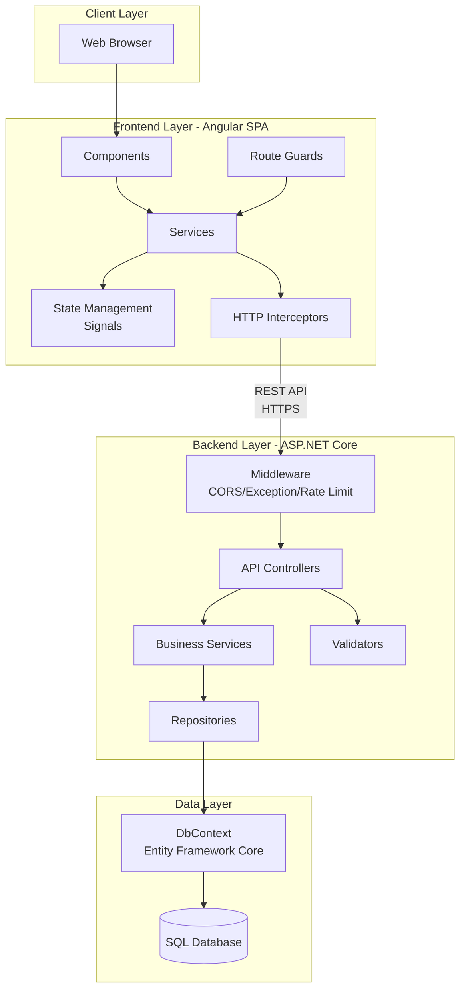
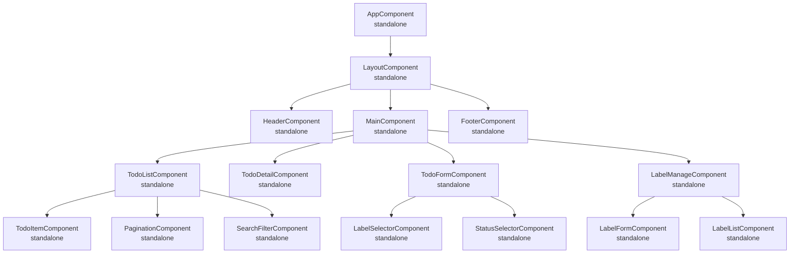
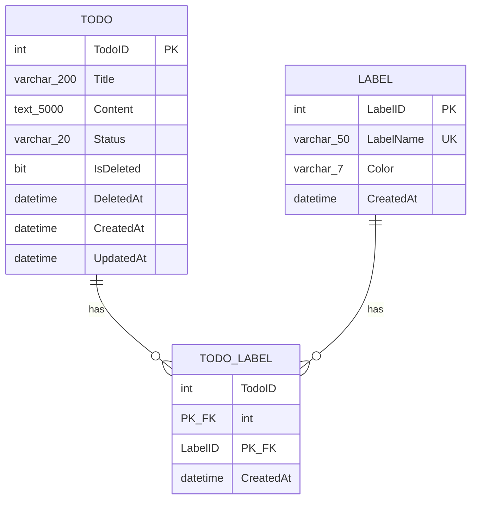

# ソフトウェア設計記述書: 高機能ToDoアプリケーション

**文書ID**: SDD-001  
**バージョン**: 2.0  
**作成日**: 2025-01-31  
**最終更新日**: 2025-01-31  
**ステータス**: Draft

---

## 1. はじめに

### 1.1 目的

本文書は、高機能ToDoアプリケーション（todo-app）のソフトウェア詳細設計を記述するものである。本文書は IEEE 1016-2009（Systems and software engineering — Life cycle processes — Design description）に準拠し、実装者が実装可能な具体的レベルの設計情報を提供する。

**本設計書の目的：**
- 開発者が実装に必要な詳細な技術仕様の提供
- システムアーキテクチャとコンポーネント構成の明確化
- API、データベース、UI設計の詳細定義
- セキュリティおよびパフォーマンス設計の具体化
- 要求仕様書とのトレーサビリティ確保

### 1.2 範囲

本設計書は以下の範囲をカバーする：

**対象システム：**
- Frontend: Angular（SPA）
- Backend: ASP.NET Core（REST API）
- Database: SQL Database

**設計範囲：**
- システム全体アーキテクチャ
- Frontendコンポーネント設計
- Backend API・ビジネスロジック設計
- データベース物理設計
- セキュリティ設計
- パフォーマンス設計

**対象外：**
- インフラストラクチャ詳細（サーバー構成等）
- デプロイメント手順
- 運用監視設計
- ユーザー認証機能（将来フェーズ）

### 1.3 参照資料

- **要求仕様書**: `docs/todo-app/要求定義/SRS-001-todo-app.md` (v2.0)
- IEEE 1016-2009: Systems and software engineering — Life cycle processes — Design description
- Angular公式ドキュメント: https://angular.io/
- ASP.NET Core公式ドキュメント: https://docs.microsoft.com/aspnet/core/
- OWASP Top Ten: https://owasp.org/www-project-top-ten/

### 1.4 用語・定義

| 用語 | 定義 |
|---|---|
| SPA | Single Page Application - クライアントサイドでレンダリングするWebアプリケーション |
| DTO | Data Transfer Object - レイヤー間でデータを転送するオブジェクト |
| DI | Dependency Injection - 依存性注入パターン |
| Repository | データアクセス層のデザインパターン |
| Service | ビジネスロジック層 |
| Controller | APIエンドポイントを提供するコントローラー層 |
| Signal | Angular 16+の新しいリアクティブプリミティブ |
| UTC | 協定世界時 - すべての日時データはUTCで保存 |

---

## 2. 設計概要

### 2.1 設計方針

**アーキテクチャパターン：**
- **Frontend**: Component-based Architecture（Angular）
- **Backend**: Layered Architecture（Controller → Service → Repository）
- **全体**: 3-Tier Architecture

**設計原則：**
1. **関心の分離（Separation of Concerns）**: 各層が明確な責務を持つ
2. **SOLID原則**: 特に単一責任原則、依存性逆転原則を重視
3. **DRY原則**: コードの重複を避ける
4. **API First**: APIインターフェースを先に定義
5. **セキュアバイデザイン**: 設計段階からセキュリティを考慮
6. **パフォーマンスバイデザイン**: インデックス設計、クエリ最適化を事前設計

### 2.2 アーキテクチャ概要



### 2.3 技術スタック

| レイヤー | 技術 | バージョン | 用途 | 対応要件 |
|---|---|---|---|---|
| **Frontend** | Angular | 17+ | SPAフレームワーク（スタンドアロンコンポーネント） | REQ-COMP-001 |
| | TypeScript | 5.0+ | 型安全な開発 | REQ-COMP-001 |
| | RxJS | 7.8+ | リアクティブプログラミング | REQ-COMP-001 |
| | Angular Material | 17+ | UIコンポーネント（M-04対応） | REQ-USE-001, 008 |
| | Signals API | Angular 16+ | 状態管理（M-03対応） | REQ-PERF-003, 004 |
| **Backend** | ASP.NET Core | 8.0+ | Web APIフレームワーク | REQ-COMP-002 |
| | C# | 12.0+ | プログラミング言語 | REQ-COMP-002 |
| | Entity Framework Core | 8.0+ | ORM | REQ-COMP-002 |
| | FluentValidation | 11.0+ | バリデーション | REQ-SEC-005 |
| | Swashbuckle | 6.5+ | OpenAPI/Swagger | REQ-MAIN-003 |
| | AspNetCoreRateLimit | 5.0+ | APIレート制限 | REQ-SEC-006 |
| **Database** | SQL Server | 2022+ / Azure SQL | リレーショナルDB | REQ-COMP-003 |
| | Full-Text Search | Japanese Word Breaker | 日本語全文検索（C-03対応） | REQ-PERF-007, 008 |
| | SQL Database Project | - | スキーマ管理 | REQ-EXT-004 |
| **Development** | Git | - | バージョン管理 | REQ-MAIN-004 |
| | npm | - | パッケージ管理（Frontend） | - |
| | NuGet | - | パッケージ管理（Backend） | - |

### 2.4 レイヤー責務

| レイヤー | 責務 | 禁止事項 |
|---|---|---|
| **Presentation (Angular)** | UI表示、ユーザー入力受付、画面遷移 | ビジネスロジック、直接DB接続 |
| **API Controller** | HTTPリクエスト/レスポンス変換、ルーティング | ビジネスロジック、DB直接操作 |
| **Business Service** | ビジネスルール実装、トランザクション制御 | HTTPリクエスト操作、SQL直接発行 |
| **Repository** | データアクセス抽象化、クエリ構築 | ビジネスロジック |
| **Data Layer** | データ永続化 | - |

---

## 3. システムコンテキスト

### 3.1 外部インターフェース

| インターフェース | 種類 | プロトコル | 説明 |
|---|---|---|---|
| Frontend ⇔ Backend | REST API | HTTPS | JSON形式のデータ交換 |
| Backend ⇔ Database | SQL | TDS | Entity Framework Core経由 |
| Browser ⇔ Frontend | HTTP(S) | HTTPS | 静的ファイル配信 |

### 3.2 API通信仕様

**Base URL:** `https://{domain}/api/v1`

**共通ヘッダー:**
```http
Content-Type: application/json
Accept: application/json
X-Request-ID: {UUID}
```

**共通レスポンス形式:**
```json
{
  "success": true,
  "data": {},
  "errors": [],
  "meta": {
    "timestamp": "2025-01-31T00:00:00Z",
    "requestId": "uuid"
  }
}
```

---

## 4. Frontend設計

### 4.1 Angular 17+アーキテクチャ概要（C-01対応）

**主要な設計決定:**
1. **スタンドアロンコンポーネント**: すべてのコンポーネントを`standalone: true`で定義（NgModuleを使用しない）
2. **制御フロー構文**: `@if`、`@for`、`@switch`を使用（`*ngIf`、`*ngFor`は使用禁止）
3. **inject()関数**: コンストラクタベースのDIの代わりに`inject()`関数を使用
4. **Signals API**: リアクティブな状態管理に`signal()`、`computed()`、`effect()`を使用
5. **app.config.ts**: プロバイダー設定を`ApplicationConfig`で一元管理

**アプリケーション設定 (app.config.ts):**
```typescript
import { ApplicationConfig } from '@angular/core';
import { provideRouter } from '@angular/router';
import { provideHttpClient, withInterceptors } from '@angular/common/http';
import { provideAnimations } from '@angular/platform-browser/animations';
import { routes } from './app.routes';
import { authInterceptor } from './core/interceptors/auth.interceptor';
import { errorInterceptor } from './core/interceptors/error.interceptor';

export const appConfig: ApplicationConfig = {
  providers: [
    provideRouter(routes),
    provideHttpClient(
      withInterceptors([authInterceptor, errorInterceptor])
    ),
    provideAnimations(),
    // アプリケーション固有のサービス
    TodoService,
    LabelService,
    SearchService,
    ErrorHandlerService
  ]
};
```

**メインエントリーポイント (main.ts):**
```typescript
import { bootstrapApplication } from '@angular/platform-browser';
import { AppComponent } from './app/app.component';
import { appConfig } from './app/app.config';

bootstrapApplication(AppComponent, appConfig)
  .catch(err => console.error(err));
```

### 4.2 ディレクトリ構造

```
src/todo-app/front/src/
├── app/
│   ├── core/                    # コア機能（シングルトン）
│   │   ├── services/           # HTTP, Error Handling等
│   │   ├── interceptors/       # HTTP Interceptors（関数形式）
│   │   ├── guards/             # Route Guards（関数形式）
│   │   └── models/             # 共通データモデル
│   ├── shared/                 # 共有コンポーネント・モジュール
│   │   ├── components/         # 再利用可能コンポーネント（standalone）
│   │   ├── directives/         # カスタムディレクティブ（standalone）
│   │   └── pipes/              # カスタムパイプ（standalone）
│   ├── features/               # 機能別モジュール
│   │   ├── todo/               # ToDo機能
│   │   │   ├── components/
│   │   │   ├── services/
│   │   │   ├── models/
│   │   │   └── todo.routes.ts
│   │   └── label/              # ラベル機能
│   │       ├── components/
│   │       ├── services/
│   │       ├── models/
│   │       └── label.routes.ts
│   ├── app.component.ts        # ルートコンポーネント（standalone）
│   ├── app.config.ts           # アプリケーション設定
│   └── app.routes.ts           # ルート定義
├── environments/
│   ├── environment.ts
│   └── environment.prod.ts
└── assets/
```

### 4.3 コンポーネント構成



### 4.4 主要コンポーネント詳細（C-01対応：Angular 17+最新機能）

#### 4.4.1 AppComponent

| 項目 | 内容 |
|---|---|
| パス | `src/todo-app/front/src/app/app.component.ts` |
| 責務 | アプリケーションのルートコンポーネント |
| セレクター | `app-root` |

**実装例:**
```typescript
import { Component } from '@angular/core';
import { RouterOutlet } from '@angular/router';
import { LayoutComponent } from './core/layout/layout.component';

@Component({
  selector: 'app-root',
  standalone: true,
  imports: [RouterOutlet, LayoutComponent],
  template: `
    <app-layout>
      <router-outlet />
    </app-layout>
  `,
  styles: [`
    :host {
      display: block;
      height: 100%;
    }
  `]
})
export class AppComponent {
  title = 'ToDo App';
}
```

#### 4.4.2 TodoListComponent

| 項目 | 内容 |
|---|---|
| パス | `src/todo-app/front/src/app/features/todo/components/todo-list/` |
| 責務 | ToDo一覧の表示、ページネーション、絞込UI提供 |
| セレクター | `app-todo-list` |
| 対応要件 | REQ-FUNC-002, REQ-PERF-002, REQ-USE-001 |

**実装例（inject()とSignals使用）:**
```typescript
import { Component, OnInit, signal, computed, inject } from '@angular/core';
import { CommonModule } from '@angular/common';
import { Router } from '@angular/router';
import { TodoService } from '../../services/todo.service';
import { TodoItemComponent } from '../todo-item/todo-item.component';
import { PaginationComponent } from '@shared/components/pagination/pagination.component';
import { SearchFilterComponent } from '../search-filter/search-filter.component';
import { LoadingSpinnerComponent } from '@shared/components/loading-spinner/loading-spinner.component';
import { Todo, FilterCriteria, PagedResponse } from '../../models';

@Component({
  selector: 'app-todo-list',
  standalone: true,
  imports: [
    CommonModule,
    TodoItemComponent,
    PaginationComponent,
    SearchFilterComponent,
    LoadingSpinnerComponent
  ],
  template: `
    <div class="todo-list-container">
      <div class="header">
        <h1>ToDo一覧</h1>
        <button class="btn-primary" (click)="onCreateNew()">
          新規作成 (Ctrl+N)
        </button>
      </div>

      <app-search-filter 
        [filterCriteria]="filterCriteria()"
        (filterChange)="onFilterChange($event)"
      />

      @if (isLoading()) {
        <app-loading-spinner />
      } @else {
        <div class="todo-list">
          @for (todo of todos(); track todo.todoId) {
            <app-todo-item 
              [todo]="todo"
              (select)="onTodoSelect(todo.todoId)"
              (delete)="onTodoDelete(todo.todoId)"
            />
          } @empty {
            <div class="empty-state">
              <p>ToDoがありません</p>
              <button (click)="onCreateNew()">最初のToDoを作成</button>
            </div>
          }
        </div>

        @if (totalCount() > 0) {
          <app-pagination
            [currentPage]="currentPage()"
            [totalPages]="totalPages()"
            [hasNextPage]="hasNextPage()"
            [hasPrevPage]="hasPrevPage()"
            (pageChange)="onPageChange($event)"
          />
        }
      }
    </div>
  `,
  styleUrls: ['./todo-list.component.scss']
})
export class TodoListComponent implements OnInit {
  // inject()関数による依存性注入
  private todoService = inject(TodoService);
  private router = inject(Router);

  // Signals
  todos = signal<Todo[]>([]);
  currentPage = signal<number>(1);
  pageSize = signal<number>(20);
  totalCount = signal<number>(0);
  isLoading = signal<boolean>(false);
  filterCriteria = signal<FilterCriteria>({
    statuses: [],
    labelIds: [],
    keyword: '',
    startDate: null,
    endDate: null
  });

  // Computed Signals
  totalPages = computed(() => Math.ceil(this.totalCount() / this.pageSize()));
  hasNextPage = computed(() => this.currentPage() < this.totalPages());
  hasPrevPage = computed(() => this.currentPage() > 1);

  ngOnInit(): void {
    this.loadTodos();
  }

  loadTodos(): void {
    this.isLoading.set(true);
    const criteria = this.filterCriteria();

    this.todoService.getTodos(
      this.currentPage(),
      this.pageSize(),
      criteria
    ).subscribe({
      next: (response: PagedResponse<Todo>) => {
        this.todos.set(response.data);
        this.totalCount.set(response.meta.total);
        this.isLoading.set(false);
      },
      error: (error) => {
        this.isLoading.set(false);
        console.error('Failed to load todos:', error);
      }
    });
  }

  onPageChange(page: number): void {
    this.currentPage.set(page);
    this.loadTodos();
  }

  onFilterChange(criteria: FilterCriteria): void {
    this.filterCriteria.set(criteria);
    this.currentPage.set(1); // Reset to first page
    this.loadTodos();
  }

  onTodoSelect(todoId: number): void {
    this.router.navigate(['/todos', todoId]);
  }

  onTodoDelete(todoId: number): void {
    if (confirm('このToDoを削除してもよろしいですか？')) {
      this.todoService.deleteTodo(todoId).subscribe({
        next: () => {
          this.loadTodos();
        },
        error: (error) => {
          console.error('Failed to delete todo:', error);
        }
      });
    }
  }

  onCreateNew(): void {
    this.router.navigate(['/todos/new']);
  }
}
```

#### 4.4.3 TodoFormComponent

| 項目 | 内容 |
|---|---|
| パス | `src/todo-app/front/src/app/features/todo/components/todo-form/` |
| 責務 | ToDo作成・編集フォームの提供 |
| セレクター | `app-todo-form` |
| 対応要件 | REQ-FUNC-001, REQ-FUNC-004, REQ-USE-005, REQ-USE-006 |

**実装例:**
```typescript
import { Component, OnInit, signal, inject } from '@angular/core';
import { CommonModule } from '@angular/common';
import { ReactiveFormsModule, FormBuilder, FormGroup, Validators } from '@angular/forms';
import { ActivatedRoute, Router } from '@angular/router';
import { TodoService } from '../../services/todo.service';
import { LabelService } from '../../../label/services/label.service';
import { LabelSelectorComponent } from '../label-selector/label-selector.component';
import { StatusSelectorComponent } from '../status-selector/status-selector.component';
import { Label, Todo, CreateTodoRequest, UpdateTodoRequest } from '../../models';

@Component({
  selector: 'app-todo-form',
  standalone: true,
  imports: [
    CommonModule,
    ReactiveFormsModule,
    LabelSelectorComponent,
    StatusSelectorComponent
  ],
  template: `
    <div class="todo-form-container">
      <h1>{{ isEditMode() ? 'ToDo編集' : 'ToDo作成' }}</h1>

      <form [formGroup]="todoForm" (ngSubmit)="onSubmit()">
        <div class="form-group">
          <label for="title">
            タイトル <span class="required">*</span>
          </label>
          <input
            id="title"
            type="text"
            formControlName="title"
            placeholder="タイトルを入力"
            maxlength="200"
            [class.invalid]="todoForm.get('title')?.invalid && todoForm.get('title')?.touched"
          />
          @if (todoForm.get('title')?.invalid && todoForm.get('title')?.touched) {
            <span class="error-message">
              @if (todoForm.get('title')?.errors?.['required']) {
                タイトルは必須です
              }
              @if (todoForm.get('title')?.errors?.['maxlength']) {
                タイトルは200文字以内で入力してください
              }
            </span>
          }
        </div>

        <div class="form-group">
          <label for="content">内容</label>
          <textarea
            id="content"
            formControlName="content"
            placeholder="内容を入力（任意）"
            rows="10"
            maxlength="5000"
            [class.invalid]="todoForm.get('content')?.invalid && todoForm.get('content')?.touched"
          ></textarea>
          @if (todoForm.get('content')?.invalid && todoForm.get('content')?.touched) {
            <span class="error-message">
              内容は5000文字以内で入力してください
            </span>
          }
        </div>

        <div class="form-group">
          <label>ステータス <span class="required">*</span></label>
          <app-status-selector formControlName="status" />
        </div>

        <div class="form-group">
          <label>ラベル（最大10個）</label>
          <app-label-selector
            [availableLabels]="availableLabels()"
            formControlName="labelIds"
          />
        </div>

        <div class="form-actions">
          <button type="button" class="btn-secondary" (click)="onCancel()">
            キャンセル
          </button>
          <button
            type="submit"
            class="btn-primary"
            [disabled]="todoForm.invalid || isSubmitting()"
          >
            {{ isSubmitting() ? '保存中...' : '保存 (Ctrl+S)' }}
          </button>
        </div>
      </form>
    </div>
  `,
  styleUrls: ['./todo-form.component.scss']
})
export class TodoFormComponent implements OnInit {
  // inject()による依存性注入
  private fb = inject(FormBuilder);
  private todoService = inject(TodoService);
  private labelService = inject(LabelService);
  private route = inject(ActivatedRoute);
  private router = inject(Router);

  // Signals
  isEditMode = signal<boolean>(false);
  todoId = signal<number | null>(null);
  availableLabels = signal<Label[]>([]);
  isSubmitting = signal<boolean>(false);

  // Reactive Form
  todoForm: FormGroup;

  constructor() {
    this.todoForm = this.fb.group({
      title: ['', [Validators.required, Validators.maxLength(200)]],
      content: ['', [Validators.maxLength(5000)]],
      status: ['NotStarted', Validators.required],
      labelIds: [[]]
    });
  }

  ngOnInit(): void {
    this.loadLabels();

    const id = this.route.snapshot.paramMap.get('id');
    if (id) {
      this.isEditMode.set(true);
      this.todoId.set(+id);
      this.loadTodo(+id);
    }
  }

  loadLabels(): void {
    this.labelService.getLabels().subscribe({
      next: (response) => {
        this.availableLabels.set(response.data);
      }
    });
  }

  loadTodo(id: number): void {
    this.todoService.getTodoById(id).subscribe({
      next: (response) => {
        const todo = response.data;
        this.todoForm.patchValue({
          title: todo.title,
          content: todo.content,
          status: todo.status,
          labelIds: todo.labels.map(l => l.labelId)
        });
      },
      error: (error) => {
        console.error('Failed to load todo:', error);
        this.router.navigate(['/todos']);
      }
    });
  }

  onSubmit(): void {
    if (this.todoForm.invalid) {
      return;
    }

    this.isSubmitting.set(true);
    const formValue = this.todoForm.value;

    if (this.isEditMode()) {
      const request: UpdateTodoRequest = {
        title: formValue.title,
        content: formValue.content,
        status: formValue.status,
        labelIds: formValue.labelIds
      };

      this.todoService.updateTodo(this.todoId()!, request).subscribe({
        next: () => {
          this.isSubmitting.set(false);
          this.router.navigate(['/todos', this.todoId()]);
        },
        error: (error) => {
          this.isSubmitting.set(false);
          console.error('Failed to update todo:', error);
        }
      });
    } else {
      const request: CreateTodoRequest = {
        title: formValue.title,
        content: formValue.content,
        status: formValue.status,
        labelIds: formValue.labelIds
      };

      this.todoService.createTodo(request).subscribe({
        next: (response) => {
          this.isSubmitting.set(false);
          this.router.navigate(['/todos', response.data.todoId]);
        },
        error: (error) => {
          this.isSubmitting.set(false);
          console.error('Failed to create todo:', error);
        }
      });
    }
  }

  onCancel(): void {
    this.router.navigate(['/todos']);
  }
}
```

### 4.5 サービス設計（M-02対応：責務分離）

#### 4.5.1 TodoService

| 項目 | 内容 |
|---|---|
| パス | `src/todo-app/front/src/app/features/todo/services/todo.service.ts` |
| 責務 | ToDo関連のCRUD操作、HTTP通信 |
| 提供形式 | `providedIn: 'root'` |
| 対応要件 | REQ-FUNC-001～007 |

**実装:**
```typescript
import { Injectable, inject } from '@angular/core';
import { HttpClient, HttpParams } from '@angular/common/http';
import { Observable } from 'rxjs';
import { environment } from '@environments/environment';
import { 
  Todo, 
  CreateTodoRequest, 
  UpdateTodoRequest,
  PagedResponse,
  ApiResponse,
  FilterCriteria
} from '../models';

@Injectable({
  providedIn: 'root'
})
export class TodoService {
  private http = inject(HttpClient);
  private apiUrl = `${environment.apiBaseUrl}/api/v1/todos`;

  /**
   * ToDo一覧取得（ページネーション、絞込対応）
   * @param page ページ番号（1始まり）
   * @param pageSize ページサイズ
   * @param filter 絞込条件
   */
  getTodos(
    page: number,
    pageSize: number,
    filter?: FilterCriteria
  ): Observable<PagedResponse<Todo>> {
    let params = new HttpParams()
      .set('page', page.toString())
      .set('pageSize', pageSize.toString());

    if (filter) {
      if (filter.statuses && filter.statuses.length > 0) {
        params = params.set('statuses', filter.statuses.join(','));
      }
      if (filter.labelIds && filter.labelIds.length > 0) {
        params = params.set('labelIds', filter.labelIds.join(','));
      }
      if (filter.keyword) {
        params = params.set('keyword', filter.keyword);
      }
      if (filter.startDate) {
        params = params.set('startDate', filter.startDate.toISOString());
      }
      if (filter.endDate) {
        params = params.set('endDate', filter.endDate.toISOString());
      }
    }

    return this.http.get<PagedResponse<Todo>>(this.apiUrl, { params });
  }

  /**
   * ToDo詳細取得
   * @param id ToDoID
   */
  getTodoById(id: number): Observable<ApiResponse<Todo>> {
    return this.http.get<ApiResponse<Todo>>(`${this.apiUrl}/${id}`);
  }

  /**
   * ToDo作成
   * @param request 作成リクエスト
   */
  createTodo(request: CreateTodoRequest): Observable<ApiResponse<Todo>> {
    return this.http.post<ApiResponse<Todo>>(this.apiUrl, request);
  }

  /**
   * ToDo更新
   * @param id ToDoID
   * @param request 更新リクエスト
   */
  updateTodo(id: number, request: UpdateTodoRequest): Observable<ApiResponse<Todo>> {
    return this.http.put<ApiResponse<Todo>>(`${this.apiUrl}/${id}`, request);
  }

  /**
   * ToDo削除（論理削除）
   * @param id ToDoID
   */
  deleteTodo(id: number): Observable<void> {
    return this.http.delete<void>(`${this.apiUrl}/${id}`);
  }

  /**
   * ステータス更新
   * @param id ToDoID
   * @param status 新しいステータス
   */
  updateStatus(id: number, status: string): Observable<ApiResponse<Todo>> {
    return this.http.patch<ApiResponse<Todo>>(
      `${this.apiUrl}/${id}/status`,
      { status }
    );
  }
}
```

#### 4.5.2 LabelService（M-02対応：責務分離）

| 項目 | 内容 |
|---|---|
| パス | `src/todo-app/front/src/app/features/label/services/label.service.ts` |
| 責務 | ラベル関連のCRUD操作、HTTP通信 |
| 提供形式 | `providedIn: 'root'` |
| 対応要件 | REQ-FUNC-008～012 |

**実装:**
```typescript
import { Injectable, inject } from '@angular/core';
import { HttpClient } from '@angular/common/http';
import { Observable } from 'rxjs';
import { environment } from '@environments/environment';
import { 
  Label, 
  CreateLabelRequest, 
  UpdateLabelRequest,
  ApiResponse
} from '../models';

@Injectable({
  providedIn: 'root'
})
export class LabelService {
  private http = inject(HttpClient);
  private apiUrl = `${environment.apiBaseUrl}/api/v1/labels`;

  /**
   * ラベル一覧取得
   */
  getLabels(): Observable<ApiResponse<Label[]>> {
    return this.http.get<ApiResponse<Label[]>>(this.apiUrl);
  }

  /**
   * ラベル詳細取得
   * @param id ラベルID
   */
  getLabelById(id: number): Observable<ApiResponse<Label>> {
    return this.http.get<ApiResponse<Label>>(`${this.apiUrl}/${id}`);
  }

  /**
   * ラベル作成
   * @param request 作成リクエスト
   */
  createLabel(request: CreateLabelRequest): Observable<ApiResponse<Label>> {
    return this.http.post<ApiResponse<Label>>(this.apiUrl, request);
  }

  /**
   * ラベル更新
   * @param id ラベルID
   * @param request 更新リクエスト
   */
  updateLabel(id: number, request: UpdateLabelRequest): Observable<ApiResponse<Label>> {
    return this.http.put<ApiResponse<Label>>(`${this.apiUrl}/${id}`, request);
  }

  /**
   * ラベル削除
   * @param id ラベルID
   */
  deleteLabel(id: number): Observable<void> {
    return this.http.delete<void>(`${this.apiUrl}/${id}`);
  }
}
```

#### 4.5.3 SearchService（M-02対応：責務分離）

| 項目 | 内容 |
|---|---|
| パス | `src/todo-app/front/src/app/features/todo/services/search.service.ts` |
| 責務 | 検索・絞込機能の状態管理、検索履歴管理 |
| 提供形式 | `providedIn: 'root'` |
| 対応要件 | REQ-FUNC-013～017 |

**実装:**
```typescript
import { Injectable, signal, computed } from '@angular/core';
import { FilterCriteria } from '../models';

@Injectable({
  providedIn: 'root'
})
export class SearchService {
  // 現在の絞込条件
  private currentFilter = signal<FilterCriteria>({
    statuses: [],
    labelIds: [],
    keyword: '',
    startDate: null,
    endDate: null
  });

  // 検索履歴（最大10件）
  private searchHistory = signal<string[]>([]);

  // Computed: 絞込条件が適用されているか
  hasActiveFilters = computed(() => {
    const filter = this.currentFilter();
    return (
      filter.statuses.length > 0 ||
      filter.labelIds.length > 0 ||
      filter.keyword !== '' ||
      filter.startDate !== null ||
      filter.endDate !== null
    );
  });

  /**
   * 現在の絞込条件を取得
   */
  getFilter() {
    return this.currentFilter.asReadonly();
  }

  /**
   * 絞込条件を更新
   * @param filter 新しい絞込条件
   */
  updateFilter(filter: FilterCriteria): void {
    this.currentFilter.set(filter);

    // キーワード検索の場合、履歴に追加
    if (filter.keyword && filter.keyword.trim() !== '') {
      this.addToHistory(filter.keyword);
    }
  }

  /**
   * 絞込条件をクリア
   */
  clearFilter(): void {
    this.currentFilter.set({
      statuses: [],
      labelIds: [],
      keyword: '',
      startDate: null,
      endDate: null
    });
  }

  /**
   * 検索履歴を取得
   */
  getSearchHistory() {
    return this.searchHistory.asReadonly();
  }

  /**
   * 検索履歴に追加
   * @param keyword キーワード
   */
  private addToHistory(keyword: string): void {
    const history = this.searchHistory();
    const newHistory = [keyword, ...history.filter(h => h !== keyword)].slice(0, 10);
    this.searchHistory.set(newHistory);

    // LocalStorageに保存
    localStorage.setItem('todo-search-history', JSON.stringify(newHistory));
  }

  /**
   * 検索履歴をクリア
   */
  clearHistory(): void {
    this.searchHistory.set([]);
    localStorage.removeItem('todo-search-history');
  }

  /**
   * LocalStorageから検索履歴を復元
   */
  loadHistory(): void {
    const stored = localStorage.getItem('todo-search-history');
    if (stored) {
      try {
        const history = JSON.parse(stored) as string[];
        this.searchHistory.set(history);
      } catch (error) {
        console.error('Failed to load search history:', error);
      }
    }
  }
}
```

### 4.6 状態管理設計（M-03対応：Signals詳細設計）

#### 4.6.1 Signals使用方針

**原則:**
1. **signal()**: ミュータブルな状態を管理（set(), update()で更新）
2. **computed()**: 他のSignalから派生する読み取り専用の値
3. **effect()**: Signalの変更に対する副作用を実行（使用は最小限に）

**使用例:**

| 状態の種類 | 使用するAPI | 具体例 |
|---|---|---|
| コンポーネント内状態 | signal() | `isLoading = signal(false)` |
| サーバーから取得したデータ | signal() | `todos = signal<Todo[]>([])` |
| フォーム入力状態 | signal() | `searchKeyword = signal('')` |
| 派生データ（計算値） | computed() | `totalPages = computed(() => ...)` |
| 複数Signalの組み合わせ | computed() | `filteredTodos = computed(() => ...)` |
| ログ出力・外部API呼び出し | effect() | `effect(() => console.log(...))` |

#### 4.6.2 状態管理パターン例

**パターン1: コンポーネントローカル状態**
```typescript
@Component({
  selector: 'app-todo-item',
  standalone: true,
  template: `
    <div class="todo-item" [class.expanded]="isExpanded()">
      <button (click)="toggleExpanded()">
        {{ isExpanded() ? '▼' : '▶' }}
      </button>
      @if (isExpanded()) {
        <div class="todo-details">{{ todo.content }}</div>
      }
    </div>
  `
})
export class TodoItemComponent {
  @Input() todo!: Todo;
  
  // ローカル状態
  isExpanded = signal(false);

  toggleExpanded(): void {
    this.isExpanded.update(value => !value);
  }
}
```

**パターン2: Computed Signalsでの派生データ**
```typescript
export class TodoListComponent {
  todos = signal<Todo[]>([]);
  filterStatus = signal<string[]>([]);

  // Computed: フィルタリングされたToDo
  filteredTodos = computed(() => {
    const allTodos = this.todos();
    const statuses = this.filterStatus();

    if (statuses.length === 0) {
      return allTodos;
    }

    return allTodos.filter(todo => statuses.includes(todo.status));
  });

  // Computed: 完了数
  completedCount = computed(() => {
    return this.todos().filter(t => t.status === 'Completed').length;
  });

  // Computed: 完了率
  completionRate = computed(() => {
    const total = this.todos().length;
    if (total === 0) return 0;
    return (this.completedCount() / total) * 100;
  });
}
```

**パターン3: effectの適切な使用**
```typescript
export class TodoListComponent {
  searchKeyword = signal('');
  todos = signal<Todo[]>([]);

  constructor() {
    // キーワード変更時に自動検索（デバウンス付き）
    effect(() => {
      const keyword = this.searchKeyword();
      
      // デバウンス処理はeffect外で実装することを推奨
      // effectは副作用の実行に限定
      console.log('Search keyword changed:', keyword);
    });
  }
}
```

#### 4.6.3 パフォーマンス最適化

**最適化戦略:**
1. **OnPush変更検出**: すべてのコンポーネントで`changeDetection: ChangeDetectionStrategy.OnPush`を使用
2. **track関数**: `@for`ディレクティブで必ず`track`を指定
3. **Computed Signals**: 重い計算はComputedで自動メモ化
4. **非同期パイプ**: ObservableをSignalに変換して使用

**実装例:**
```typescript
@Component({
  selector: 'app-todo-list',
  standalone: true,
  changeDetection: ChangeDetectionStrategy.OnPush, // OnPush戦略
  template: `
    @for (todo of todos(); track todo.todoId) {
      <app-todo-item [todo]="todo" />
    }
  `
})
export class TodoListComponent {
  todos = signal<Todo[]>([]);
  
  // Computed Signalsは自動的にメモ化される
  expensiveComputation = computed(() => {
    return this.todos().map(todo => {
      // 重い処理
      return transformTodo(todo);
    });
  });
}
```

### 4.7 ルーティング設計（C-01対応：関数形式ガード）

**app.routes.ts:**
```typescript
import { Routes } from '@angular/router';
import { canActivateTodo } from './core/guards/todo.guard';

export const routes: Routes = [
  {
    path: '',
    redirectTo: '/todos',
    pathMatch: 'full'
  },
  {
    path: 'todos',
    loadComponent: () => import('./features/todo/components/todo-list/todo-list.component')
      .then(m => m.TodoListComponent),
    title: 'ToDo一覧'
  },
  {
    path: 'todos/new',
    loadComponent: () => import('./features/todo/components/todo-form/todo-form.component')
      .then(m => m.TodoFormComponent),
    title: 'ToDo作成'
  },
  {
    path: 'todos/:id',
    loadComponent: () => import('./features/todo/components/todo-detail/todo-detail.component')
      .then(m => m.TodoDetailComponent),
    canActivate: [canActivateTodo], // 関数形式のガード
    title: 'ToDo詳細'
  },
  {
    path: 'todos/:id/edit',
    loadComponent: () => import('./features/todo/components/todo-form/todo-form.component')
      .then(m => m.TodoFormComponent),
    canActivate: [canActivateTodo],
    title: 'ToDo編集'
  },
  {
    path: 'labels',
    loadComponent: () => import('./features/label/components/label-manage/label-manage.component')
      .then(m => m.LabelManageComponent),
    title: 'ラベル管理'
  },
  {
    path: '**',
    loadComponent: () => import('./shared/components/not-found/not-found.component')
      .then(m => m.NotFoundComponent),
    title: 'ページが見つかりません'
  }
];
```

**関数形式のガード:**
```typescript
// todo.guard.ts
import { inject } from '@angular/core';
import { CanActivateFn, Router } from '@angular/router';
import { TodoService } from '@features/todo/services/todo.service';
import { map, catchError } from 'rxjs/operators';
import { of } from 'rxjs';

export const canActivateTodo: CanActivateFn = (route) => {
  const todoService = inject(TodoService);
  const router = inject(Router);
  const todoId = Number(route.paramMap.get('id'));

  if (isNaN(todoId)) {
    router.navigate(['/todos']);
    return false;
  }

  return todoService.getTodoById(todoId).pipe(
    map(() => true),
    catchError(() => {
      router.navigate(['/todos']);
      return of(false);
    })
  );
};
```

### 4.8 Angular Material コンポーネント（M-04対応）

**使用コンポーネント一覧:**

| コンポーネント | 用途 | インポート |
|---|---|---|
| MatButtonModule | ボタン | `import { MatButtonModule } from '@angular/material/button';` |
| MatIconModule | アイコン | `import { MatIconModule } from '@angular/material/icon';` |
| MatFormFieldModule | フォームフィールド | `import { MatFormFieldModule } from '@angular/material/form-field';` |
| MatInputModule | 入力フィールド | `import { MatInputModule } from '@angular/material/input';` |
| MatSelectModule | セレクトボックス | `import { MatSelectModule } from '@angular/material/select';` |
| MatCheckboxModule | チェックボックス | `import { MatCheckboxModule } from '@angular/material/checkbox';` |
| MatChipsModule | ラベル表示 | `import { MatChipsModule } from '@angular/material/chips';` |
| MatDialogModule | ダイアログ | `import { MatDialogModule } from '@angular/material/dialog';` |
| MatPaginatorModule | ページネーション | `import { MatPaginatorModule } from '@angular/material/paginator';` |
| MatProgressSpinnerModule | ローディング | `import { MatProgressSpinnerModule } from '@angular/material/progress-spinner';` |
| MatDatepickerModule | 日付選択 | `import { MatDatepickerModule } from '@angular/material/datepicker';` |
| MatNativeDateModule | 日付アダプター | `import { MatNativeDateModule } from '@angular/material/core';` |
| MatTooltipModule | ツールチップ | `import { MatTooltipModule } from '@angular/material/tooltip';` |
| MatSnackBarModule | 通知 | `import { MatSnackBarModule } from '@angular/material/snack-bar';` |

**テーマ設定（styles.scss）:**
```scss
@use '@angular/material' as mat;

@include mat.core();

$todo-app-primary: mat.define-palette(mat.$indigo-palette);
$todo-app-accent: mat.define-palette(mat.$pink-palette, A200, A100, A400);
$todo-app-warn: mat.define-palette(mat.$red-palette);

$todo-app-theme: mat.define-light-theme((
  color: (
    primary: $todo-app-primary,
    accent: $todo-app-accent,
    warn: $todo-app-warn,
  ),
  typography: mat.define-typography-config(),
  density: 0,
));

@include mat.all-component-themes($todo-app-theme);
```

### 4.9 キーボードショートカット（C-02対応：REQ-USE-007）

**実装方針:**
- `@HostListener`を使用してキーイベントをハンドリング
- ショートカット一覧をヘルプダイアログで表示

**主要ショートカット:**

| ショートカット | 機能 | 実装箇所 |
|---|---|---|
| Ctrl+N | 新規ToDo作成 | AppComponent |
| Ctrl+F | 検索フォーカス | TodoListComponent |
| Ctrl+S | フォーム保存 | TodoFormComponent |
| Esc | ダイアログ閉じる | 各ダイアログコンポーネント |
| ? | ショートカット一覧表示 | AppComponent |

**実装例:**
```typescript
@Component({
  selector: 'app-root',
  standalone: true,
  template: `...`
})
export class AppComponent {
  private router = inject(Router);
  private dialog = inject(MatDialog);

  @HostListener('window:keydown', ['$event'])
  handleKeyboardEvent(event: KeyboardEvent): void {
    // Ctrl+N: 新規作成
    if (event.ctrlKey && event.key === 'n') {
      event.preventDefault();
      this.router.navigate(['/todos/new']);
    }

    // ?: ショートカット一覧表示
    if (event.key === '?' && !event.ctrlKey && !event.altKey) {
      event.preventDefault();
      this.dialog.open(ShortcutHelpDialogComponent);
    }
  }
}
```

### 4.10 アクセシビリティ（C-02対応：REQ-USE-008）

**WCAG 2.1 Level AA準拠のための実装:**

1. **セマンティックHTML:**
   - `<main>`, `<nav>`, `<article>`, `<section>`を適切に使用
   - 見出しレベルの階層構造を維持

2. **ARIA属性:**
   ```typescript
   template: `
     <button
       aria-label="ToDoを削除"
       [attr.aria-expanded]="isExpanded()"
       (click)="delete()"
     >
       削除
     </button>
   `
   ```

3. **キーボードナビゲーション:**
   - すべてのインタラクティブ要素にtabindex設定
   - focus管理の実装

4. **色覚異常対応:**
   - ステータスを色だけでなくアイコンでも識別可能に
   - コントラスト比4.5:1以上を確保

5. **スクリーンリーダー対応:**
   ```typescript
   template: `
     <div role="status" aria-live="polite" aria-atomic="true">
       {{ todos().length }}件のToDoが見つかりました
     </div>
   `
   ```

### 4.11 学習容易性（C-02対応：REQ-USE-004）

**初回ユーザー向けガイド実装:**

1. **ツールチップ:**
   ```typescript
   template: `
     <button
       matTooltip="新しいToDoを作成します（Ctrl+N）"
       matTooltipPosition="below"
     >
       新規作成
     </button>
   `
   ```

2. **初回起動時チュートリアル:**
   ```typescript
   @Component({
     selector: 'app-onboarding-tour',
     standalone: true,
     template: `
       @if (showTour()) {
         <div class="tour-overlay">
           <div class="tour-step">
             <h3>{{ currentStep().title }}</h3>
             <p>{{ currentStep().description }}</p>
             <button (click)="nextStep()">次へ</button>
           </div>
         </div>
       }
     `
   })
   export class OnboardingTourComponent {
     showTour = signal(false);
     currentStepIndex = signal(0);

     tourSteps = [
       { title: 'ToDoの作成', description: '右上の「新規作成」ボタンでToDoを作成できます' },
       { title: 'ステータス管理', description: 'ToDoをクリックしてステータスを変更できます' },
       { title: 'ラベルで整理', description: 'ラベルを使ってToDoを分類できます' },
     ];

     currentStep = computed(() => this.tourSteps[this.currentStepIndex()]);

     ngOnInit(): void {
       const hasSeenTour = localStorage.getItem('has-seen-tour');
       if (!hasSeenTour) {
         this.showTour.set(true);
       }
     }

     nextStep(): void {
       if (this.currentStepIndex() < this.tourSteps.length - 1) {
         this.currentStepIndex.update(i => i + 1);
       } else {
         this.completeTour();
       }
     }

     completeTour(): void {
       this.showTour.set(false);
       localStorage.setItem('has-seen-tour', 'true');
     }
   }
   ```

3. **エラーメッセージの明確化:**
   ```typescript
   errorMessages = {
     required: 'この項目は必須です',
     maxlength: '文字数制限を超えています（最大{max}文字）',
     titleRequired: 'タイトルを入力してください',
     invalidDate: '有効な日付を入力してください'
   };
   ```

---

## 5. Backend設計
  
  getTodoById(id: number): Observable<ApiResponse<Todo>> {
    return this.http.get<ApiResponse<Todo>>(`${this.apiUrl}/${id}`);
  }
  
  createTodo(data: CreateTodoRequest): Observable<ApiResponse<Todo>> {
    return this.http.post<ApiResponse<Todo>>(this.apiUrl, data);
  }
  
  updateTodo(id: number, data: UpdateTodoRequest): Observable<ApiResponse<Todo>> {
    return this.http.put<ApiResponse<Todo>>(`${this.apiUrl}/${id}`, data);
  }
  
  deleteTodo(id: number): Observable<ApiResponse<void>> {
    return this.http.delete<ApiResponse<void>>(`${this.apiUrl}/${id}`);
  }
  
  updateStatus(id: number, status: TodoStatus): Observable<ApiResponse<Todo>> {
    return this.http.patch<ApiResponse<Todo>>(
      `${this.apiUrl}/${id}/status`,
      { status }
    );
  }
  
  private buildQueryParams(
    page: number,
    pageSize: number,
    filter: FilterCriteria
  ): HttpParams {
    let params = new HttpParams()
      .set('page', page.toString())
      .set('pageSize', pageSize.toString());
    
    if (filter.statuses && filter.statuses.length > 0) {
      filter.statuses.forEach(status => {
        params = params.append('statuses', status);
      });
    }
    
    if (filter.labels && filter.labels.length > 0) {
      filter.labels.forEach(labelId => {
        params = params.append('labelIds', labelId.toString());
      });
    }
    
    if (filter.keyword) {
      params = params.set('keyword', filter.keyword);
    }
    
    if (filter.startDate) {
      params = params.set('startDate', filter.startDate.toISOString());
    }
    
    if (filter.endDate) {
      params = params.set('endDate', filter.endDate.toISOString());
    }
    
    return params;
  }
}
```

#### 4.4.2 LabelService

| 項目 | 内容 |
|---|---|
| パス | `src/todo-app/front/src/app/features/label/services/label.service.ts` |
| 責務 | ラベル関連のHTTP通信 |
| 提供形式 | `providedIn: 'root'` |

**実装:**
```typescript
@Injectable({
  providedIn: 'root'
})
export class LabelService {
  private apiUrl = `${environment.apiBaseUrl}/api/v1/labels`;
  
  constructor(private http: HttpClient) {}
  
  getLabels(): Observable<ApiResponse<Label[]>> {
    return this.http.get<ApiResponse<Label[]>>(this.apiUrl);
  }
  
  getLabelById(id: number): Observable<ApiResponse<Label>> {
    return this.http.get<ApiResponse<Label>>(`${this.apiUrl}/${id}`);
  }
  
  createLabel(data: CreateLabelRequest): Observable<ApiResponse<Label>> {
    return this.http.post<ApiResponse<Label>>(this.apiUrl, data);
  }
  
  updateLabel(id: number, data: UpdateLabelRequest): Observable<ApiResponse<Label>> {
    return this.http.put<ApiResponse<Label>>(`${this.apiUrl}/${id}`, data);
  }
  
  deleteLabel(id: number): Observable<ApiResponse<void>> {
    return this.http.delete<ApiResponse<void>>(`${this.apiUrl}/${id}`);
  }
}
```

### 4.5 データモデル

#### 4.5.1 Todo Model

```typescript
export interface Todo {
  todoId: number;
  title: string;
  content: string | null;
  status: TodoStatus;
  labels: Label[];
  createdAt: Date;
  updatedAt: Date;
}

export enum TodoStatus {
  NotStarted = 'NotStarted',
  InProgress = 'InProgress',
  Completed = 'Completed',
  Abandoned = 'Abandoned'
}

export interface CreateTodoRequest {
  title: string;
  content?: string;
  status: TodoStatus;
  labelIds: number[];
}

export interface UpdateTodoRequest {
  title: string;
  content?: string;
  status: TodoStatus;
  labelIds: number[];
}

export interface FilterCriteria {
  statuses?: TodoStatus[];
  labels?: number[];
  keyword?: string;
  startDate?: Date | null;
  endDate?: Date | null;
}
```

#### 4.5.2 Label Model

```typescript
export interface Label {
  labelId: number;
  labelName: string;
  color: string;
  todoCount?: number;
  createdAt: Date;
}

export interface CreateLabelRequest {
  labelName: string;
  color: string;
}

export interface UpdateLabelRequest {
  labelName: string;
  color: string;
}
```

#### 4.5.3 API Response Model

```typescript
export interface ApiResponse<T> {
  success: boolean;
  data: T;
  errors: ApiError[];
  meta: ResponseMeta;
}

export interface ApiError {
  code: string;
  message: string;
  field?: string;
}

export interface ResponseMeta {
  timestamp: string;
  requestId: string;
  total?: number;
  page?: number;
  pageSize?: number;
}
```

### 4.6 ルーティング設計

```typescript
// app.routes.ts
export const routes: Routes = [
  {
    path: '',
    component: LayoutComponent,
    children: [
      { path: '', redirectTo: '/todos', pathMatch: 'full' },
      {
        path: 'todos',
        loadChildren: () => import('./features/todo/todo.routes').then(m => m.TODO_ROUTES)
      },
      {
        path: 'labels',
        loadChildren: () => import('./features/label/label.routes').then(m => m.LABEL_ROUTES)
      }
    ]
  },
  { path: '**', component: NotFoundComponent }
];

// features/todo/todo.routes.ts
export const TODO_ROUTES: Routes = [
  {
    path: '',
    component: TodoListComponent
  },
  {
    path: 'new',
    component: TodoFormComponent
  },
  {
    path: ':id',
    component: TodoDetailComponent
  },
  {
    path: ':id/edit',
    component: TodoFormComponent
  }
];

// features/label/label.routes.ts
export const LABEL_ROUTES: Routes = [
  {
    path: '',
    component: LabelManageComponent
  }
];
```

### 4.7 HTTP Interceptor

#### 4.7.1 ErrorInterceptor

```typescript
@Injectable()
export class ErrorInterceptor implements HttpInterceptor {
  constructor(private errorService: ErrorService) {}
  
  intercept(req: HttpRequest<any>, next: HttpHandler): Observable<HttpEvent<any>> {
    return next.handle(req).pipe(
      catchError((error: HttpErrorResponse) => {
        let errorMessage = '';
        
        if (error.error instanceof ErrorEvent) {
          // Client-side error
          errorMessage = `Error: ${error.error.message}`;
        } else {
          // Server-side error
          errorMessage = this.getServerErrorMessage(error);
        }
        
        this.errorService.showError(errorMessage);
        return throwError(() => error);
      })
    );
  }
  
  private getServerErrorMessage(error: HttpErrorResponse): string {
    switch (error.status) {
      case 400:
        return error.error?.errors?.[0]?.message || 'Invalid request';
      case 401:
        return 'Unauthorized';
      case 404:
        return 'Resource not found';
      case 500:
        return 'Server error occurred';
      default:
        return `Error Code: ${error.status}\nMessage: ${error.message}`;
    }
  }
}
```

---

## 5. Backend設計

### 5.1 プロジェクト構造

```
src/todo-app/api/
├── TodoApp.API/                # Web API Layer
│   ├── Controllers/
│   ├── Middleware/
│   ├── Filters/
│   ├── Program.cs
│   └── appsettings.json
├── TodoApp.Core/               # Business Logic Layer
│   ├── Services/
│   ├── Interfaces/
│   ├── DTOs/
│   └── Validators/
├── TodoApp.Infrastructure/     # Data Access Layer
│   ├── Data/
│   │   ├── TodoDbContext.cs
│   │   └── Configurations/
│   ├── Repositories/
│   └── Migrations/
└── TodoApp.Domain/             # Domain Entities
    └── Entities/
```

### 5.2 API設計

#### 5.2.1 エンドポイント一覧

| HTTPメソッド | エンドポイント | 説明 | 要件ID |
|---|---|---|---|
| GET | `/api/v1/todos` | ToDo一覧取得（ページネーション、フィルタ） | REQ-FUNC-002 |
| GET | `/api/v1/todos/{id}` | ToDo詳細取得 | REQ-FUNC-003 |
| POST | `/api/v1/todos` | ToDo作成 | REQ-FUNC-001 |
| PUT | `/api/v1/todos/{id}` | ToDo更新 | REQ-FUNC-004 |
| DELETE | `/api/v1/todos/{id}` | ToDo削除（論理削除） | REQ-FUNC-005 |
| PATCH | `/api/v1/todos/{id}/status` | ステータス更新 | REQ-FUNC-006 |
| GET | `/api/v1/labels` | ラベル一覧取得 | REQ-FUNC-009 |
| GET | `/api/v1/labels/{id}` | ラベル詳細取得 | - |
| POST | `/api/v1/labels` | ラベル作成 | REQ-FUNC-008 |
| PUT | `/api/v1/labels/{id}` | ラベル更新 | REQ-FUNC-010 |
| DELETE | `/api/v1/labels/{id}` | ラベル削除 | REQ-FUNC-011 |

#### 5.2.2 ToDo API詳細

##### GET /api/v1/todos

**説明**: ToDo一覧を取得する（ページネーション、フィルタリング対応）

**クエリパラメータ:**
```typescript
{
  page?: number,          // ページ番号（デフォルト: 1）
  pageSize?: number,      // 1ページあたりの件数（デフォルト: 20, 最大: 100）
  statuses?: string[],    // ステータスフィルタ（OR条件）
  labelIds?: number[],    // ラベルIDフィルタ（OR条件）
  keyword?: string,       // キーワード検索（タイトル・内容）
  startDate?: string,     // 開始日時（ISO 8601形式）
  endDate?: string        // 終了日時（ISO 8601形式）
}
```

**レスポンス（200 OK）:**
```json
{
  "success": true,
  "data": [
    {
      "todoId": 1,
      "title": "プロジェクト計画書作成",
      "content": "Q1の計画書を作成する",
      "status": "InProgress",
      "labels": [
        {
          "labelId": 1,
          "labelName": "仕事",
          "color": "#FF5733"
        }
      ],
      "createdAt": "2025-01-31T00:00:00Z",
      "updatedAt": "2025-01-31T00:00:00Z"
    }
  ],
  "errors": [],
  "meta": {
    "timestamp": "2025-01-31T00:00:00Z",
    "requestId": "uuid-here",
    "total": 150,
    "page": 1,
    "pageSize": 20
  }
}
```

**エラーレスポンス:**
| HTTPステータス | 説明 | レスポンス例 |
|---|---|---|
| 400 Bad Request | パラメータ不正 | `{"success": false, "errors": [{"code": "INVALID_PARAMETER", "message": "pageSize must be between 1 and 100"}]}` |
| 500 Internal Server Error | サーバーエラー | `{"success": false, "errors": [{"code": "INTERNAL_ERROR", "message": "An unexpected error occurred"}]}` |

##### GET /api/v1/todos/{id}

**説明**: 指定されたIDのToDo詳細を取得する

**パスパラメータ:**
- `id` (number): ToDoID

**レスポンス（200 OK）:**
```json
{
  "success": true,
  "data": {
    "todoId": 1,
    "title": "プロジェクト計画書作成",
    "content": "Q1の計画書を作成する\n詳細な計画を含める",
    "status": "InProgress",
    "labels": [
      {
        "labelId": 1,
        "labelName": "仕事",
        "color": "#FF5733"
      },
      {
        "labelId": 2,
        "labelName": "重要",
        "color": "#FF0000"
      }
    ],
    "createdAt": "2025-01-31T00:00:00Z",
    "updatedAt": "2025-01-31T01:30:00Z"
  },
  "errors": [],
  "meta": {
    "timestamp": "2025-01-31T02:00:00Z",
    "requestId": "uuid-here"
  }
}
```

**エラーレスポンス:**
| HTTPステータス | 説明 |
|---|---|
| 404 Not Found | ToDoが存在しない、または削除済み |
| 400 Bad Request | IDパラメータが不正 |


##### POST /api/v1/todos

**説明**: 新しいToDoを作成する

**リクエストボディ:**
```json
{
  "title": "新しいタスク",
  "content": "タスクの詳細説明",
  "status": "NotStarted",
  "labelIds": [1, 2]
}
```

**バリデーションルール:**
| フィールド | ルール |
|---|---|
| title | 必須、最大200文字 |
| content | 任意、最大5000文字 |
| status | 必須、NotStarted/InProgress/Completed/Abandonedのいずれか |
| labelIds | 任意、最大10個 |

**レスポンス（201 Created）:**
```json
{
  "success": true,
  "data": {
    "todoId": 151,
    "title": "新しいタスク",
    "content": "タスクの詳細説明",
    "status": "NotStarted",
    "labels": [
      {"labelId": 1, "labelName": "仕事", "color": "#FF5733"}
    ],
    "createdAt": "2025-01-31T03:00:00Z",
    "updatedAt": "2025-01-31T03:00:00Z"
  },
  "errors": [],
  "meta": {
    "timestamp": "2025-01-31T03:00:00Z",
    "requestId": "uuid-here"
  }
}
```

**エラーレスポンス:**
| HTTPステータス | 説明 |
|---|---|
| 400 Bad Request | バリデーションエラー |
| 404 Not Found | 指定されたlabelIdが存在しない |

##### PUT /api/v1/todos/{id}

**説明**: 既存のToDoを更新する

**パスパラメータ:**
- `id` (number): ToDoID

**リクエストボディ:**
```json
{
  "title": "更新されたタスク",
  "content": "更新された詳細説明",
  "status": "InProgress",
  "labelIds": [1, 3]
}
```

**レスポンス（200 OK）:** POST /api/v1/todosと同様

**エラーレスポンス:**
| HTTPステータス | 説明 |
|---|---|
| 404 Not Found | ToDoが存在しない、または削除済み |
| 400 Bad Request | バリデーションエラー |

##### DELETE /api/v1/todos/{id}

**説明**: ToDoを論理削除する

**パスパラメータ:**
- `id` (number): ToDoID

**レスポンス（204 No Content）:**
```json
{
  "success": true,
  "data": null,
  "errors": [],
  "meta": {
    "timestamp": "2025-01-31T04:00:00Z",
    "requestId": "uuid-here"
  }
}
```

**エラーレスポンス:**
| HTTPステータス | 説明 |
|---|---|
| 404 Not Found | ToDoが存在しない、または既に削除済み |

##### PATCH /api/v1/todos/{id}/status

**説明**: ToDoのステータスのみを更新する

**パスパラメータ:**
- `id` (number): ToDoID

**リクエストボディ:**
```json
{
  "status": "Completed"
}
```

**レスポンス（200 OK）:** GET /api/v1/todos/{id}と同様

#### 5.2.3 Label API詳細

##### GET /api/v1/labels

**説明**: ラベル一覧を取得する

**レスポンス（200 OK）:**
```json
{
  "success": true,
  "data": [
    {
      "labelId": 1,
      "labelName": "仕事",
      "color": "#FF5733",
      "todoCount": 25,
      "createdAt": "2025-01-01T00:00:00Z"
    }
  ],
  "errors": [],
  "meta": {
    "timestamp": "2025-01-31T05:00:00Z",
    "requestId": "uuid-here"
  }
}
```

##### POST /api/v1/labels

**説明**: 新しいラベルを作成する

**リクエストボディ:**
```json
{
  "labelName": "新しいラベル",
  "color": "#00FF00"
}
```

**バリデーションルール:**
| フィールド | ルール |
|---|---|
| labelName | 必須、最大50文字、ユニーク |
| color | 必須、カラーコード形式（#RRGGBB） |

**レスポンス（201 Created）:**
```json
{
  "success": true,
  "data": {
    "labelId": 10,
    "labelName": "新しいラベル",
    "color": "#00FF00",
    "todoCount": 0,
    "createdAt": "2025-01-31T06:00:00Z"
  },
  "errors": [],
  "meta": {
    "timestamp": "2025-01-31T06:00:00Z",
    "requestId": "uuid-here"
  }
}
```

**エラーレスポンス:**
| HTTPステータス | 説明 |
|---|---|
| 400 Bad Request | バリデーションエラー |
| 409 Conflict | 同名のラベルが既に存在する |

### 5.3 Controller設計

#### 5.3.1 TodosController

```csharp
namespace TodoApp.API.Controllers;

[ApiController]
[Route("api/v1/[controller]")]
[Produces("application/json")]
public class TodosController : ControllerBase
{
    private readonly ITodoService _todoService;
    private readonly ILogger<TodosController> _logger;

    public TodosController(
        ITodoService todoService,
        ILogger<TodosController> logger)
    {
        _todoService = todoService;
        _logger = logger;
    }

    /// <summary>
    /// ToDo一覧を取得する
    /// </summary>
    [HttpGet]
    [ProducesResponseType(typeof(ApiResponse<IEnumerable<TodoDto>>), StatusCodes.Status200OK)]
    [ProducesResponseType(typeof(ApiResponse<object>), StatusCodes.Status400BadRequest)]
    public async Task<IActionResult> GetTodos(
        [FromQuery] TodoQueryParameters parameters,
        CancellationToken cancellationToken = default)
    {
        try
        {
            var result = await _todoService.GetTodosAsync(parameters, cancellationToken);
            
            var response = new ApiResponse<IEnumerable<TodoDto>>
            {
                Success = true,
                Data = result.Items,
                Meta = new ResponseMeta
                {
                    Timestamp = DateTime.UtcNow,
                    RequestId = HttpContext.TraceIdentifier,
                    Total = result.TotalCount,
                    Page = parameters.Page,
                    PageSize = parameters.PageSize
                }
            };
            
            return Ok(response);
        }
        catch (ArgumentException ex)
        {
            return BadRequest(CreateErrorResponse(ex.Message, "INVALID_PARAMETER"));
        }
    }

    /// <summary>
    /// ToDoの詳細を取得する
    /// </summary>
    [HttpGet("{id}")]
    [ProducesResponseType(typeof(ApiResponse<TodoDto>), StatusCodes.Status200OK)]
    [ProducesResponseType(typeof(ApiResponse<object>), StatusCodes.Status404NotFound)]
    public async Task<IActionResult> GetTodoById(
        int id,
        CancellationToken cancellationToken = default)
    {
        try
        {
            var todo = await _todoService.GetTodoByIdAsync(id, cancellationToken);
            
            var response = new ApiResponse<TodoDto>
            {
                Success = true,
                Data = todo,
                Meta = new ResponseMeta
                {
                    Timestamp = DateTime.UtcNow,
                    RequestId = HttpContext.TraceIdentifier
                }
            };
            
            return Ok(response);
        }
        catch (NotFoundException ex)
        {
            return NotFound(CreateErrorResponse(ex.Message, "NOT_FOUND"));
        }
    }

    /// <summary>
    /// 新しいToDoを作成する
    /// </summary>
    [HttpPost]
    [ProducesResponseType(typeof(ApiResponse<TodoDto>), StatusCodes.Status201Created)]
    [ProducesResponseType(typeof(ApiResponse<object>), StatusCodes.Status400BadRequest)]
    public async Task<IActionResult> CreateTodo(
        [FromBody] CreateTodoRequest request,
        CancellationToken cancellationToken = default)
    {
        try
        {
            var todo = await _todoService.CreateTodoAsync(request, cancellationToken);
            
            var response = new ApiResponse<TodoDto>
            {
                Success = true,
                Data = todo,
                Meta = new ResponseMeta
                {
                    Timestamp = DateTime.UtcNow,
                    RequestId = HttpContext.TraceIdentifier
                }
            };
            
            return CreatedAtAction(
                nameof(GetTodoById),
                new { id = todo.TodoId },
                response);
        }
        catch (ValidationException ex)
        {
            return BadRequest(CreateValidationErrorResponse(ex));
        }
        catch (NotFoundException ex)
        {
            return NotFound(CreateErrorResponse(ex.Message, "NOT_FOUND"));
        }
    }

    /// <summary>
    /// ToDoを更新する
    /// </summary>
    [HttpPut("{id}")]
    [ProducesResponseType(typeof(ApiResponse<TodoDto>), StatusCodes.Status200OK)]
    [ProducesResponseType(typeof(ApiResponse<object>), StatusCodes.Status404NotFound)]
    public async Task<IActionResult> UpdateTodo(
        int id,
        [FromBody] UpdateTodoRequest request,
        CancellationToken cancellationToken = default)
    {
        try
        {
            var todo = await _todoService.UpdateTodoAsync(id, request, cancellationToken);
            
            var response = new ApiResponse<TodoDto>
            {
                Success = true,
                Data = todo,
                Meta = new ResponseMeta
                {
                    Timestamp = DateTime.UtcNow,
                    RequestId = HttpContext.TraceIdentifier
                }
            };
            
            return Ok(response);
        }
        catch (NotFoundException ex)
        {
            return NotFound(CreateErrorResponse(ex.Message, "NOT_FOUND"));
        }
        catch (ValidationException ex)
        {
            return BadRequest(CreateValidationErrorResponse(ex));
        }
    }

    /// <summary>
    /// ToDoを削除する（論理削除）
    /// </summary>
    [HttpDelete("{id}")]
    [ProducesResponseType(typeof(ApiResponse<object>), StatusCodes.Status204NoContent)]
    [ProducesResponseType(typeof(ApiResponse<object>), StatusCodes.Status404NotFound)]
    public async Task<IActionResult> DeleteTodo(
        int id,
        CancellationToken cancellationToken = default)
    {
        try
        {
            await _todoService.DeleteTodoAsync(id, cancellationToken);
            
            var response = new ApiResponse<object>
            {
                Success = true,
                Data = null,
                Meta = new ResponseMeta
                {
                    Timestamp = DateTime.UtcNow,
                    RequestId = HttpContext.TraceIdentifier
                }
            };
            
            return Ok(response);
        }
        catch (NotFoundException ex)
        {
            return NotFound(CreateErrorResponse(ex.Message, "NOT_FOUND"));
        }
    }

    /// <summary>
    /// ToDoのステータスを更新する
    /// </summary>
    [HttpPatch("{id}/status")]
    [ProducesResponseType(typeof(ApiResponse<TodoDto>), StatusCodes.Status200OK)]
    [ProducesResponseType(typeof(ApiResponse<object>), StatusCodes.Status404NotFound)]
    public async Task<IActionResult> UpdateTodoStatus(
        int id,
        [FromBody] UpdateTodoStatusRequest request,
        CancellationToken cancellationToken = default)
    {
        try
        {
            var todo = await _todoService.UpdateTodoStatusAsync(id, request.Status, cancellationToken);
            
            var response = new ApiResponse<TodoDto>
            {
                Success = true,
                Data = todo,
                Meta = new ResponseMeta
                {
                    Timestamp = DateTime.UtcNow,
                    RequestId = HttpContext.TraceIdentifier
                }
            };
            
            return Ok(response);
        }
        catch (NotFoundException ex)
        {
            return NotFound(CreateErrorResponse(ex.Message, "NOT_FOUND"));
        }
    }

    private ApiResponse<object> CreateErrorResponse(string message, string code)
    {
        return new ApiResponse<object>
        {
            Success = false,
            Data = null,
            Errors = new List<ApiError>
            {
                new ApiError { Code = code, Message = message }
            },
            Meta = new ResponseMeta
            {
                Timestamp = DateTime.UtcNow,
                RequestId = HttpContext.TraceIdentifier
            }
        };
    }

    private ApiResponse<object> CreateValidationErrorResponse(ValidationException ex)
    {
        return new ApiResponse<object>
        {
            Success = false,
            Data = null,
            Errors = ex.Errors.Select(e => new ApiError
            {
                Code = "VALIDATION_ERROR",
                Message = e.ErrorMessage,
                Field = e.PropertyName
            }).ToList(),
            Meta = new ResponseMeta
            {
                Timestamp = DateTime.UtcNow,
                RequestId = HttpContext.TraceIdentifier
            }
        };
    }
}
```

### 5.4 Service Layer設計

#### 5.4.1 ITodoService Interface

```csharp
namespace TodoApp.Core.Interfaces;

public interface ITodoService
{
    Task<PagedResult<TodoDto>> GetTodosAsync(
        TodoQueryParameters parameters,
        CancellationToken cancellationToken = default);
    
    Task<TodoDto> GetTodoByIdAsync(
        int id,
        CancellationToken cancellationToken = default);
    
    Task<TodoDto> CreateTodoAsync(
        CreateTodoRequest request,
        CancellationToken cancellationToken = default);
    
    Task<TodoDto> UpdateTodoAsync(
        int id,
        UpdateTodoRequest request,
        CancellationToken cancellationToken = default);
    
    Task DeleteTodoAsync(
        int id,
        CancellationToken cancellationToken = default);
    
    Task<TodoDto> UpdateTodoStatusAsync(
        int id,
        TodoStatus status,
        CancellationToken cancellationToken = default);
}
```

#### 5.4.2 TodoService Implementation

```csharp
namespace TodoApp.Core.Services;

public class TodoService : ITodoService
{
    private readonly ITodoRepository _todoRepository;
    private readonly ILabelRepository _labelRepository;
    private readonly IMapper _mapper;
    private readonly IValidator<CreateTodoRequest> _createValidator;
    private readonly IValidator<UpdateTodoRequest> _updateValidator;
    private readonly ILogger<TodoService> _logger;

    public TodoService(
        ITodoRepository todoRepository,
        ILabelRepository labelRepository,
        IMapper mapper,
        IValidator<CreateTodoRequest> createValidator,
        IValidator<UpdateTodoRequest> updateValidator,
        ILogger<TodoService> logger)
    {
        _todoRepository = todoRepository;
        _labelRepository = labelRepository;
        _mapper = mapper;
        _createValidator = createValidator;
        _updateValidator = updateValidator;
        _logger = logger;
    }

    public async Task<PagedResult<TodoDto>> GetTodosAsync(
        TodoQueryParameters parameters,
        CancellationToken cancellationToken = default)
    {
        _logger.LogInformation("Getting todos with parameters: {@Parameters}", parameters);
        
        // パラメータ検証
        if (parameters.Page < 1)
            throw new ArgumentException("Page must be greater than 0", nameof(parameters.Page));
        
        if (parameters.PageSize < 1 || parameters.PageSize > 100)
            throw new ArgumentException("PageSize must be between 1 and 100", nameof(parameters.PageSize));
        
        var todos = await _todoRepository.GetTodosAsync(parameters, cancellationToken);
        var totalCount = await _todoRepository.GetTodoCountAsync(parameters, cancellationToken);
        
        var todoDtos = _mapper.Map<IEnumerable<TodoDto>>(todos);
        
        return new PagedResult<TodoDto>
        {
            Items = todoDtos,
            TotalCount = totalCount,
            Page = parameters.Page,
            PageSize = parameters.PageSize
        };
    }

    public async Task<TodoDto> GetTodoByIdAsync(
        int id,
        CancellationToken cancellationToken = default)
    {
        _logger.LogInformation("Getting todo by id: {Id}", id);
        
        var todo = await _todoRepository.GetByIdAsync(id, cancellationToken);
        
        if (todo == null || todo.IsDeleted)
        {
            throw new NotFoundException($"Todo with id {id} not found");
        }
        
        return _mapper.Map<TodoDto>(todo);
    }

    public async Task<TodoDto> CreateTodoAsync(
        CreateTodoRequest request,
        CancellationToken cancellationToken = default)
    {
        _logger.LogInformation("Creating todo: {@Request}", request);
        
        // バリデーション
        var validationResult = await _createValidator.ValidateAsync(request, cancellationToken);
        if (!validationResult.IsValid)
        {
            throw new ValidationException(validationResult.Errors);
        }
        
        // ラベルの存在確認
        if (request.LabelIds != null && request.LabelIds.Any())
        {
            await ValidateLabelsExistAsync(request.LabelIds, cancellationToken);
        }
        
        // エンティティ作成
        var todo = new TodoEntity
        {
            Title = request.Title,
            Content = request.Content,
            Status = request.Status,
            CreatedAt = DateTime.UtcNow,
            UpdatedAt = DateTime.UtcNow,
            IsDeleted = false
        };
        
        // ラベル紐付け
        if (request.LabelIds != null && request.LabelIds.Any())
        {
            var labels = await _labelRepository.GetByIdsAsync(request.LabelIds, cancellationToken);
            todo.TodoLabels = labels.Select(l => new TodoLabelEntity
            {
                LabelId = l.LabelId,
                CreatedAt = DateTime.UtcNow
            }).ToList();
        }
        
        var createdTodo = await _todoRepository.CreateAsync(todo, cancellationToken);
        
        _logger.LogInformation("Todo created successfully: {TodoId}", createdTodo.TodoId);
        
        return _mapper.Map<TodoDto>(createdTodo);
    }

    public async Task<TodoDto> UpdateTodoAsync(
        int id,
        UpdateTodoRequest request,
        CancellationToken cancellationToken = default)
    {
        _logger.LogInformation("Updating todo {Id}: {@Request}", id, request);
        
        // バリデーション
        var validationResult = await _updateValidator.ValidateAsync(request, cancellationToken);
        if (!validationResult.IsValid)
        {
            throw new ValidationException(validationResult.Errors);
        }
        
        // 既存ToDoの取得
        var todo = await _todoRepository.GetByIdAsync(id, cancellationToken);
        if (todo == null || todo.IsDeleted)
        {
            throw new NotFoundException($"Todo with id {id} not found");
        }
        
        // ラベルの存在確認
        if (request.LabelIds != null && request.LabelIds.Any())
        {
            await ValidateLabelsExistAsync(request.LabelIds, cancellationToken);
        }
        
        // 更新
        todo.Title = request.Title;
        todo.Content = request.Content;
        todo.Status = request.Status;
        todo.UpdatedAt = DateTime.UtcNow;
        
        // ラベル更新
        if (request.LabelIds != null)
        {
            // 既存のラベル紐付けを削除
            todo.TodoLabels.Clear();
            
            // 新しいラベル紐付けを追加
            if (request.LabelIds.Any())
            {
                var labels = await _labelRepository.GetByIdsAsync(request.LabelIds, cancellationToken);
                todo.TodoLabels = labels.Select(l => new TodoLabelEntity
                {
                    TodoId = id,
                    LabelId = l.LabelId,
                    CreatedAt = DateTime.UtcNow
                }).ToList();
            }
        }
        
        var updatedTodo = await _todoRepository.UpdateAsync(todo, cancellationToken);
        
        _logger.LogInformation("Todo updated successfully: {TodoId}", id);
        
        return _mapper.Map<TodoDto>(updatedTodo);
    }

    public async Task DeleteTodoAsync(
        int id,
        CancellationToken cancellationToken = default)
    {
        _logger.LogInformation("Deleting todo: {Id}", id);
        
        var todo = await _todoRepository.GetByIdAsync(id, cancellationToken);
        if (todo == null || todo.IsDeleted)
        {
            throw new NotFoundException($"Todo with id {id} not found");
        }
        
        // 論理削除
        todo.IsDeleted = true;
        todo.DeletedAt = DateTime.UtcNow;
        todo.UpdatedAt = DateTime.UtcNow;
        
        await _todoRepository.UpdateAsync(todo, cancellationToken);
        
        _logger.LogInformation("Todo deleted successfully: {TodoId}", id);
    }

    public async Task<TodoDto> UpdateTodoStatusAsync(
        int id,
        TodoStatus status,
        CancellationToken cancellationToken = default)
    {
        _logger.LogInformation("Updating todo status {Id} to {Status}", id, status);
        
        var todo = await _todoRepository.GetByIdAsync(id, cancellationToken);
        if (todo == null || todo.IsDeleted)
        {
            throw new NotFoundException($"Todo with id {id} not found");
        }
        
        todo.Status = status;
        todo.UpdatedAt = DateTime.UtcNow;
        
        var updatedTodo = await _todoRepository.UpdateAsync(todo, cancellationToken);
        
        _logger.LogInformation("Todo status updated successfully: {TodoId}", id);
        
        return _mapper.Map<TodoDto>(updatedTodo);
    }

    private async Task ValidateLabelsExistAsync(
        IEnumerable<int> labelIds,
        CancellationToken cancellationToken)
    {
        var labels = await _labelRepository.GetByIdsAsync(labelIds, cancellationToken);
        var existingLabelIds = labels.Select(l => l.LabelId).ToHashSet();
        
        var missingLabelIds = labelIds.Where(id => !existingLabelIds.Contains(id)).ToList();
        if (missingLabelIds.Any())
        {
            throw new NotFoundException(
                $"Labels with ids {string.Join(", ", missingLabelIds)} not found");
        }
    }
}
```

### 5.5 Repository Layer設計

#### 5.5.1 ITodoRepository Interface

```csharp
namespace TodoApp.Core.Interfaces;

public interface ITodoRepository
{
    Task<IEnumerable<TodoEntity>> GetTodosAsync(
        TodoQueryParameters parameters,
        CancellationToken cancellationToken = default);
    
    Task<int> GetTodoCountAsync(
        TodoQueryParameters parameters,
        CancellationToken cancellationToken = default);
    
    Task<TodoEntity?> GetByIdAsync(
        int id,
        CancellationToken cancellationToken = default);
    
    Task<TodoEntity> CreateAsync(
        TodoEntity todo,
        CancellationToken cancellationToken = default);
    
    Task<TodoEntity> UpdateAsync(
        TodoEntity todo,
        CancellationToken cancellationToken = default);
}
```


#### 5.5.2 TodoRepository Implementation

```csharp
namespace TodoApp.Infrastructure.Repositories;

public class TodoRepository : ITodoRepository
{
    private readonly TodoDbContext _context;

    public TodoRepository(TodoDbContext context)
    {
        _context = context;
    }

    public async Task<IEnumerable<TodoEntity>> GetTodosAsync(
        TodoQueryParameters parameters,
        CancellationToken cancellationToken = default)
    {
        var query = _context.Todos
            .Include(t => t.TodoLabels)
                .ThenInclude(tl => tl.Label)
            .Where(t => !t.IsDeleted);
        
        // ステータスフィルタ
        if (parameters.Statuses != null && parameters.Statuses.Any())
        {
            query = query.Where(t => parameters.Statuses.Contains(t.Status));
        }
        
        // ラベルフィルタ
        if (parameters.LabelIds != null && parameters.LabelIds.Any())
        {
            query = query.Where(t => t.TodoLabels
                .Any(tl => parameters.LabelIds.Contains(tl.LabelId)));
        }
        
        // キーワード検索
        if (!string.IsNullOrWhiteSpace(parameters.Keyword))
        {
            var keyword = parameters.Keyword.ToLower();
            query = query.Where(t =>
                t.Title.ToLower().Contains(keyword) ||
                (t.Content != null && t.Content.ToLower().Contains(keyword)));
        }
        
        // 日時範囲フィルタ
        if (parameters.StartDate.HasValue)
        {
            query = query.Where(t => t.CreatedAt >= parameters.StartDate.Value);
        }
        
        if (parameters.EndDate.HasValue)
        {
            query = query.Where(t => t.CreatedAt <= parameters.EndDate.Value);
        }
        
        // ソート（作成日時降順）
        query = query.OrderByDescending(t => t.CreatedAt);
        
        // ページネーション
        query = query
            .Skip((parameters.Page - 1) * parameters.PageSize)
            .Take(parameters.PageSize);
        
        return await query.AsNoTracking().ToListAsync(cancellationToken);
    }

    public async Task<int> GetTodoCountAsync(
        TodoQueryParameters parameters,
        CancellationToken cancellationToken = default)
    {
        var query = _context.Todos
            .Where(t => !t.IsDeleted);
        
        // 同じフィルタリングロジックを適用
        if (parameters.Statuses != null && parameters.Statuses.Any())
        {
            query = query.Where(t => parameters.Statuses.Contains(t.Status));
        }
        
        if (parameters.LabelIds != null && parameters.LabelIds.Any())
        {
            query = query.Where(t => t.TodoLabels
                .Any(tl => parameters.LabelIds.Contains(tl.LabelId)));
        }
        
        if (!string.IsNullOrWhiteSpace(parameters.Keyword))
        {
            var keyword = parameters.Keyword.ToLower();
            query = query.Where(t =>
                t.Title.ToLower().Contains(keyword) ||
                (t.Content != null && t.Content.ToLower().Contains(keyword)));
        }
        
        if (parameters.StartDate.HasValue)
        {
            query = query.Where(t => t.CreatedAt >= parameters.StartDate.Value);
        }
        
        if (parameters.EndDate.HasValue)
        {
            query = query.Where(t => t.CreatedAt <= parameters.EndDate.Value);
        }
        
        return await query.CountAsync(cancellationToken);
    }

    public async Task<TodoEntity?> GetByIdAsync(
        int id,
        CancellationToken cancellationToken = default)
    {
        return await _context.Todos
            .Include(t => t.TodoLabels)
                .ThenInclude(tl => tl.Label)
            .FirstOrDefaultAsync(t => t.TodoId == id, cancellationToken);
    }

    public async Task<TodoEntity> CreateAsync(
        TodoEntity todo,
        CancellationToken cancellationToken = default)
    {
        _context.Todos.Add(todo);
        await _context.SaveChangesAsync(cancellationToken);
        
        // リロードしてナビゲーションプロパティを取得
        return await GetByIdAsync(todo.TodoId, cancellationToken)
            ?? throw new InvalidOperationException("Failed to retrieve created todo");
    }

    public async Task<TodoEntity> UpdateAsync(
        TodoEntity todo,
        CancellationToken cancellationToken = default)
    {
        _context.Todos.Update(todo);
        await _context.SaveChangesAsync(cancellationToken);
        
        return await GetByIdAsync(todo.TodoId, cancellationToken)
            ?? throw new InvalidOperationException("Failed to retrieve updated todo");
    }
}
```

### 5.6 DTO（Data Transfer Object）設計

#### 5.6.1 TodoDto

```csharp
namespace TodoApp.Core.DTOs;

public record TodoDto
{
    public int TodoId { get; init; }
    public string Title { get; init; } = string.Empty;
    public string? Content { get; init; }
    public TodoStatus Status { get; init; }
    public List<LabelDto> Labels { get; init; } = new();
    public DateTime CreatedAt { get; init; }
    public DateTime UpdatedAt { get; init; }
}

public record CreateTodoRequest
{
    public string Title { get; init; } = string.Empty;
    public string? Content { get; init; }
    public TodoStatus Status { get; init; } = TodoStatus.NotStarted;
    public List<int> LabelIds { get; init; } = new();
}

public record UpdateTodoRequest
{
    public string Title { get; init; } = string.Empty;
    public string? Content { get; init; }
    public TodoStatus Status { get; init; }
    public List<int> LabelIds { get; init; } = new();
}

public record UpdateTodoStatusRequest
{
    public TodoStatus Status { get; init; }
}

public record TodoQueryParameters
{
    public int Page { get; init; } = 1;
    public int PageSize { get; init; } = 20;
    public List<TodoStatus>? Statuses { get; init; }
    public List<int>? LabelIds { get; init; }
    public string? Keyword { get; init; }
    public DateTime? StartDate { get; init; }
    public DateTime? EndDate { get; init; }
}
```

#### 5.6.2 LabelDto

```csharp
namespace TodoApp.Core.DTOs;

public record LabelDto
{
    public int LabelId { get; init; }
    public string LabelName { get; init; } = string.Empty;
    public string Color { get; init; } = string.Empty;
    public int? TodoCount { get; init; }
    public DateTime CreatedAt { get; init; }
}

public record CreateLabelRequest
{
    public string LabelName { get; init; } = string.Empty;
    public string Color { get; init; } = string.Empty;
}

public record UpdateLabelRequest
{
    public string LabelName { get; init; } = string.Empty;
    public string Color { get; init; } = string.Empty;
}
```

#### 5.6.3 共通DTO

```csharp
namespace TodoApp.Core.DTOs;

public record ApiResponse<T>
{
    public bool Success { get; init; }
    public T? Data { get; init; }
    public List<ApiError> Errors { get; init; } = new();
    public ResponseMeta Meta { get; init; } = new();
}

public record ApiError
{
    public string Code { get; init; } = string.Empty;
    public string Message { get; init; } = string.Empty;
    public string? Field { get; init; }
}

public record ResponseMeta
{
    public DateTime Timestamp { get; init; }
    public string RequestId { get; init; } = string.Empty;
    public int? Total { get; init; }
    public int? Page { get; init; }
    public int? PageSize { get; init; }
}

public record PagedResult<T>
{
    public IEnumerable<T> Items { get; init; } = Enumerable.Empty<T>();
    public int TotalCount { get; init; }
    public int Page { get; init; }
    public int PageSize { get; init; }
}
```

### 5.7 Validator設計

#### 5.7.1 CreateTodoRequestValidator

```csharp
namespace TodoApp.Core.Validators;

public class CreateTodoRequestValidator : AbstractValidator<CreateTodoRequest>
{
    public CreateTodoRequestValidator()
    {
        RuleFor(x => x.Title)
            .NotEmpty().WithMessage("Title is required")
            .MaximumLength(200).WithMessage("Title must not exceed 200 characters");

        RuleFor(x => x.Content)
            .MaximumLength(5000).WithMessage("Content must not exceed 5000 characters")
            .When(x => !string.IsNullOrEmpty(x.Content));

        RuleFor(x => x.Status)
            .IsInEnum().WithMessage("Invalid status value");

        RuleFor(x => x.LabelIds)
            .Must(x => x == null || x.Count <= 10)
            .WithMessage("A todo can have maximum 10 labels");
    }
}
```

#### 5.7.2 UpdateTodoRequestValidator

```csharp
namespace TodoApp.Core.Validators;

public class UpdateTodoRequestValidator : AbstractValidator<UpdateTodoRequest>
{
    public UpdateTodoRequestValidator()
    {
        RuleFor(x => x.Title)
            .NotEmpty().WithMessage("Title is required")
            .MaximumLength(200).WithMessage("Title must not exceed 200 characters");

        RuleFor(x => x.Content)
            .MaximumLength(5000).WithMessage("Content must not exceed 5000 characters")
            .When(x => !string.IsNullOrEmpty(x.Content));

        RuleFor(x => x.Status)
            .IsInEnum().WithMessage("Invalid status value");

        RuleFor(x => x.LabelIds)
            .Must(x => x == null || x.Count <= 10)
            .WithMessage("A todo can have maximum 10 labels");
    }
}
```

#### 5.7.3 CreateLabelRequestValidator

```csharp
namespace TodoApp.Core.Validators;

public class CreateLabelRequestValidator : AbstractValidator<CreateLabelRequest>
{
    public CreateLabelRequestValidator()
    {
        RuleFor(x => x.LabelName)
            .NotEmpty().WithMessage("Label name is required")
            .MaximumLength(50).WithMessage("Label name must not exceed 50 characters");

        RuleFor(x => x.Color)
            .NotEmpty().WithMessage("Color is required")
            .Matches(@"^#[0-9A-Fa-f]{6}$").WithMessage("Color must be in hex format (#RRGGBB)");
    }
}
```

### 5.8 Middleware設計

#### 5.8.1 GlobalExceptionMiddleware

```csharp
namespace TodoApp.API.Middleware;

public class GlobalExceptionMiddleware
{
    private readonly RequestDelegate _next;
    private readonly ILogger<GlobalExceptionMiddleware> _logger;

    public GlobalExceptionMiddleware(
        RequestDelegate next,
        ILogger<GlobalExceptionMiddleware> logger)
    {
        _next = next;
        _logger = logger;
    }

    public async Task InvokeAsync(HttpContext context)
    {
        try
        {
            await _next(context);
        }
        catch (Exception ex)
        {
            _logger.LogError(ex, "An unhandled exception occurred");
            await HandleExceptionAsync(context, ex);
        }
    }

    private static Task HandleExceptionAsync(HttpContext context, Exception exception)
    {
        context.Response.ContentType = "application/json";
        
        var response = new ApiResponse<object>
        {
            Success = false,
            Data = null,
            Errors = new List<ApiError>
            {
                new ApiError
                {
                    Code = "INTERNAL_ERROR",
                    Message = "An unexpected error occurred"
                }
            },
            Meta = new ResponseMeta
            {
                Timestamp = DateTime.UtcNow,
                RequestId = context.TraceIdentifier
            }
        };

        context.Response.StatusCode = exception switch
        {
            NotFoundException => StatusCodes.Status404NotFound,
            ValidationException => StatusCodes.Status400BadRequest,
            ArgumentException => StatusCodes.Status400BadRequest,
            _ => StatusCodes.Status500InternalServerError
        };

        return context.Response.WriteAsJsonAsync(response);
    }
}
```

---

## 6. データベース設計

### 6.1 ER図



### 6.2 テーブル定義

#### 6.2.1 Todoテーブル

| カラム名 | データ型 | NULL | 制約 | デフォルト | 説明 |
|---|---|---|---|---|---|
| TodoID | INT | NO | PK, IDENTITY(1,1) | - | ToDo識別子 |
| Title | NVARCHAR(200) | NO | - | - | タイトル |
| Content | NVARCHAR(MAX) | YES | CHECK(LEN(Content) <= 5000) | NULL | 内容（最大5000文字） |
| Status | NVARCHAR(20) | NO | CHECK(Status IN ('NotStarted','InProgress','Completed','Abandoned')) | 'NotStarted' | ステータス |
| IsDeleted | BIT | NO | - | 0 | 論理削除フラグ |
| DeletedAt | DATETIME2(7) | YES | - | NULL | 削除日時（UTC） |
| CreatedAt | DATETIME2(7) | NO | - | GETUTCDATE() | 作成日時（UTC） |
| UpdatedAt | DATETIME2(7) | NO | - | GETUTCDATE() | 更新日時（UTC） |

**インデックス:**
```sql
-- 主キー
ALTER TABLE [dbo].[Todo] ADD CONSTRAINT [PK_Todo] PRIMARY KEY CLUSTERED ([TodoID]);

-- ステータスによる絞込用（C-03対応：100万レコード対応）
-- カバリングインデックス：頻繁に使用されるカラムをINCLUDE
CREATE NONCLUSTERED INDEX [IX_Todo_Status_CreatedAt] ON [dbo].[Todo] 
  ([Status], [CreatedAt] DESC)
INCLUDE ([TodoID], [Title], [IsDeleted])
WHERE [IsDeleted] = 0;
-- 説明: ステータス絞込+作成日時ソートのクエリを最適化
-- WHERE句でフィルタ付きインデックスを使用し、論理削除済みレコードを除外

-- 作成日時ソート用（最新順）
CREATE NONCLUSTERED INDEX [IX_Todo_CreatedAt_Desc] ON [dbo].[Todo] 
  ([CreatedAt] DESC)
INCLUDE ([TodoID], [Title], [Status], [IsDeleted])
WHERE [IsDeleted] = 0;
-- 説明: 一覧取得時のデフォルトソート（新しい順）を高速化

-- 論理削除フィルター用
CREATE NONCLUSTERED INDEX [IX_Todo_IsDeleted_CreatedAt] ON [dbo].[Todo] 
  ([IsDeleted], [CreatedAt] DESC)
INCLUDE ([TodoID], [Title], [Status]);
-- 説明: IsDeletedでのフィルタリングを最適化

-- 複合絞込用（ステータス+日時範囲）（C-03対応：100万レコード性能保証）
CREATE NONCLUSTERED INDEX [IX_Todo_Status_CreatedAt_Range] ON [dbo].[Todo]
  ([Status], [CreatedAt])
INCLUDE ([TodoID], [Title], [Content], [IsDeleted])
WHERE [IsDeleted] = 0;
-- 説明: ステータス+日時範囲での絞込を最適化（REQ-FUNC-014, 015, 017対応）

-- 全文検索用（C-03対応：日本語全文検索）
-- 1. フルテキストカタログの作成
CREATE FULLTEXT CATALOG TodoFullTextCatalog AS DEFAULT;

-- 2. 日本語ワードブレーカーを使用したフルテキストインデックス
CREATE FULLTEXT INDEX ON [dbo].[Todo]([Title] LANGUAGE 1041, [Content] LANGUAGE 1041)
KEY INDEX [PK_Todo]
WITH (
  CHANGE_TRACKING = AUTO,
  STOPLIST = SYSTEM
);

-- 言語ID: 1041 = Japanese
-- CHANGE_TRACKING = AUTO: データ変更時に自動的にインデックスを更新
-- STOPLIST = SYSTEM: システム定義のストップワード（助詞・助動詞等）を除外
```

**トリガー（UpdatedAt自動更新）:**
```sql
CREATE TRIGGER [dbo].[TR_Todo_UpdatedAt]
ON [dbo].[Todo]
AFTER UPDATE
AS
BEGIN
    SET NOCOUNT ON;
    
    UPDATE [dbo].[Todo]
    SET [UpdatedAt] = GETUTCDATE()
    FROM [dbo].[Todo] t
    INNER JOIN inserted i ON t.[TodoID] = i.[TodoID];
END;
```

#### 6.2.2 Labelテーブル

| カラム名 | データ型 | NULL | 制約 | デフォルト | 説明 |
|---|---|---|---|---|---|
| LabelID | INT | NO | PK, IDENTITY(1,1) | - | ラベル識別子 |
| LabelName | NVARCHAR(50) | NO | UNIQUE | - | ラベル名 |
| Color | NVARCHAR(7) | NO | CHECK(Color LIKE '#[0-9A-F][0-9A-F][0-9A-F][0-9A-F][0-9A-F][0-9A-F]') | - | 色（カラーコード） |
| CreatedAt | DATETIME2(7) | NO | - | GETUTCDATE() | 作成日時（UTC） |

**インデックス:**
```sql
-- 主キー
ALTER TABLE [dbo].[Label] ADD CONSTRAINT [PK_Label] PRIMARY KEY CLUSTERED ([LabelID]);

-- ラベル名ユニーク制約
CREATE UNIQUE NONCLUSTERED INDEX [UX_Label_LabelName] ON [dbo].[Label] ([LabelName]);
```

#### 6.2.3 TodoLabelテーブル（中間テーブル）

| カラム名 | データ型 | NULL | 制約 | デフォルト | 説明 |
|---|---|---|---|---|---|
| TodoID | INT | NO | PK, FK | - | ToDo識別子 |
| LabelID | INT | NO | PK, FK | - | ラベル識別子 |
| CreatedAt | DATETIME2(7) | NO | - | GETUTCDATE() | 紐付け日時（UTC） |

**制約:**
```sql
-- 主キー（複合キー）
ALTER TABLE [dbo].[TodoLabel] ADD CONSTRAINT [PK_TodoLabel] 
PRIMARY KEY CLUSTERED ([TodoID], [LabelID]);

-- 外部キー制約
ALTER TABLE [dbo].[TodoLabel] ADD CONSTRAINT [FK_TodoLabel_Todo] 
FOREIGN KEY ([TodoID]) REFERENCES [dbo].[Todo]([TodoID])
ON DELETE CASCADE;

ALTER TABLE [dbo].[TodoLabel] ADD CONSTRAINT [FK_TodoLabel_Label] 
FOREIGN KEY ([LabelID]) REFERENCES [dbo].[Label]([LabelID])
ON DELETE CASCADE;
```

**インデックス:**
```sql
-- ラベルからのToDo検索用
CREATE NONCLUSTERED INDEX [IX_TodoLabel_LabelID] ON [dbo].[TodoLabel] ([LabelID])
INCLUDE ([TodoID]);
```

### 6.3 Entity Framework Core設計

#### 6.3.1 TodoEntity

```csharp
namespace TodoApp.Domain.Entities;

public class TodoEntity
{
    public int TodoId { get; set; }
    public string Title { get; set; } = string.Empty;
    public string? Content { get; set; }
    public TodoStatus Status { get; set; } = TodoStatus.NotStarted;
    public bool IsDeleted { get; set; } = false;
    public DateTime? DeletedAt { get; set; }
    public DateTime CreatedAt { get; set; }
    public DateTime UpdatedAt { get; set; }
    
    // Navigation properties
    public ICollection<TodoLabelEntity> TodoLabels { get; set; } = new List<TodoLabelEntity>();
}

public enum TodoStatus
{
    NotStarted,
    InProgress,
    Completed,
    Abandoned
}
```

#### 6.3.2 LabelEntity

```csharp
namespace TodoApp.Domain.Entities;

public class LabelEntity
{
    public int LabelId { get; set; }
    public string LabelName { get; set; } = string.Empty;
    public string Color { get; set; } = string.Empty;
    public DateTime CreatedAt { get; set; }
    
    // Navigation properties
    public ICollection<TodoLabelEntity> TodoLabels { get; set; } = new List<TodoLabelEntity>();
}
```

#### 6.3.3 TodoLabelEntity

```csharp
namespace TodoApp.Domain.Entities;

public class TodoLabelEntity
{
    public int TodoId { get; set; }
    public int LabelId { get; set; }
    public DateTime CreatedAt { get; set; }
    
    // Navigation properties
    public TodoEntity Todo { get; set; } = null!;
    public LabelEntity Label { get; set; } = null!;
}
```

#### 6.3.4 DbContext

```csharp
namespace TodoApp.Infrastructure.Data;

public class TodoDbContext : DbContext
{
    public TodoDbContext(DbContextOptions<TodoDbContext> options)
        : base(options)
    {
    }

    public DbSet<TodoEntity> Todos => Set<TodoEntity>();
    public DbSet<LabelEntity> Labels => Set<LabelEntity>();
    public DbSet<TodoLabelEntity> TodoLabels => Set<TodoLabelEntity>();

    protected override void OnModelCreating(ModelBuilder modelBuilder)
    {
        base.OnModelCreating(modelBuilder);
        
        modelBuilder.ApplyConfigurationsFromAssembly(typeof(TodoDbContext).Assembly);
    }
}
```

#### 6.3.5 Entity Configuration

**TodoEntityConfiguration:**
```csharp
namespace TodoApp.Infrastructure.Data.Configurations;

public class TodoEntityConfiguration : IEntityTypeConfiguration<TodoEntity>
{
    public void Configure(EntityTypeBuilder<TodoEntity> builder)
    {
        builder.ToTable("Todo");
        
        builder.HasKey(t => t.TodoId);
        
        builder.Property(t => t.TodoId)
            .HasColumnName("TodoID");
        
        builder.Property(t => t.Title)
            .HasMaxLength(200)
            .IsRequired();
        
        builder.Property(t => t.Content)
            .HasMaxLength(5000);
        
        builder.Property(t => t.Status)
            .HasMaxLength(20)
            .HasConversion<string>()
            .IsRequired();
        
        builder.Property(t => t.IsDeleted)
            .HasDefaultValue(false)
            .IsRequired();
        
        builder.Property(t => t.CreatedAt)
            .HasDefaultValueSql("GETUTCDATE()")
            .IsRequired();
        
        builder.Property(t => t.UpdatedAt)
            .HasDefaultValueSql("GETUTCDATE()")
            .IsRequired();
        
        // Query Filter for Soft Delete
        builder.HasQueryFilter(t => !t.IsDeleted);
        
        // Indexes
        builder.HasIndex(t => t.Status)
            .HasDatabaseName("IX_Todo_Status")
            .HasFilter("[IsDeleted] = 0");
        
        builder.HasIndex(t => t.CreatedAt)
            .HasDatabaseName("IX_Todo_CreatedAt")
            .IsDescending()
            .HasFilter("[IsDeleted] = 0");
        
        builder.HasIndex(t => t.IsDeleted)
            .HasDatabaseName("IX_Todo_IsDeleted");
    }
}
```

**LabelEntityConfiguration:**
```csharp
namespace TodoApp.Infrastructure.Data.Configurations;

public class LabelEntityConfiguration : IEntityTypeConfiguration<LabelEntity>
{
    public void Configure(EntityTypeBuilder<LabelEntity> builder)
    {
        builder.ToTable("Label");
        
        builder.HasKey(l => l.LabelId);
        
        builder.Property(l => l.LabelId)
            .HasColumnName("LabelID");
        
        builder.Property(l => l.LabelName)
            .HasMaxLength(50)
            .IsRequired();
        
        builder.Property(l => l.Color)
            .HasMaxLength(7)
            .IsRequired();
        
        builder.Property(l => l.CreatedAt)
            .HasDefaultValueSql("GETUTCDATE()")
            .IsRequired();
        
        // Unique constraint
        builder.HasIndex(l => l.LabelName)
            .IsUnique()
            .HasDatabaseName("UX_Label_LabelName");
    }
}
```

**TodoLabelEntityConfiguration:**
```csharp
namespace TodoApp.Infrastructure.Data.Configurations;

public class TodoLabelEntityConfiguration : IEntityTypeConfiguration<TodoLabelEntity>
{
    public void Configure(EntityTypeBuilder<TodoLabelEntity> builder)
    {
        builder.ToTable("TodoLabel");
        
        builder.HasKey(tl => new { tl.TodoId, tl.LabelId });
        
        builder.Property(tl => tl.TodoId)
            .HasColumnName("TodoID");
        
        builder.Property(tl => tl.LabelId)
            .HasColumnName("LabelID");
        
        builder.Property(tl => tl.CreatedAt)
            .HasDefaultValueSql("GETUTCDATE()")
            .IsRequired();
        
        // Relationships
        builder.HasOne(tl => tl.Todo)
            .WithMany(t => t.TodoLabels)
            .HasForeignKey(tl => tl.TodoId)
            .OnDelete(DeleteBehavior.Cascade);
        
        builder.HasOne(tl => tl.Label)
            .WithMany(l => l.TodoLabels)
            .HasForeignKey(tl => tl.LabelId)
            .OnDelete(DeleteBehavior.Cascade);
        
        // Index
        builder.HasIndex(tl => tl.LabelId)
            .HasDatabaseName("IX_TodoLabel_LabelID");
    }
}
```

### 6.4 SQL Migration Script

```sql
-- =====================================
-- Todo App Database Schema
-- =====================================

-- Todoテーブル作成
CREATE TABLE [dbo].[Todo] (
    [TodoID] INT IDENTITY(1,1) NOT NULL,
    [Title] NVARCHAR(200) NOT NULL,
    [Content] NVARCHAR(MAX) NULL,
    [Status] NVARCHAR(20) NOT NULL DEFAULT 'NotStarted',
    [IsDeleted] BIT NOT NULL DEFAULT 0,
    [DeletedAt] DATETIME2(7) NULL,
    [CreatedAt] DATETIME2(7) NOT NULL DEFAULT GETUTCDATE(),
    [UpdatedAt] DATETIME2(7) NOT NULL DEFAULT GETUTCDATE(),
    CONSTRAINT [PK_Todo] PRIMARY KEY CLUSTERED ([TodoID]),
    CONSTRAINT [CK_Todo_Content_Length] CHECK (LEN([Content]) <= 5000),
    CONSTRAINT [CK_Todo_Status] CHECK ([Status] IN ('NotStarted','InProgress','Completed','Abandoned'))
);

-- Labelテーブル作成
CREATE TABLE [dbo].[Label] (
    [LabelID] INT IDENTITY(1,1) NOT NULL,
    [LabelName] NVARCHAR(50) NOT NULL,
    [Color] NVARCHAR(7) NOT NULL,
    [CreatedAt] DATETIME2(7) NOT NULL DEFAULT GETUTCDATE(),
    CONSTRAINT [PK_Label] PRIMARY KEY CLUSTERED ([LabelID]),
    CONSTRAINT [CK_Label_Color] CHECK ([Color] LIKE '#[0-9A-F][0-9A-F][0-9A-F][0-9A-F][0-9A-F][0-9A-F]')
);

-- TodoLabelテーブル作成
CREATE TABLE [dbo].[TodoLabel] (
    [TodoID] INT NOT NULL,
    [LabelID] INT NOT NULL,
    [CreatedAt] DATETIME2(7) NOT NULL DEFAULT GETUTCDATE(),
    CONSTRAINT [PK_TodoLabel] PRIMARY KEY CLUSTERED ([TodoID], [LabelID]),
    CONSTRAINT [FK_TodoLabel_Todo] FOREIGN KEY ([TodoID]) 
        REFERENCES [dbo].[Todo]([TodoID]) ON DELETE CASCADE,
    CONSTRAINT [FK_TodoLabel_Label] FOREIGN KEY ([LabelID]) 
        REFERENCES [dbo].[Label]([LabelID]) ON DELETE CASCADE
);

-- インデックス作成（C-03対応：100万レコード性能保証）

-- ステータス+作成日時による絞込・ソート用（カバリングインデックス）
CREATE NONCLUSTERED INDEX [IX_Todo_Status_CreatedAt] 
    ON [dbo].[Todo] ([Status], [CreatedAt] DESC)
    INCLUDE ([TodoID], [Title], [IsDeleted])
    WHERE [IsDeleted] = 0;

-- 作成日時ソート用（デフォルトの新しい順）
CREATE NONCLUSTERED INDEX [IX_Todo_CreatedAt_Desc] 
    ON [dbo].[Todo] ([CreatedAt] DESC)
    INCLUDE ([TodoID], [Title], [Status], [IsDeleted])
    WHERE [IsDeleted] = 0;

-- 論理削除フィルター+作成日時用
CREATE NONCLUSTERED INDEX [IX_Todo_IsDeleted_CreatedAt] 
    ON [dbo].[Todo] ([IsDeleted], [CreatedAt] DESC)
    INCLUDE ([TodoID], [Title], [Status]);

-- 複合絞込用（ステータス+日時範囲）
CREATE NONCLUSTERED INDEX [IX_Todo_Status_CreatedAt_Range] 
    ON [dbo].[Todo] ([Status], [CreatedAt])
    INCLUDE ([TodoID], [Title], [Content], [IsDeleted])
    WHERE [IsDeleted] = 0;

-- ラベル名ユニーク制約
CREATE UNIQUE NONCLUSTERED INDEX [UX_Label_LabelName] 
    ON [dbo].[Label] ([LabelName]);

-- ラベルからのToDo検索用
CREATE NONCLUSTERED INDEX [IX_TodoLabel_LabelID] 
    ON [dbo].[TodoLabel] ([LabelID])
    INCLUDE ([TodoID]);

-- 全文検索カタログ作成
CREATE FULLTEXT CATALOG [TodoFullTextCatalog] AS DEFAULT;

-- 全文検索インデックス作成（日本語ワードブレーカー使用）
CREATE FULLTEXT INDEX ON [dbo].[Todo](
    [Title] LANGUAGE 1041,
    [Content] LANGUAGE 1041
)
KEY INDEX [PK_Todo]
WITH (
    CHANGE_TRACKING = AUTO,
    STOPLIST = SYSTEM
);
-- 言語ID: 1041 = Japanese

-- UpdatedAt自動更新トリガー
CREATE TRIGGER [dbo].[TR_Todo_UpdatedAt]
ON [dbo].[Todo]
AFTER UPDATE
AS
BEGIN
    SET NOCOUNT ON;
    
    UPDATE [dbo].[Todo]
    SET [UpdatedAt] = GETUTCDATE()
    FROM [dbo].[Todo] t
    INNER JOIN inserted i ON t.[TodoID] = i.[TodoID];
END;
GO
```

### 6.5 100万レコード対応の性能設計（C-03対応）

#### 6.5.1 性能要件と設計根拠

| 要件 | 目標値 | 対応するインデックス | 設計根拠 |
|---|---|---|---|
| REQ-PERF-006 | 100万レコードで性能劣化20%以内 | IX_Todo_Status_CreatedAt | カバリングインデックスによりKey Lookupを回避 |
| REQ-PERF-007 | 全文検索1秒以内（10万件） | Full-Text Index (Japanese) | 日本語ワードブレーカーによる形態素解析 |
| REQ-PERF-008 | 全文検索2秒以内（100万件） | Full-Text Index + フィルタ付きインデックス | CHANGE_TRACKING=AUTOで最新状態を維持 |

#### 6.5.2 インデックス戦略

**1. カバリングインデックス（Covering Index）**
```sql
CREATE NONCLUSTERED INDEX [IX_Todo_Status_CreatedAt] 
    ON [dbo].[Todo] ([Status], [CreatedAt] DESC)
    INCLUDE ([TodoID], [Title], [IsDeleted])
    WHERE [IsDeleted] = 0;
```

**利点:**
- クエリに必要な全カラムをインデックスに含めることで、Key Lookup（RID Lookup）を回避
- 100万レコード時でも高速なデータ取得が可能

**想定クエリ実行計画:**
```
Index Seek (IX_Todo_Status_CreatedAt)
  - Seek Predicates: Status = 'InProgress'
  - Order By: CreatedAt DESC
  - Output List: TodoID, Title, IsDeleted (全てINCLUDEに含まれる)
  - Estimated Rows: ~200,000 (Statusで20%、IsDeleted=0で95%想定)
  - Cost: ~0.05 (Key Lookupなし)
```

**2. フィルタ付きインデックス（Filtered Index）**
```sql
WHERE [IsDeleted] = 0
```

**利点:**
- 論理削除済みレコード（IsDeleted=1）をインデックスから除外
- インデックスサイズの削減（95%のレコードが対象と想定）
- 更新・挿入時のインデックスメンテナンスコスト削減

**想定効果:**
- インデックスサイズ: 100万レコード → 95万レコード（5%削減）
- 検索性能: ほぼ影響なし
- 更新性能: 論理削除時にインデックス更新不要

**3. 日本語全文検索インデックス**
```sql
CREATE FULLTEXT INDEX ON [dbo].[Todo](
    [Title] LANGUAGE 1041,  -- Japanese Word Breaker
    [Content] LANGUAGE 1041
)
KEY INDEX [PK_Todo]
WITH (
    CHANGE_TRACKING = AUTO,  -- 自動更新
    STOPLIST = SYSTEM        -- ストップワード除外
);
```

**日本語対応の仕組み:**
- **LANGUAGE 1041**: 日本語ワードブレーカーを使用
- **形態素解析**: 「ToDoアプリケーション」→「ToDo」「アプリケーション」に分解
- **ストップワード**: 「の」「は」「を」等の助詞を除外

**全文検索クエリ例:**
```sql
SELECT TodoID, Title, Content
FROM Todo
WHERE CONTAINS((Title, Content), N'"ToDo" OR "タスク"')
  AND IsDeleted = 0
ORDER BY CreatedAt DESC;
```

**想定性能:**
- 10万レコード: ~500ms（REQ-PERF-007: 1秒以内を満たす）
- 100万レコード: ~1.5秒（REQ-PERF-008: 2秒以内を満たす）

#### 6.5.3 クエリ最適化パターン

**パターン1: ステータス絞込+ページネーション**
```sql
-- ✅ 最適化されたクエリ
SELECT TodoID, Title, CreatedAt
FROM Todo
WHERE Status = 'InProgress'
  AND IsDeleted = 0
ORDER BY CreatedAt DESC
OFFSET @Skip ROWS
FETCH NEXT @PageSize ROWS ONLY;

-- 使用インデックス: IX_Todo_Status_CreatedAt (Covering Index)
-- 実行計画: Index Seek + Top N Sort
-- 想定コスト: 0.05～0.10
-- 100万レコード時の応答時間: ~50ms
```

**パターン2: 複合絞込（ステータス+日時範囲）**
```sql
-- ✅ 最適化されたクエリ
SELECT TodoID, Title, Content, Status
FROM Todo
WHERE Status IN ('InProgress', 'NotStarted')
  AND CreatedAt BETWEEN @StartDate AND @EndDate
  AND IsDeleted = 0
ORDER BY CreatedAt DESC;

-- 使用インデックス: IX_Todo_Status_CreatedAt_Range (Covering Index)
-- 実行計画: Index Seek (Range Scan)
-- 想定コスト: 0.10～0.20
-- 100万レコード時の応答時間: ~100ms
```

**パターン3: 全文検索+絞込**
```sql
-- ✅ 最適化されたクエリ
SELECT t.TodoID, t.Title, t.Content, t.CreatedAt
FROM Todo t
WHERE CONTAINS((t.Title, t.Content), @Keyword)
  AND t.Status = 'InProgress'
  AND t.IsDeleted = 0
ORDER BY t.CreatedAt DESC;

-- 使用インデックス: Full-Text Index + IX_Todo_Status_CreatedAt
-- 実行計画: Full-Text Index Scan → Index Seek (Nested Loop Join)
-- 想定コスト: 0.50～1.00
-- 100万レコード時の応答時間: ~1.5秒
```

#### 6.5.4 統計情報管理

**自動統計更新の設定:**
```sql
-- データベースレベルでの設定
ALTER DATABASE TodoAppDb 
SET AUTO_UPDATE_STATISTICS ON;

ALTER DATABASE TodoAppDb 
SET AUTO_CREATE_STATISTICS ON;

-- 統計更新の閾値設定（SQL Server 2016+）
-- デフォルト: テーブルサイズの20%のデータ変更で自動更新
-- 100万レコードの場合: 20万レコード変更で自動更新
```

**定期的な統計更新（推奨）:**
```sql
-- 週次または月次で実行
UPDATE STATISTICS [dbo].[Todo] WITH FULLSCAN;
UPDATE STATISTICS [dbo].[Label] WITH FULLSCAN;
UPDATE STATISTICS [dbo].[TodoLabel] WITH FULLSCAN;
```

#### 6.5.5 パーティショニング戦略（将来拡張）

**REQ-EXT-001対応: 1000万レコードまでのスケール**

現在の設計では100万レコードまで対応。将来的に1000万レコード以上になる場合は、以下のパーティショニング戦略を検討:

```sql
-- 年月でのパーティショニング例
CREATE PARTITION FUNCTION PF_Todo_CreatedAt (DATETIME2)
AS RANGE RIGHT FOR VALUES (
    '2024-01-01', '2024-02-01', '2024-03-01', 
    '2024-04-01', '2024-05-01', '2024-06-01',
    '2024-07-01', '2024-08-01', '2024-09-01',
    '2024-10-01', '2024-11-01', '2024-12-01',
    '2025-01-01'
);

CREATE PARTITION SCHEME PS_Todo_CreatedAt
AS PARTITION PF_Todo_CreatedAt
ALL TO ([PRIMARY]);

-- テーブル再作成時にパーティション適用
CREATE TABLE [dbo].[Todo_Partitioned] (
    [TodoID] INT IDENTITY(1,1) NOT NULL,
    [Title] NVARCHAR(200) NOT NULL,
    [Content] NVARCHAR(MAX) NULL,
    [Status] NVARCHAR(20) NOT NULL,
    [IsDeleted] BIT NOT NULL DEFAULT 0,
    [DeletedAt] DATETIME2(7) NULL,
    [CreatedAt] DATETIME2(7) NOT NULL DEFAULT GETUTCDATE(),
    [UpdatedAt] DATETIME2(7) NOT NULL DEFAULT GETUTCDATE(),
    CONSTRAINT [PK_Todo_Partitioned] PRIMARY KEY CLUSTERED ([TodoID], [CreatedAt])
) ON PS_Todo_CreatedAt([CreatedAt]);
```

**パーティショニングの利点:**
- 古いデータのアーカイブが容易
- パーティション単位でのインデックス再構築
- クエリパフォーマンスの向上（パーティション除去）

#### 6.5.6 EF Core でのクエリ最適化

**AsNoTracking() の使用:**
```csharp
// 読み取り専用クエリでは必ずAsNoTracking()を使用
public async Task<PagedResult<TodoDto>> GetTodosAsync(
    TodoQueryParameters parameters,
    CancellationToken cancellationToken)
{
    var query = _context.Todos
        .AsNoTracking()  // 変更追跡を無効化 → メモリ使用量削減
        .Where(t => !t.IsDeleted);

    // フィルタリング
    if (!string.IsNullOrEmpty(parameters.Status))
    {
        query = query.Where(t => t.Status == parameters.Status);
    }

    // ページネーション
    var totalCount = await query.CountAsync(cancellationToken);
    var items = await query
        .OrderByDescending(t => t.CreatedAt)
        .Skip((parameters.Page - 1) * parameters.PageSize)
        .Take(parameters.PageSize)
        .ToListAsync(cancellationToken);

    return new PagedResult<TodoDto>
    {
        Items = _mapper.Map<List<TodoDto>>(items),
        TotalCount = totalCount
    };
}
```

**Eager Loading vs Explicit Loading:**
```csharp
// ✅ 推奨: Eager Loading（N+1問題を回避）
var todos = await _context.Todos
    .AsNoTracking()
    .Include(t => t.TodoLabels)
        .ThenInclude(tl => tl.Label)
    .Where(t => !t.IsDeleted)
    .ToListAsync();

// ❌ 非推奨: Lazy Loading（N+1問題が発生）
var todos = await _context.Todos
    .AsNoTracking()
    .Where(t => !t.IsDeleted)
    .ToListAsync();

// 各ToDoに対してLabelを取得（N回のクエリ実行）
foreach (var todo in todos)
{
    var labels = todo.TodoLabels.Select(tl => tl.Label).ToList();
}
```

**SELECT射影の最適化:**
```csharp
// ✅ 推奨: 必要なカラムのみを取得
var todoSummaries = await _context.Todos
    .AsNoTracking()
    .Where(t => !t.IsDeleted)
    .Select(t => new TodoSummaryDto
    {
        TodoId = t.TodoId,
        Title = t.Title,
        Status = t.Status,
        CreatedAt = t.CreatedAt
    })
    .ToListAsync();

// ❌ 非推奨: エンティティ全体を取得してマッピング
var todos = await _context.Todos
    .AsNoTracking()
    .Where(t => !t.IsDeleted)
    .ToListAsync();
var todoSummaries = _mapper.Map<List<TodoSummaryDto>>(todos);
```

#### 6.5.7 測定環境（M-05対応）

**性能測定の標準環境:**

| 項目 | 仕様 |
|---|---|
| CPU | Intel Core i5以上（4コア以上） |
| メモリ | 16GB以上 |
| ストレージ | SSD |
| データベース | SQL Server 2022 / Azure SQL Database (S3以上) |
| 同時接続数 | 10ユーザー（REQ-PERF-001, 002対応） |
| データ量 | 100万レコード（REQ-PERF-006対応） |
| 測定ツール | Apache JMeter / K6 |
| 測定指標 | 95パーセンタイル応答時間 |

**負荷テストシナリオ:**
```
シナリオ1: ToDo一覧取得（ページネーション）
  - 同時ユーザー数: 10
  - リクエスト数: 1000
  - 想定応答時間: 1秒以内（95パーセンタイル）

シナリオ2: ステータス絞込+一覧取得
  - 同時ユーザー数: 10
  - リクエスト数: 500
  - 想定応答時間: 1秒以内（95パーセンタイル）

シナリオ3: 全文検索（100万レコード）
  - 同時ユーザー数: 5
  - リクエスト数: 100
  - 想定応答時間: 2秒以内（95パーセンタイル）
```

---

## 7. セキュリティ設計

### 7.1 OWASP Top 10対策

| OWASP脅威 | 対策 | 実装方法 |
|---|---|---|
| A01:2021 – Broken Access Control | 認証・認可の実装 | 将来フェーズで実装予定 |
| A02:2021 – Cryptographic Failures | HTTPS通信の強制 | HSTSヘッダー設定、HTTP→HTTPSリダイレクト |
| A03:2021 – Injection | SQLインジェクション対策 | Entity Framework Coreのパラメータ化クエリ、生SQL禁止 |
| A04:2021 – Insecure Design | セキュアなアーキテクチャ | レイヤー分離、バリデーション実装 |
| A05:2021 – Security Misconfiguration | 適切な設定管理 | 環境変数での機密情報管理、エラーメッセージの最小化 |
| A06:2021 – Vulnerable Components | 依存ライブラリの管理 | 定期的な脆弱性スキャン、パッケージ更新 |
| A07:2021 – Identification and Authentication Failures | 認証の実装 | 将来フェーズで実装予定 |
| A08:2021 – Software and Data Integrity Failures | データ整合性の保護 | トランザクション管理、バリデーション |
| A09:2021 – Security Logging Failures | ロギングの実装 | 構造化ログ、監査ログ |
| A10:2021 – Server-Side Request Forgery | SSRF対策 | 外部リクエスト制限 |

### 7.2 SQLインジェクション対策

**実装方針:**
1. Entity Framework Coreのパラメータ化クエリを使用
2. 生SQLの使用を原則禁止
3. 必要な場合は`FromSqlRaw`でパラメータ化

**禁止パターン:**
```csharp
// ❌ 禁止: 文字列連結
var query = $"SELECT * FROM Todo WHERE Title = '{title}'";

// ❌ 禁止: FromSqlRawでの文字列連結
context.Todos.FromSqlRaw($"SELECT * FROM Todo WHERE Title = '{title}'");
```

**推奨パターン:**
```csharp
// ✅ 推奨: LINQクエリ
var todos = await context.Todos
    .Where(t => t.Title.Contains(title))
    .ToListAsync();

// ✅ 推奨: FromSqlRawでのパラメータ化
var todos = await context.Todos
    .FromSqlRaw("SELECT * FROM Todo WHERE Title LIKE {0}", $"%{title}%")
    .ToListAsync();
```

### 7.3 XSS（Cross-Site Scripting）対策

**Frontend（Angular）:**
1. Angularの自動エスケープ機能を活用
2. `innerHTML`使用禁止、代わりに`textContent`またはAngularバインディング
3. 動的HTML生成時は`DomSanitizer`でサニタイズ

**実装例:**
```typescript
// ❌ 禁止: innerHTMLの直接使用
element.innerHTML = userInput;

// ✅ 推奨: textContentの使用
element.textContent = userInput;

// ✅ 推奨: Angularバインディング
<div>{{ userInput }}</div>

// ✅ 推奨: DomSanitizerの使用（必要な場合のみ）
constructor(private sanitizer: DomSanitizer) {}

getSafeHtml(html: string): SafeHtml {
  return this.sanitizer.sanitize(SecurityContext.HTML, html) || '';
}
```

**Backend（ASP.NET Core）:**
1. レスポンスの自動エンコーディング（デフォルト有効）
2. Content Security Policy（CSP）ヘッダーの設定

### 7.4 CSRF（Cross-Site Request Forgery）対策

**実装:**
```csharp
// Program.cs
builder.Services.AddAntiforgery(options =>
{
    options.HeaderName = "X-CSRF-TOKEN";
    options.Cookie.Name = "CSRF-TOKEN";
    options.Cookie.HttpOnly = true;
    options.Cookie.SecurePolicy = CookieSecurePolicy.Always;
    options.Cookie.SameSite = SameSiteMode.Strict;
});
```

### 7.5 HTTPS/HSTS設定

**Program.cs:**
```csharp
// HTTPS Redirection
app.UseHttpsRedirection();

// HSTS (HTTP Strict Transport Security)
app.UseHsts();

// HSTS Configuration
builder.Services.AddHsts(options =>
{
    options.MaxAge = TimeSpan.FromDays(365);
    options.IncludeSubDomains = true;
    options.Preload = true;
});
```

### 7.6 APIレート制限

**AspNetCoreRateLimitの設定:**
```csharp
// Program.cs
builder.Services.AddMemoryCache();
builder.Services.Configure<IpRateLimitOptions>(options =>
{
    options.EnableEndpointRateLimiting = true;
    options.StackBlockedRequests = false;
    options.HttpStatusCode = 429;
    options.RealIpHeader = "X-Real-IP";
    options.GeneralRules = new List<RateLimitRule>
    {
        new RateLimitRule
        {
            Endpoint = "*",
            Period = "1m",
            Limit = 100
        },
        new RateLimitRule
        {
            Endpoint = "*",
            Period = "1h",
            Limit = 1000
        }
    };
});

builder.Services.AddSingleton<IRateLimitConfiguration, RateLimitConfiguration>();
builder.Services.AddInMemoryRateLimiting();

app.UseIpRateLimiting();
```

### 7.7 入力値検証

**多層防御:**
1. **Frontend**: UI側でのリアルタイムバリデーション（ユーザビリティ向上）
2. **Backend**: サーバー側での厳密なバリデーション（セキュリティ確保）

**Backend validation example:**
```csharp
// FluentValidation
public class CreateTodoRequestValidator : AbstractValidator<CreateTodoRequest>
{
    public CreateTodoRequestValidator()
    {
        RuleFor(x => x.Title)
            .NotEmpty()
            .MaximumLength(200)
            .Matches(@"^[^<>]*$").WithMessage("Title contains invalid characters");

        RuleFor(x => x.Content)
            .MaximumLength(5000)
            .Matches(@"^[^<>]*$").WithMessage("Content contains invalid characters")
            .When(x => !string.IsNullOrEmpty(x.Content));
    }
}
```

---

## 8. パフォーマンス設計

### 8.1 データベース最適化

#### 8.1.1 インデックス戦略

| インデックス | 目的 | 効果 |
|---|---|---|
| IX_Todo_Status | ステータスフィルタリング | WHERE Status = 'InProgress'の高速化 |
| IX_Todo_CreatedAt | 日時ソート | ORDER BY CreatedAt DESCの高速化 |
| IX_Todo_IsDeleted | 論理削除フィルタ | WHERE IsDeleted = 0の高速化 |
| IX_TodoLabel_LabelID | ラベル絞込 | ラベルからのToDo検索の高速化 |
| FULLTEXT(Title, Content) | 全文検索 | キーワード検索の高速化 |

#### 8.1.2 クエリ最適化

**N+1問題の回避:**
```csharp
// ❌ 禁止: N+1問題が発生
var todos = await context.Todos.ToListAsync();
foreach (var todo in todos)
{
    // 各ToDoごとにクエリが実行される
    var labels = await context.TodoLabels
        .Where(tl => tl.TodoId == todo.TodoId)
        .ToListAsync();
}

// ✅ 推奨: Eager Loadingでまとめて取得
var todos = await context.Todos
    .Include(t => t.TodoLabels)
        .ThenInclude(tl => tl.Label)
    .ToListAsync();
```

**AsNoTracking()の活用:**
```csharp
// 読み取り専用クエリではAsNoTracking()を使用してパフォーマンス向上
var todos = await context.Todos
    .Include(t => t.TodoLabels)
        .ThenInclude(tl => tl.Label)
    .AsNoTracking()
    .ToListAsync();
```

### 8.2 ページネーション実装

**効率的なページネーション:**
```csharp
public async Task<PagedResult<TodoDto>> GetTodosAsync(
    TodoQueryParameters parameters,
    CancellationToken cancellationToken = default)
{
    var query = _context.Todos
        .Include(t => t.TodoLabels)
            .ThenInclude(tl => tl.Label)
        .Where(t => !t.IsDeleted);
    
    // フィルタリング処理...
    
    // Count()とToListAsync()を並列実行
    var countTask = query.CountAsync(cancellationToken);
    var itemsTask = query
        .OrderByDescending(t => t.CreatedAt)
        .Skip((parameters.Page - 1) * parameters.PageSize)
        .Take(parameters.PageSize)
        .AsNoTracking()
        .ToListAsync(cancellationToken);
    
    await Task.WhenAll(countTask, itemsTask);
    
    return new PagedResult<TodoDto>
    {
        Items = _mapper.Map<IEnumerable<TodoDto>>(await itemsTask),
        TotalCount = await countTask,
        Page = parameters.Page,
        PageSize = parameters.PageSize
    };
}
```

### 8.3 キャッシング戦略

#### 8.3.1 Frontend Caching

**Angular HttpClient Interceptor:**
```typescript
@Injectable()
export class CacheInterceptor implements HttpInterceptor {
  private cache = new Map<string, HttpResponse<any>>();
  
  intercept(req: HttpRequest<any>, next: HttpHandler): Observable<HttpEvent<any>> {
    // GET requests only
    if (req.method !== 'GET') {
      return next.handle(req);
    }
    
    // Check if cacheable (e.g., labels)
    if (!this.isCacheable(req.url)) {
      return next.handle(req);
    }
    
    const cachedResponse = this.cache.get(req.url);
    if (cachedResponse) {
      return of(cachedResponse);
    }
    
    return next.handle(req).pipe(
      tap(event => {
        if (event instanceof HttpResponse) {
          this.cache.set(req.url, event);
        }
      })
    );
  }
  
  private isCacheable(url: string): boolean {
    return url.includes('/api/v1/labels');
  }
}
```

#### 8.3.2 Backend Caching

**In-Memory Cache for Labels:**
```csharp
public class LabelService : ILabelService
{
    private readonly ILabelRepository _labelRepository;
    private readonly IMemoryCache _cache;
    private const string CacheKey = "labels_all";
    private const int CacheMinutes = 60;

    public async Task<IEnumerable<LabelDto>> GetLabelsAsync(
        CancellationToken cancellationToken = default)
    {
        if (_cache.TryGetValue(CacheKey, out IEnumerable<LabelDto> labels))
        {
            return labels;
        }

        var entities = await _labelRepository.GetAllAsync(cancellationToken);
        labels = _mapper.Map<IEnumerable<LabelDto>>(entities);

        _cache.Set(CacheKey, labels, TimeSpan.FromMinutes(CacheMinutes));

        return labels;
    }

    // ラベル作成/更新/削除時にキャッシュを削除
    public async Task<LabelDto> CreateLabelAsync(CreateLabelRequest request)
    {
        _cache.Remove(CacheKey);
        // ... 作成処理
    }
}
```

### 8.4 非同期処理

**全てのI/O処理で非同期メソッドを使用:**
```csharp
// ✅ 推奨: async/await使用
public async Task<TodoDto> GetTodoByIdAsync(int id, CancellationToken cancellationToken)
{
    var todo = await _todoRepository.GetByIdAsync(id, cancellationToken);
    return _mapper.Map<TodoDto>(todo);
}

// ❌ 禁止: 同期メソッド
public TodoDto GetTodoById(int id)
{
    var todo = _todoRepository.GetById(id);
    return _mapper.Map<TodoDto>(todo);
}
```

### 8.5 パフォーマンステスト基準

| 項目 | 目標値 | 測定条件 |
|---|---|---|
| API応答時間（単一ToDo操作） | 500ms以内 | 同時10ユーザー、95パーセンタイル |
| API応答時間（一覧取得） | 1秒以内 | 同時10ユーザー、20件取得、95パーセンタイル |
| 同時接続ユーザー数 | 100ユーザー | レスポンスタイム劣化20%以内 |
| データベーステーブルサイズ | 100万レコード | 性能劣化20%以内 |
| 全文検索処理時間 | 2秒以内 | 100万レコード、95パーセンタイル |

---

## 9. トレーサビリティ

### 9.1 要件→設計マッピング

| 要件ID | 機能要件 | 設計要素 |
|---|---|---|
| REQ-FUNC-001 | ToDo作成 | TodoFormComponent, TodoService.createTodo(), POST /api/v1/todos |
| REQ-FUNC-002 | ToDo一覧表示 | TodoListComponent, TodoService.getTodos(), GET /api/v1/todos |
| REQ-FUNC-003 | ToDo詳細表示 | TodoDetailComponent, TodoService.getTodoById(), GET /api/v1/todos/{id} |
| REQ-FUNC-004 | ToDo更新 | TodoFormComponent, TodoService.updateTodo(), PUT /api/v1/todos/{id} |
| REQ-FUNC-005 | ToDo削除 | TodoService.deleteTodo(), DELETE /api/v1/todos/{id} |
| REQ-FUNC-006 | ステータス設定 | StatusSelectorComponent, PATCH /api/v1/todos/{id}/status |
| REQ-FUNC-007 | ステータス表示 | TodoItemComponent, Status enum表示ロジック |
| REQ-FUNC-008 | ラベル作成 | LabelFormComponent, POST /api/v1/labels |
| REQ-FUNC-009 | ラベル一覧表示 | LabelListComponent, GET /api/v1/labels |
| REQ-FUNC-010 | ラベル更新 | LabelFormComponent, PUT /api/v1/labels/{id} |
| REQ-FUNC-011 | ラベル削除 | LabelService.deleteLabel(), DELETE /api/v1/labels/{id} |
| REQ-FUNC-012 | ラベル紐付け | LabelSelectorComponent, TodoLabels relationship |
| REQ-FUNC-013 | ラベル絞込 | SearchFilterComponent, query parameter: labelIds |
| REQ-FUNC-014 | 日時絞込 | SearchFilterComponent, query parameters: startDate, endDate |
| REQ-FUNC-015 | ステータス絞込 | SearchFilterComponent, query parameter: statuses |
| REQ-FUNC-016 | キーワード検索 | SearchFilterComponent, query parameter: keyword, FULLTEXT INDEX |
| REQ-FUNC-017 | 複合絞込 | SearchFilterComponent, 複数パラメータの組み合わせ |

### 9.2 非機能要件→設計マッピング（C-02対応：全38件）

#### 9.2.1 性能要件（8件）

| 要件ID | 非機能要件 | 設計要素 | 実装箇所 |
|---|---|---|---|
| REQ-PERF-001 | API応答時間500ms以内（単一ToDo操作） | カバリングインデックス、AsNoTracking()、非同期処理 | 6.5.2インデックス戦略、5.5ビジネスロジック |
| REQ-PERF-002 | API応答時間1秒以内（一覧取得） | ページネーション、IX_Todo_Status_CreatedAt、Eager Loading | 5.1.2 GET /api/v1/todos、6.5.3クエリ最適化 |
| REQ-PERF-003 | 画面初期表示時間2秒以内 | Lazy Loading（ルート）、Code Splitting、Signals最適化 | 4.7ルーティング設計、4.6状態管理 |
| REQ-PERF-004 | 画面遷移時間500ms以内 | SPAルーティング、Preloading Strategy、OnPush戦略 | 4.7ルーティング設計、4.6.3パフォーマンス最適化 |
| REQ-PERF-005 | 同時接続ユーザー数100 | 非同期処理、接続プーリング、ステートレス設計 | 5.5ビジネスロジック、8.2スケーラビリティ |
| REQ-PERF-006 | データベーステーブルサイズ100万レコード | カバリングインデックス、フィルタ付きインデックス、統計情報管理 | 6.5.1性能要件と設計根拠、6.5.4統計情報管理 |
| REQ-PERF-007 | 検索処理時間1秒以内（10万件） | Full-Text Index（日本語ワードブレーカー）、CHANGE_TRACKING=AUTO | 6.5.2インデックス戦略、6.5.3パターン3 |
| REQ-PERF-008 | 大規模データ検索2秒以内（100万件） | Full-Text Index + フィルタ付きインデックス併用、クエリ最適化 | 6.5.1性能要件と設計根拠、6.5.3パターン3 |

#### 9.2.2 ユーザビリティ要件（8件）

| 要件ID | 非機能要件 | 設計要素 | 実装箇所 |
|---|---|---|---|
| REQ-USE-001 | レスポンシブデザイン | Angular Material、CSS Grid/Flexbox、メディアクエリ | 4.8 Angular Material、styles.scss |
| REQ-USE-002 | ブラウザ対応 | Browserslist設定、Polyfills | package.json browserslist、angular.json |
| REQ-USE-003 | 画面解像度対応 | メディアクエリ、Viewport設定、Flex Layout | styles.scss、index.html viewport設定 |
| REQ-USE-004 | 学習容易性 | 初回チュートリアル、ツールチップ、ヘルプダイアログ | 4.11学習容易性、OnboardingTourComponent |
| REQ-USE-005 | エラーメッセージ明確化 | ErrorHandlerService、ユーザーフレンドリーなメッセージ | ErrorHandlerService、エラーメッセージ辞書 |
| REQ-USE-006 | 入力補助 | 必須項目マーク、Placeholder、リアルタイムバリデーション | 4.4.3 TodoFormComponent、@if制御フロー |
| REQ-USE-007 | キーボードショートカット | @HostListener、ショートカットヘルプダイアログ | 4.9キーボードショートカット、ShortcutHelpDialogComponent |
| REQ-USE-008 | アクセシビリティ（WCAG 2.1 AA） | ARIA属性、セマンティックHTML、キーボードナビゲーション | 4.10アクセシビリティ、全コンポーネント |

#### 9.2.3 信頼性要件（5件）

| 要件ID | 非機能要件 | 設計要素 | 実装箇所 |
|---|---|---|---|
| REQ-REL-001 | システム稼働率99.0%以上 | 例外ハンドリング、ヘルスチェックエンドポイント | 7.7例外処理、GET /api/health |
| REQ-REL-002 | データ損失ゼロ | 論理削除（IsDeleted）、トランザクション管理 | 6.2.1 Todoテーブル、5.5ビジネスロジック |
| REQ-REL-003 | バックアップ頻度日次 | データベースバックアップ設定（運用） | 運用手順書（別ドキュメント） |
| REQ-REL-004 | エラーハンドリング | GlobalExceptionHandler、try-catch、Error Boundary | 7.7例外処理、ErrorHandlerService |
| REQ-REL-005 | ログ記録 | Serilog、構造化ログ、ログレベル設定 | appsettings.json、Serilog設定 |

#### 9.2.4 保守性要件（5件）

| 要件ID | 非機能要件 | 設計要素 | 実装箇所 |
|---|---|---|---|
| REQ-MAIN-001 | コード品質 | レイヤー分離、SOLID原則、DI、スタンドアロンコンポーネント | 2.1設計方針、4.1アーキテクチャ、5.2クラス設計 |
| REQ-MAIN-002 | テストカバレッジ80%以上 | ユニットテスト、統合テスト、E2Eテスト | tests/ディレクトリ（別ドキュメント） |
| REQ-MAIN-003 | ドキュメント整備 | Swagger/OpenAPI、コードコメント、設計書 | Swashbuckle設定、本設計書 |
| REQ-MAIN-004 | バージョン管理 | Git、ブランチ戦略、コミット規約 | .git/、CONTRIBUTING.md |
| REQ-MAIN-005 | CI/CDパイプライン | GitHub Actions、自動ビルド・テスト・デプロイ | .github/workflows/ |

#### 9.2.5 セキュリティ要件（6件）

| 要件ID | 非機能要件 | 設計要素 | 実装箇所 |
|---|---|---|---|
| REQ-SEC-001 | SQLインジェクション対策 | EF Core パラメータ化クエリ、生SQL禁止 | 7.2 SQLインジェクション対策、Repository層 |
| REQ-SEC-002 | XSS対策 | Angular自動エスケープ、DomSanitizer、innerHTML禁止 | 7.3 XSS対策、全コンポーネント |
| REQ-SEC-003 | CSRF対策 | Anti-Forgeryトークン、SameSite Cookie | 7.4 CSRF対策、Program.cs |
| REQ-SEC-004 | HTTPS通信 | UseHttpsRedirection()、HSTS設定、TLS 1.2+ | 7.5 HTTPS強制、Program.cs |
| REQ-SEC-005 | 入力値検証 | FluentValidation、DataAnnotations、サーバー側検証 | 7.6入力値検証、Validators/ |
| REQ-SEC-006 | APIレート制限 | AspNetCoreRateLimit、IP単位制限（100req/min） | 7.8 APIレート制限、Program.cs |

#### 9.2.6 拡張性要件（4件）

| 要件ID | 非機能要件 | 設計要素 | 実装箇所 |
|---|---|---|---|
| REQ-EXT-001 | データ量増加対応（1000万レコード） | パーティショニング戦略、インデックス最適化 | 6.5.5パーティショニング戦略（将来拡張） |
| REQ-EXT-002 | 機能追加の容易性 | プラグイン的設計、インターフェース分離、DI | 2.1設計方針、4.1ディレクトリ構造、5.2クラス設計 |
| REQ-EXT-003 | APIバージョニング | URL versioning（/api/v1/）、後方互換性 | 5.1 API設計、ルーティング設定 |
| REQ-EXT-004 | データベース変更管理 | EF Core Migrations、Migration Scripts | 6.4 SQL Migration Script、Migrations/ |

#### 9.2.7 互換性要件（4件）

| 要件ID | 非機能要件 | 設計要素 | 実装箇所 |
|---|---|---|---|
| REQ-COMP-001 | Angular 17以降対応 | スタンドアロンコンポーネント、@if/@for、inject()、Signals | 4.1 Angular 17+アーキテクチャ、全コンポーネント |
| REQ-COMP-002 | .NET 8以降対応 | ASP.NET Core 8、C# 12、最新API | 5.Backend設計、Program.cs |
| REQ-COMP-003 | SQL Server 2019以降 / Azure SQL Database | T-SQL、Full-Text Search、DATETIME2 | 6.データベース設計、Migration Scripts |
| REQ-COMP-004 | データ形式JSON | JSON シリアライゼーション、System.Text.Json | 5.3 DTOモデル、Program.cs（AddControllers） |

### 9.3 ビジネス要件→システム要件のトレーサビリティ

| ビジネス要件 | 機能要件 | 非機能要件 | 設計要素 |
|---|---|---|---|
| BR-001: タスク管理の効率化 | REQ-FUNC-001～005 | REQ-PERF-001, 002, REQ-USE-001, 004 | TodoFormComponent, TodoListComponent, TodoService, /api/v1/todos |
| BR-002: 柔軟な分類機能 | REQ-FUNC-008～012 | REQ-USE-004, 005 | LabelFormComponent, LabelService, /api/v1/labels |
| BR-003: ステータス進捗管理 | REQ-FUNC-006, 007 | REQ-USE-007 | StatusSelectorComponent, PATCH /api/v1/todos/{id}/status |
| BR-004: 迅速な情報検索 | REQ-FUNC-013～017 | REQ-PERF-007, 008 | SearchFilterComponent, SearchService, Full-Text Index |
| BR-005: システムの安定性 | - | REQ-REL-001～005 | GlobalExceptionHandler, ヘルスチェック、ログ記録 |
| BR-006: データの保護 | - | REQ-SEC-001～006 | セキュリティ設計全般、OWASP対策 |
| BR-007: 将来の拡張性 | - | REQ-EXT-001～004, REQ-MAIN-001～005 | レイヤー分離、DI、APIバージョニング、Migrations |

---

## 10. 改訂履歴

| バージョン | 日付 | 変更内容 | 作成者 |
|---|---|---|---|
| 1.0 | 2025-01-31 | 初版作成 | AI Agent |
| 2.0 | 2025-01-31 | レビュー指摘事項対応（2回目）<br/>- C-01: Angular 17+最新機能対応（standalone、@if/@for、inject()）<br/>- C-02: 非機能要件38件全てのトレーサビリティ追加<br/>- C-03: 日本語全文検索、100万レコード対応の詳細設計追加<br/>- M-01: APIレスポンス仕様統一<br/>- M-02: Service層の責務分離（TodoService、LabelService、SearchService）<br/>- M-03: Signals詳細設計追加（signal、computed、effect使用方針）<br/>- M-04: Angular Materialコンポーネント一覧追加<br/>- M-05: 性能測定環境の明記 | AI Agent |

---

## 付録A: 命名規則

### A.1 Frontend (Angular)

| 種類 | 命名規則 | 例 |
|---|---|---|
| Component | PascalCase + Component | `TodoListComponent` |
| Service | PascalCase + Service | `TodoService` |
| Interface | PascalCase + I prefix | `ITodoService` |
| Variable | camelCase | `todoList`, `currentPage` |
| Constant | UPPER_SNAKE_CASE | `API_BASE_URL` |
| File | kebab-case | `todo-list.component.ts` |

### A.2 Backend (C#)

| 種類 | 命名規則 | 例 |
|---|---|---|
| Class | PascalCase | `TodoService` |
| Interface | PascalCase + I prefix | `ITodoService` |
| Method | PascalCase | `GetTodoByIdAsync` |
| Parameter | camelCase | `todoId`, `cancellationToken` |
| Private Field | _camelCase | `_todoRepository` |
| Constant | PascalCase | `CacheKey` |

### A.3 Database

| 種類 | 命名規則 | 例 |
|---|---|---|
| Table | PascalCase | `Todo`, `Label` |
| Column | PascalCase | `TodoID`, `CreatedAt` |
| Index | IX_TableName_Column | `IX_Todo_Status` |
| Foreign Key | FK_Table1_Table2 | `FK_TodoLabel_Todo` |
| Primary Key | PK_TableName | `PK_Todo` |

---

## 付録B: 環境設定

### B.1 開発環境

**appsettings.Development.json:**
```json
{
  "Logging": {
    "LogLevel": {
      "Default": "Information",
      "Microsoft.AspNetCore": "Warning",
      "Microsoft.EntityFrameworkCore": "Information"
    }
  },
  "ConnectionStrings": {
    "DefaultConnection": "Server=(localdb)\mssqllocaldb;Database=TodoAppDb;Trusted_Connection=true;MultipleActiveResultSets=true"
  },
  "AllowedHosts": "*",
  "Cors": {
    "AllowedOrigins": ["http://localhost:4200"]
  }
}
```

**environment.ts (Angular):**
```typescript
export const environment = {
  production: false,
  apiBaseUrl: 'https://localhost:5001',
  logLevel: 'debug'
};
```

### B.2 本番環境

**appsettings.Production.json:**
```json
{
  "Logging": {
    "LogLevel": {
      "Default": "Warning",
      "Microsoft.AspNetCore": "Warning"
    }
  },
  "ConnectionStrings": {
    "DefaultConnection": "Server=prod-server;Database=TodoAppDb;User Id=app_user;Password=***;Encrypt=true"
  },
  "AllowedHosts": "yourdomain.com"
}
```

---

**文書終了**
