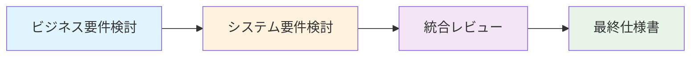

# タグ・ラベル機能 仕様書INDEX

## 概要
ToDoアプリにタグとラベル機能を追加する仕様書です。エージェントチーム（business-requirements、system-requirements、integration-reviewer）による協業で作成されました。

**目的:** タスクの柔軟な分類、視覚的な識別性向上、検索効率の向上、チーム協業の促進

**スコープ:**
- Phase 1 (MVP): Label、Tag、TodoTag のCRUD機能
- Phase 2: タグフィルタリング機能
- Phase 3 (オプション): 高度な検索・統計機能

## 文書一覧

| 文書名 | パス | 作成日 | 担当エージェント | ステータス |
|---|---|---|---|---|
| ビジネス要件 | [ビジネス要件.md](./ビジネス要件.md) | 2026-02-09 | business-requirements | Draft |
| システム要件 | [システム要件.md](./システム要件.md) | 2026-02-09 | system-requirements | Draft |
| 統合仕様書 | [統合仕様書.md](./統合仕様書.md) | 2026-02-09 | integration-reviewer | Draft |

## 仕様策定プロセス

## エージェントチーム

| 役割 | エージェント | 成果物 | 責務 |
|---|---|---|---|
| ビジネス要件検討 | business-requirements | ビジネス要件.md | ユースケース想定、ビジネス要件の構築 |
| システム要件検討 | system-requirements | システム要件.md | 既存コードから技術要件の検討・構築 |
| 統合レビュー | integration-reviewer | 統合仕様書.md | 両要件の精査・整合性確保・統合 |

## 承認状況

| 文書 | ステータス | レビュー結果 |
|---|---|---|
| ビジネス要件 | Draft | - |
| システム要件 | Draft | - |
| 統合仕様書 | Draft | 整合性: ✓, 完全性: ✓, 実現可能性: ✓, 品質: ✓ |

## 主要コンポーネント

### 新規エンティティ
- **Label**: ラベル（名前と色）
- **Tag**: タグ（名前とラベル参照）
- **TodoTag**: ToDoとTagの多対多関連

### 新規API
- `/api/lists/{listId}/labels` - ラベル管理
- `/api/lists/{listId}/tags` - タグ管理
- `/api/lists/{listId}/todos/{todoId}/tags` - タグ付与
- `/api/lists/{listId}/todos?tagIds=...` - タグフィルタリング

## ビジネス要件サマリー

### 主要なユーザーストーリー
- **US-001**: タグによるToDo分類（Essential, Phase 1）
- **US-002**: ラベルによる視覚的識別（Essential, Phase 1）
- **US-003**: タグのフィルタリング（Conditional, Phase 2）
- **US-004**: タグの管理と整理（Optional, Phase 3）

### ビジネスKPI
| KPI | 目標値 | 測定方法 |
|---|---|---|
| タグ利用率 | 70%以上 | タグを使用しているユーザーの割合 |
| 平均タグ数/ToDo | 2-3個 | ToDoあたりの平均タグ付与数 |
| タグ検索頻度 | 1日1回以上 | タグ検索の利用頻度 |
| タスク検索時間 | 50%削減 | タグ導入前後の比較 |

## システム要件サマリー

### 技術スタック
- **Backend**: ASP.NET Core 10.0、Entity Framework Core
- **Database**: PostgreSQL 14+
- **Frontend**: Angular (latest) - 想定

### パフォーマンス要件
| 要件 | 目標値 |
|---|---|
| タグ検索レスポンス | 500ms以内 |
| タグ一覧取得 | 100ms以内 |
| タグ付与 | 200ms以内 |

### セキュリティ
既存のListMemberベースの権限体系を適用:
- **Owner/Editor**: 作成・編集・削除可能
- **Viewer**: 閲覧のみ

## 実装計画

### Phase 1 (MVP) - 2週間
**期間:** 2週間
**スコープ:** Label、Tag、TodoTag のCRUD機能

**受け入れ基準:**
- [ ] ラベルの作成・編集・削除ができる
- [ ] タグの作成・編集・削除ができる
- [ ] タグにラベルを関連付けられる
- [ ] ToDoにタグを付与・削除できる
- [ ] ToDoリストでタグバッジが表示される

### Phase 2 - 1週間
**期間:** 1週間
**スコープ:** タグフィルタリング機能（単一タグ、複数タグAND/OR）

**受け入れ基準:**
- [ ] 単一タグで絞り込み検索ができる
- [ ] 複数タグでのAND/OR検索ができる
- [ ] フィルター結果がリアルタイムで更新される

### Phase 3 - 1週間（オプション）
**期間:** 1週間
**スコープ:** タグオートコンプリート、タグ統計、バルク操作

## リスク管理

| リスク | 影響度 | 軽減策 |
|---|---|---|
| タグの乱立 | 中 | タグ統合機能、使用統計表示 |
| パフォーマンス低下 | 高 | インデックス最適化、Eager Loading |
| データ移行失敗 | 高 | ロールバック手順、段階的移行 |
| 既存機能への影響 | 高 | 既存テスト実行、後方互換性確保 |

## 次のステップ

1. **詳細設計書の作成**: IEEE 1016準拠の詳細設計書（huge-app-orch/orchestrator エージェント使用推奨）
2. **UI/UXデザイン作成**: Figma等でモックアップ作成
3. **実装の開始**: Phase 1開発着手
4. **テスト計画の作成**: ISTQB準拠のテスト計画書

## 参照

- **既存システム**: `/src/todo-service/`
- **既存API仕様**: `/src/todo-service/api/README.md`
- **既存データモデル**: `/src/todo-service/api/Models/`
- **エージェント定義**: `/.github/agents/tag-label-team/`

## レビュー結果（統合仕様書より）

- **整合性**: ✓ すべてのビジネス要件にシステム要件が対応
- **完全性**: ✓ すべてのユーザーストーリーに実装方法が定義
- **実現可能性**: ✓ 技術的制約内で実現可能、既存システムとの統合可能
- **品質**: ✓ 受け入れ基準が測定可能、テスト可能な設計

**発見された問題**: なし

**推奨事項**:
1. Phase 1の実装を優先して早期にユーザーフィードバックを得る
2. パフォーマンステストを実装時に実施（大量タグでの性能検証）
3. ユーザビリティテストを各Phase完了時に実施
4. チュートリアルを作成してユーザーの混乱を防ぐ

## 変更履歴

| 日付 | バージョン | 変更内容 | 変更者 |
|---|---|---|---|
| 2026-02-09 | 1.0 | 初版作成 | AI Agent Team |

---

**文書ステータス**: Draft
**次回レビュー予定**: ステークホルダー承認後
**承認者**:
- [ ] ビジネス担当者
- [ ] システムアーキテクト
- [ ] プロジェクトマネージャー
- [ ] 開発リーダー
