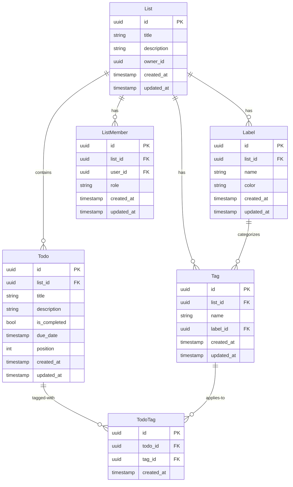

# タグ・ラベル機能 システム要件

## 1. システム概要

### 1.1 技術スタック
| レイヤー | 技術 | バージョン | 既存システム |
|---|---|---|---|
| Backend | ASP.NET Core | 10.0 | src/todo-service/api |
| ORM | Entity Framework Core | 9.0+ | TodoDbContext |
| Database | PostgreSQL | 14+ | todo_db |
| Frontend | Angular | latest | src/web (想定) |

### 1.2 既存システム構造

**現在のエンティティ:**
- **List**: ToDoリスト（タイトル、説明、所有者）
- **Todo**: ToDoアイテム（タイトル、説明、完了状態、期日、位置）
- **ListMember**: リストメンバー（ユーザー、ロール）
- **OutboxEvent**: イベントソーシング用（将来の拡張）

**新規追加エンティティ:**
- **Label**: ラベル（名前と色）
- **Tag**: タグ（名前とラベル参照）
- **TodoTag**: ToDoとTagの多対多関連

**既存の命名規約:**
- テーブル名: snake_case (例: `list_members`)
- カラム名: snake_case (例: `created_at`)
- C#プロパティ: PascalCase (例: `CreatedAt`)
- インデックス名: `idx_<テーブル名>_<カラム名>` (例: `idx_lists_owner`)

## 2. データモデル設計

### 2.1 ER図



### 2.2 エンティティ定義

#### 2.2.1 Label エンティティ

**C# モデル定義:**
```csharp
namespace TodoApi.Models;

public class Label
{
    public Guid Id { get; set; }
    public Guid ListId { get; set; }
    public string Name { get; set; } = string.Empty;
    public string Color { get; set; } = "#808080"; // デフォルトグレー
    public DateTime CreatedAt { get; set; }
    public DateTime UpdatedAt { get; set; }

    // Navigation properties
    public List List { get; set; } = null!;
    public ICollection<Tag> Tags { get; set; } = new List<Tag>();
}
```

**データベーステーブル:**
```sql
CREATE TABLE labels (
    id UUID PRIMARY KEY DEFAULT gen_random_uuid(),
    list_id UUID NOT NULL,
    name VARCHAR(50) NOT NULL,
    color VARCHAR(7) NOT NULL DEFAULT '#808080',
    created_at TIMESTAMP NOT NULL DEFAULT CURRENT_TIMESTAMP,
    updated_at TIMESTAMP NOT NULL DEFAULT CURRENT_TIMESTAMP,
    FOREIGN KEY (list_id) REFERENCES lists(id) ON DELETE CASCADE
);

CREATE INDEX idx_labels_list ON labels (list_id);
CREATE UNIQUE INDEX idx_labels_list_name ON labels (list_id, name);
```

**DbContext設定:**
```csharp
modelBuilder.Entity<Label>(entity =>
{
    entity.ToTable("labels");
    entity.HasKey(e => e.Id);
    entity.Property(e => e.Id).HasColumnName("id");
    entity.Property(e => e.ListId).HasColumnName("list_id").IsRequired();
    entity.Property(e => e.Name).HasColumnName("name").IsRequired().HasMaxLength(50);
    entity.Property(e => e.Color).HasColumnName("color").IsRequired().HasMaxLength(7);
    entity.Property(e => e.CreatedAt).HasColumnName("created_at");
    entity.Property(e => e.UpdatedAt).HasColumnName("updated_at");

    entity.HasIndex(e => e.ListId).HasDatabaseName("idx_labels_list");
    entity.HasIndex(e => new { e.ListId, e.Name })
        .HasDatabaseName("idx_labels_list_name")
        .IsUnique();

    // Relationship with List
    entity.HasOne(e => e.List)
        .WithMany()
        .HasForeignKey(e => e.ListId)
        .OnDelete(DeleteBehavior.Cascade);

    // Relationship with Tags
    entity.HasMany(e => e.Tags)
        .WithOne(e => e.Label)
        .HasForeignKey(e => e.LabelId)
        .OnDelete(DeleteBehavior.SetNull);
});
```

#### 2.2.2 Tag エンティティ

**C# モデル定義:**
```csharp
namespace TodoApi.Models;

public class Tag
{
    public Guid Id { get; set; }
    public Guid ListId { get; set; }
    public string Name { get; set; } = string.Empty;
    public Guid? LabelId { get; set; }
    public DateTime CreatedAt { get; set; }
    public DateTime UpdatedAt { get; set; }

    // Navigation properties
    public List List { get; set; } = null!;
    public Label? Label { get; set; }
    public ICollection<TodoTag> TodoTags { get; set; } = new List<TodoTag>();
}
```

**データベーステーブル:**
```sql
CREATE TABLE tags (
    id UUID PRIMARY KEY DEFAULT gen_random_uuid(),
    list_id UUID NOT NULL,
    name VARCHAR(50) NOT NULL,
    label_id UUID,
    created_at TIMESTAMP NOT NULL DEFAULT CURRENT_TIMESTAMP,
    updated_at TIMESTAMP NOT NULL DEFAULT CURRENT_TIMESTAMP,
    FOREIGN KEY (list_id) REFERENCES lists(id) ON DELETE CASCADE,
    FOREIGN KEY (label_id) REFERENCES labels(id) ON DELETE SET NULL
);

CREATE INDEX idx_tags_list ON tags (list_id);
CREATE INDEX idx_tags_label ON tags (label_id);
CREATE UNIQUE INDEX idx_tags_list_name ON tags (list_id, name);
```

**DbContext設定:**
```csharp
modelBuilder.Entity<Tag>(entity =>
{
    entity.ToTable("tags");
    entity.HasKey(e => e.Id);
    entity.Property(e => e.Id).HasColumnName("id");
    entity.Property(e => e.ListId).HasColumnName("list_id").IsRequired();
    entity.Property(e => e.Name).HasColumnName("name").IsRequired().HasMaxLength(50);
    entity.Property(e => e.LabelId).HasColumnName("label_id");
    entity.Property(e => e.CreatedAt).HasColumnName("created_at");
    entity.Property(e => e.UpdatedAt).HasColumnName("updated_at");

    entity.HasIndex(e => e.ListId).HasDatabaseName("idx_tags_list");
    entity.HasIndex(e => e.LabelId).HasDatabaseName("idx_tags_label");
    entity.HasIndex(e => new { e.ListId, e.Name })
        .HasDatabaseName("idx_tags_list_name")
        .IsUnique();

    // Relationship with List
    entity.HasOne(e => e.List)
        .WithMany()
        .HasForeignKey(e => e.ListId)
        .OnDelete(DeleteBehavior.Cascade);

    // Relationship with Label (nullable)
    entity.HasOne(e => e.Label)
        .WithMany(e => e.Tags)
        .HasForeignKey(e => e.LabelId)
        .OnDelete(DeleteBehavior.SetNull);

    // Relationship with TodoTags
    entity.HasMany(e => e.TodoTags)
        .WithOne(e => e.Tag)
        .HasForeignKey(e => e.TagId)
        .OnDelete(DeleteBehavior.Cascade);
});
```

#### 2.2.3 TodoTag エンティティ (中間テーブル)

**C# モデル定義:**
```csharp
namespace TodoApi.Models;

public class TodoTag
{
    public Guid Id { get; set; }
    public Guid TodoId { get; set; }
    public Guid TagId { get; set; }
    public DateTime CreatedAt { get; set; }

    // Navigation properties
    public Todo Todo { get; set; } = null!;
    public Tag Tag { get; set; } = null!;
}
```

**データベーステーブル:**
```sql
CREATE TABLE todo_tags (
    id UUID PRIMARY KEY DEFAULT gen_random_uuid(),
    todo_id UUID NOT NULL,
    tag_id UUID NOT NULL,
    created_at TIMESTAMP NOT NULL DEFAULT CURRENT_TIMESTAMP,
    FOREIGN KEY (todo_id) REFERENCES todos(id) ON DELETE CASCADE,
    FOREIGN KEY (tag_id) REFERENCES tags(id) ON DELETE CASCADE
);

CREATE INDEX idx_todo_tags_todo ON todo_tags (todo_id);
CREATE INDEX idx_todo_tags_tag ON todo_tags (tag_id);
CREATE UNIQUE INDEX idx_todo_tags_unique ON todo_tags (todo_id, tag_id);
```

**DbContext設定:**
```csharp
modelBuilder.Entity<TodoTag>(entity =>
{
    entity.ToTable("todo_tags");
    entity.HasKey(e => e.Id);
    entity.Property(e => e.Id).HasColumnName("id");
    entity.Property(e => e.TodoId).HasColumnName("todo_id").IsRequired();
    entity.Property(e => e.TagId).HasColumnName("tag_id").IsRequired();
    entity.Property(e => e.CreatedAt).HasColumnName("created_at");

    entity.HasIndex(e => e.TodoId).HasDatabaseName("idx_todo_tags_todo");
    entity.HasIndex(e => e.TagId).HasDatabaseName("idx_todo_tags_tag");
    entity.HasIndex(e => new { e.TodoId, e.TagId })
        .HasDatabaseName("idx_todo_tags_unique")
        .IsUnique();

    // Relationship with Todo
    entity.HasOne(e => e.Todo)
        .WithMany()
        .HasForeignKey(e => e.TodoId)
        .OnDelete(DeleteBehavior.Cascade);

    // Relationship with Tag
    entity.HasOne(e => e.Tag)
        .WithMany(e => e.TodoTags)
        .HasForeignKey(e => e.TagId)
        .OnDelete(DeleteBehavior.Cascade);
});
```

### 2.3 Todoエンティティの拡張

既存のTodoエンティティにナビゲーションプロパティを追加:

```csharp
namespace TodoApi.Models;

public class Todo
{
    public Guid Id { get; set; }
    public Guid ListId { get; set; }
    public string Title { get; set; } = string.Empty;
    public string? Description { get; set; }
    public bool IsCompleted { get; set; }
    public DateTime? DueDate { get; set; }
    public int Position { get; set; }
    public DateTime CreatedAt { get; set; }
    public DateTime UpdatedAt { get; set; }

    // Navigation properties
    public List List { get; set; } = null!;

    // 新規追加
    public ICollection<TodoTag> TodoTags { get; set; } = new List<TodoTag>();
}
```

DbContext設定の追加:
```csharp
// 既存のTodo設定に追加
entity.HasMany(e => e.TodoTags)
    .WithOne(e => e.Todo)
    .HasForeignKey(e => e.TodoId)
    .OnDelete(DeleteBehavior.Cascade);
```

## 3. API設計

### 3.1 Label API

#### POST /api/lists/{listId}/labels
**説明:** ラベルを作成
**権限:** owner, editor
**Request:**
```json
{
  "name": "重要",
  "color": "#FF0000"
}
```
**Response:** 201 Created
```json
{
  "id": "123e4567-e89b-12d3-a456-426614174000",
  "listId": "123e4567-e89b-12d3-a456-426614174001",
  "name": "重要",
  "color": "#FF0000",
  "createdAt": "2026-02-09T12:00:00Z",
  "updatedAt": "2026-02-09T12:00:00Z"
}
```

#### GET /api/lists/{listId}/labels
**説明:** リスト内のラベル一覧を取得
**権限:** owner, editor, viewer
**Response:** 200 OK
```json
[
  {
    "id": "uuid",
    "listId": "uuid",
    "name": "重要",
    "color": "#FF0000",
    "createdAt": "2026-02-09T12:00:00Z",
    "updatedAt": "2026-02-09T12:00:00Z"
  }
]
```

#### GET /api/lists/{listId}/labels/{labelId}
**説明:** 特定のラベルを取得
**権限:** owner, editor, viewer

#### PUT /api/lists/{listId}/labels/{labelId}
**説明:** ラベルを更新
**権限:** owner, editor
**Request:**
```json
{
  "name": "最重要",
  "color": "#FF0000"
}
```

#### DELETE /api/lists/{listId}/labels/{labelId}
**説明:** ラベルを削除（関連するTagのLabelIdはNULLになる）
**権限:** owner, editor
**Response:** 204 No Content

### 3.2 Tag API

#### POST /api/lists/{listId}/tags
**説明:** タグを作成
**権限:** owner, editor
**Request:**
```json
{
  "name": "バグ修正",
  "labelId": "123e4567-e89b-12d3-a456-426614174000"
}
```
**Response:** 201 Created
```json
{
  "id": "uuid",
  "listId": "uuid",
  "name": "バグ修正",
  "labelId": "uuid",
  "label": {
    "id": "uuid",
    "listId": "uuid",
    "name": "重要",
    "color": "#FF0000",
    "createdAt": "2026-02-09T12:00:00Z",
    "updatedAt": "2026-02-09T12:00:00Z"
  },
  "createdAt": "2026-02-09T12:00:00Z",
  "updatedAt": "2026-02-09T12:00:00Z"
}
```

#### GET /api/lists/{listId}/tags
**説明:** リスト内のタグ一覧を取得（ラベル情報含む）
**権限:** owner, editor, viewer
**Query Parameters:**
- `includeLabel`: true/false (デフォルト: true)
- `labelId`: 特定のラベルIDでフィルタ
**Response:** 200 OK

#### GET /api/lists/{listId}/tags/{tagId}
**説明:** 特定のタグを取得

#### PUT /api/lists/{listId}/tags/{tagId}
**説明:** タグを更新
**権限:** owner, editor

#### DELETE /api/lists/{listId}/tags/{tagId}
**説明:** タグを削除（関連するTodoTagも削除）
**権限:** owner, editor
**Response:** 204 No Content

### 3.3 TodoTag API

#### POST /api/lists/{listId}/todos/{todoId}/tags
**説明:** ToDoに複数のタグを追加
**権限:** owner, editor
**Request:**
```json
{
  "tagIds": [
    "123e4567-e89b-12d3-a456-426614174000",
    "123e4567-e89b-12d3-a456-426614174001"
  ]
}
```
**Response:** 201 Created
```json
{
  "todoId": "uuid",
  "tags": [
    {
      "id": "uuid",
      "name": "バグ修正",
      "label": {
        "name": "重要",
        "color": "#FF0000"
      }
    }
  ]
}
```

#### GET /api/lists/{listId}/todos/{todoId}/tags
**説明:** ToDoのタグ一覧を取得
**権限:** owner, editor, viewer

#### DELETE /api/lists/{listId}/todos/{todoId}/tags/{tagId}
**説明:** ToDoからタグを削除
**権限:** owner, editor
**Response:** 204 No Content

### 3.4 タグフィルタリング API

#### GET /api/lists/{listId}/todos?tagIds=uuid1,uuid2&filterMode=AND
**説明:** タグでToDoをフィルタリング
**権限:** owner, editor, viewer
**Query Parameters:**
- `tagIds`: フィルタするタグID（カンマ区切り）
- `filterMode`: AND | OR (デフォルト: OR)
  - AND: すべてのタグを持つToDoのみ
  - OR: いずれかのタグを持つToDo
- `includeCompleted`: true/false (デフォルト: false)

**Response:** 200 OK
```json
[
  {
    "id": "uuid",
    "listId": "uuid",
    "title": "バグを修正する",
    "description": "ログイン画面のバグ",
    "isCompleted": false,
    "dueDate": "2026-02-10T10:00:00Z",
    "position": 1,
    "tags": [
      {
        "id": "uuid",
        "name": "バグ修正",
        "label": {
          "name": "重要",
          "color": "#FF0000"
        }
      }
    ],
    "createdAt": "2026-02-09T12:00:00Z",
    "updatedAt": "2026-02-09T12:00:00Z"
  }
]
```

## 4. DTO設計

```csharp
namespace TodoApi.DTOs;

// Label DTOs
public record CreateLabelRequest(
    string Name,
    string Color
);

public record UpdateLabelRequest(
    string? Name,
    string? Color
);

public record LabelResponse(
    Guid Id,
    Guid ListId,
    string Name,
    string Color,
    DateTime CreatedAt,
    DateTime UpdatedAt
);

// Tag DTOs
public record CreateTagRequest(
    string Name,
    Guid? LabelId
);

public record UpdateTagRequest(
    string? Name,
    Guid? LabelId
);

public record TagResponse(
    Guid Id,
    Guid ListId,
    string Name,
    Guid? LabelId,
    LabelResponse? Label,
    DateTime CreatedAt,
    DateTime UpdatedAt
);

// TodoTag DTOs
public record AddTagsToTodoRequest(
    List<Guid> TagIds
);

public record TodoTagsResponse(
    Guid TodoId,
    List<TagResponse> Tags
);

// 既存のTodoResponseを拡張
public record TodoWithTagsResponse(
    Guid Id,
    Guid ListId,
    string Title,
    string? Description,
    bool IsCompleted,
    DateTime? DueDate,
    int Position,
    List<TagResponse> Tags,
    DateTime CreatedAt,
    DateTime UpdatedAt
);
```

## 5. DbContext更新

```csharp
public class TodoDbContext : DbContext
{
    // 既存のDbSet
    public DbSet<List> Lists { get; set; } = null!;
    public DbSet<Todo> Todos { get; set; } = null!;
    public DbSet<ListMember> ListMembers { get; set; } = null!;
    public DbSet<OutboxEvent> OutboxEvents { get; set; } = null!;

    // 新規追加
    public DbSet<Label> Labels { get; set; } = null!;
    public DbSet<Tag> Tags { get; set; } = null!;
    public DbSet<TodoTag> TodoTags { get; set; } = null!;

    // UpdateTimestampsメソッドも更新が必要
    private void UpdateTimestamps()
    {
        var entries = ChangeTracker.Entries()
            .Where(e => e.Entity is List || e.Entity is Todo ||
                       e.Entity is ListMember || e.Entity is Label || e.Entity is Tag);

        foreach (var entry in entries)
        {
            var now = DateTime.UtcNow;

            if (entry.State == EntityState.Added)
            {
                // 既存のコード + Label, Tag処理
                if (entry.Entity is Label label)
                {
                    label.CreatedAt = now;
                    label.UpdatedAt = now;
                }
                else if (entry.Entity is Tag tag)
                {
                    tag.CreatedAt = now;
                    tag.UpdatedAt = now;
                }
                else if (entry.Entity is TodoTag todoTag)
                {
                    todoTag.CreatedAt = now;
                }
            }
            else if (entry.State == EntityState.Modified)
            {
                // 既存のコード + Label, Tag処理
                if (entry.Entity is Label label)
                {
                    label.UpdatedAt = now;
                }
                else if (entry.Entity is Tag tag)
                {
                    tag.UpdatedAt = now;
                }
            }
        }
    }
}
```

## 6. コントローラー設計

### 6.1 LabelsController

```csharp
namespace TodoApi.Controllers;

[ApiController]
[Route("api/lists/{listId}/labels")]
[Authorize]
public class LabelsController : ControllerBase
{
    private readonly TodoDbContext _context;
    private readonly IAuthorizationService _authorizationService;

    // CRUD operations
    // - CreateLabel (POST)
    // - GetLabels (GET)
    // - GetLabel (GET /{labelId})
    // - UpdateLabel (PUT /{labelId})
    // - DeleteLabel (DELETE /{labelId})
}
```

### 6.2 TagsController

```csharp
namespace TodoApi.Controllers;

[ApiController]
[Route("api/lists/{listId}/tags")]
[Authorize]
public class TagsController : ControllerBase
{
    private readonly TodoDbContext _context;
    private readonly IAuthorizationService _authorizationService;

    // CRUD operations
    // - CreateTag (POST)
    // - GetTags (GET)
    // - GetTag (GET /{tagId})
    // - UpdateTag (PUT /{tagId})
    // - DeleteTag (DELETE /{tagId})
}
```

### 6.3 TodoTagsController

```csharp
namespace TodoApi.Controllers;

[ApiController]
[Route("api/lists/{listId}/todos/{todoId}/tags")]
[Authorize]
public class TodoTagsController : ControllerBase
{
    private readonly TodoDbContext _context;
    private readonly IAuthorizationService _authorizationService;

    // Operations
    // - AddTagsToTodo (POST)
    // - GetTodoTags (GET)
    // - RemoveTagFromTodo (DELETE /{tagId})
}
```

### 6.4 TodosController の拡張

既存のTodosControllerにタグフィルタリング機能を追加:

```csharp
[HttpGet]
public async Task<ActionResult<List<TodoWithTagsResponse>>> GetTodos(
    Guid listId,
    [FromQuery] string? tagIds = null,
    [FromQuery] string filterMode = "OR",
    [FromQuery] bool includeCompleted = false)
{
    // タグフィルタリングロジック
    // - tagIdsがある場合はフィルタリング
    // - filterMode (AND/OR) に応じた検索
    // - Eager Loading (.Include(t => t.TodoTags).ThenInclude(tt => tt.Tag).ThenInclude(t => t.Label))
}
```

## 7. セキュリティ要件

### 7.1 認証・認可

既存のListMemberベースの権限体系を適用:

| アクション | Owner | Editor | Viewer |
|---|---|---|---|
| ラベル作成 | ✓ | ✓ | ✗ |
| ラベル編集 | ✓ | ✓ | ✗ |
| ラベル削除 | ✓ | ✓ | ✗ |
| ラベル閲覧 | ✓ | ✓ | ✓ |
| タグ作成 | ✓ | ✓ | ✗ |
| タグ編集 | ✓ | ✓ | ✗ |
| タグ削除 | ✓ | ✓ | ✗ |
| タグ閲覧 | ✓ | ✓ | ✓ |
| ToDo<br>タグ付与 | ✓ | ✓ | ✗ |
| ToDo<br>タグ削除 | ✓ | ✓ | ✗ |

### 7.2 入力検証

| フィールド | 検証ルール | エラーメッセージ |
|---|---|---|
| Label.Name | 必須、1-50文字、リスト内で一意 | "ラベル名は必須です" / "ラベル名は既に使用されています" |
| Label.Color | 必須、HEX形式(#RRGGBB) | "色はHEX形式で指定してください" |
| Tag.Name | 必須、1-50文字、リスト内で一意 | "タグ名は必須です" / "タグ名は既に使用されています" |
| Tag.LabelId | 存在するLabelのID、または空 | "指定されたラベルが見つかりません" |
| TodoTag.TagId | 存在するTagのID | "指定されたタグが見つかりません" |

**バリデーション属性:**
```csharp
public record CreateLabelRequest(
    [Required][StringLength(50, MinimumLength = 1)] string Name,
    [Required][RegularExpression(@"^#[0-9A-Fa-f]{6}$")] string Color
);

public record CreateTagRequest(
    [Required][StringLength(50, MinimumLength = 1)] string Name,
    Guid? LabelId
);
```

## 8. 非機能要件

### 8.1 性能要件

| 要件 | 目標値 | 実装アプローチ |
|---|---|---|
| タグ検索レスポンス | 500ms以内 | インデックス最適化、Eager Loading |
| タグ一覧取得 | 100ms以内 | インデックス、キャッシング（Phase 2） |
| タグ付与 | 200ms以内 | バッチ挿入 |
| タグフィルタリング | 500ms以内 | 複合インデックス、クエリ最適化 |

**クエリ最適化:**
```csharp
// N+1問題を回避するEager Loading
var todos = await _context.Todos
    .Where(t => t.ListId == listId)
    .Include(t => t.TodoTags)
        .ThenInclude(tt => tt.Tag)
            .ThenInclude(t => t.Label)
    .ToListAsync();
```

### 8.2 データ整合性

| ルール | 実装方法 |
|---|---|
| タグ名の一意性 | UNIQUE INDEX (list_id, name) |
| ラベル名の一意性 | UNIQUE INDEX (list_id, name) |
| TodoTag の重複防止 | UNIQUE INDEX (todo_id, tag_id) |
| List削除時のカスケード | ON DELETE CASCADE (Label, Tag) |
| Label削除時のNULL設定 | ON DELETE SET NULL (Tag.LabelId) |
| Todo削除時のカスケード | ON DELETE CASCADE (TodoTag) |

### 8.3 可用性

- データベース制約により整合性を保証
- トランザクションによる原子性確保
- ロールバック可能なマイグレーション設計

## 9. マイグレーション計画

### 9.1 マイグレーション順序

```sql
-- Migration 1: labels テーブル作成
CREATE TABLE labels (
    -- 省略 (上記参照)
);

-- Migration 2: tags テーブル作成
CREATE TABLE tags (
    -- 省略 (上記参照)
);

-- Migration 3: todo_tags テーブル作成
CREATE TABLE todo_tags (
    -- 省略 (上記参照)
);
```

### 9.2 Entity Framework マイグレーション

```bash
# マイグレーション作成
dotnet ef migrations add AddTagsAndLabels

# マイグレーション適用
dotnet ef database update

# ロールバック（必要な場合）
dotnet ef database update <前のマイグレーション名>
```

### 9.3 ロールバック計画

```sql
-- ロールバック順序（逆順）
DROP TABLE IF EXISTS todo_tags;
DROP TABLE IF EXISTS tags;
DROP TABLE IF EXISTS labels;
```

## 10. Frontend影響範囲

### 10.1 新規コンポーネント

- **LabelManagementComponent**: ラベル一覧・作成・編集・削除
- **TagManagementComponent**: タグ一覧・作成・編集・削除
- **TagSelectorComponent**: ToDo編集時のタグ選択UI（複数選択、オートコンプリート）
- **TagFilterComponent**: タグフィルターUI（単一/複数選択、AND/OR切替）
- **TagBadgeComponent**: タグバッジ表示コンポーネント

### 10.2 既存コンポーネント更新

- **TodoListComponent**: タグバッジ表示、タグフィルター統合
- **TodoItemComponent**: タグバッジ表示
- **TodoEditComponent**: タグ選択UI追加

### 10.3 新規サービス

```typescript
// label.service.ts
export class LabelService {
  getLabels(listId: string): Observable<Label[]>
  createLabel(listId: string, label: CreateLabelRequest): Observable<Label>
  updateLabel(listId: string, labelId: string, label: UpdateLabelRequest): Observable<Label>
  deleteLabel(listId: string, labelId: string): Observable<void>
}

// tag.service.ts
export class TagService {
  getTags(listId: string): Observable<Tag[]>
  createTag(listId: string, tag: CreateTagRequest): Observable<Tag>
  updateTag(listId: string, tagId: string, tag: UpdateTagRequest): Observable<Tag>
  deleteTag(listId: string, tagId: string): Observable<void>
}

// todo-tag.service.ts
export class TodoTagService {
  addTagsToTodo(listId: string, todoId: string, tagIds: string[]): Observable<void>
  removeTagFromTodo(listId: string, todoId: string, tagId: string): Observable<void>
  getTodoTags(listId: string, todoId: string): Observable<Tag[]>
}
```

## 11. 実装優先順位

### Phase 1 (MVP) - 2週間
**Backend (1週間):**
1. Label エンティティとAPI実装
2. Tag エンティティとAPI実装
3. TodoTag 中間テーブルとAPI実装
4. データベースマイグレーション実行
5. 単体テスト作成

**Frontend (1週間):**
6. Label管理コンポーネント
7. Tag管理コンポーネント
8. Todoにタグ追加UI
9. タグバッジ表示

**受け入れテスト:**
- ラベルのCRUD操作
- タグのCRUD操作
- ToDoへのタグ付与・削除
- タグバッジの表示

### Phase 2 - 1週間
**Backend (3日):**
1. タグフィルタリングAPI実装
2. AND/OR検索機能
3. パフォーマンステスト

**Frontend (4日):**
4. タグフィルターコンポーネント
5. 複数タグ選択UI
6. リアルタイムフィルタリング

**受け入れテスト:**
- タグによる絞り込み検索
- AND/OR条件検索
- パフォーマンス確認

### Phase 3 - 1週間（オプション）
1. タグオートコンプリート
2. タグ使用統計
3. バルクタグ付与
4. タグインポート/エクスポート

## 12. テスト戦略

### 12.1 単体テスト

- Entity Frameworkのインメモリデータベースを使用
- 各コントローラーのアクションメソッドをテスト
- DTO変換ロジックのテスト
- バリデーションロジックのテスト

### 12.2 統合テスト

- 実際のPostgreSQLを使用したテスト
- API エンドポイントのE2Eテスト
- 認証・認可のテスト
- カスケード削除のテスト

### 12.3 パフォーマンステスト

- 大量タグ（1000+）での検索性能
- 複数タグフィルタリングの性能
- N+1問題の検出

## 13. リスク管理

### 13.1 技術的リスク

| リスク | 影響 | 軽減策 |
|---|---|---|
| N+1クエリ問題 | パフォーマンス低下 | Eager Loading、クエリ監視 |
| インデックス不足 | 検索遅延 | 適切なインデックス設計、実測 |
| マイグレーション失敗 | データ損失 | バックアップ、トランザクション、ロールバック計画 |
| 既存機能への影響 | バグ発生 | 既存テストの実行、段階的リリース |

### 13.2 運用リスク

| リスク | 影響 | 軽減策 |
|---|---|---|
| データベース容量増加 | ストレージ不足 | 監視、容量計画 |
| タグ数の増加 | UI/UX悪化 | タグ統合機能、アーカイブ機能 |

## 14. 既存システムとの互換性

### 14.1 後方互換性

- 既存のAPI エンドポイントは変更なし
- 既存のデータモデルは拡張のみ（破壊的変更なし）
- 既存のフロントエンドは動作継続

### 14.2 段階的ロールアウト

1. **Phase 1**: バックエンドAPI完成、フロントエンド基本UI
2. **Phase 2**: フィルタリング機能追加
3. **Phase 3**: 高度な機能追加

各フェーズで既存機能が正常動作することを確認。

## 15. 監視とメトリクス

### 15.1 監視項目

- API レスポンスタイム
- タグ検索クエリの実行時間
- データベースクエリ数（N+1検出）
- エラー率

### 15.2 ビジネスメトリクス

- タグ利用率
- 平均タグ数/ToDo
- タグ検索頻度

## 16. ドキュメント

### 16.1 技術ドキュメント

- API仕様書（OpenAPI/Swagger）
- データベーススキーマ図
- アーキテクチャ図

### 16.2 開発者ガイド

- セットアップ手順
- マイグレーション手順
- テスト実行手順
- デバッグガイド

## 17. 次のステップ

1. **ビジネス要件とのレビュー**: 統合仕様書作成
2. **実装着手**: Phase 1開発開始
3. **テスト環境構築**: CI/CD パイプライン更新
4. **ドキュメント作成**: API仕様書、開発者ガイド
