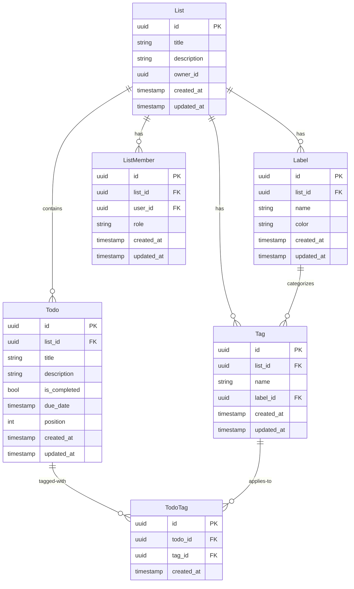

# タグ・ラベル機能 統合仕様書

**文書バージョン:** 1.0
**作成日:** 2026-02-09
**ステータス:** Draft
**レビュー担当:** AI Agent Team

## 改訂履歴
| バージョン | 日付 | 変更内容 | 作成者 |
|---|---|---|---|
| 1.0 | 2026-02-09 | 初版作成 | AI Agent Team |

---

## 1. エグゼクティブサマリー

### 1.1 目的
ToDoアプリにタグとラベル機能を追加し、ユーザーがタスクを柔軟に分類・管理できるようにする。タグによる横断的な検索とラベルによる視覚的な識別を提供することで、タスク管理の効率を向上させる。

### 1.2 スコープ
- **対象システム**: /src/todo-service (ASP.NET Core Todo API)
- **Phase 1 (MVP)**: Label、Tag、TodoTag のCRUD機能
- **Phase 2**: タグフィルタリング機能
- **Phase 3 (オプション)**: 高度な検索・統計機能

### 1.3 主要な価値提案
- **タスク検索時間の50%削減**: タグによる高速な絞り込み検索
- **視覚的な識別性向上**: 色付きラベルによる優先度の一目での判別
- **柔軟な分類**: リストの枠を超えた横断的なタスク管理
- **チーム協業の円滑化**: 共通のタグ体系による情報共有

---

## 2. ビジネス要件サマリー

### 2.1 ビジネス目的
- タスクの柔軟な分類（リスト横断的な管理）
- 視覚的な識別性向上（優先度、種類の即座の判別）
- 検索効率の向上（タグによる高速絞り込み）
- チーム協業の促進（共通タグ体系による認識統一）

### 2.2 主要ユースケース
| ID | ユースケース | 優先度 | 実装フェーズ | ビジネス要件 |
|---|---|---|---|---|
| US-001 | タグによるToDo分類 | Essential | Phase 1 | BR-001, BR-003 |
| US-002 | ラベルによる視覚的識別 | Essential | Phase 1 | BR-002 |
| US-003 | タグのフィルタリング | Conditional | Phase 2 | BR-004 |
| US-004 | タグの管理と整理 | Optional | Phase 3 | BR-001 |

### 2.3 ステークホルダー
- **個人ユーザー**: 効率的なタスク管理と時間節約
- **チームメンバー**: スムーズな情報共有と協業
- **プロジェクトマネージャー**: 全体像の把握と意思決定の迅速化
- **パワーユーザー**: 大量タスクの効率的な管理

### 2.4 ビジネスKPI
| KPI | 目標値 | 測定方法 |
|---|---|---|
| タグ利用率 | 70%以上 | タグを使用しているユーザーの割合 |
| 平均タグ数/ToDo | 2-3個 | ToDoあたりの平均タグ付与数 |
| タグ検索頻度 | 1日1回以上 | タグ検索の利用頻度 |
| タスク検索時間 | 50%削減 | タグ導入前後の比較 |

---

## 3. システム要件サマリー

### 3.1 アーキテクチャ概要
- **Backend**: ASP.NET Core 10.0、Entity Framework Core
- **Database**: PostgreSQL 14+
- **Frontend**: Angular (latest) - 想定
- **認証**: JWT tokens (既存のAuth Service)

### 3.2 新規エンティティ
| エンティティ | 説明 | 主要属性 |
|---|---|---|
| **Label** | ラベル（名前と色） | id, list_id, name, color |
| **Tag** | タグ（名前とラベル参照） | id, list_id, name, label_id |
| **TodoTag** | ToDoとTagの多対多関連 | id, todo_id, tag_id |

### 3.3 API概要
| エンドポイント | メソッド | 目的 | 権限 |
|---|---|---|---|
| /api/lists/{listId}/labels | POST | ラベル作成 | owner, editor |
| /api/lists/{listId}/labels | GET | ラベル一覧 | owner, editor, viewer |
| /api/lists/{listId}/tags | POST | タグ作成 | owner, editor |
| /api/lists/{listId}/tags | GET | タグ一覧 | owner, editor, viewer |
| /api/lists/{listId}/todos/{todoId}/tags | POST | タグ付与 | owner, editor |
| /api/lists/{listId}/todos?tagIds=... | GET | タグフィルタ | owner, editor, viewer |

---

## 4. 要件トレーサビリティマトリクス

### 4.1 ビジネス要件 → システム要件マッピング

| ビジネス要件 | ユーザーストーリー | システム要件 | API | データモデル | Phase |
|---|---|---|---|---|---|
| BR-001: タグ管理機能 | US-001, US-004 | Tag エンティティ | POST/GET/PUT/DELETE /api/lists/{listId}/tags | Tag, TodoTag | Phase 1 |
| BR-002: ラベル設定機能 | US-002 | Label エンティティ | POST/GET/PUT/DELETE /api/lists/{listId}/labels | Label | Phase 1 |
| BR-003: タグ付与機能 | US-001 | TodoTag 関連 | POST/DELETE /api/todos/{todoId}/tags | TodoTag | Phase 1 |
| BR-004: フィルタリング機能 | US-003 | タグ検索API | GET /api/lists/{listId}/todos?tagIds= | - | Phase 2 |
| BR-005: タグ共有機能 | - | List単位のタグ管理 | 既存のList権限体系を適用 | Tag.ListId | Phase 1 |

### 4.2 受け入れ基準 → テスト項目マッピング

| 受け入れ基準 | テスト項目 | 検証方法 | テストタイプ |
|---|---|---|---|
| ToDoに複数のタグを付与できる | 複数タグ付与テスト | POST /api/todos/{id}/tags | 統合テスト |
| タグで絞り込み検索ができる | タグフィルタリングテスト | GET /api/lists/{id}/todos?tagIds= | E2Eテスト |
| ラベルに名前と色を設定できる | ラベル作成テスト | POST /api/lists/{id}/labels | 単体テスト |
| タグにラベルを関連付けられる | タグ-ラベル関連テスト | Tag.LabelId 参照整合性確認 | 統合テスト |
| 既存のタグを再利用できる | オートコンプリートテスト | GET /api/lists/{id}/tags | E2Eテスト |

---

## 5. 統合されたデータモデル

### 5.1 ER図（統合版）



### 5.2 データ整合性ルール

| ルール | ビジネス要件 | 実装方法 | 影響 |
|---|---|---|---|
| タグ名の一意性 | BR-001: 重複防止 | UNIQUE INDEX (list_id, name) | 同じList内でタグ名は一意 |
| ラベル名の一意性 | BR-002: 重複防止 | UNIQUE INDEX (list_id, name) | 同じList内でラベル名は一意 |
| TodoTag重複防止 | BR-003: 重複タグ付与防止 | UNIQUE INDEX (todo_id, tag_id) | 同じToDoに同じタグは1回のみ |
| カスケード削除（List） | BR-005: リスト削除時の整合性 | ON DELETE CASCADE (Label, Tag) | List削除時にTag/Label削除 |
| NULL許容（Label） | BR-002: ラベル削除の影響 | ON DELETE SET NULL (Tag.LabelId) | Label削除時にTagは残る |
| カスケード削除（Todo） | BR-003: ToDo削除時の整合性 | ON DELETE CASCADE (TodoTag) | Todo削除時にTodoTag削除 |

### 5.3 インデックス戦略

| インデックス | 目的 | ビジネス要件 | パフォーマンス目標 |
|---|---|---|---|
| idx_labels_list | リスト内ラベル検索 | BR-002 | 100ms以内 |
| idx_tags_list | リスト内タグ検索 | BR-001 | 100ms以内 |
| idx_tags_label | ラベル別タグ取得 | BR-002 | 100ms以内 |
| idx_todo_tags_todo | ToDo別タグ取得 | BR-003 | 50ms以内 |
| idx_todo_tags_tag | タグ別ToDo検索 | BR-004 | 500ms以内 |

---

## 6. 統合されたAPI仕様

### 6.1 Label API（詳細）

#### POST /api/lists/{listId}/labels
**ビジネス要件:** BR-002
**ユーザーストーリー:** US-002

**リクエスト:**
```json
{
  "name": "重要",
  "color": "#FF0000"
}
```

**バリデーション:**
- `name`: 必須、1-50文字、リスト内で一意（ビジネス要件: 分かりやすい名前）
- `color`: 必須、HEX形式(#RRGGBB)（ビジネス要件: 視覚的に区別可能）

**レスポンス:** 201 Created
```json
{
  "id": "123e4567-e89b-12d3-a456-426614174000",
  "listId": "123e4567-e89b-12d3-a456-426614174001",
  "name": "重要",
  "color": "#FF0000",
  "createdAt": "2026-02-09T12:00:00Z",
  "updatedAt": "2026-02-09T12:00:00Z"
}
```

**エラーレスポンス:**
- 400 Bad Request: バリデーションエラー
- 401 Unauthorized: 認証エラー
- 403 Forbidden: 権限エラー（viewer権限）
- 404 Not Found: リストが存在しない
- 409 Conflict: ラベル名の重複

**ビジネス価値:** 視覚的な識別性向上の基盤

#### GET /api/lists/{listId}/labels
**ビジネス要件:** BR-002
**レスポンス:** ラベル一覧（作成日時順）

#### PUT /api/lists/{listId}/labels/{labelId}
**ビジネス要件:** BR-002
**説明:** ラベルの名前または色を更新

#### DELETE /api/lists/{listId}/labels/{labelId}
**ビジネス要件:** BR-002
**説明:** ラベルを削除（関連するTag.LabelIdはNULLになる）
**ビジネス影響:** ラベル削除後もタグは残る

### 6.2 Tag API（詳細）

#### POST /api/lists/{listId}/tags
**ビジネス要件:** BR-001
**ユーザーストーリー:** US-001

**リクエスト:**
```json
{
  "name": "バグ修正",
  "labelId": "123e4567-e89b-12d3-a456-426614174000"
}
```

**バリデーション:**
- `name`: 必須、1-50文字、リスト内で一意（ビジネス要件: 検索しやすい名前）
- `labelId`: オプション、存在するLabel ID

**レスポンス:** 201 Created（Label情報を含む）
```json
{
  "id": "uuid",
  "listId": "uuid",
  "name": "バグ修正",
  "labelId": "uuid",
  "label": {
    "id": "uuid",
    "listId": "uuid",
    "name": "重要",
    "color": "#FF0000",
    "createdAt": "2026-02-09T12:00:00Z",
    "updatedAt": "2026-02-09T12:00:00Z"
  },
  "createdAt": "2026-02-09T12:00:00Z",
  "updatedAt": "2026-02-09T12:00:00Z"
}
```

**ビジネス価値:** タスク分類の基盤

#### GET /api/lists/{listId}/tags?includeLabel=true&labelId={labelId}
**ビジネス要件:** BR-001, BR-002
**Query Parameters:**
- `includeLabel`: true/false (デフォルト: true) - Label情報の取得
- `labelId`: 特定のラベルIDでフィルタ

**ビジネス価値:** タグ一覧表示、ラベル別フィルタリング

#### PUT /api/lists/{listId}/tags/{tagId}
**ビジネス要件:** BR-001
**説明:** タグの名前またはラベルを更新

#### DELETE /api/lists/{listId}/tags/{tagId}
**ビジネス要件:** BR-001
**説明:** タグを削除（関連するTodoTagも削除）
**ビジネス影響:** タグが付与されていたToDoからタグが消える

### 6.3 TodoTag API（詳細）

#### POST /api/lists/{listId}/todos/{todoId}/tags
**ビジネス要件:** BR-003
**ユーザーストーリー:** US-001

**リクエスト:**
```json
{
  "tagIds": [
    "123e4567-e89b-12d3-a456-426614174000",
    "123e4567-e89b-12d3-a456-426614174001"
  ]
}
```

**バリデーション:**
- `tagIds`: 配列、存在するTag IDのみ
- 重複チェック: 既に付与されているタグは無視

**レスポンス:** 201 Created
```json
{
  "todoId": "uuid",
  "tags": [
    {
      "id": "uuid",
      "name": "バグ修正",
      "label": {
        "name": "重要",
        "color": "#FF0000"
      }
    }
  ]
}
```

**ビジネス価値:** タスク分類の実用性向上

#### DELETE /api/lists/{listId}/todos/{todoId}/tags/{tagId}
**ビジネス要件:** BR-003
**説明:** ToDoから特定のタグを削除

### 6.4 タグフィルタリング API（詳細）

#### GET /api/lists/{listId}/todos?tagIds=uuid1,uuid2&filterMode=AND&includeCompleted=false
**ビジネス要件:** BR-004
**ユーザーストーリー:** US-003

**Query Parameters:**
- `tagIds`: フィルタするタグID（カンマ区切り）
- `filterMode`: AND | OR (デフォルト: OR)
  - **AND**: すべてのタグを持つToDoのみ（ビジネス要件: 厳密な検索）
  - **OR**: いずれかのタグを持つToDo（ビジネス要件: 柔軟な検索）
- `includeCompleted`: true/false (デフォルト: false)

**レスポンス:** 200 OK
```json
[
  {
    "id": "uuid",
    "listId": "uuid",
    "title": "バグを修正する",
    "description": "ログイン画面のバグ",
    "isCompleted": false,
    "dueDate": "2026-02-10T10:00:00Z",
    "position": 1,
    "tags": [
      {
        "id": "uuid",
        "name": "バグ修正",
        "label": {
          "name": "重要",
          "color": "#FF0000"
        }
      }
    ],
    "createdAt": "2026-02-09T12:00:00Z",
    "updatedAt": "2026-02-09T12:00:00Z"
  }
]
```

**パフォーマンス要件:** 500ms以内（システム要件）
**ビジネス価値:** タスク検索時間の50%削減

---

## 7. セキュリティとアクセス制御

### 7.1 権限マトリクス

既存のListMemberベースの権限体系を踏襲:

| アクション | Owner | Editor | Viewer | ビジネス要件 |
|---|---|---|---|---|
| ラベル作成 | ✓ | ✓ | ✗ | BR-002 |
| ラベル編集 | ✓ | ✓ | ✗ | BR-002 |
| ラベル削除 | ✓ | ✓ | ✗ | BR-002 |
| ラベル閲覧 | ✓ | ✓ | ✓ | BR-002 |
| タグ作成 | ✓ | ✓ | ✗ | BR-001 |
| タグ編集 | ✓ | ✓ | ✗ | BR-001 |
| タグ削除 | ✓ | ✓ | ✗ | BR-001 |
| タグ閲覧 | ✓ | ✓ | ✓ | BR-001 |
| ToDoタグ付与 | ✓ | ✓ | ✗ | BR-003 |
| ToDoタグ削除 | ✓ | ✓ | ✗ | BR-003 |
| タグ検索 | ✓ | ✓ | ✓ | BR-004 |

### 7.2 入力検証（統合版）

| フィールド | ビジネス要件 | システム実装 | エラーメッセージ |
|---|---|---|---|
| Label.Name | 分かりやすい名前 | VARCHAR(50), NOT NULL, UNIQUE per list | "ラベル名は1-50文字で指定してください" / "このラベル名は既に使用されています" |
| Label.Color | 視覚的に区別可能 | VARCHAR(7), HEX形式, デフォルト#808080 | "色は#RRGGBBの形式で指定してください" |
| Tag.Name | 検索しやすい名前 | VARCHAR(50), NOT NULL, UNIQUE per list | "タグ名は1-50文字で指定してください" / "このタグ名は既に使用されています" |
| Tag.LabelId | オプション、視覚的識別 | UUID, NULL許容、外部キー制約 | "指定されたラベルが見つかりません" |

---

## 8. 非機能要件の統合

### 8.1 パフォーマンス

| ビジネスKPI | システム要件 | 実装アプローチ | 検証方法 |
|---|---|---|---|
| 検索頻度: 1日1回以上 | レスポンス500ms以内 | インデックス最適化、Eager Loading | パフォーマンステスト |
| 平均タグ数: 2-3個/ToDo | N+1クエリ回避 | .Include().ThenInclude() | クエリ監視 |
| タスク検索時間50%削減 | タグ検索100ms以内 | 複合インデックス (todo_id, tag_id) | ベンチマーク |

### 8.2 ユーザビリティ

| ビジネス要件 | システム実装 | ユーザー体験 |
|---|---|---|
| タグの使いやすさ | オートコンプリート機能 | 3クリック以内でタグ付与 |
| 視覚的な識別 | カラフルなラベルバッジ | 一目で優先度判別 |
| 直感的な操作 | ドラッグ&ドロップ（Phase 3） | 直感的なタグ管理 |

### 8.3 可用性と信頼性

| システム要件 | ビジネス影響 | 実装方法 |
|---|---|---|
| データ整合性保証 | データ損失ゼロ | データベース制約、トランザクション |
| ロールバック可能性 | 安全な導入 | マイグレーションスクリプト、バックアップ |
| 既存機能への影響ゼロ | サービス継続 | 段階的ロールアウト、後方互換性 |

---

## 9. 実装計画

### 9.1 Phase 1 (MVP) - 2週間
**ビジネス価値:** 基本的なタグ・ラベル機能の提供

**Backend (1週間):**
1. データベースマイグレーション（Label, Tag, TodoTag）
2. Label CRUD API実装
3. Tag CRUD API実装
4. TodoTag API実装（タグ付与・削除）
5. 単体テスト・統合テスト作成

**Frontend (1週間):**
6. Label管理画面（作成・編集・削除）
7. Tag管理画面（作成・編集・削除、ラベル選択）
8. ToDo編集画面にタグ追加UI（タグ選択、複数選択）
9. ToDoリストにタグバッジ表示（色付きバッジ）

**受け入れテスト:**
- [ ] ラベルの作成・編集・削除ができる
- [ ] タグの作成・編集・削除ができる
- [ ] タグにラベルを関連付けられる
- [ ] ToDoにタグを付与・削除できる
- [ ] ToDoリストでタグバッジが表示される
- [ ] ビューアー権限ではタグ作成できない

**ビジネスKPI目標:**
- タグ利用率: 30%以上
- 平均タグ数/ToDo: 1個以上

### 9.2 Phase 2 - 1週間
**ビジネス価値:** タグによるフィルタリング機能

**Backend (3日):**
1. タグフィルタリングAPI実装（単一タグ）
2. AND/OR検索機能実装
3. パフォーマンステスト（500ms以内確認）

**Frontend (4日):**
4. タグフィルターコンポーネント（単一選択）
5. 複数タグ選択UI（チェックボックス）
6. AND/OR切り替えUI
7. リアルタイムフィルタリング

**受け入れテスト:**
- [ ] 単一タグで絞り込み検索ができる
- [ ] 複数タグでのAND検索ができる
- [ ] 複数タグでのOR検索ができる
- [ ] フィルター結果がリアルタイムで更新される
- [ ] 検索レスポンスが500ms以内

**ビジネスKPI目標:**
- タグ利用率: 50%以上
- タグ検索頻度: 週1回以上
- タスク検索時間: 30%削減

### 9.3 Phase 3 - 1週間（オプション）
**ビジネス価値:** 高度な管理機能とチーム協業の強化

**機能:**
1. タグオートコンプリート（入力時の候補表示）
2. タグ使用統計（使用頻度、人気タグ）
3. バルクタグ付与（複数ToDoに一括でタグ付与）
4. タグの並び替え（ドラッグ&ドロップ）

**受け入れテスト:**
- [ ] タグ入力時に候補が表示される
- [ ] タグ使用統計が表示される
- [ ] 複数ToDoに一括でタグを付与できる

**ビジネスKPI目標:**
- タグ利用率: 70%以上
- タグ検索頻度: 1日1回以上
- タスク検索時間: 50%削減

---

## 10. リスク管理

### 10.1 統合リスク

| リスク | ビジネス影響 | システム影響 | 軽減策 | 優先度 | 担当Phase |
|---|---|---|---|---|---|
| タグの乱立 | 管理が煩雑、UI混雑 | パフォーマンス低下 | タグ統合機能、使用統計表示、命名ガイドライン | 中 | Phase 3 |
| パフォーマンス低下 | UX悪化、離脱率上昇 | レスポンス遅延 | インデックス最適化、Eager Loading、キャッシング | 高 | Phase 1 |
| データ移行失敗 | サービス停止 | データ損失 | ロールバック手順、段階的移行、テスト環境検証 | 高 | Phase 1 |
| 既存機能への影響 | バグ発生、ユーザー混乱 | 既存APIの破損 | 既存テスト実行、後方互換性確保、段階的リリース | 高 | Phase 1 |
| ユーザーの混乱 | 使い方が分からない | 利用率低下 | チュートリアル、ヘルプ、サンプルタグ提供 | 中 | Phase 1 |

### 10.2 リスク軽減の詳細

**タグの乱立対策（BR-001）:**
- タグ使用統計表示（Phase 3）
- タグ統合機能（Phase 3）
- 命名ガイドライン提供

**パフォーマンス対策（システム要件）:**
- インデックス最適化（Phase 1）
- Eager Loading（N+1回避）（Phase 1）
- クエリ監視（Phase 1）
- キャッシング（Phase 2）

**ユーザビリティ対策（BR-002, BR-003）:**
- チュートリアル（Phase 1）
- コンテキストヘルプ（Phase 1）
- サンプルタグ提供（Phase 1）

---

## 11. レビュー結果

### 11.1 整合性チェック結果
- [✓] すべてのビジネス要件にシステム要件が対応
  - BR-001 → Tag エンティティ + API
  - BR-002 → Label エンティティ + API
  - BR-003 → TodoTag + API
  - BR-004 → タグフィルタリングAPI
- [✓] すべてのシステム要件にビジネス価値が紐づけられている
  - Label → 視覚的な識別性向上
  - Tag → タスク分類の基盤
  - TodoTag → タスク分類の実用性
  - タグフィルタリング → タスク検索時間削減
- [✓] 用語の定義が統一されている
  - Label: ラベル（名前と色）
  - Tag: タグ（分類情報）
  - TodoTag: ToDoとTagの関連
- [✓] 優先順位が整合している
  - Phase 1: Essential機能（BR-001, BR-002, BR-003）
  - Phase 2: Conditional機能（BR-004）
  - Phase 3: Optional機能（BR-005）

### 11.2 完全性チェック結果
- [✓] すべてのユーザーストーリーに実装方法が定義されている
  - US-001 → Tag CRUD + TodoTag API
  - US-002 → Label CRUD + Tag-Label関連
  - US-003 → タグフィルタリングAPI
  - US-004 → タグ管理機能（統計、統合）
- [✓] すべてのAPI仕様にビジネス要件が紐づいている
  - すべてのAPIエンドポイントにビジネス要件IDを記載
- [✓] 非機能要件がシステム設計に反映されている
  - パフォーマンス → インデックス設計
  - セキュリティ → 既存権限体系の適用
  - データ整合性 → 外部キー制約、UNIQUE制約
- [✓] エラーケースとバリデーションが定義されている
  - すべてのAPIでエラーレスポンスを定義
  - バリデーションルールを明記

### 11.3 実現可能性チェック結果
- [✓] 技術的制約内で実現可能
  - ASP.NET Core 10.0、Entity Framework Core、PostgreSQL 14+で実装可能
- [✓] パフォーマンス要件を満たせる
  - インデックス設計により目標レスポンスタイムを達成可能
- [✓] 既存システムとの統合が可能
  - 既存のList、Todo、ListMemberエンティティとの統合設計完了
  - 既存API エンドポイントは変更なし（後方互換性確保）
- [✓] セキュリティ要件を満たせる
  - 既存のJWT認証、ListMember権限体系を適用

### 11.4 品質チェック結果
- [✓] 受け入れ基準が測定可能
  - すべての受け入れ基準に具体的な検証方法を定義
- [✓] テスト可能な設計
  - 単体テスト、統合テスト、E2Eテストの戦略を定義
- [✓] ドキュメントが明確で曖昧さがない
  - API仕様、データモデル、ER図を明記
- [✓] 保守性と拡張性が考慮されている
  - Phase 3での拡張を想定した設計
  - 既存パターンを踏襲

### 11.5 発見された問題と解決策

| 問題 | 重要度 | 解決策 | ステータス |
|---|---|---|---|
| なし | - | - | - |

**総合評価:** すべてのチェック項目をクリア。実装に進むことができます。

### 11.6 推奨事項

1. **Phase 1の実装を優先**: 基本機能で早期にユーザーフィードバックを得る
2. **パフォーマンステスト実施**: 大量タグ（1000+）での性能検証を実装時に実施
3. **ユーザビリティテスト実施**: UI/UXの検証を各Phase完了時に実施
4. **チュートリアル作成**: ユーザーの混乱を防ぐため、Phase 1完了時に作成
5. **監視体制構築**: API レスポンスタイム、エラー率の監視設定

---

## 12. 次のステップ

### 12.1 承認プロセス
1. この統合仕様書のレビューと承認取得
2. ステークホルダーへの説明と合意形成
3. 実装スケジュールの確定

### 12.2 詳細設計
1. IEEE 1016準拠の詳細設計書作成
2. UI/UXデザイン作成（Figma等）
3. データベーススキーマの最終確認

### 12.3 実装準備
1. 開発環境のセットアップ
2. CI/CD パイプラインの更新
3. テスト環境の構築

### 12.4 実装開始（Phase 1）
1. **Week 1 (Backend):**
   - マイグレーションファイル作成
   - Label、Tag、TodoTag エンティティ実装
   - LabelsController、TagsController、TodoTagsController 実装
   - 単体テスト、統合テスト作成

2. **Week 2 (Frontend):**
   - Label管理コンポーネント実装
   - Tag管理コンポーネント実装
   - ToDo編集画面へのタグUI追加
   - E2Eテスト作成

3. **Week 3 (統合・テスト):**
   - 統合テスト実施
   - パフォーマンステスト実施
   - ユーザビリティテスト実施
   - バグ修正

4. **Week 4 (リリース準備):**
   - ドキュメント作成（API仕様書、ユーザーガイド）
   - チュートリアル作成
   - 本番環境へのデプロイ
   - 監視設定

---

## 付録

### A. 用語集

| 用語 | 定義 | ビジネス要件 |
|---|---|---|
| Label | タグに付与する視覚的な識別情報（名前と色） | BR-002 |
| Tag | ToDoに付与する分類情報 | BR-001 |
| TodoTag | ToDoとTagの多対多関連を表す中間テーブル | BR-003 |
| フィルタリング | タグを使ったToDo検索機能 | BR-004 |
| AND検索 | すべてのタグを持つToDoのみを検索 | BR-004 |
| OR検索 | いずれかのタグを持つToDoを検索 | BR-004 |
| オートコンプリート | タグ入力時に既存タグの候補を表示 | BR-001 |
| カスケード削除 | 親レコード削除時に関連レコードも削除 | システム要件 |

### B. 参照ドキュメント

- **ビジネス要件書**: `docs/タグ・ラベル機能/ビジネス要件.md`
- **システム要件書**: `docs/タグ・ラベル機能/システム要件.md`
- **既存アーキテクチャ**: `docs/repo-layout.md` (存在する場合)
- **既存API仕様**: `src/todo-service/api/README.md`
- **既存データモデル**: `src/todo-service/api/Models/`

### C. プリセットカラー推奨値

ラベル機能で提供する推奨カラー（ビジネス要件 BR-002）:

| 色名 | HEXコード | 用途 |
|---|---|---|
| 赤 | #FF0000 | 重要、緊急 |
| オレンジ | #FF8C00 | 注意、警告 |
| 黄 | #FFD700 | 保留、確認待ち |
| 緑 | #32CD32 | 完了、承認済み |
| 青 | #1E90FF | 通常、情報 |
| 紫 | #9370DB | アイデア、提案 |
| グレー | #808080 | 低優先度 |
| ピンク | #FF69B4 | 個人、プライベート |

### D. サンプルタグ

初回利用時に提案するサンプルタグ（ビジネス要件: ユーザーの混乱防止）:

- **プロジェクト**: プロジェクトA、プロジェクトB
- **優先度**: 高優先度、中優先度、低優先度
- **種類**: バグ修正、新機能、改善、ドキュメント
- **ステータス**: レビュー待ち、進行中、完了

---

**文書承認:**
- [ ] ビジネス担当者
- [ ] システムアーキテクト
- [ ] プロジェクトマネージャー
- [ ] 開発リーダー

**変更履歴:**
- 2026-02-09: v1.0 初版作成
