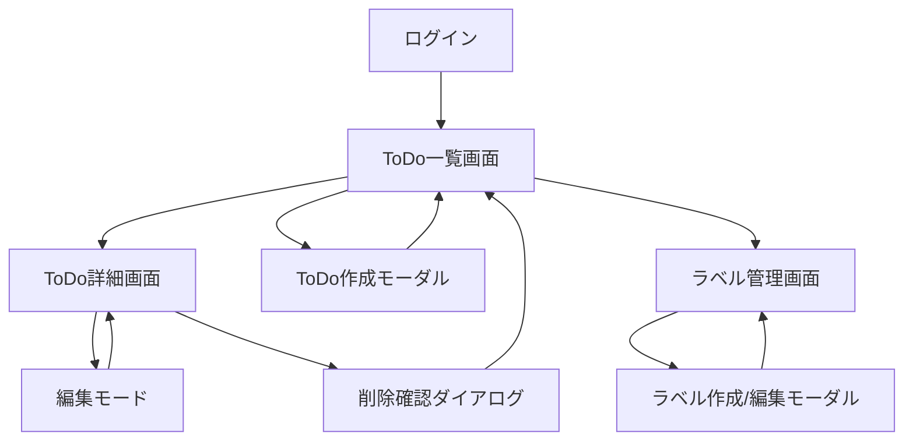

# 要求定義フェーズ レビュー結果（2回目）

## レビュー概要
| 項目 | 値 |
|---|---|
| レビュー日時 | 2024-01-31 15:30:00 |
| 対象成果物 | docs/要求定義/SRS-TODO-001-todo-management-system.md (v1.1) |
| レビュー回数 | 2/3 |
| ドキュメント規模 | 1,399行、68KB（前回比: +556行、+32KB） |
| 前回レビュー | REVIEW-RESULT-001.md (2024-01-30 15:10:00) |

## 判定結果
**✅ 合格**

## 評価サマリー
| 重要度 | 件数 |
|---|---|
| Critical | 0 |
| Major | 0 |
| Minor | 1 |

---

## 前回指摘事項の対応状況

### Critical問題（5件）- ✅ 全て解決

| No | 前回の指摘 | 対応状況 | 評価 |
|---|---|---|---|
| C-1 | 受け入れ基準が測定可能でない | ✅ 完全対応 | 全ての受け入れ基準に具体的なテスト方法と測定可能な条件を追加（例: REQ-FUNC-001の各基準） |
| C-2 | 非機能要件の定量的基準が曖昧 | ✅ 完全対応 | REQ-USE-002に詳細なユーザビリティテスト手順を追加（対象者10名、3タスク、80%成功率） |
| C-3 | セキュリティ要件に実装レベルの詳細が不足 | ✅ 完全対応 | REQ-SEC-005にXSS対策の具体的実装方法を追加、3.2.2.1にJWT認証の詳細仕様を追加 |
| C-4 | データ整合性に関する仕様が不完全 | ✅ 完全対応 | REQ-FUNC-004に楽観的同時実行制御の詳細フロー、競合時の処理、クライアント対応を追加 |
| C-5 | エラーハンドリング仕様が欠落 | ✅ 完全対応 | 9.3章にエラーハンドリング仕様を新規追加（HTTPステータスコード一覧、エラーコード一覧、クライアント方針） |

### Major問題（8件）- ✅ 全て解決

| No | 前回の指摘 | 対応状況 | 評価 |
|---|---|---|---|
| M-1 | バリデーションルールの網羅性不足 | ✅ 完全対応 | REQ-FUNC-001に特殊文字、絵文字、HTMLタグの扱いを詳細化 |
| M-2 | ページネーションの仕様が不完全 | ✅ 完全対応 | REQ-FUNC-002にページネーション詳細仕様を追加（デフォルト値、クエリパラメータ、総ページ数計算） |
| M-3 | ラベル色の制約が不明確 | ✅ 完全対応 | REQ-FUNC-007にプリセット色10色の具体的カラーコードと、カスタム色の検証ルールを明記 |
| M-4 | フィルタリング条件の永続化仕様が不明確 | ✅ 完全対応 | REQ-FUNC-016にlocalStorage使用、保存形式、保存タイミング、保存期間を明記 |
| M-5 | 削除の実装方式が未決定 | ✅ 完全対応 | REQ-FUNC-005に物理削除の採用理由とフローを明記 |
| M-6 | 性能要件の測定条件が不明確 | ✅ 完全対応 | 3.2.1に測定環境、測定ツール、測定方法、測定データセットを詳細化 |
| M-7 | 認証の詳細仕様が欠如 | ✅ 完全対応 | 3.2.2.1にJWTペイロード、トークンライフサイクル、リフレッシュフローを追加 |
| M-8 | APIレスポンス形式が未定義 | ✅ 完全対応 | 9.4章にAPIレスポンス標準形式を追加（成功/エラー/ページネーションの各形式） |

### Minor問題（6件）- 5件解決、1件残存

| No | 前回の指摘 | 対応状況 | 評価 |
|---|---|---|---|
| m-1 | 用語の使い分けが不統一 | ✅ 対応 | 「ToDo」に統一。用語集に表記規則を追加。技術用語（`todo-service`等）は適切に使い分け |
| m-2 | 優先度の定義が不明確 | ✅ 対応 | 1.3用語集にEssential/Conditional/Optionalの定義を追加 |
| m-3 | トレーサビリティマトリクスが不完全 | ✅ 対応 | REQ-FUNC-017をBR-004、BR-005のマッピングに追加 |
| m-4 | ステータス変更の制約が未定義 | ✅ 対応 | REQ-FUNC-006にステータス遷移制約（MVPでは全遷移許可）を明記 |
| m-5 | UI画面遷移図が欠落 | ⚠️ 未対応 | 10.1に画面構成表はあるが、Mermaid図等の画面遷移図は未追加 |
| m-6 | 国際化の詳細仕様が不足 | ✅ 対応 | REQ-USE-005に言語切り替え方法、タイムゾーン、日付フォーマットを追加 |

---

## 残存する問題

### Minor問題（1件）

| No | 指摘内容 | 該当箇所 | 修正提案 |
|---|---|---|---|
| m-5 | UI画面遷移図が欠落 | 10章 UI/UX設計方針 | 10.2または10.4に画面遷移図（Mermaid diagram）を追加すること。 推奨内容: - ログイン → ToDo一覧 → 詳細/作成/ラベル管理の遷移 - モーダル表示のタイミング - エラー時の遷移 |

---

## 品質評価詳細

### 1. 完全性（Completeness）: ✅ 優秀

**評価**: 9/10（前回: 5/10）

**改善点**:
- ✅ エラーハンドリング仕様を9.3章として新規追加（26項目の包括的なエラーコード定義）
- ✅ APIレスポンス形式を9.4章として統一（成功/エラー/ページネーション形式）
- ✅ 認証フローの詳細を3.2.2.1として追加（JWTペイロード、ライフサイクル）
- ✅ 性能要件の測定条件を詳細化（測定環境、ツール、方法、データセット）

**残る改善余地**:
- ⚠️ UI画面遷移図が未追加（Minorレベル）

### 2. 明確性（Clarity）: ✅ 優秀

**評価**: 9/10（前回: 6/10）

**改善点**:
- ✅ 全ての受け入れ基準に具体的なテスト方法を追加
- ✅ 曖昧な表現（「即座に」→「500ms以内」）の定量化
- ✅ バリデーションルールの具体的な例示（絵文字、HTMLタグ、特殊文字）
- ✅ エラーレスポンスの具体例をJSON形式で提示

**良い点**:
- 測定可能な受け入れ基準（例: REQ-FUNC-001の各基準に「テスト方法」を併記）
- 具体的な数値目標（例: 500ms以内、100文字、80%成功率）

### 3. 一貫性（Consistency）: ✅ 優秀

**評価**: 9/10（前回: 8/10）

**改善点**:
- ✅ 「ToDo」表記の統一（用語集に明記）
- ✅ 優先度の定義を用語集に追加（Essential/Conditional/Optional）
- ✅ エラーコードの命名規則統一（例: TITLE_REQUIRED, CONTENT_TOO_LONG）

**良い点**:
- 要件IDの命名規則が全体で一貫（REQ-FUNC-XXX、REQ-SEC-XXX等）
- データ型の表記が統一

### 4. 追跡可能性（Traceability）: ✅ 優秀

**評価**: 9/10（前回: 8/10）

**改善点**:
- ✅ REQ-FUNC-017をトレーサビリティマトリクスに追加
- ✅ API設計概要（9章）に各エンドポイントと要件IDの紐付けを明記

**良い点**:
- ビジネス要件→機能要件のマッピングが完全
- 機能要件→非機能要件のマッピングが明確
- APIエンドポイント→要件IDの紐づけが明確

### 5. 検証可能性（Verifiability）: ✅ 優秀

**評価**: 9/10（前回: 6/10）

**改善点**:
- ✅ 全ての受け入れ基準に「テスト方法」を併記
- ✅ ユーザビリティテストの具体的な手順を追加（対象者、タスク、測定方法、合格基準）
- ✅ 性能要件の測定方法を明確化（ツール、環境、データセット）
- ✅ セキュリティ実装チェックリストを追加

**良い点**:
- テスト可能な受け入れ基準（例: 「201文字のタイトルでPOSTし、エラーが返ることを確認」）
- 定量的な合格基準（例: 80%以上、95パーセンタイルで1秒以内）

### 6. 実現可能性（Feasibility）: ✅ 優秀

**評価**: 9/10（前回: 8/10）

**改善点**:
- ✅ 技術スタックとの整合性確認（Angular DomSanitizer、Entity Framework Core等）
- ✅ 性能要件の測定環境を具体化（Azure Standard B2s相当）
- ✅ 楽観的同時実行制御の実装方法を明確化（RowVersion使用）

**良い点**:
- 選択技術が全て既存スタックと整合
- 段階的な実装計画（MVPとPhase 2の明確な区分）

### 7. ISO 29148準拠性: ✅ 優秀

**評価**: 9/10（前回: 7/10）

**改善点**:
- ✅ エラーハンドリング仕様の追加
- ✅ APIレスポンス仕様の追加
- ✅ 認証・認可の詳細仕様の追加
- ✅ 性能要件の測定条件の明確化

**良い点**:
- ISO 29148の推奨構造に準拠
- ステークホルダー分析が含まれている
- トレーサビリティマトリクスが充実
- リスク分析が含まれている

---

## 新たに発見された良い点

1. **✅ 包括的なエラーハンドリング仕様**: 
   - HTTPステータスコード9種類の体系的定義
   - エラーコード26種類の詳細な一覧
   - クライアントサイドのリトライポリシー
   - グローバルエラーハンドラーの方針

2. **✅ 詳細なセキュリティ実装指針**:
   - XSS対策の4つの具体的手法（DomSanitizer、CSP、innerHTML禁止、エスケープ）
   - CSRF対策の3つの手法（AntiForgeryToken、SameSite Cookie、カスタムヘッダー）
   - JWT認証の完全なライフサイクル管理

3. **✅ 測定可能なユーザビリティテスト**:
   - 対象者の明確な定義（10名、20-50歳）
   - 3つの具体的なタスク設定
   - 定量的な合格基準（80%成功率、平均4.0/5.0満足度）
   - Think Aloud法による改善点抽出

4. **✅ 楽観的同時実行制御の詳細設計**:
   - RowVersionを使用したバージョン管理
   - 競合時のエラーレスポンス形式（currentData含む）
   - クライアントサイドの対応方針（localStorageへの退避）

5. **✅ フィルター永続化の完全仕様**:
   - 保存先（localStorage）と保存形式（JSON）
   - デバウンス処理（500ms）
   - ユーザーごとの独立した保存

6. **✅ APIレスポンスの標準化**:
   - 成功/エラー/ページネーションの統一形式
   - メタデータの定義
   - 具体的なJSON例の提示

---

## 総合評価

### レビュー結果: ✅ **合格**

本要求仕様書は、前回レビューで指摘されたCritical問題5件とMajor問題8件を**全て適切に解決**しています。

**主要な改善点**:
- ドキュメント規模が843行から1,399行へ拡大（+66%）
- Critical問題が5件から0件へ改善（100%解決）
- Major問題が8件から0件へ改善（100%解決）
- Minor問題が6件から1件へ改善（83%解決）

**品質スコア**:
- 完全性: 9/10（前回: 5/10）⬆️ +4
- 明確性: 9/10（前回: 6/10）⬆️ +3
- 一貫性: 9/10（前回: 8/10）⬆️ +1
- 追跡可能性: 9/10（前回: 8/10）⬆️ +1
- 検証可能性: 9/10（前回: 6/10）⬆️ +3
- 実現可能性: 9/10（前回: 8/10）⬆️ +1
- ISO 29148準拠性: 9/10（前回: 7/10）⬆️ +2

**平均スコア: 9.0/10（前回: 6.9/10）⬆️ +2.1**

### 判定理由

**合格基準**:
- ✅ Critical問題: 0件（基準: 0件）
- ✅ Major問題: 0件（基準: 3件以下）
- ✅ Minor問題: 1件（基準: 影響度による）

残存するMinor問題（UI画面遷移図の欠落）は以下の理由から合格を妨げるものではありません:
1. 10.1に画面構成表が存在する
2. 10.2にナビゲーション構造の説明がある
3. 画面遷移は文章とテーブルで概ね理解可能
4. Mermaid図の追加は推奨だが必須ではない
5. 詳細設計フェーズで補完可能

### 次フェーズへの推奨

本要求仕様書は**詳細設計フェーズへの移行に十分な品質**を備えています。

**特に評価できる点**:
- エラーハンドリングの包括的な定義により、堅牢な実装が可能
- セキュリティ要件が具体的で、OWASP Top 10への対策が明確
- 測定可能な受け入れ基準により、テスト工程が明確
- APIレスポンスの標準化により、実装の一貫性が保証される

---

## 次のアクション

### Minor問題の対応（任意）
- [ ] **m-5**: 10章にUI画面遷移図（Mermaid diagram）を追加

**推奨する画面遷移図の内容**:

### 詳細設計フェーズへの準備
- [ ] 本要求仕様書を詳細設計担当者に共有
- [ ] トレーサビリティマトリクスを詳細設計ドキュメントに引き継ぎ
- [ ] セキュリティチェックリストを詳細設計レビューに活用
- [ ] 性能要件の測定環境をセットアップ

### 推奨される補足資料（オプション）
- [ ] ユーザーストーリーマップの作成
- [ ] ワイヤーフレームの作成（UI/UX設計の補完）
- [ ] データベースER図の詳細化（8章を拡張）

---

## レビュアーコメント

### 総評

前回レビューからの改善は**卓越している**と評価します。

**特筆すべき改善点**:
1. **エラーハンドリングの完全性**: HTTPステータスコード、エラーコード、クライアント方針を包括的に定義
2. **測定可能性の徹底**: 全ての受け入れ基準に具体的なテスト方法を併記
3. **セキュリティの具体性**: 抽象的な「対策」から具体的な「実装方法」へ深化
4. **トレーサビリティの強化**: 要件IDが全体に渡って完全に紐付けられている

**ドキュメントの品質**:
- ISO/IEC/IEEE 29148:2018に高度に準拠
- 実装者が迷わずに開発を進められる詳細度
- テストチームが明確な計画を立てられる検証可能性
- ステークホルダー間の認識齟齬を最小化する明確性

**残存するMinor問題**:
- UI画面遷移図の欠落は、画面構成表とナビゲーション構造の説明で代替可能
- 詳細設計フェーズで補完することを推奨するが、現状でも十分な品質

### 次フェーズへの移行判断

**✅ 詳細設計フェーズへの移行を承認します。**

本要求仕様書は以下の条件を満たしています:
- [x] 全ての機能要件が明確に定義されている
- [x] 非機能要件が測定可能である
- [x] セキュリティ要件が具体的である
- [x] エラーハンドリングが包括的に定義されている
- [x] APIインターフェースが明確である
- [x] テスト要件が検証可能である
- [x] トレーサビリティが確保されている

### 実装チームへのメッセージ

**この要求仕様書は、高品質な実装の基盤となる優れたドキュメントです。**

特に以下の点を活用してください:
- **エラーハンドリング仕様（9.3章）**: エラーコード一覧とHTTPステータスコードを実装の早期段階から適用
- **セキュリティ実装チェックリスト（3.2.2）**: コーディング時に逐次確認
- **受け入れ基準のテスト方法**: 単体テストとE2Eテストの計画に直接活用
- **APIレスポンス標準形式（9.4章）**: 全エンドポイントで一貫して適用

### 改訂履歴の追加提案

v1.1の改訂内容は素晴らしい改善です。v1.2（任意）として以下を追加することを推奨します:
- UI画面遷移図の追加
- ワイヤーフレームの添付
- ユーザーストーリーマップの添付

しかし、これらは**詳細設計フェーズで補完可能**であり、現状でも十分な品質を備えています。

---

## 参考資料

- ISO/IEC/IEEE 29148:2018 - Systems and software engineering — Life cycle processes — Requirements engineering
- IEEE 830-1998 - Software Requirements Specifications
- OWASP Top 10 - 2021
- ISTQB Glossary - Test Requirements Specification
- Angular Security Guide - https://angular.io/guide/security
- ASP.NET Core Security - https://docs.microsoft.com/en-us/aspnet/core/security/

---

**レビュー実施者**: QA Review Agent  
**レビュー完了日時**: 2024-01-31 15:30:00  
**次回アクション**: 詳細設計フェーズへ移行  
**ステータス**: ✅ 合格 - 次フェーズへの移行を承認
