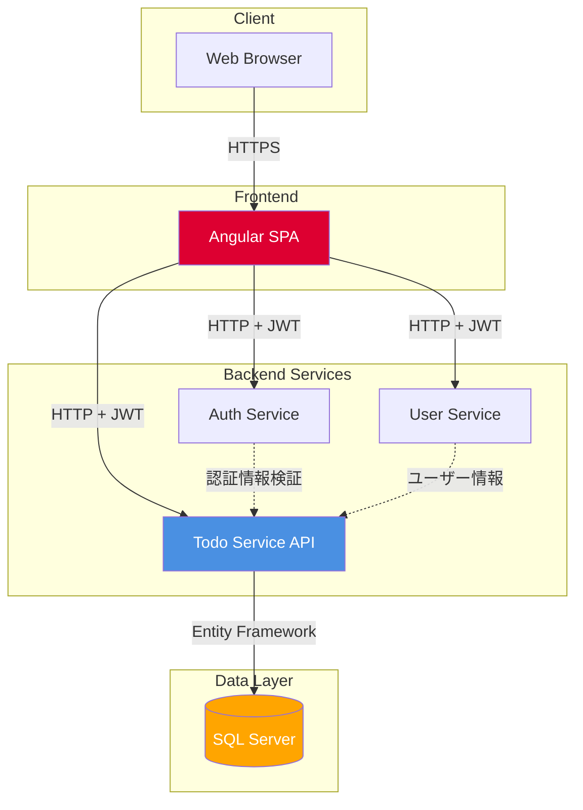
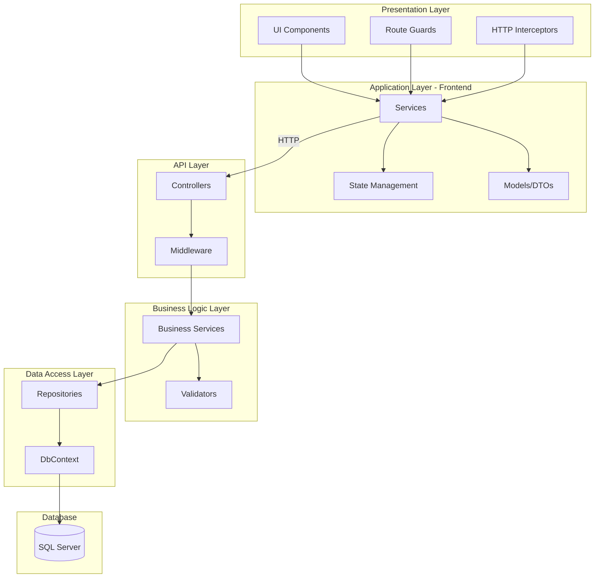
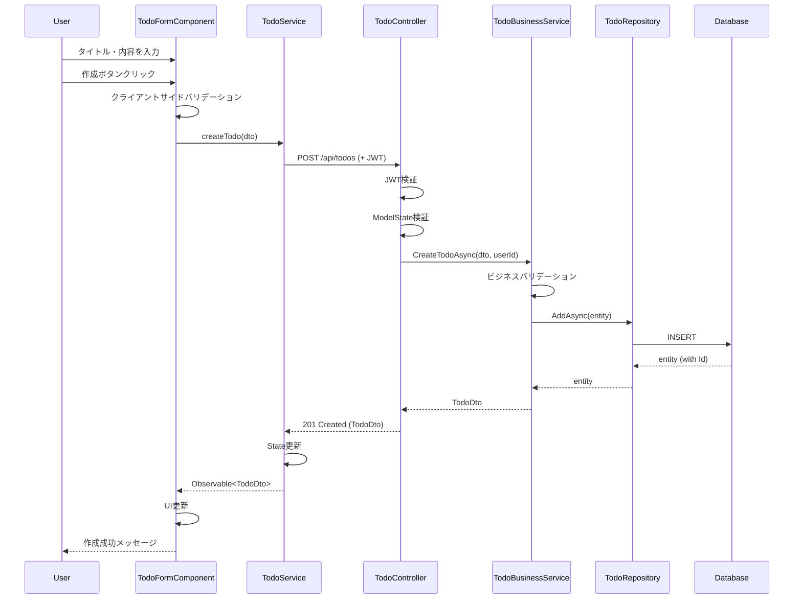
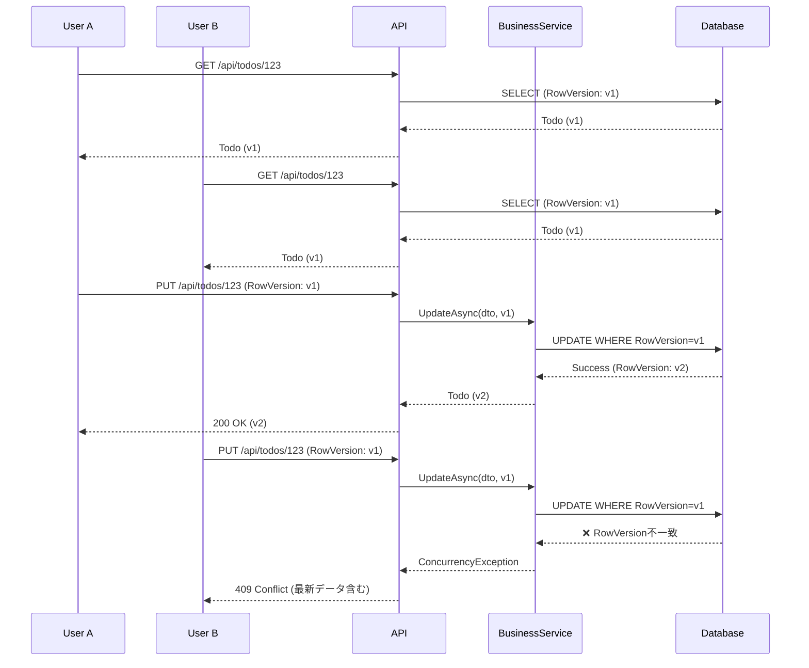
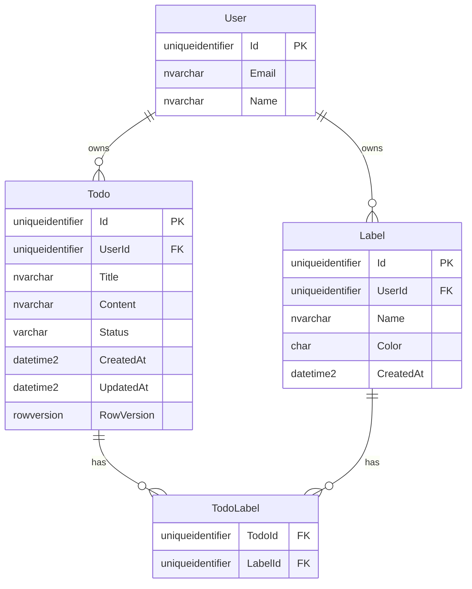
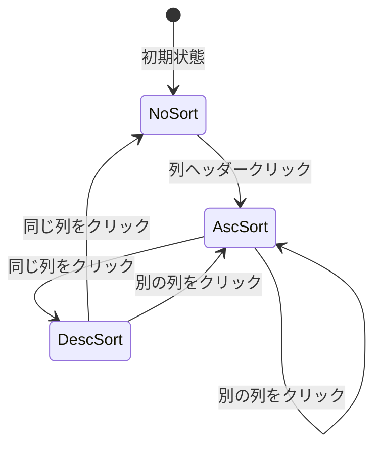
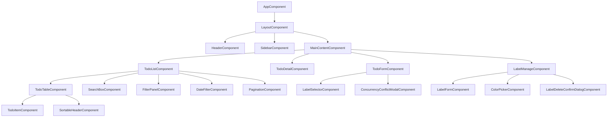
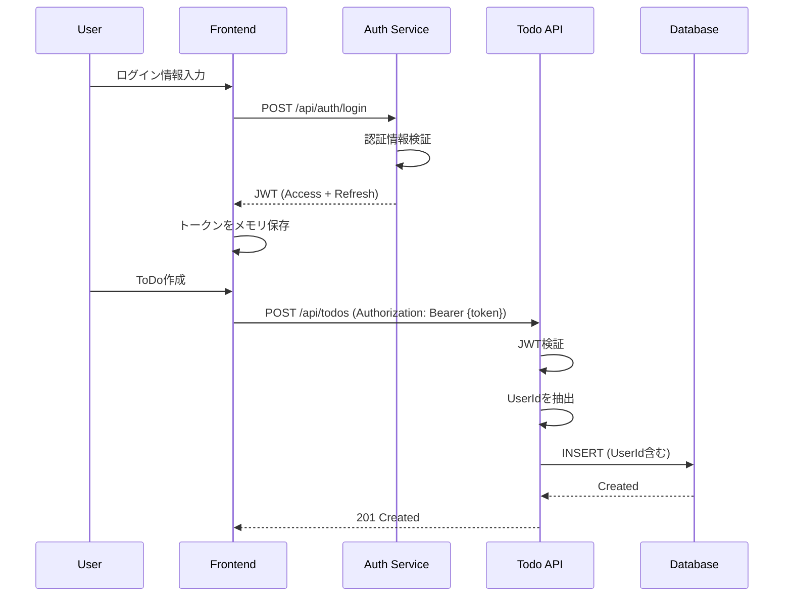
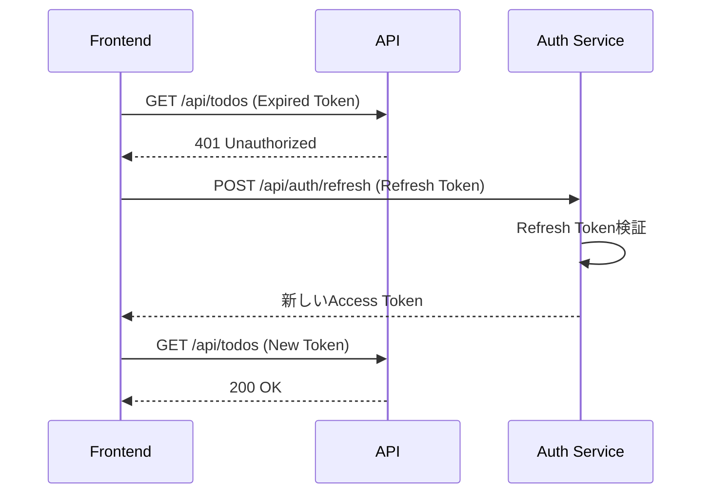

# ソフトウェア設計記述書: ToDoマネジメントシステム

**文書ID**: SDD-TODO-001  
**バージョン**: 1.1  
**作成日**: 2024-01-31  
**最終更新日**: 2024-01-31  
**ステータス**: Draft  
**作成者**: AI Agent  
**準拠規格**: IEEE 1016-2009

---

## 目次

1. [はじめに](#1-はじめに)
2. [設計概要](#2-設計概要)
3. [システムコンテキスト](#3-システムコンテキスト)
4. [アーキテクチャ設計](#4-アーキテクチャ設計)
5. [データベース設計](#5-データベース設計)
6. [Backend設計](#6-backend設計)
7. [Frontend設計](#7-frontend設計)
8. [セキュリティ設計](#8-セキュリティ設計)
9. [非機能設計](#9-非機能設計)
10. [トレーサビリティ](#10-トレーサビリティ)
11. [改訂履歴](#11-改訂履歴)

---

## 1. はじめに

### 1.1 目的

本文書は、高機能ToDoマネジメントシステムの詳細設計を記述し、開発チームが実装を行うための技術的な詳細情報を提供することを目的とします。IEEE 1016-2009標準に準拠し、以下を含みます:

- システムアーキテクチャ
- データベース設計
- API設計
- Frontend/Backend コンポーネント設計
- セキュリティ設計
- 非機能要件の実現方法

### 1.2 範囲

本設計書は以下の範囲をカバーします:

**対象システム**:
- ToDoサービス (todo-service)
- Frontend: Angular (SPA)
- Backend: ASP.NET Core Web API
- Database: SQL Server

**対象外**:
- 認証サービス (auth-service): 既存サービスを利用
- ユーザーサービス (user-service): 既存サービスを利用
- BFFサービス (bff-service): 将来の拡張として検討

### 1.3 参照資料

- **要求仕様書**: `docs/要求定義/SRS-TODO-001-todo-management-system.md` (v1.1)
- **IEEE 1016-2009**: Systems and software engineering — Life cycle processes — Software design descriptions
- **ISO/IEC/IEEE 29148:2018**: Systems and software engineering — Life cycle processes — Requirements engineering
- **Angular公式ドキュメント**: https://angular.io/docs
- **ASP.NET Core公式ドキュメント**: https://docs.microsoft.com/aspnet/core
- **SQL Server公式ドキュメント**: https://docs.microsoft.com/sql

### 1.4 用語・定義

| 用語 | 定義 |
|---|---|
| ToDo | ユーザーが管理するタスクアイテム |
| ラベル | ToDoを分類するための色付きタグ |
| ステータス | ToDoの進捗状態（未着手、着手中、完了、放棄） |
| RowVersion | 楽観的同時実行制御用のバージョン管理フィールド |
| DTO | Data Transfer Object - レイヤー間でデータを転送するオブジェクト |
| Repository | データアクセス層のパターン |
| Service | ビジネスロジック層 |
| Component | Angularのビューコンポーネント |

---

## 2. 設計概要

### 2.1 設計方針

本システムは以下の設計原則に基づいて設計されています:

1. **レイヤー分離**: プレゼンテーション層、ビジネスロジック層、データアクセス層を明確に分離
2. **関心の分離**: 各コンポーネントは単一の責務を持つ
3. **疎結合**: インターフェースを介した依存関係の管理
4. **RESTful設計**: リソース指向のAPI設計
5. **セキュリティファースト**: 全レイヤーでのセキュリティ対策
6. **テスタビリティ**: ユニットテスト、統合テストが容易な設計
7. **スケーラビリティ**: 将来の拡張を考慮した設計

### 2.2 アーキテクチャスタイル

- **Frontend**: Single Page Application (SPA) - コンポーネントベースアーキテクチャ
- **Backend**: レイヤードアーキテクチャ（3層）
- **API**: RESTful API
- **データベース**: リレーショナルデータベース（SQL Server）

### 2.3 技術スタック

| レイヤー | 技術 | バージョン | 用途 |
|---|---|---|---|
| Frontend | Angular | 18+ | SPA フレームワーク |
| Frontend | TypeScript | 5+ | 型安全なJavaScript |
| Frontend | RxJS | 7+ | リアクティブプログラミング |
| Frontend | Angular Signals | 18+ | 状態管理 |
| Backend | ASP.NET Core | 8+ | Web API フレームワーク |
| Backend | C# | 12+ | プログラミング言語 |
| Backend | Entity Framework Core | 8+ | ORM |
| Database | SQL Server | 2022+ | リレーショナルDB |
| Database | SSDT | latest | データベースプロジェクト |
| 認証 | JWT | - | トークンベース認証 |


---

## 3. システムコンテキスト

### 3.1 システムコンテキスト図



### 3.2 外部インターフェース

#### 3.2.1 既存サービス連携

**Auth Service (認証サービス)**
- **用途**: JWT トークンの発行・検証
- **連携方法**: HTTP API
- **エンドポイント**:
  - `POST /api/auth/login` - ログイン
  - `POST /api/auth/refresh` - トークンリフレッシュ
  - `POST /api/auth/logout` - ログアウト
  - `GET /api/auth/verify` - トークン検証

**User Service (ユーザーサービス)**
- **用途**: ユーザー情報の取得
- **連携方法**: HTTP API
- **エンドポイント**:
  - `GET /api/users/{id}` - ユーザー情報取得
  - `GET /api/users/me` - 現在のユーザー情報取得

#### 3.2.2 データベースインターフェース

- **接続方式**: Entity Framework Core
- **接続文字列**: appsettings.json で管理
- **マイグレーション**: Code-First アプローチ

---

## 4. アーキテクチャ設計

### 4.1 システム全体アーキテクチャ



### 4.2 Backend レイヤー構成

#### 4.2.1 プロジェクト構造

```
src/todo-service/
├── api/                          # ASP.NET Core Web API プロジェクト
│   ├── TodoService.Api/
│   │   ├── Controllers/          # API Controllers
│   │   ├── Middleware/           # Custom Middleware
│   │   ├── Filters/              # Action Filters
│   │   ├── Program.cs            # エントリーポイント
│   │   └── appsettings.json      # 設定ファイル
│   │
│   ├── TodoService.Core/         # ドメインモデル・インターフェース
│   │   ├── Entities/             # エンティティクラス
│   │   ├── Interfaces/           # リポジトリインターフェース
│   │   ├── Enums/                # 列挙型
│   │   └── Exceptions/           # カスタム例外
│   │
│   ├── TodoService.Application/  # ビジネスロジック
│   │   ├── Services/             # ビジネスサービス
│   │   ├── DTOs/                 # Data Transfer Objects
│   │   ├── Validators/           # バリデーター
│   │   ├── Mappings/             # AutoMapper プロファイル
│   │   └── Interfaces/           # サービスインターフェース
│   │
│   └── TodoService.Infrastructure/ # インフラストラクチャ
│       ├── Data/                 # Entity Framework DbContext
│       ├── Repositories/         # リポジトリ実装
│       ├── Migrations/           # DBマイグレーション
│       └── Configuration/        # EF構成クラス
│
└── db/                           # データベースプロジェクト
    └── TodoDb/                   # SQL Database Project
        ├── Tables/               # テーブル定義
        ├── Indexes/              # インデックス定義
        └── Scripts/              # 初期データスクリプト
```

#### 4.2.2 レイヤー責務

| レイヤー | 責務 | 主要コンポーネント |
|---|---|---|
| **API Layer** | HTTPリクエスト/レスポンス処理、ルーティング、認証認可 | Controllers, Middleware, Filters |
| **Application Layer** | ビジネスロジック、バリデーション、DTO変換 | Services, Validators, Mappers |
| **Core Layer** | ドメインモデル、ビジネスルール、インターフェース定義 | Entities, Interfaces, Enums |
| **Infrastructure Layer** | データアクセス、外部サービス連携 | Repositories, DbContext, Migrations |

### 4.3 Frontend レイヤー構成

#### 4.3.1 プロジェクト構造

```
src/todo-service/front/           # Angular プロジェクト
├── src/
│   ├── app/
│   │   ├── core/                 # コア機能（シングルトン）
│   │   │   ├── guards/           # Route Guards
│   │   │   ├── interceptors/     # HTTP Interceptors
│   │   │   ├── services/         # グローバルサービス
│   │   │   └── models/           # 共通モデル
│   │   │
│   │   ├── shared/               # 共有コンポーネント・ディレクティブ
│   │   │   ├── components/       # 再利用可能なコンポーネント
│   │   │   ├── directives/       # カスタムディレクティブ
│   │   │   ├── pipes/            # カスタムパイプ
│   │   │   └── validators/       # カスタムバリデーター
│   │   │
│   │   ├── features/             # 機能モジュール
│   │   │   ├── todo/             # ToDo機能
│   │   │   │   ├── components/   # Todoコンポーネント
│   │   │   │   ├── services/     # Todoサービス
│   │   │   │   ├── models/       # Todoモデル
│   │   │   │   └── todo.routes.ts # ルート定義
│   │   │   │
│   │   │   └── label/            # ラベル機能
│   │   │       ├── components/   # Labelコンポーネント
│   │   │       ├── services/     # Labelサービス
│   │   │       ├── models/       # Labelモデル
│   │   │       └── label.routes.ts # ルート定義
│   │   │
│   │   ├── layout/               # レイアウトコンポーネント
│   │   │   ├── header/
│   │   │   ├── sidebar/
│   │   │   └── footer/
│   │   │
│   │   ├── app.component.ts      # ルートコンポーネント
│   │   ├── app.config.ts         # アプリケーション設定
│   │   └── app.routes.ts         # ルート定義
│   │
│   ├── assets/                   # 静的リソース
│   ├── environments/             # 環境設定
│   └── styles/                   # グローバルスタイル
│
└── angular.json                  # Angular設定
```

### 4.4 データフロー

#### 4.4.1 ToDo作成フロー



#### 4.4.2 ToDo更新フロー（楽観的同時実行制御）



---


## 5. データベース設計

### 5.1 ER図



### 5.2 テーブル定義

#### 5.2.1 Todosテーブル

| カラム | 型 | NULL | 制約 | デフォルト | 説明 |
|---|---|---|---|---|---|
| Id | UNIQUEIDENTIFIER | NO | PK | NEWID() | 主キー |
| UserId | UNIQUEIDENTIFIER | NO | FK | - | ユーザーID（外部キー） |
| Title | NVARCHAR(200) | NO | - | - | タイトル（1-200文字） |
| Content | NVARCHAR(MAX) | YES | - | NULL | 内容（最大5000文字、アプリで制御） |
| Status | VARCHAR(20) | NO | CHECK | 'NOT_STARTED' | ステータス |
| CreatedAt | DATETIME2(7) | NO | - | GETUTCDATE() | 作成日時（UTC） |
| UpdatedAt | DATETIME2(7) | NO | - | GETUTCDATE() | 更新日時（UTC） |
| RowVersion | ROWVERSION | NO | - | - | 楽観的同時実行制御 |

**制約**:
```sql
CONSTRAINT CK_Todos_Status CHECK (Status IN ('NOT_STARTED', 'IN_PROGRESS', 'COMPLETED', 'ABANDONED'))
```

**インデックス**:
```sql
-- ユーザーIDでの検索（頻繁）
CREATE INDEX IX_Todos_UserId ON Todos(UserId);

-- ステータスフィルタリング
CREATE INDEX IX_Todos_Status ON Todos(Status) INCLUDE (UserId);

-- 作成日時ソート（降順）
CREATE INDEX IX_Todos_CreatedAt ON Todos(CreatedAt DESC) INCLUDE (UserId);

-- 複合インデックス（ユーザー + ステータス + 作成日時）
CREATE INDEX IX_Todos_UserId_Status_CreatedAt ON Todos(UserId, Status, CreatedAt DESC);
```

#### 5.2.2 Labelsテーブル

| カラム | 型 | NULL | 制約 | デフォルト | 説明 |
|---|---|---|---|---|---|
| Id | UNIQUEIDENTIFIER | NO | PK | NEWID() | 主キー |
| UserId | UNIQUEIDENTIFIER | NO | FK | - | ユーザーID（外部キー） |
| Name | NVARCHAR(50) | NO | - | - | ラベル名（1-50文字） |
| Color | CHAR(7) | NO | - | - | カラーコード（#RRGGBB） |
| CreatedAt | DATETIME2(7) | NO | - | GETUTCDATE() | 作成日時（UTC） |

**制約**:
```sql
-- ユーザーごとにラベル名は一意
CONSTRAINT UQ_Labels_UserId_Name UNIQUE (UserId, Name);

-- カラーコード形式チェック
CONSTRAINT CK_Labels_Color CHECK (Color LIKE '#[0-9A-Fa-f][0-9A-Fa-f][0-9A-Fa-f][0-9A-Fa-f][0-9A-Fa-f][0-9A-Fa-f]');
```

**インデックス**:
```sql
-- ユーザーIDでの検索
CREATE INDEX IX_Labels_UserId ON Labels(UserId);

-- ラベル名での検索（ユーザーごと）
CREATE INDEX IX_Labels_UserId_Name ON Labels(UserId, Name);
```

#### 5.2.3 TodoLabelsテーブル（多対多関連）

| カラム | 型 | NULL | 制約 | デフォルト | 説明 |
|---|---|---|---|---|---|
| TodoId | UNIQUEIDENTIFIER | NO | FK | - | ToDo ID |
| LabelId | UNIQUEIDENTIFIER | NO | FK | - | ラベル ID |

**制約**:
```sql
-- 複合主キー
CONSTRAINT PK_TodoLabels PRIMARY KEY (TodoId, LabelId);

-- 外部キー制約（カスケード削除）
CONSTRAINT FK_TodoLabels_Todo FOREIGN KEY (TodoId) REFERENCES Todos(Id) ON DELETE CASCADE;
CONSTRAINT FK_TodoLabels_Label FOREIGN KEY (LabelId) REFERENCES Labels(Id) ON DELETE CASCADE;
```

**インデックス**:
```sql
-- TodoIdでの検索（ラベル一覧取得）
CREATE INDEX IX_TodoLabels_TodoId ON TodoLabels(TodoId);

-- LabelIdでの検索（ラベルフィルタリング）
CREATE INDEX IX_TodoLabels_LabelId ON TodoLabels(LabelId);
```

### 5.3 DDLスクリプト

#### 5.3.1 テーブル作成スクリプト

```sql
-- Todosテーブル
CREATE TABLE Todos (
    Id UNIQUEIDENTIFIER NOT NULL DEFAULT NEWID(),
    UserId UNIQUEIDENTIFIER NOT NULL,
    Title NVARCHAR(200) NOT NULL,
    Content NVARCHAR(MAX) NULL,
    Status VARCHAR(20) NOT NULL DEFAULT 'NOT_STARTED',
    CreatedAt DATETIME2(7) NOT NULL DEFAULT GETUTCDATE(),
    UpdatedAt DATETIME2(7) NOT NULL DEFAULT GETUTCDATE(),
    RowVersion ROWVERSION NOT NULL,
    
    CONSTRAINT PK_Todos PRIMARY KEY (Id),
    CONSTRAINT CK_Todos_Status CHECK (Status IN ('NOT_STARTED', 'IN_PROGRESS', 'COMPLETED', 'ABANDONED'))
);

-- Labelsテーブル
CREATE TABLE Labels (
    Id UNIQUEIDENTIFIER NOT NULL DEFAULT NEWID(),
    UserId UNIQUEIDENTIFIER NOT NULL,
    Name NVARCHAR(50) NOT NULL,
    Color CHAR(7) NOT NULL,
    CreatedAt DATETIME2(7) NOT NULL DEFAULT GETUTCDATE(),
    
    CONSTRAINT PK_Labels PRIMARY KEY (Id),
    CONSTRAINT UQ_Labels_UserId_Name UNIQUE (UserId, Name),
    CONSTRAINT CK_Labels_Color CHECK (Color LIKE '#[0-9A-Fa-f][0-9A-Fa-f][0-9A-Fa-f][0-9A-Fa-f][0-9A-Fa-f][0-9A-Fa-f]')
);

-- TodoLabelsテーブル
CREATE TABLE TodoLabels (
    TodoId UNIQUEIDENTIFIER NOT NULL,
    LabelId UNIQUEIDENTIFIER NOT NULL,
    
    CONSTRAINT PK_TodoLabels PRIMARY KEY (TodoId, LabelId),
    CONSTRAINT FK_TodoLabels_Todo FOREIGN KEY (TodoId) REFERENCES Todos(Id) ON DELETE CASCADE,
    CONSTRAINT FK_TodoLabels_Label FOREIGN KEY (LabelId) REFERENCES Labels(Id) ON DELETE CASCADE
);

-- インデックス作成
CREATE INDEX IX_Todos_UserId ON Todos(UserId);
CREATE INDEX IX_Todos_Status ON Todos(Status) INCLUDE (UserId);
CREATE INDEX IX_Todos_CreatedAt ON Todos(CreatedAt DESC) INCLUDE (UserId);
CREATE INDEX IX_Todos_UserId_Status_CreatedAt ON Todos(UserId, Status, CreatedAt DESC);

CREATE INDEX IX_Labels_UserId ON Labels(UserId);
CREATE INDEX IX_Labels_UserId_Name ON Labels(UserId, Name);

CREATE INDEX IX_TodoLabels_TodoId ON TodoLabels(TodoId);
CREATE INDEX IX_TodoLabels_LabelId ON TodoLabels(LabelId);
```

#### 5.3.2 トリガー（UpdatedAt自動更新）

```sql
-- Todosテーブルの更新日時自動更新トリガー
CREATE OR ALTER TRIGGER TR_Todos_UpdatedAt
ON Todos
AFTER UPDATE
AS
BEGIN
    SET NOCOUNT ON;
    
    UPDATE Todos
    SET UpdatedAt = GETUTCDATE()
    FROM Todos t
    INNER JOIN inserted i ON t.Id = i.Id
    WHERE t.UpdatedAt = i.UpdatedAt; -- 無限ループ防止
END;
```

### 5.4 データベースパフォーマンス設計

#### 5.4.1 クエリ最適化戦略

| 要件 | 最適化手法 | 期待効果 |
|---|---|---|
| ToDo一覧取得（ページング） | カバリングインデックス | インデックスのみでクエリ完結 |
| ステータスフィルタリング | 複合インデックス | WHERE + ORDER BY を高速化 |
| ラベルフィルタリング | インデックスヒント | JOINのパフォーマンス向上 |
| 全文検索 | LIKE検索 + インデックス | Phase 2でFull-Text Searchを検討 |

#### 5.4.2 パーティショニング戦略（将来）

Phase 2以降で検討:
- 作成日時ベースの水平パーティショニング
- アーカイブテーブルへの移行（1年以上経過したToDo）

---

## 6. Backend設計

### 6.1 API設計

#### 6.1.1 エンドポイント一覧

**ToDo API**

| メソッド | エンドポイント | 説明 | 要件ID | 認証 |
|---|---|---|---|---|
| GET | `/api/v1/todos` | ToDo一覧取得 | REQ-FUNC-002 | Required |
| GET | `/api/v1/todos/{id}` | ToDo詳細取得 | REQ-FUNC-003 | Required |
| POST | `/api/v1/todos` | ToDo作成 | REQ-FUNC-001 | Required |
| PUT | `/api/v1/todos/{id}` | ToDo更新 | REQ-FUNC-004 | Required |
| DELETE | `/api/v1/todos/{id}` | ToDo削除 | REQ-FUNC-005 | Required |
| PATCH | `/api/v1/todos/{id}/status` | ステータス更新 | REQ-FUNC-006 | Required |
| PUT | `/api/v1/todos/{id}/labels` | ラベル割り当て | REQ-FUNC-011 | Required |

**Label API**

| メソッド | エンドポイント | 説明 | 要件ID | 認証 |
|---|---|---|---|---|
| GET | `/api/v1/labels` | ラベル一覧取得 | REQ-FUNC-008 | Required |
| GET | `/api/v1/labels/{id}` | ラベル詳細取得 | - | Required |
| POST | `/api/v1/labels` | ラベル作成 | REQ-FUNC-007 | Required |
| PUT | `/api/v1/labels/{id}` | ラベル更新 | REQ-FUNC-009 | Required |
| DELETE | `/api/v1/labels/{id}` | ラベル削除 | REQ-FUNC-010 | Required |

#### 6.1.2 主要APIレスポンス例

**GET /api/v1/todos (一覧取得)**

リクエストパラメータ:
- `page`: ページ番号（デフォルト: 1）
- `pageSize`: ページサイズ（デフォルト: 20、最大: 100）
- `status[]`: ステータスフィルター（複数可）
- `labelIds[]`: ラベルIDフィルター（複数可）
- `search`: 検索キーワード（タイトルと内容を対象とした部分一致検索、複数キーワードはスペース区切りでAND検索）
- `startDate`: 開始日時フィルター（ISO8601形式: `2024-01-01T00:00:00Z`）
- `endDate`: 終了日時フィルター（ISO8601形式: `2024-01-31T23:59:59Z`）
- `sortBy`: ソートフィールド（`createdAt`, `title`, `status`、デフォルト: `createdAt`）
- `sortOrder`: ソート順（`asc`/`desc`、デフォルト: `desc`）

レスポンス (200 OK):
```json
{
  "data": [
    {
      "id": "3fa85f64-5717-4562-b3fc-2c963f66afa6",
      "title": "買い物リスト作成",
      "content": "週末の買い物リストを作る",
      "status": "IN_PROGRESS",
      "createdAt": "2024-01-30T10:00:00Z",
      "updatedAt": "2024-01-30T11:30:00Z",
      "rowVersion": "AAAAAAAAB9E=",
      "labels": [
        {"id": "...", "name": "家事", "color": "#FF5733"}
      ]
    }
  ],
  "pagination": {
    "currentPage": 1,
    "pageSize": 20,
    "totalItems": 157,
    "totalPages": 8,
    "hasNextPage": true,
    "hasPreviousPage": false
  }
}
```

**POST /api/v1/todos (作成)**

リクエストボディ:
```json
{
  "title": "買い物リスト作成",
  "content": "週末の買い物リストを作る",
  "labelIds": ["1fa85f64-..."]
}
```

レスポンス (201 Created):
```json
{
  "data": {
    "id": "3fa85f64-5717-4562-b3fc-2c963f66afa6",
    "title": "買い物リスト作成",
    "status": "NOT_STARTED",
    "createdAt": "2024-01-31T10:00:00Z",
    "updatedAt": "2024-01-31T10:00:00Z",
    "rowVersion": "AAAAAAAAB9E=",
    "labels": [...]
  }
}
```

**エラーレスポンス (400 Bad Request)**

```json
{
  "error": {
    "code": "VALIDATION_ERROR",
    "message": "入力内容に誤りがあります",
    "details": [
      {
        "field": "title",
        "issue": "タイトルは1文字以上200文字以内で入力してください"
      }
    ],
    "timestamp": "2024-01-31T10:00:00Z",
    "traceId": "abc123-def456"
  }
}
```

**エラーレスポンス (409 Conflict - 楽観的同時実行制御)**

```json
{
  "error": {
    "code": "CONCURRENT_UPDATE_CONFLICT",
    "message": "このToDoは他のユーザーによって更新されています",
    "details": [{
      "field": "rowVersion",
      "issue": "バージョンが一致しません。最新データを取得してください。"
    }],
    "currentVersion": "AAAAAAAAB9F=",
    "currentData": {
      "id": "3fa85f64-...",
      "title": "最新のタイトル"
    },
    "timestamp": "2024-01-31T10:30:00Z",
    "traceId": "abc123-def456"
  }
}
```

#### 6.1.3 検索機能の詳細仕様 (REQ-FUNC-015)

**検索対象フィールド**:
- `Title`: ToDoのタイトル
- `Content`: ToDoの内容

**検索方式**:
- **部分一致**: SQL LIKE演算子を使用した前方・中間・後方一致
- **大文字小文字の区別**: 区別しない（COLLATE SQL_Latin1_General_CP1_CI_AS）
- **複数キーワード**: スペース区切りでAND検索
  - 例: `"買い物 週末"` → `Title LIKE '%買い物%' AND Title LIKE '%週末%' OR Content LIKE '%買い物%' AND Content LIKE '%週末%'`

**SQLクエリ実装例**:
```sql
-- 単一キーワード検索
SELECT * FROM Todos
WHERE (Title LIKE N'%キーワード%' OR Content LIKE N'%キーワード%')
  AND UserId = @UserId

-- 複数キーワード検索（例: "買い物 週末"）
SELECT * FROM Todos
WHERE UserId = @UserId
  AND (
    (Title LIKE N'%買い物%' OR Content LIKE N'%買い物%')
    AND (Title LIKE N'%週末%' OR Content LIKE N'%週末%')
  )
```

**パフォーマンス最適化**:
- `IX_Todos_UserId_Title`: UserId と Title の複合インデックス（既存）を活用
- 全文検索（Full-Text Search）は Phase 2 で検討（1万件以上のデータ時）
- 検索キーワードは最大100文字に制限
- 検索クエリのキャッシング（Redis）を Phase 2 で検討

**C# 実装例（Repository層）**:
```csharp
public async Task<List<Todo>> SearchTodosAsync(
    Guid userId, 
    string searchKeyword, 
    CancellationToken ct = default)
{
    var query = _context.Todos
        .Where(t => t.UserId == userId);
    
    if (!string.IsNullOrWhiteSpace(searchKeyword))
    {
        // 複数キーワードをスペースで分割
        var keywords = searchKeyword.Split(' ', StringSplitOptions.RemoveEmptyEntries);
        
        foreach (var keyword in keywords)
        {
            var pattern = $"%{keyword}%";
            query = query.Where(t => 
                EF.Functions.Like(t.Title, pattern) || 
                EF.Functions.Like(t.Content ?? "", pattern)
            );
        }
    }
    
    return await query
        .OrderByDescending(t => t.CreatedAt)
        .ToListAsync(ct);
}
```

#### 6.1.4 ソート機能の詳細仕様 (REQ-FUNC-017)

**サポートするソートフィールド**:

| sortBy | 説明 | デフォルト順序 | SQL ORDER BY |
|---|---|---|---|
| `createdAt` | 投稿日時 | desc | `ORDER BY CreatedAt DESC` |
| `title` | タイトル | asc | `ORDER BY Title ASC` |
| `status` | ステータス | asc | `ORDER BY Status ASC, CreatedAt DESC` |

**ソート順序 (sortOrder)**:
- `asc`: 昇順
- `desc`: 降順

**ソート状態機械**:


**UIフィードバック**:
- **昇順**: ▲アイコン表示、`aria-sort="ascending"`
- **降順**: ▼アイコン表示、`aria-sort="descending"`
- **ソートなし**: アイコンなし、`aria-sort="none"`

**C# 実装例（Repository層）**:
```csharp
public async Task<PagedResult<Todo>> GetTodosAsync(
    Guid userId,
    TodoQueryParams queryParams,
    CancellationToken ct = default)
{
    var query = _context.Todos
        .Where(t => t.UserId == userId);
    
    // フィルタリング
    if (queryParams.Status?.Any() == true)
        query = query.Where(t => queryParams.Status.Contains(t.Status));
    
    if (queryParams.LabelIds?.Any() == true)
        query = query.Where(t => t.TodoLabels.Any(tl => queryParams.LabelIds.Contains(tl.LabelId)));
    
    // 検索
    if (!string.IsNullOrWhiteSpace(queryParams.Search))
    {
        var keywords = queryParams.Search.Split(' ', StringSplitOptions.RemoveEmptyEntries);
        foreach (var keyword in keywords)
        {
            var pattern = $"%{keyword}%";
            query = query.Where(t => 
                EF.Functions.Like(t.Title, pattern) || 
                EF.Functions.Like(t.Content ?? "", pattern)
            );
        }
    }
    
    // 日時範囲フィルタリング
    if (queryParams.StartDate.HasValue)
        query = query.Where(t => t.CreatedAt >= queryParams.StartDate.Value);
    
    if (queryParams.EndDate.HasValue)
        query = query.Where(t => t.CreatedAt <= queryParams.EndDate.Value);
    
    // ソート
    query = queryParams.SortBy switch
    {
        "title" => queryParams.SortOrder == "asc" 
            ? query.OrderBy(t => t.Title)
            : query.OrderByDescending(t => t.Title),
        "status" => queryParams.SortOrder == "asc"
            ? query.OrderBy(t => t.Status).ThenByDescending(t => t.CreatedAt)
            : query.OrderByDescending(t => t.Status).ThenByDescending(t => t.CreatedAt),
        _ => queryParams.SortOrder == "asc"
            ? query.OrderBy(t => t.CreatedAt)
            : query.OrderByDescending(t => t.CreatedAt)
    };
    
    // ページング
    var totalItems = await query.CountAsync(ct);
    var items = await query
        .Skip((queryParams.Page - 1) * queryParams.PageSize)
        .Take(queryParams.PageSize)
        .Include(t => t.TodoLabels).ThenInclude(tl => tl.Label)
        .ToListAsync(ct);
    
    return new PagedResult<Todo>
    {
        Data = items,
        Pagination = new PaginationMetadata(
            queryParams.Page, 
            queryParams.PageSize, 
            totalItems
        )
    };
}
```

#### 6.1.5 日時範囲フィルタリングの詳細仕様 (REQ-FUNC-014)

**クエリパラメータ**:
- `startDate`: 開始日時（ISO 8601形式、UTC）
  - 例: `2024-01-01T00:00:00Z`
- `endDate`: 終了日時（ISO 8601形式、UTC）
  - 例: `2024-01-31T23:59:59Z`

**バリデーション**:
- `startDate` <= `endDate`（バックエンド・フロントエンド両方で検証）
- 日付形式チェック（ISO 8601）
- タイムゾーン: UTC統一

**エラーレスポンス例**:
```json
{
  "error": {
    "code": "INVALID_DATE_RANGE",
    "message": "開始日時は終了日時より前である必要があります",
    "details": [
      {
        "field": "startDate",
        "issue": "startDate (2024-02-01) は endDate (2024-01-01) より後です"
      }
    ],
    "timestamp": "2024-01-31T10:00:00Z",
    "traceId": "xyz-789"
  }
}
```

**プリセット日時範囲**（クライアントサイドで生成）:
- **今日**: `startDate = 今日00:00:00`, `endDate = 今日23:59:59`
- **今週**: `startDate = 週の開始（月曜）00:00:00`, `endDate = 週の終了（日曜）23:59:59`
- **今月**: `startDate = 月初00:00:00`, `endDate = 月末23:59:59`

### 6.2 クラス設計

#### 6.2.1 主要クラス一覧

**Controllers (API Layer)**
- `TodoController`: ToDo関連のエンドポイント
- `LabelController`: ラベル関連のエンドポイント

**Services (Application Layer)**
- `TodoService`: ToDoのビジネスロジック
- `LabelService`: ラベルのビジネスロジック

**Repositories (Infrastructure Layer)**
- `TodoRepository`: ToDoのデータアクセス
- `LabelRepository`: ラベルのデータアクセス

**Entities (Core Layer)**
- `Todo`: ToDoエンティティ
- `Label`: ラベルエンティティ
- `TodoLabel`: 多対多関連エンティティ

**DTOs (Application Layer)**
- `CreateTodoRequest`, `UpdateTodoRequest`: リクエストDTO
- `TodoDto`, `LabelDto`: レスポンスDTO
- `PagedResult<T>`: ページング結果DTO

**Enums**
- `TodoStatus`: NOT_STARTED, IN_PROGRESS, COMPLETED, ABANDONED

#### 6.2.2 依存関係注入 (DI)

`Program.cs`:
```csharp
// Services
builder.Services.AddScoped<ITodoService, TodoService>();
builder.Services.AddScoped<ILabelService, LabelService>();

// Repositories
builder.Services.AddScoped<ITodoRepository, TodoRepository>();
builder.Services.AddScoped<ILabelRepository, LabelRepository>();

// DbContext
builder.Services.AddDbContext<TodoDbContext>(options =>
    options.UseSqlServer(builder.Configuration.GetConnectionString("TodoDb")));

// AutoMapper
builder.Services.AddAutoMapper(typeof(MappingProfile));

// Authentication
builder.Services.AddAuthentication(JwtBearerDefaults.AuthenticationScheme)
    .AddJwtBearer(options => {
        options.Authority = builder.Configuration["Auth:Authority"];
        options.Audience = builder.Configuration["Auth:Audience"];
    });
```

### 6.3 バリデーション設計

#### 6.3.1 クライアントサイドバリデーション

Angularフォームバリデーション:
- `Validators.required`: 必須チェック
- `Validators.minLength(1)`, `Validators.maxLength(200)`: 文字数チェック
- カスタムバリデーター: カラーコード形式チェック

#### 6.3.2 サーバーサイドバリデーション

FluentValidation使用:
```csharp
public class CreateTodoRequestValidator : AbstractValidator<CreateTodoRequest>
{
    public CreateTodoRequestValidator()
    {
        RuleFor(x => x.Title)
            .NotEmpty().WithMessage("タイトルは必須です")
            .Length(1, 200).WithMessage("タイトルは1文字以上200文字以内で入力してください");
            
        RuleFor(x => x.Content)
            .MaximumLength(5000).WithMessage("内容は5000文字以内で入力してください");
    }
}
```

---

## 7. Frontend設計

### 7.1 コンポーネント構成



### 7.2 主要コンポーネント詳細

#### 7.2.1 TodoListComponent

| 項目 | 内容 |
|---|---|
| セレクター | `app-todo-list` |
| パス | `src/app/features/todo/components/todo-list/` |
| 責務 | ToDo一覧の表示、フィルタリング、ページング制御 |
| Input | なし |
| Output | なし |
| 依存サービス | TodoService, LabelService |

**主要メソッド**:
```typescript
export class TodoListComponent implements OnInit {
  todos = signal<TodoDto[]>([]);
  pagination = signal<PaginationMetadata | null>(null);
  filters = signal<TodoQueryParams>({
    page: 1,
    pageSize: 20,
    sortBy: 'createdAt',
    sortOrder: 'desc'
  });
  
  constructor(
    private todoService: TodoService,
    private labelService: LabelService
  ) {}
  
  ngOnInit(): void {
    this.loadTodos();
  }
  
  loadTodos(): void {
    this.todoService.getTodos(this.filters())
      .subscribe(result => {
        this.todos.set(result.data);
        this.pagination.set(result.pagination);
      });
  }
  
  onFilterChange(filters: Partial<TodoQueryParams>): void {
    this.filters.update(f => ({ ...f, ...filters, page: 1 }));
    this.loadTodos();
  }
  
  onSortChange(sortBy: string): void {
    this.filters.update(f => {
      // 同じ列をクリックした場合は順序を反転
      if (f.sortBy === sortBy) {
        return {
          ...f,
          sortOrder: f.sortOrder === 'asc' ? 'desc' : 'asc'
        };
      }
      // 別の列をクリックした場合はデフォルトの順序
      return {
        ...f,
        sortBy,
        sortOrder: sortBy === 'createdAt' ? 'desc' : 'asc'
      };
    });
    this.loadTodos();
  }
  
  onPageChange(page: number): void {
    this.filters.update(f => ({ ...f, page }));
    this.loadTodos();
  }
}
```

#### 7.2.2 TodoFormComponent

| 項目 | 内容 |
|---|---|
| セレクター | `app-todo-form` |
| パス | `src/app/features/todo/components/todo-form/` |
| 責務 | ToDo作成・編集フォーム |
| Input | `@Input() todoId?: string` (編集時) |
| Output | `@Output() saved = new EventEmitter<TodoDto>()` |
| 依存サービス | TodoService, LabelService |

**フォーム定義**:
```typescript
export class TodoFormComponent implements OnInit {
  todoForm = this.fb.group({
    title: ['', [Validators.required, Validators.maxLength(200)]],
    content: ['', [Validators.maxLength(5000)]],
    labelIds: [[] as string[]]
  });
  
  labels = signal<LabelDto[]>([]);
  isEditMode = computed(() => !!this.todoId());
  currentRowVersion = signal<string | null>(null);
  showConflictModal = signal(false);
  conflictData = signal<ConflictResolutionData | null>(null);
  
  constructor(
    private fb: FormBuilder,
    private todoService: TodoService,
    private labelService: LabelService
  ) {}
  
  ngOnInit(): void {
    if (this.isEditMode()) {
      this.loadTodo();
    }
    this.loadLabels();
    this.restoreFormFromLocalStorage();
  }
  
  onSubmit(): void {
    if (this.todoForm.invalid) return;
    
    const request = this.todoForm.value as CreateTodoRequest;
    
    if (this.isEditMode()) {
      const updateRequest = {
        ...request,
        rowVersion: this.currentRowVersion()
      } as UpdateTodoRequest;
      
      this.todoService.updateTodo(this.todoId()!, updateRequest)
        .pipe(
          catchError(error => this.handleUpdateError(error))
        )
        .subscribe(todo => {
          this.clearLocalStorage();
          this.saved.emit(todo);
        });
    } else {
      this.todoService.createTodo(request)
        .subscribe(todo => {
          this.clearLocalStorage();
          this.saved.emit(todo);
        });
    }
  }
  
  private handleUpdateError(error: HttpErrorResponse): Observable<never> {
    if (error.status === 409) {
      // 楽観的同時実行制御エラー
      this.saveFormToLocalStorage();
      this.conflictData.set({
        userChanges: this.todoForm.value,
        serverData: error.error.currentData,
        currentVersion: error.error.currentVersion
      });
      this.showConflictModal.set(true);
      return EMPTY;
    }
    return throwError(() => error);
  }
  
  onConflictResolved(resolution: 'use-server' | 'retry' | 'cancel'): void {
    this.showConflictModal.set(false);
    
    switch (resolution) {
      case 'use-server':
        // サーバーの最新データをロード
        this.loadTodo();
        this.clearLocalStorage();
        break;
      case 'retry':
        // 最新のrowVersionで再送信
        const conflict = this.conflictData();
        if (conflict) {
          this.currentRowVersion.set(conflict.currentVersion);
          this.onSubmit();
        }
        break;
      case 'cancel':
        // ユーザー入力を保持
        this.restoreFormFromLocalStorage();
        break;
    }
  }
  
  private saveFormToLocalStorage(): void {
    const formData = {
      todoId: this.todoId(),
      formValue: this.todoForm.value,
      timestamp: new Date().toISOString()
    };
    localStorage.setItem(`todo_form_${this.todoId()}`, JSON.stringify(formData));
  }
  
  private restoreFormFromLocalStorage(): void {
    if (!this.isEditMode()) return;
    
    const saved = localStorage.getItem(`todo_form_${this.todoId()}`);
    if (saved) {
      try {
        const { formValue, timestamp } = JSON.parse(saved);
        // 24時間以内のデータのみ復元
        const savedTime = new Date(timestamp);
        const now = new Date();
        if (now.getTime() - savedTime.getTime() < 24 * 60 * 60 * 1000) {
          this.todoForm.patchValue(formValue);
        } else {
          this.clearLocalStorage();
        }
      } catch (error) {
        console.error('Failed to restore form data:', error);
        this.clearLocalStorage();
      }
    }
  }
  
  private clearLocalStorage(): void {
    if (this.isEditMode()) {
      localStorage.removeItem(`todo_form_${this.todoId()}`);
    }
  }
}

interface ConflictResolutionData {
  userChanges: any;
  serverData: TodoDto;
  currentVersion: string;
}
```

#### 7.2.3 SearchBoxComponent (REQ-FUNC-015)

| 項目 | 内容 |
|---|---|
| セレクター | `app-search-box` |
| パス | `src/app/features/todo/components/search-box/` |
| 責務 | 検索キーワード入力、リアルタイム検索 |
| Input | なし |
| Output | `@Output() searchChange = new EventEmitter<string>()` |
| 依存サービス | なし |

**実装例**:
```typescript
export class SearchBoxComponent implements OnInit {
  searchControl = new FormControl('', [Validators.maxLength(100)]);
  searchChange = output<string>();
  
  private searchSubject = new Subject<string>();
  
  ngOnInit(): void {
    // デバウンス処理（300ms）
    this.searchSubject.pipe(
      debounceTime(300),
      distinctUntilChanged()
    ).subscribe(keyword => {
      this.searchChange.emit(keyword);
    });
    
    this.searchControl.valueChanges.subscribe(value => {
      this.searchSubject.next(value || '');
    });
  }
  
  onClear(): void {
    this.searchControl.setValue('');
  }
}
```

**テンプレート**:
```html
<div class="search-box">
  <input
    type="search"
    [formControl]="searchControl"
    placeholder="タイトルや内容で検索..."
    aria-label="ToDo検索"
    class="search-input"
  />
  <button
    type="button"
    (click)="onClear()"
    *ngIf="searchControl.value"
    aria-label="検索クリア"
  >
    ✕
  </button>
</div>
```

#### 7.2.4 DateFilterComponent (REQ-FUNC-014)

| 項目 | 内容 |
|---|---|
| セレクター | `app-date-filter` |
| パス | `src/app/features/todo/components/date-filter/` |
| 責務 | 日時範囲選択、プリセットボタン |
| Input | なし |
| Output | `@Output() dateRangeChange = new EventEmitter<DateRange>()` |
| 依存サービス | なし |

**実装例**:
```typescript
export class DateFilterComponent {
  dateRangeForm = this.fb.group({
    startDate: [null as Date | null],
    endDate: [null as Date | null]
  }, {
    validators: this.dateRangeValidator
  });
  
  dateRangeChange = output<DateRange>();
  
  constructor(private fb: FormBuilder) {}
  
  onApply(): void {
    if (this.dateRangeForm.valid) {
      const { startDate, endDate } = this.dateRangeForm.value;
      this.dateRangeChange.emit({
        startDate: startDate ? this.toUTC(startDate, '00:00:00') : undefined,
        endDate: endDate ? this.toUTC(endDate, '23:59:59') : undefined
      });
    }
  }
  
  onPreset(preset: 'today' | 'week' | 'month'): void {
    const now = new Date();
    let startDate: Date;
    let endDate: Date = now;
    
    switch (preset) {
      case 'today':
        startDate = now;
        break;
      case 'week':
        startDate = this.getStartOfWeek(now);
        endDate = this.getEndOfWeek(now);
        break;
      case 'month':
        startDate = new Date(now.getFullYear(), now.getMonth(), 1);
        endDate = new Date(now.getFullYear(), now.getMonth() + 1, 0);
        break;
    }
    
    this.dateRangeForm.patchValue({ startDate, endDate });
    this.onApply();
  }
  
  onClear(): void {
    this.dateRangeForm.reset();
    this.dateRangeChange.emit({ startDate: undefined, endDate: undefined });
  }
  
  private dateRangeValidator(control: AbstractControl): ValidationErrors | null {
    const startDate = control.get('startDate')?.value;
    const endDate = control.get('endDate')?.value;
    
    if (startDate && endDate && startDate > endDate) {
      return { invalidRange: '開始日時は終了日時より前である必要があります' };
    }
    return null;
  }
  
  private toUTC(date: Date, time: string): string {
    const [hours, minutes, seconds] = time.split(':').map(Number);
    const d = new Date(date);
    d.setHours(hours, minutes, seconds, 0);
    return d.toISOString();
  }
  
  private getStartOfWeek(date: Date): Date {
    const d = new Date(date);
    const day = d.getDay();
    const diff = d.getDate() - day + (day === 0 ? -6 : 1); // 月曜始まり
    return new Date(d.setDate(diff));
  }
  
  private getEndOfWeek(date: Date): Date {
    const start = this.getStartOfWeek(date);
    return new Date(start.getTime() + 6 * 24 * 60 * 60 * 1000);
  }
}

interface DateRange {
  startDate?: string;
  endDate?: string;
}
```

**テンプレート**:
```html
<div class="date-filter" [formGroup]="dateRangeForm">
  <div class="date-inputs">
    <label>
      開始日時
      <input type="date" formControlName="startDate" />
    </label>
    <label>
      終了日時
      <input type="date" formControlName="endDate" />
    </label>
  </div>
  
  <div class="preset-buttons">
    <button type="button" (click)="onPreset('today')">今日</button>
    <button type="button" (click)="onPreset('week')">今週</button>
    <button type="button" (click)="onPreset('month')">今月</button>
  </div>
  
  <div class="actions">
    <button type="button" (click)="onApply()" [disabled]="dateRangeForm.invalid">
      適用
    </button>
    <button type="button" (click)="onClear()">クリア</button>
  </div>
  
  <div class="error" *ngIf="dateRangeForm.hasError('invalidRange')">
    {{ dateRangeForm.errors?.['invalidRange'] }}
  </div>
</div>
```

#### 7.2.5 SortableHeaderComponent (REQ-FUNC-017)

| 項目 | 内容 |
|---|---|
| セレクター | `app-sortable-header` |
| パス | `src/app/shared/components/sortable-header/` |
| 責務 | ソート可能な列ヘッダー、ソート状態表示 |
| Input | `@Input() field: string`, `@Input() currentSort: SortState` |
| Output | `@Output() sortChange = new EventEmitter<string>()` |
| 依存サービス | なし |

**実装例**:
```typescript
export class SortableHeaderComponent {
  @Input() field!: string;
  @Input() label!: string;
  @Input() currentSort!: SortState;
  
  sortChange = output<string>();
  
  get isActive(): boolean {
    return this.currentSort.sortBy === this.field;
  }
  
  get sortOrder(): 'asc' | 'desc' | 'none' {
    return this.isActive ? this.currentSort.sortOrder : 'none';
  }
  
  get ariaSort(): 'ascending' | 'descending' | 'none' {
    if (!this.isActive) return 'none';
    return this.currentSort.sortOrder === 'asc' ? 'ascending' : 'descending';
  }
  
  get sortIcon(): string {
    if (!this.isActive) return '';
    return this.currentSort.sortOrder === 'asc' ? '▲' : '▼';
  }
  
  onClick(): void {
    this.sortChange.emit(this.field);
  }
}

interface SortState {
  sortBy: string;
  sortOrder: 'asc' | 'desc';
}
```

**テンプレート**:
```html
<th
  class="sortable-header"
  [class.active]="isActive"
  (click)="onClick()"
  [attr.aria-sort]="ariaSort"
  role="columnheader"
  tabindex="0"
  (keydown.enter)="onClick()"
  (keydown.space)="onClick()"
>
  <span class="label">{{ label }}</span>
  <span class="sort-icon" [attr.aria-hidden]="true">{{ sortIcon }}</span>
</th>
```

#### 7.2.6 ConcurrencyConflictModalComponent (REQ-FUNC-004)

| 項目 | 内容 |
|---|---|
| セレクター | `app-concurrency-conflict-modal` |
| パス | `src/app/shared/components/concurrency-conflict-modal/` |
| 責務 | 楽観的同時実行制御の競合解決UI |
| Input | `@Input() conflictData: ConflictResolutionData` |
| Output | `@Output() resolved = new EventEmitter<'use-server' \| 'retry' \| 'cancel'>()` |
| 依存サービス | なし |

**実装例**:
```typescript
export class ConcurrencyConflictModalComponent {
  @Input() conflictData!: ConflictResolutionData;
  
  resolved = output<'use-server' | 'retry' | 'cancel'>();
  
  onUseServerData(): void {
    this.resolved.emit('use-server');
  }
  
  onRetry(): void {
    this.resolved.emit('retry');
  }
  
  onCancel(): void {
    this.resolved.emit('cancel');
  }
  
  getDiff(field: string): { user: any; server: any } {
    return {
      user: this.conflictData.userChanges[field],
      server: this.conflictData.serverData[field]
    };
  }
}
```

**テンプレート**:
```html
<div class="modal-overlay" (click)="onCancel()">
  <div class="modal-content" (click)="$event.stopPropagation()">
    <h2>更新の競合が発生しました</h2>
    
    <p class="message">
      このToDoは他のユーザーによって更新されています。<br>
      どのように対処しますか？
    </p>
    
    <div class="diff-view">
      <h3>変更内容の比較</h3>
      
      <div class="diff-item">
        <label>タイトル:</label>
        <div class="values">
          <div class="user-value">
            <strong>あなたの変更:</strong>
            {{ getDiff('title').user }}
          </div>
          <div class="server-value">
            <strong>サーバーの最新値:</strong>
            {{ getDiff('title').server }}
          </div>
        </div>
      </div>
      
      <div class="diff-item">
        <label>内容:</label>
        <div class="values">
          <div class="user-value">
            <strong>あなたの変更:</strong>
            {{ getDiff('content').user }}
          </div>
          <div class="server-value">
            <strong>サーバーの最新値:</strong>
            {{ getDiff('content').server }}
          </div>
        </div>
      </div>
    </div>
    
    <div class="actions">
      <button
        type="button"
        class="btn-primary"
        (click)="onUseServerData()"
      >
        最新データを表示（自分の変更を破棄）
      </button>
      
      <button
        type="button"
        class="btn-warning"
        (click)="onRetry()"
      >
        自分の変更で上書き
      </button>
      
      <button
        type="button"
        class="btn-secondary"
        (click)="onCancel()"
      >
        キャンセル（再編集）
      </button>
    </div>
  </div>
</div>
```

### 7.3 サービス設計

#### 7.3.1 TodoService

| 項目 | 内容 |
|---|---|
| パス | `src/app/features/todo/services/todo.service.ts` |
| 責務 | ToDo関連のHTTP通信、状態管理 |
| 依存 | HttpClient, AuthService |

**主要メソッド**:
```typescript
@Injectable({ providedIn: 'root' })
export class TodoService {
  private readonly apiUrl = '/api/v1/todos';
  private todosSignal = signal<TodoDto[]>([]);
  
  todos = this.todosSignal.asReadonly();
  
  constructor(private http: HttpClient) {}
  
  getTodos(query: TodoQueryParams): Observable<PagedResult<TodoDto>> {
    const params = this.buildQueryParams(query);
    return this.http.get<PagedResult<TodoDto>>(this.apiUrl, { params });
  }
  
  getTodoById(id: string): Observable<TodoDto> {
    return this.http.get<{ data: TodoDto }>(`${this.apiUrl}/${id}`)
      .pipe(map(response => response.data));
  }
  
  createTodo(request: CreateTodoRequest): Observable<TodoDto> {
    return this.http.post<{ data: TodoDto }>(this.apiUrl, request)
      .pipe(
        map(response => response.data),
        tap(todo => this.todosSignal.update(todos => [todo, ...todos]))
      );
  }
  
  updateTodo(id: string, request: UpdateTodoRequest): Observable<TodoDto> {
    return this.http.put<{ data: TodoDto }>(`${this.apiUrl}/${id}`, request)
      .pipe(
        map(response => response.data),
        tap(updated => this.todosSignal.update(todos =>
          todos.map(t => t.id === id ? updated : t)
        ))
      );
  }
  
  deleteTodo(id: string): Observable<void> {
    return this.http.delete<void>(`${this.apiUrl}/${id}`)
      .pipe(
        tap(() => this.todosSignal.update(todos =>
          todos.filter(t => t.id !== id)
        ))
      );
  }
  
  updateStatus(id: string, status: TodoStatus): Observable<TodoDto> {
    return this.http.patch<{ data: TodoDto }>(
      `${this.apiUrl}/${id}/status`,
      { status }
    ).pipe(map(response => response.data));
  }
}
```

### 7.4 状態管理設計

Angular Signalsを使用した状態管理:

**TodoStateService**:
```typescript
@Injectable({ providedIn: 'root' })
export class TodoStateService {
  // State
  private todosSignal = signal<TodoDto[]>([]);
  private selectedTodoSignal = signal<TodoDto | null>(null);
  private filterSignal = signal<TodoQueryParams>({});
  private loadingSignal = signal<boolean>(false);
  
  // Computed
  readonly todos = this.todosSignal.asReadonly();
  readonly selectedTodo = this.selectedTodoSignal.asReadonly();
  readonly filters = this.filterSignal.asReadonly();
  readonly loading = this.loadingSignal.asReadonly();
  
  readonly filteredTodos = computed(() => {
    const todos = this.todosSignal();
    const filters = this.filterSignal();
    return this.applyFilters(todos, filters);
  });
  
  readonly todoCount = computed(() => this.todosSignal().length);
  
  // Actions
  setTodos(todos: TodoDto[]): void {
    this.todosSignal.set(todos);
  }
  
  addTodo(todo: TodoDto): void {
    this.todosSignal.update(todos => [todo, ...todos]);
  }
  
  updateTodo(id: string, updates: Partial<TodoDto>): void {
    this.todosSignal.update(todos =>
      todos.map(t => t.id === id ? { ...t, ...updates } : t)
    );
  }
  
  removeTodo(id: string): void {
    this.todosSignal.update(todos => todos.filter(t => t.id !== id));
  }
  
  setFilters(filters: TodoQueryParams): void {
    this.filterSignal.set(filters);
  }
  
  private applyFilters(todos: TodoDto[], filters: TodoQueryParams): TodoDto[] {
    // フィルタリングロジック
    return todos;
  }
}
```

#### 7.4.2 FilterStateService (REQ-FUNC-016)

| 項目 | 内容 |
|---|---|
| パス | `src/app/features/todo/services/filter-state.service.ts` |
| 責務 | フィルター状態の管理とlocalStorageへの永続化 |
| 依存 | AuthService（ユーザーID取得用） |

**実装例**:
```typescript
@Injectable({ providedIn: 'root' })
export class FilterStateService {
  private readonly STORAGE_KEY_PREFIX = 'todoFilters_';
  private readonly DEBOUNCE_TIME = 500; // ms
  
  private filterSignal = signal<TodoQueryParams>(this.getDefaultFilters());
  private saveSubject = new Subject<TodoQueryParams>();
  
  readonly filters = this.filterSignal.asReadonly();
  
  constructor(private authService: AuthService) {
    this.initializeAutoSave();
    this.loadFiltersFromStorage();
  }
  
  updateFilters(filters: Partial<TodoQueryParams>): void {
    this.filterSignal.update(current => ({ ...current, ...filters }));
    this.saveSubject.next(this.filterSignal());
  }
  
  resetFilters(): void {
    this.filterSignal.set(this.getDefaultFilters());
    this.clearStorage();
  }
  
  private initializeAutoSave(): void {
    this.saveSubject.pipe(
      debounceTime(this.DEBOUNCE_TIME),
      distinctUntilChanged((prev, curr) => JSON.stringify(prev) === JSON.stringify(curr))
    ).subscribe(filters => {
      this.saveFiltersToStorage(filters);
    });
  }
  
  private getStorageKey(): string {
    const userId = this.authService.getCurrentUserId();
    return `${this.STORAGE_KEY_PREFIX}${userId}`;
  }
  
  private saveFiltersToStorage(filters: TodoQueryParams): void {
    try {
      const data = {
        filters,
        timestamp: new Date().toISOString(),
        version: '1.0'
      };
      localStorage.setItem(this.getStorageKey(), JSON.stringify(data));
    } catch (error) {
      console.error('Failed to save filters to localStorage:', error);
      // QuotaExceededError の場合は古いデータをクリア
      if (error instanceof DOMException && error.name === 'QuotaExceededError') {
        this.clearOldData();
      }
    }
  }
  
  private loadFiltersFromStorage(): void {
    try {
      const saved = localStorage.getItem(this.getStorageKey());
      if (saved) {
        const { filters, timestamp, version } = JSON.parse(saved);
        
        // 30日以内のデータのみ復元
        const savedTime = new Date(timestamp);
        const now = new Date();
        const daysDiff = (now.getTime() - savedTime.getTime()) / (1000 * 60 * 60 * 24);
        
        if (daysDiff <= 30 && version === '1.0') {
          this.filterSignal.set({ ...this.getDefaultFilters(), ...filters });
        } else {
          this.clearStorage();
        }
      }
    } catch (error) {
      console.error('Failed to load filters from localStorage:', error);
      this.clearStorage();
    }
  }
  
  private clearStorage(): void {
    try {
      localStorage.removeItem(this.getStorageKey());
    } catch (error) {
      console.error('Failed to clear storage:', error);
    }
  }
  
  private clearOldData(): void {
    // 古いフィルターデータをクリア（他のユーザーのデータも含む）
    const keysToRemove: string[] = [];
    for (let i = 0; i < localStorage.length; i++) {
      const key = localStorage.key(i);
      if (key?.startsWith(this.STORAGE_KEY_PREFIX)) {
        keysToRemove.push(key);
      }
    }
    keysToRemove.forEach(key => localStorage.removeItem(key));
  }
  
  private getDefaultFilters(): TodoQueryParams {
    return {
      page: 1,
      pageSize: 20,
      sortBy: 'createdAt',
      sortOrder: 'desc'
    };
  }
}

interface TodoQueryParams {
  page: number;
  pageSize: number;
  status?: string[];
  labelIds?: string[];
  search?: string;
  startDate?: string;
  endDate?: string;
  sortBy: string;
  sortOrder: 'asc' | 'desc';
}
```

**localStorage データ形式**:
```json
{
  "filters": {
    "page": 1,
    "pageSize": 20,
    "status": ["IN_PROGRESS"],
    "labelIds": ["uuid-1", "uuid-2"],
    "search": "買い物",
    "startDate": "2024-01-01T00:00:00Z",
    "endDate": "2024-01-31T23:59:59Z",
    "sortBy": "createdAt",
    "sortOrder": "desc"
  },
  "timestamp": "2024-01-31T10:00:00Z",
  "version": "1.0"
}
```

### 7.5 ルーティング設計

**app.routes.ts**:
```typescript
export const routes: Routes = [
  {
    path: '',
    component: LayoutComponent,
    canActivate: [AuthGuard],
    children: [
      {
        path: 'todos',
        loadChildren: () => import('./features/todo/todo.routes').then(m => m.TODO_ROUTES)
      },
      {
        path: 'labels',
        loadChildren: () => import('./features/label/label.routes').then(m => m.LABEL_ROUTES)
      },
      { path: '', redirectTo: 'todos', pathMatch: 'full' }
    ]
  },
  { path: 'login', component: LoginComponent },
  { path: '**', component: NotFoundComponent }
];
```

**todo.routes.ts**:
```typescript
export const TODO_ROUTES: Routes = [
  {
    path: '',
    component: TodoListComponent
  },
  {
    path: 'new',
    component: TodoFormComponent
  },
  {
    path: ':id',
    component: TodoDetailComponent
  },
  {
    path: ':id/edit',
    component: TodoFormComponent
  }
];
```

### 7.6 HTTP Interceptor設計

#### 7.6.1 AuthInterceptor（JWT付与）

```typescript
export const authInterceptor: HttpInterceptorFn = (req, next) => {
  const authService = inject(AuthService);
  const token = authService.getAccessToken();
  
  if (token) {
    const cloned = req.clone({
      setHeaders: {
        Authorization: `Bearer ${token}`
      }
    });
    return next(cloned);
  }
  
  return next(req);
};
```

#### 7.6.2 ErrorInterceptor（エラーハンドリング）

```typescript
export const errorInterceptor: HttpInterceptorFn = (req, next) => {
  const router = inject(Router);
  const notificationService = inject(NotificationService);
  
  return next(req).pipe(
    catchError((error: HttpErrorResponse) => {
      if (error.status === 401) {
        // 未認証 → ログイン画面へ
        router.navigate(['/login']);
      } else if (error.status === 409) {
        // 楽観的同時実行制御エラー → モーダル表示
        notificationService.showConcurrencyError(error.error);
      } else if (error.status >= 500) {
        // サーバーエラー
        notificationService.showError('サーバーエラーが発生しました');
      }
      
      return throwError(() => error);
    })
  );
};
```

---

## 8. セキュリティ設計

### 8.1 認証・認可フロー



### 8.2 JWT認証設計

#### 8.2.1 トークン管理設計（M-6対応）

**トークンの種類と保存方法**:

| トークン種別 | 有効期限 | 保存場所 | 保存方法 | XSS対策 | CSRF対策 |
|---|---|---|---|---|---|
| Access Token | 1時間 | メモリ（AuthService） | privateフィールド | ✓ | N/A |
| Refresh Token | 7日間 | HttpOnly Cookie | Set-Cookie（Backend） | ✓ | SameSite=Strict |

**Access Token 構成**:
```json
{
  "sub": "user-guid",
  "email": "user@example.com",
  "name": "User Name",
  "iat": 1706688000,
  "exp": 1706691600
}
```

**Refresh Token 構成**:
- データベースに保存（トークン履歴管理）
- 1回のみ使用可能（ローテーション方式）
- 使用後は新しいRefresh Tokenを発行

**AuthService実装**:
```typescript
@Injectable({ providedIn: 'root' })
export class AuthService {
  // Access Token はメモリ（privateフィールド）に保存
  private accessToken: string | null = null;
  
  // ユーザー情報
  private currentUserSignal = signal<User | null>(null);
  readonly currentUser = this.currentUserSignal.asReadonly();
  
  // ログイン状態
  readonly isAuthenticated = computed(() => !!this.currentUserSignal());
  
  constructor(private http: HttpClient, private router: Router) {
    // アプリケーション起動時にトークンをチェック
    this.checkAuthentication();
  }
  
  login(credentials: LoginRequest): Observable<void> {
    return this.http.post<LoginResponse>('/api/auth/login', credentials, {
      withCredentials: true // Cookieを含める
    }).pipe(
      tap(response => {
        // Access Token をメモリに保存
        this.accessToken = response.accessToken;
        this.currentUserSignal.set(response.user);
      }),
      map(() => void 0)
    );
  }
  
  logout(): Observable<void> {
    return this.http.post<void>('/api/auth/logout', {}, {
      withCredentials: true
    }).pipe(
      tap(() => {
        // メモリ上のトークンをクリア
        this.accessToken = null;
        this.currentUserSignal.set(null);
        this.router.navigate(['/login']);
      })
    );
  }
  
  refreshAccessToken(): Observable<string> {
    return this.http.post<RefreshTokenResponse>('/api/auth/refresh', {}, {
      withCredentials: true // Refresh Token (Cookie) を自動送信
    }).pipe(
      tap(response => {
        this.accessToken = response.accessToken;
      }),
      map(response => response.accessToken)
    );
  }
  
  getAccessToken(): string | null {
    return this.accessToken;
  }
  
  getCurrentUserId(): string | null {
    return this.currentUserSignal()?.id || null;
  }
  
  private checkAuthentication(): void {
    // ページリロード時にRefresh Tokenを使用してAccess Tokenを再取得
    this.http.post<RefreshTokenResponse>('/api/auth/refresh', {}, {
      withCredentials: true
    }).pipe(
      catchError(() => {
        // Refresh Token が無効な場合はログイン画面へ
        this.router.navigate(['/login']);
        return EMPTY;
      })
    ).subscribe(response => {
      this.accessToken = response.accessToken;
      this.currentUserSignal.set(response.user);
    });
  }
}

interface LoginResponse {
  accessToken: string;
  user: User;
}

interface RefreshTokenResponse {
  accessToken: string;
  user: User;
}
```

**Backend側のCookie設定（ASP.NET Core）**:
```csharp
[HttpPost("login")]
public async Task<IActionResult> Login([FromBody] LoginRequest request)
{
    var user = await _authService.AuthenticateAsync(request.Email, request.Password);
    
    if (user == null)
        return Unauthorized(new { message = "メールアドレスまたはパスワードが正しくありません" });
    
    // Access Token 生成（短期間有効）
    var accessToken = _tokenService.GenerateAccessToken(user);
    
    // Refresh Token 生成（長期間有効）
    var refreshToken = _tokenService.GenerateRefreshToken();
    await _tokenService.SaveRefreshTokenAsync(user.Id, refreshToken);
    
    // Refresh Token を HttpOnly Cookie に設定
    Response.Cookies.Append("refreshToken", refreshToken, new CookieOptions
    {
        HttpOnly = true,        // JavaScript からアクセス不可（XSS対策）
        Secure = true,          // HTTPS のみ
        SameSite = SameSiteMode.Strict,  // CSRF対策
        Expires = DateTimeOffset.UtcNow.AddDays(7),
        Path = "/api/auth"      // /api/auth/* のみで送信
    });
    
    return Ok(new
    {
        accessToken = accessToken,
        user = new { user.Id, user.Email, user.Name }
    });
}

[HttpPost("logout")]
[Authorize]
public async Task<IActionResult> Logout()
{
    var userId = User.FindFirst(ClaimTypes.NameIdentifier)?.Value;
    
    // Refresh Token を無効化
    await _tokenService.RevokeRefreshTokenAsync(Guid.Parse(userId));
    
    // Cookie を削除
    Response.Cookies.Delete("refreshToken");
    
    return Ok();
}

[HttpPost("refresh")]
public async Task<IActionResult> RefreshToken()
{
    // HttpOnly Cookie から Refresh Token を取得
    if (!Request.Cookies.TryGetValue("refreshToken", out var refreshToken))
        return Unauthorized(new { message = "Refresh Token が見つかりません" });
    
    // Refresh Token 検証
    var userId = await _tokenService.ValidateRefreshTokenAsync(refreshToken);
    if (userId == null)
        return Unauthorized(new { message = "無効な Refresh Token です" });
    
    var user = await _userService.GetByIdAsync(userId.Value);
    
    // 新しい Access Token 生成
    var newAccessToken = _tokenService.GenerateAccessToken(user);
    
    // Refresh Token のローテーション
    var newRefreshToken = _tokenService.GenerateRefreshToken();
    await _tokenService.RevokeRefreshTokenAsync(userId.Value); // 旧トークン無効化
    await _tokenService.SaveRefreshTokenAsync(userId.Value, newRefreshToken);
    
    // 新しい Refresh Token を Cookie に設定
    Response.Cookies.Append("refreshToken", newRefreshToken, new CookieOptions
    {
        HttpOnly = true,
        Secure = true,
        SameSite = SameSiteMode.Strict,
        Expires = DateTimeOffset.UtcNow.AddDays(7),
        Path = "/api/auth"
    });
    
    return Ok(new
    {
        accessToken = newAccessToken,
        user = new { user.Id, user.Email, user.Name }
    });
}
```

**セキュリティ上の利点**:

1. **XSS対策**:
   - Access Token: メモリ保存のため、JavaScriptからの不正取得不可
   - Refresh Token: HttpOnly Cookie のため、JavaScriptからの不正取得不可

2. **CSRF対策**:
   - Refresh Token: SameSite=Strict により、クロスサイトリクエストで送信されない

3. **トークンリーク対策**:
   - Access Token: 短期間有効（1時間）
   - Refresh Token: ローテーション方式で1回のみ使用可能

4. **リロード時の認証維持**:
   - ページリロード時に Refresh Token（Cookie）を使用して Access Token を自動再取得
   - ユーザー体験を損なわない

#### 8.2.2 トークンリフレッシュフロー



### 8.3 OWASP Top 10 対策

| リスク | 対策 | 実装箇所 |
|---|---|---|
| **A01: Broken Access Control** | ユーザーIDベースの認可、他ユーザーのデータへのアクセス禁止 | Controller, Repository |
| **A02: Cryptographic Failures** | HTTPS必須、JWT署名検証 | Infrastructure |
| **A03: Injection** | パラメータ化クエリ（EF Core）、入力サニタイズ | Repository, Validator |
| **A04: Insecure Design** | セキュアな設計原則適用、脅威モデリング | Design |
| **A05: Security Misconfiguration** | セキュアなデフォルト設定、不要な機能無効化 | Configuration |
| **A06: Vulnerable Components** | 定期的な依存パッケージ更新、脆弱性スキャン | CI/CD |
| **A07: Authentication Failures** | JWT認証、強力なパスワードポリシー | Auth Service |
| **A08: Software and Data Integrity** | コード署名、CI/CDパイプライン保護 | DevOps |
| **A09: Logging Failures** | 適切なログ記録、セキュリティイベント監視 | Logging |
| **A10: SSRF** | 外部URL検証、ホワイトリスト | N/A (対象外) |

### 8.4 入力検証・サニタイゼーション

#### 8.4.1 Frontend検証

```typescript
// HTMLエスケープ（XSS対策）
const sanitizeHtml = (input: string): string => {
  const div = document.createElement('div');
  div.textContent = input;
  return div.innerHTML;
};

// カラーコード検証
const colorCodeValidator = (): ValidatorFn => {
  return (control: AbstractControl): ValidationErrors | null => {
    const value = control.value;
    if (!value) return null;
    
    const pattern = /^#[0-9A-Fa-f]{6}$/;
    return pattern.test(value) ? null : { invalidColorCode: true };
  };
};
```

#### 8.4.2 Backend検証

```csharp
public class CreateTodoRequestValidator : AbstractValidator<CreateTodoRequest>
{
    public CreateTodoRequestValidator()
    {
        RuleFor(x => x.Title)
            .NotEmpty()
            .MaximumLength(200)
            .Must(NotContainHtmlTags).WithMessage("HTMLタグは使用できません");
    }
    
    private bool NotContainHtmlTags(string value)
    {
        return !Regex.IsMatch(value, @"<[^>]+>");
    }
}
```

### 8.5 データアクセス制御

#### 8.5.1 行レベルセキュリティ

全クエリに `WHERE UserId = @CurrentUserId` を自動付与:

```csharp
public async Task<Todo?> GetByIdAsync(Guid id, Guid userId)
{
    return await _context.Todos
        .Where(t => t.Id == id && t.UserId == userId) // 必須条件
        .Include(t => t.TodoLabels)
            .ThenInclude(tl => tl.Label)
        .FirstOrDefaultAsync();
}
```

#### 8.5.2 認可ポリシー

```csharp
[Authorize]
[ApiController]
[Route("api/v1/todos")]
public class TodoController : ControllerBase
{
    private Guid CurrentUserId => Guid.Parse(User.FindFirst(ClaimTypes.NameIdentifier)?.Value!);
    
    [HttpGet("{id}")]
    public async Task<ActionResult<TodoDto>> GetTodo(Guid id)
    {
        var todo = await _todoService.GetTodoByIdAsync(id, CurrentUserId);
        
        if (todo == null)
            return NotFound();
            
        return Ok(new { data = todo });
    }
}
```

### 8.6 通信セキュリティ

- **HTTPS強制**: `RequireHttpsAttribute` を使用
- **CORS設定**: 許可されたオリジンのみ
  ```csharp
  builder.Services.AddCors(options =>
  {
      options.AddPolicy("AllowedOrigins", policy =>
      {
          policy.WithOrigins("https://app.example.com")
                .AllowAnyMethod()
                .AllowAnyHeader()
                .AllowCredentials();
      });
  });
  ```
- **CSP (Content Security Policy)**: Helmet.jsまたはミドルウェアで設定

---

## 9. 非機能設計

### 9.1 性能設計

#### 9.1.1 性能目標

| 指標 | 目標値 | 測定方法 |
|---|---|---|
| API応答時間（P95） | 500ms以下 | Application Insights |
| API応答時間（P99） | 1000ms以下 | Application Insights |
| **APIスループット** | **100 req/sec以上** | **負荷テスト** |
| ページ読み込み時間 | 2秒以下 | Lighthouse |
| フィルタリング処理時間 | 200ms以下 | Performance API |

#### 9.1.2 APIスループット目標達成のための設計 (REQ-PERF-007)

**目標**: 同時100リクエスト/秒以上の処理

##### データベース接続プーリング

**appsettings.json**:
```json
{
  "ConnectionStrings": {
    "TodoDb": "Server=...;Database=TodoDb;User Id=...;Password=...;Min Pool Size=10;Max Pool Size=100;Connection Timeout=30;Command Timeout=30;"
  }
}
```

**設定値**:
- `Min Pool Size`: 10（最小接続数）
- `Max Pool Size`: 100（最大接続数）
- `Connection Timeout`: 30秒
- `Command Timeout`: 30秒

##### ASP.NET Core スレッドプール設定

**Program.cs**:
```csharp
// スレッドプール設定
ThreadPool.SetMinThreads(
    workerThreads: Environment.ProcessorCount * 10,
    completionPortThreads: Environment.ProcessorCount * 10
);

var builder = WebApplication.CreateBuilder(args);

// Kestrel サーバー設定
builder.WebHost.ConfigureKestrel(options =>
{
    options.Limits.MaxConcurrentConnections = 1000;
    options.Limits.MaxConcurrentUpgradedConnections = 1000;
    options.Limits.MaxRequestBodySize = 10 * 1024 * 1024; // 10MB
    options.Limits.MinRequestBodyDataRate = new MinDataRate(
        bytesPerSecond: 100, 
        gracePeriod: TimeSpan.FromSeconds(10)
    );
});
```

##### レスポンスキャッシング

**Program.cs**:
```csharp
// レスポンスキャッシング
builder.Services.AddResponseCaching();
builder.Services.AddOutputCache(options =>
{
    // ラベル一覧は5分間キャッシュ
    options.AddPolicy("labels", builder => builder
        .Expire(TimeSpan.FromMinutes(5))
        .Tag("labels"));
    
    // ユーザー情報は10分間キャッシュ
    options.AddPolicy("user-profile", builder => builder
        .Expire(TimeSpan.FromMinutes(10))
        .Tag("user-profile"));
});

var app = builder.Build();

app.UseResponseCaching();
app.UseOutputCache();
```

**Controller実装例**:
```csharp
[ApiController]
[Route("api/v1/labels")]
public class LabelController : ControllerBase
{
    [HttpGet]
    [OutputCache(PolicyName = "labels")]
    public async Task<IActionResult> GetLabels()
    {
        // ラベル一覧取得（5分間キャッシュ）
        var labels = await _labelService.GetAllAsync();
        return Ok(new { data = labels });
    }
}
```

##### インメモリキャッシング

**Program.cs**:
```csharp
builder.Services.AddMemoryCache(options =>
{
    options.SizeLimit = 100; // 最大100エントリー
    options.CompactionPercentage = 0.25; // 25%を削除
});
```

**CacheService実装**:
```csharp
public class CacheService
{
    private readonly IMemoryCache _cache;
    
    public async Task<T> GetOrCreateAsync<T>(
        string key,
        Func<Task<T>> factory,
        TimeSpan expiration)
    {
        return await _cache.GetOrCreateAsync(key, async entry =>
        {
            entry.AbsoluteExpirationRelativeToNow = expiration;
            entry.Size = 1;
            return await factory();
        });
    }
}
```

##### 非同期処理の最適化

**全てのI/O処理を非同期化**:
```csharp
public class TodoService : ITodoService
{
    public async Task<PagedResult<TodoDto>> GetTodosAsync(
        Guid userId,
        TodoQueryParams queryParams,
        CancellationToken ct = default)
    {
        // 非同期処理でスレッドブロッキングを回避
        var todos = await _repository.GetTodosAsync(userId, queryParams, ct);
        return _mapper.Map<PagedResult<TodoDto>>(todos);
    }
}
```

##### CDN による静的コンテンツ配信

**静的ファイル（Angular）の配信**:
- Azure CDN または Cloudflare CDN を使用
- Gzip/Brotli 圧縮を有効化
- Cache-Control ヘッダーの最適化

**nginx.conf（CDNオリジン）**:
```nginx
server {
    listen 80;
    server_name todo-app.example.com;
    
    location / {
        root /var/www/html;
        try_files $uri $uri/ /index.html;
        
        # キャッシュ設定
        expires 1y;
        add_header Cache-Control "public, immutable";
    }
    
    location /api/ {
        proxy_pass http://backend-api:5000;
        proxy_http_version 1.1;
        proxy_set_header Upgrade $http_upgrade;
        proxy_set_header Connection 'upgrade';
        proxy_set_header Host $host;
        proxy_cache_bypass $http_upgrade;
    }
    
    # Gzip圧縮
    gzip on;
    gzip_types text/plain text/css application/json application/javascript text/xml application/xml;
    gzip_min_length 1000;
}
```

##### 負荷テストシナリオ

**ツール**: Apache JMeter または k6

**テストシナリオ**:
```javascript
// k6 負荷テストスクリプト
import http from 'k6/http';
import { check, sleep } from 'k6';

export const options = {
  stages: [
    { duration: '1m', target: 50 },   // ウォームアップ
    { duration: '3m', target: 100 },  // 100 req/sec
    { duration: '5m', target: 100 },  // 維持
    { duration: '1m', target: 150 },  // ピーク
    { duration: '1m', target: 0 },    // クールダウン
  ],
  thresholds: {
    http_req_duration: ['p(95)<500', 'p(99)<1000'], // 95%: 500ms以下、99%: 1秒以下
    http_req_failed: ['rate<0.05'],                  // エラー率 5%未満
  },
};

const BASE_URL = 'https://api.todo.example.com';
const TOKEN = __ENV.ACCESS_TOKEN;

export default function () {
  const headers = {
    'Authorization': `Bearer ${TOKEN}`,
    'Content-Type': 'application/json',
  };
  
  // ToDo一覧取得
  let res = http.get(`${BASE_URL}/api/v1/todos?page=1&pageSize=20`, { headers });
  check(res, {
    'status is 200': (r) => r.status === 200,
    'response time < 500ms': (r) => r.timings.duration < 500,
  });
  
  sleep(1);
}
```

**合格基準**:
- スループット: 100 req/sec 以上
- P95レスポンスタイム: 500ms 以下
- P99レスポンスタイム: 1000ms 以下
- エラーレート: 5% 未満

#### 9.1.3 パフォーマンス最適化

**データベースクエリ最適化**:
- インデックスの適切な配置
- N+1問題の回避（Include使用）
- ページネーションによるデータ量制限

**フロントエンド最適化**:
- Lazy Loading（機能モジュール）
- Virtual Scrolling（大量データ）
- Change Detection戦略（OnPush）
- Signals使用による効率的な状態管理

**キャッシング戦略**:
- ブラウザキャッシュ（静的アセット）
- HTTPキャッシュヘッダー（API）
- インメモリキャッシュ（ラベル一覧など）

### 9.2 可用性設計

#### 9.2.1 可用性目標

- **目標**: 99.5%以上（月次）
- **許容ダウンタイム**: 月3.6時間以下

#### 9.2.2 高可用性施策

- **データベース**: SQL Server AlwaysOn可用性グループ
- **アプリケーション**: 複数インスタンスのロードバランシング
- **モニタリング**: Application Insights、死活監視

### 9.3 スケーラビリティ設計

#### 9.3.1 水平スケーリング

- **Frontend**: CDNによる配信
- **Backend API**: ステートレス設計、複数インスタンス
- **Database**: Read Replicaによる読み取りスケール

#### 9.3.2 データ量スケーリング

| データ量 | 対応策 |
|---|---|
| 〜100万ToDo | 現行設計で対応可能 |
| 100万〜1000万ToDo | パーティショニング導入 |
| 1000万ToDo〜 | アーカイブテーブル分離、NoSQL検討 |

### 9.4 保守性設計

#### 9.4.1 ロギング戦略

**ログレベル**:
- **Trace**: 詳細なデバッグ情報
- **Debug**: 開発時のデバッグ
- **Information**: 一般的な情報ログ
- **Warning**: 警告（処理は継続）
- **Error**: エラー（処理失敗）
- **Critical**: 致命的エラー（システムダウン）

**ログ出力例**:
```csharp
_logger.LogInformation(
    "ToDo created: Id={TodoId}, UserId={UserId}, Title={Title}",
    todo.Id, userId, todo.Title
);

_logger.LogError(
    exception,
    "Failed to update ToDo: Id={TodoId}, UserId={UserId}",
    id, userId
);
```

#### 9.4.2 モニタリング

**監視項目**:
- APIレスポンスタイム
- エラーレート
- データベース接続数
- CPU/メモリ使用率
- ディスク使用率

**アラート設定**:
- エラーレート > 5%: 警告
- エラーレート > 10%: 緊急
- API応答時間 P95 > 1秒: 警告
- データベース接続失敗: 緊急

### 9.5 テスタビリティ設計

#### 9.5.1 単体テスト

**Backend (xUnit + Moq)**:
```csharp
public class TodoServiceTests
{
    [Fact]
    public async Task CreateTodoAsync_ValidRequest_ReturnsTodoDto()
    {
        // Arrange
        var mockRepo = new Mock<ITodoRepository>();
        var service = new TodoService(mockRepo.Object);
        var request = new CreateTodoRequest { Title = "Test" };
        
        // Act
        var result = await service.CreateTodoAsync(request, Guid.NewGuid());
        
        // Assert
        Assert.NotNull(result);
        Assert.Equal("Test", result.Title);
    }
}
```

**Frontend (Jasmine + Karma)**:
```typescript
describe('TodoService', () => {
  let service: TodoService;
  let httpMock: HttpTestingController;
  
  beforeEach(() => {
    TestBed.configureTestingModule({
      imports: [HttpClientTestingModule],
      providers: [TodoService]
    });
    service = TestBed.inject(TodoService);
    httpMock = TestBed.inject(HttpTestingController);
  });
  
  it('should create todo', () => {
    const mockTodo: TodoDto = { id: '123', title: 'Test', ... };
    
    service.createTodo({ title: 'Test' }).subscribe(todo => {
      expect(todo).toEqual(mockTodo);
    });
    
    const req = httpMock.expectOne('/api/v1/todos');
    expect(req.request.method).toBe('POST');
    req.flush({ data: mockTodo });
  });
});
```

#### 9.5.2 統合テスト

**API統合テスト (WebApplicationFactory)**:
```csharp
public class TodosControllerIntegrationTests : IClassFixture<WebApplicationFactory<Program>>
{
    private readonly HttpClient _client;
    
    public TodosControllerIntegrationTests(WebApplicationFactory<Program> factory)
    {
        _client = factory.CreateClient();
    }
    
    [Fact]
    public async Task GetTodos_ReturnsSuccessStatusCode()
    {
        // Arrange
        var token = await GetAuthToken();
        _client.DefaultRequestHeaders.Authorization = 
            new AuthenticationHeaderValue("Bearer", token);
        
        // Act
        var response = await _client.GetAsync("/api/v1/todos");
        
        // Assert
        response.EnsureSuccessStatusCode();
    }
}
```

#### 9.5.3 E2Eテスト

**Playwright/Cypress**:
```typescript
describe('Todo Management', () => {
  it('should create a new todo', () => {
    cy.visit('/todos');
    cy.get('[data-testid="create-todo-btn"]').click();
    cy.get('[data-testid="title-input"]').type('New Todo');
    cy.get('[data-testid="submit-btn"]').click();
    cy.contains('New Todo').should('be.visible');
  });
});
```

---

## 10. トレーサビリティ

### 10.1 要件→設計マッピング

| 要件ID | 要件名 | 設計要素 | 実装箇所 |
|---|---|---|---|
| REQ-FUNC-001 | ToDo作成 | POST /api/v1/todos | TodoController.CreateTodo, TodoFormComponent |
| REQ-FUNC-002 | ToDo一覧取得 | GET /api/v1/todos | TodoController.GetTodos, TodoListComponent |
| REQ-FUNC-003 | ToDo詳細取得 | GET /api/v1/todos/{id} | TodoController.GetTodoById, TodoDetailComponent |
| REQ-FUNC-004 | ToDo更新 | PUT /api/v1/todos/{id}, RowVersion | TodoController.UpdateTodo, TodoFormComponent, ConcurrencyConflictModalComponent |
| REQ-FUNC-005 | ToDo削除 | DELETE /api/v1/todos/{id} | TodoController.DeleteTodo, TodoItemComponent |
| REQ-FUNC-006 | ステータス更新 | PATCH /api/v1/todos/{id}/status | TodoController.UpdateStatus, TodoItemComponent |
| REQ-FUNC-007 | ラベル作成 | POST /api/v1/labels | LabelController.CreateLabel, LabelFormComponent |
| REQ-FUNC-008 | ラベル一覧取得 | GET /api/v1/labels | LabelController.GetLabels, LabelSelectorComponent |
| REQ-FUNC-009 | ラベル更新 | PUT /api/v1/labels/{id} | LabelController.UpdateLabel, LabelFormComponent |
| REQ-FUNC-010 | ラベル削除 | DELETE /api/v1/labels/{id} | LabelController.DeleteLabel, LabelDeleteConfirmDialogComponent |
| REQ-FUNC-011 | ラベル割り当て | PUT /api/v1/todos/{id}/labels | TodoController.AssignLabels, LabelSelectorComponent |
| REQ-FUNC-012 | ステータスフィルタリング | status[]パラメータ | TodoRepository.GetPagedAsync, FilterPanelComponent |
| REQ-FUNC-013 | ラベルフィルタリング | labelIds[]パラメータ | TodoRepository.GetPagedAsync, LabelSelectorComponent |
| REQ-FUNC-014 | 日時範囲フィルタリング | startDate/endDateパラメータ | TodoRepository.GetPagedAsync, DateFilterComponent |
| REQ-FUNC-015 | 検索機能 | searchパラメータ, LIKE検索 | TodoRepository.SearchTodosAsync, SearchBoxComponent |
| REQ-FUNC-016 | 複合フィルタリング | 複数パラメータの組み合わせ | TodoRepository.GetPagedAsync, FilterStateService (localStorage永続化) |
| REQ-FUNC-017 | ソート機能 | sortBy/sortOrderパラメータ | TodoRepository.GetPagedAsync, SortableHeaderComponent |
| REQ-PERF-001 | ToDo一覧取得200ms以下 | インデックス設計, EF Core最適化 | IX_Todos_UserId_CreatedAt |
| REQ-PERF-002 | フィルタリング200ms以下 | 複合インデックス | IX_Todos_UserId_Status |
| REQ-PERF-003 | 検索200ms以下 | インデックス戦略 | IX_Todos_UserId_Title |
| REQ-PERF-007 | APIスループット100req/sec | 接続プーリング, レスポンスキャッシング, スレッドプール設定 | Program.cs, appsettings.json |
| REQ-SEC-001 | JWT認証 | JWT Bearer認証 | AuthInterceptor, JwtBearerAuthentication |
| REQ-SEC-002 | 認可（ユーザー分離） | UserIdフィルタリング | TodoRepository, [Authorize]属性 |
| REQ-SEC-003 | XSS対策 | 出力エスケープ | Angular自動エスケープ |
| REQ-SEC-004 | SQL Injection対策 | パラメータ化クエリ | Entity Framework Core |
| REQ-USE-001 | レスポンシブデザイン | CSS Grid, Flexbox | Angular Material, カスタムCSS |

### 10.2 設計→テストマッピング

| 設計要素 | テストタイプ | テストクラス/ファイル |
|---|---|---|
| TodoController | 統合テスト | TodosControllerIntegrationTests |
| TodoService | 単体テスト | TodoServiceTests |
| TodoRepository | 統合テスト | TodoRepositoryTests |
| TodoFormComponent | 単体テスト | todo-form.component.spec.ts |
| TodoService (FE) | 単体テスト | todo.service.spec.ts |
| エンドツーエンド | E2Eテスト | todo.e2e-spec.ts |

### 10.3 データモデルマッピング

| エンティティ | テーブル | DTO | Frontend Model |
|---|---|---|---|
| Todo | Todos | TodoDto | TodoModel |
| Label | Labels | LabelDto | LabelModel |
| TodoLabel | TodoLabels | - | - |

---

## 11. 改訂履歴

| バージョン | 日付 | 変更内容 | 作成者 | 承認者 |
|---|---|---|---|---|
| 1.0 | 2024-01-31 | 初版作成 | AI Agent | - |
| 1.1 | 2024-01-31 | レビュー指摘事項対応（Critical 3件、Major 4件）<br>- **C-1**: REQ-FUNC-017（ソート機能）の詳細設計を追加（状態機械、UIフィードバック、実装例）<br>- **C-2**: REQ-FUNC-014（日時範囲フィルタリング）のAPI設計とDateFilterComponentを追加<br>- **C-3**: REQ-FUNC-015（検索機能）のAPI詳細仕様を追加（LIKE検索、AND検索、SQL実装例）<br>- **M-1**: 楽観的同時実行制御のクライアントサイド実装（ConcurrencyConflictModalComponent、localStorageへの一時保存）を追加<br>- **M-2**: FilterStateServiceを追加（複合フィルタリングのlocalStorage永続化、デバウンス処理）<br>- **M-6**: トークン保存方法のセキュリティ設計を明確化（Access Token: メモリ、Refresh Token: HttpOnly Cookie）<br>- **M-7**: APIスループット目標達成のための設計を追加（接続プーリング、スレッドプール設定、レスポンスキャッシング、負荷テスト）<br>- **m-1**: トレーサビリティマトリクスを詳細化（機能要件12-17を個別に列挙） | AI Agent | - |

---

## 付録

### A. 開発環境セットアップ

#### A.1 必要なツール

- **IDE**: Visual Studio 2022 (Backend), VS Code (Frontend)
- **SDK**: .NET 8 SDK, Node.js 20+
- **データベース**: SQL Server 2022 Developer Edition
- **ツール**: Git, Docker Desktop

#### A.2 ローカル開発手順

1. リポジトリのクローン
2. データベースの復元
3. Backend起動: `dotnet run --project src/todo-service/api/TodoService.Api`
4. Frontend起動: `cd src/todo-service/front && npm start`

### B. デプロイメント

#### B.1 デプロイ環境

- **開発環境**: Azure App Service (Dev)
- **ステージング環境**: Azure App Service (Staging)
- **本番環境**: Azure App Service (Production)

#### B.2 CI/CDパイプライン

1. コードプッシュ → GitHub Actions トリガー
2. ビルド & テスト実行
3. Docker イメージビルド
4. コンテナレジストリへプッシュ
5. Azure App Service へデプロイ

---

**文書終了**
